# Scholar Plugin - Architecture Diagrams

Comprehensive visual documentation of the Scholar plugin's internal architecture, including data flow, configuration hierarchy, and multi-stage generation pipelines.

---

## 1. Generator → Formatter → Output Flow

Shows how content flows from generators through formatters to final output files.

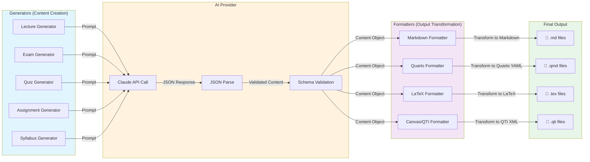

### Flow Summary

1. **Generators** create content using AI-powered templates (lecture, exam, quiz, assignment, syllabus)
2. **AI Provider** handles Claude API calls with retry logic and rate limiting
3. **Formatters** transform the JSON output to target formats (Markdown, Quarto, LaTeX, Canvas QTI)
4. **Output** files are written with appropriate file extensions

### Formatter Architecture

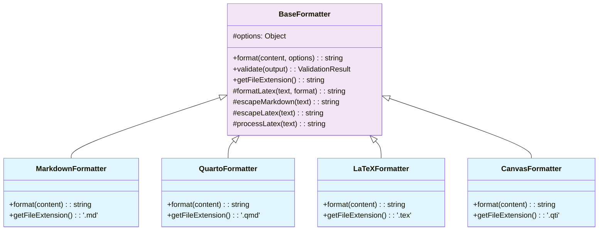

---

## 2. Four-Layer Teaching Style System

Visual representation of how teaching styles are merged hierarchically from 4 sources.

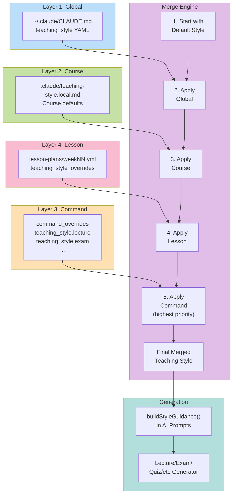

### Precedence Rules

### Highest to Lowest Priority

1. **Command Overrides** - Teaching style for specific commands (lecture, exam, quiz)
2. **Lesson Plan** - Per-lesson teaching style overrides
3. **Course Style** - Course-wide teaching style preferences
4. **Global Style** - User's personal teaching style from ~/.claude/CLAUDE.md
5. **Defaults** - Built-in defaults when no overrides present

### Teaching Style Structure

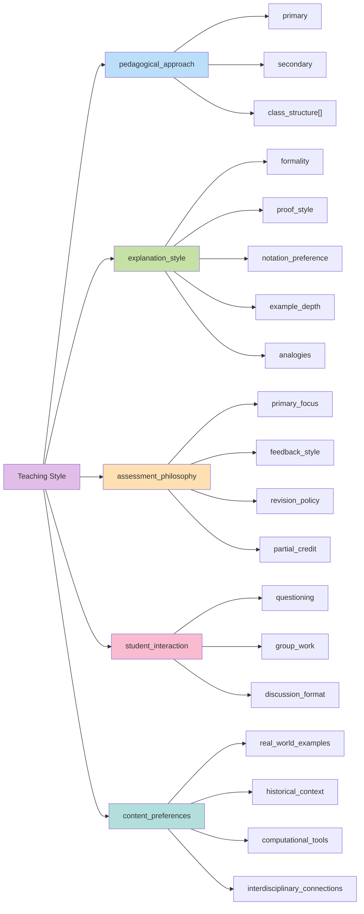

---

## 3. Lecture Generation Pipeline (Multi-Stage)

The complete workflow for generating instructor lecture notes with the `/teaching:lecture` command.

```mermaid
sequenceDiagram
    participant User as User
    participant CLI as CLI Interface
    participant Config as Config Loader
    participant Style as Style Loader
    participant Prompt as Prompt Builder
    participant AI as Claude API
    participant Output as Output Formatter

    User ->> CLI: /teaching:lecture<br/>--topic "Bayesian Methods"<br/>--level graduate

    CLI ->> Config: loadTeachConfig()
    Config -->> CLI: .flow/teach-config.yml<br/>(course info, defaults)

    CLI ->> Style: loadTeachingStyle()<br/>command: "lecture"
    Style -->> CLI: Merged style<br/>(4 layers)

    CLI ->> Prompt: buildOutlinePrompt()
    Prompt ->> Prompt: buildStyleGuidance()
    Prompt -->> CLI: Outline prompt<br/>(8-12 sections)

    CLI ->> AI: POST /messages<br/>System + Outline Prompt
    AI -->> CLI: JSON Outline<br/>(sections with IDs)

    Note over CLI: Parse & Validate<br/>Outline Structure

    loop For Each Section
        CLI ->> Prompt: buildSectionPrompt()
        Prompt ->> Prompt: Include previous context<br/>for coherence
        Prompt -->> CLI: Section prompt

        CLI ->> AI: POST /messages<br/>Section + Context
        AI -->> CLI: JSON Section Content<br/>(markdown, code, etc)

        CLI ->> CLI: Append to lecture
    end

    CLI ->> Output: format(lecture,<br/>format: 'quarto')
    Output ->> Output: Transform content<br/>to .qmd format
    Output -->> CLI: Quarto lecture notes

    CLI -->> User: 📄 lecture-notes.qmd<br/>✅ Generated successfully

    style User fill:#e8f5e9
    style CLI fill:#e1f5ff
    style Config fill:#f3e5f5
    style Style fill:#f3e5f5
    style Prompt fill:#fff3e0
    style AI fill:#ffe0b2
    style Output fill:#f3e5f5
```

### Phase Breakdown

| Phase           | Step               | Description                                          |
| --------------- | ------------------ | ---------------------------------------------------- |
| **1. Setup**    | Load Config        | Discover .flow/teach-config.yml with course info     |
|                 | Load Style         | Merge 4-layer teaching styles                        |
| **2. Outline**  | Build Prompt       | Create outline generation prompt with style guidance |
|                 | AI Call            | Generate 8-12 section structure with page estimates  |
|                 | Parse              | Validate JSON structure and section IDs              |
| **3. Sections** | Loop (per section) | For each section in outline...                       |
|                 | Build Prompt       | Create section-specific prompt with context          |
|                 | AI Call            | Generate section content                             |
|                 | Append             | Add to lecture manuscript                            |
| **4. Format**   | Transform          | Convert to target format (Quarto, LaTeX, etc.)       |
|                 | Save               | Write file with metadata                             |

---

## 4. Configuration Resolution Order

How Scholar discovers and merges configuration files during startup.

```mermaid
graph TD
    Start["Command Execution<br/>e.g., /teaching:lecture"]

    Start --> Q1{Explicit config<br/>provided?<br/>--config flag}

    Q1 -->|Yes| ExplicitPath["Use provided path"]
    Q1 -->|No| Discovery["Search for config"]

    ExplicitPath --> CheckPath{File<br/>exists?}
    CheckPath -->|No| ErrorPath["Error: Config not found"]
    CheckPath -->|Yes| LoadFile1["Load config file"]

    Discovery --> Search["Search parent dirs<br/>for .flow/teach-config.yml"]

    Search --> Found{Found?}
    Found -->|No| Defaults["Use default config"]
    Found -->|Yes| LoadFile2["Load config file"]

    LoadFile1 --> Parse1["Parse YAML"]
    LoadFile2 --> Parse2["Parse YAML"]

    Parse1 --> Validate["Validate config<br/>structure"]
    Parse2 --> Validate

    Validate --> Valid{Valid?}

    Valid -->|No| Warn["Warn user<br/>(non-strict mode)"]
    Valid -->|No, strict| Err["Error & exit"]
    Valid -->|Yes| Merge["Deep merge with<br/>defaults"]

    Warn --> Merge
    Defaults --> Merge

    Merge --> Final["Final Config<br/>Ready for generation"]

    ErrorPath :::error
    Err :::error
    Final :::success

    classDef error fill:#ffcdd2
    classDef success fill:#c8e6c9
```

### Configuration File Discovery

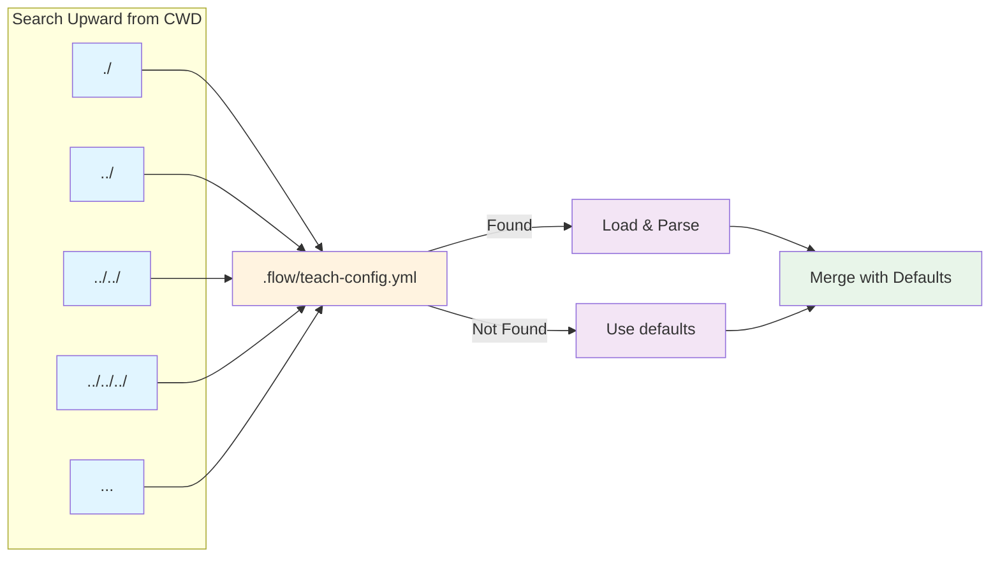

### Configuration Structure

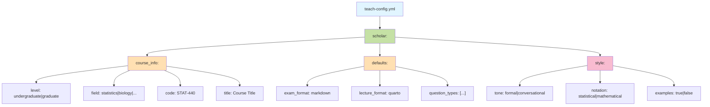

---

## 5. AI Prompt Flow for Lecture Generation

Shows how prompts are constructed and sent to Claude API with teaching style integration.

```mermaid
graph LR
    subgraph Input["Input Parameters"]
        Topic["Topic"]
        Level["Level"]
        Lang["Language"]
        Field["Field"]
    end

    subgraph StylePrep["Style Preparation"]
        LoadStyle["loadTeachingStyle()"]
        ToPrompt["toPromptStyle()"]
        BuildGuidance["buildStyleGuidance()"]
    end

    subgraph PromptGen["Prompt Generation"]
        OutlineGen["buildOutlinePrompt()"]
        SectionGen["buildSectionPrompt()"]
    end

    subgraph Template["Template Integration"]
        Schema["Lecture Schema<br/>(JSON structure)"]
        Guidelines["Section Type<br/>Guidelines"]
    end

    subgraph APICall["API Call"]
        System["System Prompt"]
        UserMsg["User Prompt<br/>+ Style Guidance"]
        Request["POST /messages"]
    end

    Input --> LoadStyle
    LoadStyle --> ToPrompt
    ToPrompt --> BuildGuidance

    BuildGuidance --> OutlineGen
    BuildGuidance --> SectionGen

    Input --> OutlineGen
    Input --> SectionGen

    OutlineGen --> Schema
    SectionGen --> Schema
    Schema --> Template

    Template --> System
    BuildGuidance --> UserMsg
    OutlineGen --> UserMsg
    SectionGen --> UserMsg

    System --> Request
    UserMsg --> Request

    Request -->|Claude API| Response["JSON Response<br/>(outline or section)"]

    style Input fill:#e1f5ff
    style StylePrep fill:#f3e5f5
    style PromptGen fill:#fff3e0
    style Template fill:#c5e1a5
    style APICall fill:#ffe0b2
    style Response fill:#e8f5e9
```

### Teaching Style Guidance Integration

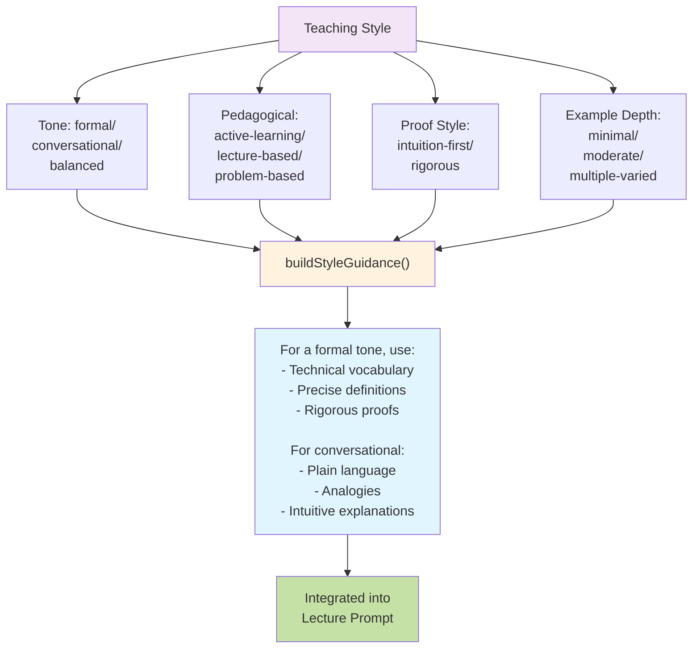

---

## 6. Error Handling and Validation Pipeline

Complete error handling flow for generation and formatting.

```mermaid
graph TD
    Start["Generate Content"]

    Start --> AICall["AI API Call"]

    AICall --> AIErr{AI Error?}
    AIErr -->|Timeout| Retry1["Exponential Backoff<br/>Retry 1/3"]
    AIErr -->|Rate Limit| Retry1
    AIErr -->|Network| Retry1
    AIErr -->|No Retries Left| Fail1["❌ Generation Failed"]

    Retry1 --> Attempt2{Retry<br/>Success?}
    Attempt2 -->|Yes| Parse["Parse JSON Response"]
    Attempt2 -->|No| Retry2["Retry 2/3"]
    Retry2 --> Attempt3{Retry<br/>Success?}
    Attempt3 -->|No| Fail1
    Attempt3 -->|Yes| Parse

    AIErr -->|No Error| Parse

    Parse --> ParseErr{Parse<br/>Error?}
    ParseErr -->|Yes| Fail2["❌ JSON Parse Failed"]
    ParseErr -->|No| Schema["Validate Schema"]

    Schema --> SchemaErr{Schema<br/>Valid?}
    SchemaErr -->|No, Strict| Fail3["❌ Validation Failed"]
    SchemaErr -->|No, Lenient| Warn1["⚠️ Schema Issues"]
    SchemaErr -->|Yes| Format

    Warn1 --> Format["Format Output"]

    Format --> FmtErr{Format<br/>Error?}
    FmtErr -->|Yes| Fail4["❌ Format Failed"]
    FmtErr -->|No| Write["Write File"]

    Write --> WriteErr{Write<br/>Success?}
    WriteErr -->|Yes| Success["✅ Success"]
    WriteErr -->|No| Fail5["❌ Write Failed"]

    Fail1 :::error
    Fail2 :::error
    Fail3 :::error
    Fail4 :::error
    Fail5 :::error
    Success :::success
    Warn1 :::warning

    classDef error fill:#ffcdd2
    classDef success fill:#c8e6c9
    classDef warning fill:#fff9c4
```

### Retry Strategy

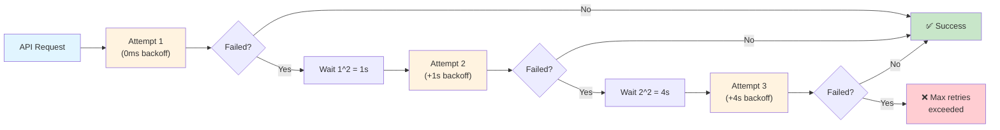

---

## 7. Architecture Dependencies

High-level dependencies between major components.

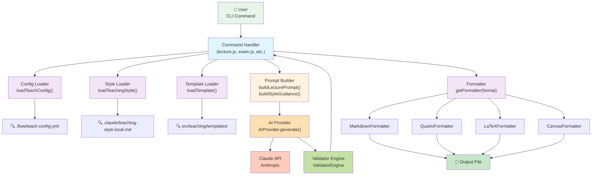

---

## Key Design Patterns

### 1. **Formatter Strategy Pattern**

All formatters inherit from `BaseFormatter` and implement the same interface (`format()`, `validate()`, `getFileExtension()`). This allows runtime selection of formatting strategy.

### 2. **Configuration Merging**

Deep merging strategy for configuration layers:

- **Defaults first** (foundation)
- **Progressively override** with higher-priority layers
- **Preserve unspecified values** from lower layers

### 3. **Teaching Style Composition**

Teaching styles are composed from multiple independent sources and merged using precedence rules. Each layer can partially override without affecting other properties.

### 4. **Prompt Template System**

Prompts are built from reusable components:

- Course context
- Teaching style guidance
- Content requirements
- Output schema specification

### 5. **AI Generation with Resilience**

- **Exponential backoff retry** on transient failures
- **Rate limiting** between requests
- **Schema validation** on output
- **Graceful degradation** in lenient mode

### 6. **Section-by-Section Generation**

Lecture notes are generated in phases:

1. **Outline** - Overall structure
2. **Sections** - Content generation per section with context passing
3. **Assembly** - Combine sections into final document

This enables coherent, long-form content with manageable API calls.

---

## File Structure Reference

```
src/teaching/
├── generators/              # Content generation logic
│   ├── lecture.js          # Lecture slides
│   ├── lecture-notes.js    # Instructor notes (20-30 pages)
│   ├── exam.js
│   ├── quiz.js
│   ├── assignment.js
│   └── syllabus.js
│
├── formatters/             # Output transformations
│   ├── base.js            # Abstract base class
│   ├── markdown.js
│   ├── quarto.js
│   ├── latex.js
│   └── canvas.js
│
├── config/                 # Configuration management
│   ├── loader.js          # .flow/teach-config.yml
│   └── style-loader.js    # 4-layer teaching style system
│
├── ai/                     # AI provider & prompts
│   ├── provider.js        # Claude API wrapper
│   ├── lecture-prompts.js # Outline & section prompts
│   └── [command]-prompts.js
│
├── validators/            # Schema validation
│   └── engine.js
│
├── templates/             # JSON schema templates
│   └── [command].json
│
└── schemas/               # JSONSchema definitions
    └── v2/
```

---

## Configuration Files Location

| File                              | Purpose                                | Layer   |
| --------------------------------- | -------------------------------------- | ------- |
| `~/.claude/CLAUDE.md`             | Global teaching style                  | Layer 1 |
| `.claude/teaching-style.local.md` | Course teaching style                  | Layer 2 |
| `.flow/teach-config.yml`          | Course config (level, field, defaults) | Config  |
| `content/lesson-plans/weekNN.yml` | Lesson-specific overrides              | Layer 4 |

---

## Next Steps for Enhancement

- Implement caching for frequently generated content
- Add progress indicators for long-running section generation
- Support for custom section types beyond built-in types
- Integration with lesson plan metadata for content continuity
- Analytics on generation performance and API usage

---

## 8. Slide Revision & Validation Pipeline

The v2.8.0 unified `--revise` and `--check` feature for slide content improvement. Includes context-aware revision targeting, multi-layer validation, and automated improvement suggestions.

### 8.1 The --revise Pipeline

Shows how slides are parsed, targeted, and revised with optional user instructions or automated analysis.

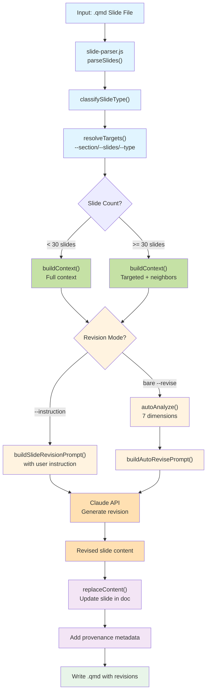

#### --revise Flow Summary

1. **Parser Stage** - Reads .qmd file and identifies slide boundaries using `slide-parser.js`
2. **Classification** - Determines slide types (title, content, examples, summary, etc.)
3. **Targeting** - Resolves user options (`--section`, `--slides`, `--type`) to specific slides
4. **Context Building** - Gathers full or targeted context based on slide count (threshold: 30 slides)
5. **Revision Strategy** - Two paths:
   - **With `--instruction`**: Uses user-provided guidance in revision prompt
   - **Bare `--revise`**: Auto-analyzes 7 dimensions (density, practice-distribution, style-compliance, math-depth, worked-examples, content-completeness, r-output-interpretation)
6. **AI Generation** - Calls Claude API with revision prompt and context
7. **Content Replacement** - Updates slides with revised content
8. **Provenance** - Adds metadata tracking the revision source and timestamp
9. **Output** - Writes modified .qmd file back to disk

---

### 8.2 The --check Pipeline

Validates slides against lesson plan, structure, timing, and style rules. Generates a report and optional revision commands.

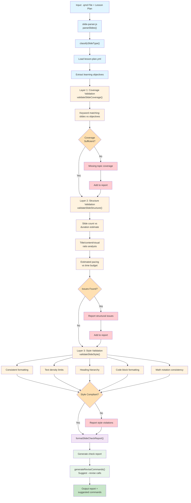

#### --check Flow Summary

1. **Input & Parsing** - Reads .qmd slide file and lesson plan YAML
2. **Classification** - Identifies slide types for context-aware validation
3. **Objectives Extraction** - Loads learning objectives from lesson plan
4. **Layer 1: Coverage** - Validates slides cover all learning objectives via keyword matching
5. **Layer 2: Structure** - Checks slide count vs duration, title/content ratio, and pacing alignment
6. **Layer 3: Style** - Validates 5 style rules (formatting consistency, text density, heading hierarchy, code formatting, math notation)
7. **Report Generation** - Formats findings with severity levels and locations
8. **Revision Commands** - Generates suggested `--revise` commands for detected issues
9. **Output** - Displays report and actionable revision suggestions

---

### 8.3 Module Relationships

Shows how the slide revision/check modules integrate with existing lecture generation and validation systems.

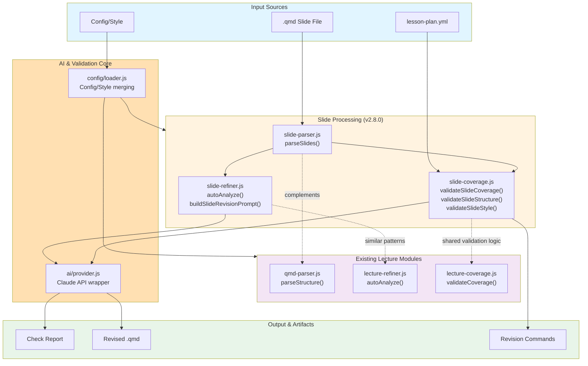

#### Module Integration Summary

| Module | Purpose | Integrations |
|--------|---------|--------------|
| **slide-parser.js** | Parse .qmd and identify slide boundaries | Feeds into `slide-refiner.js` and `slide-coverage.js` |
| **slide-refiner.js** | Automated slide analysis (7 dimensions) and revision prompt building | Uses `ai/provider.js` for Claude API calls |
| **slide-coverage.js** | 3-layer validation (coverage, structure, style) | Uses `config/loader.js` for style rules |
| **qmd-parser.js** | Quarto document structure parsing | Provides foundation for slide-parser.js |
| **lecture-refiner.js** | Lecture-level improvements | Parallel implementation to slide-refiner.js |
| **lecture-coverage.js** | Lecture validation pipeline | Shares validation patterns with slide-coverage.js |

---

### 8.4 Data Flow: --revise with --instruction

Walkthrough of a real revision request with user instruction.

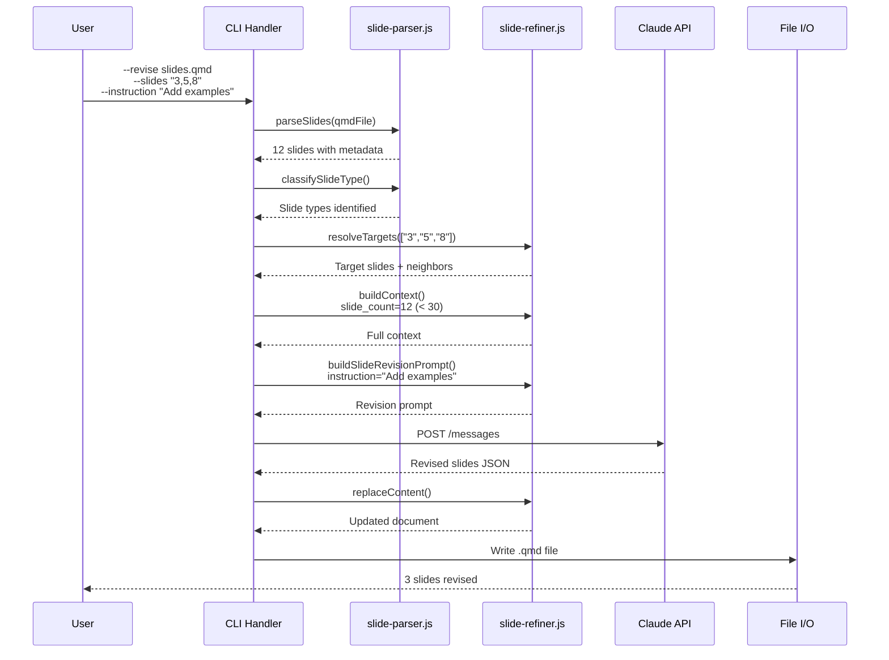

---

### 8.5 Design Considerations

#### Slide Count Thresholds
- **< 30 slides**: Full context sent to API (coherent understanding of entire presentation)
- **>= 30 slides**: Targeted context + immediate neighbors (balance context window vs token usage)

#### Seven Auto-Analysis Dimensions
When using bare `--revise` (no instruction), `autoAnalyze()` evaluates:
1. **density** — Flag overcrowded (>20 lines) or sparse (<3 lines) slides
2. **practice-distribution** — Ensure even spread of practice/quiz slides across sections
3. **style-compliance** — Match configured tone and formatting rules
4. **math-depth** — Formulas with explanation and derivation
5. **worked-examples** — Definition slides have nearby example slides
6. **content-completeness** — Sufficient concept explanation per slide
7. **r-output-interpretation** — Code output slides include interpretation

#### Validation Layer Architecture
- **Layer 1 (Coverage)** - Semantic alignment with lesson plan objectives
- **Layer 2 (Structure)** - Quantitative metrics (count, ratio, timing)
- **Layer 3 (Style)** - Qualitative rules from config/teaching-style

#### Provenance Tracking
Each revision includes:
- Timestamp of revision
- Revision source (`--instruction` or `--revise`)
- User instruction text (if applicable)
- Slide IDs affected

---

## 9. Insights-Driven Enhancements (v2.15.0)

### 9.1 R Validation Pipeline Flow

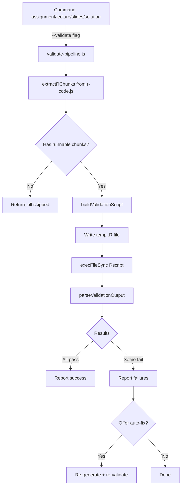

### 9.2 Preflight Check Architecture

```mermaid
flowchart LR
    PF[/teaching:preflight] --> RC[runAllChecks]
    RC --> VS[checkVersionSync]
    RC --> CM[checkConflictMarkers]
    RC --> TC[checkTestCounts]
    RC --> CC[checkCacheCleanup]
    RC --> CL[checkChangelog]
    RC --> SF[checkStatusFile]
    VS --> AGG[Aggregate Results]
    CM --> AGG
    TC --> AGG
    CC --> AGG
    CL --> AGG
    SF --> AGG
    AGG -->|--fix| FIX[Apply fixable fixes]
    AGG -->|--json| JSON[JSON output]
    AGG -->|default| TABLE[Table output]
```

### 9.3 Email Send Pipeline

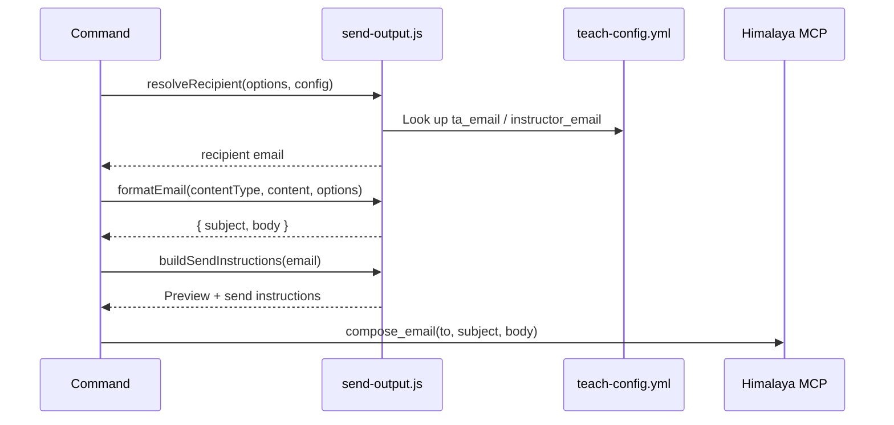
