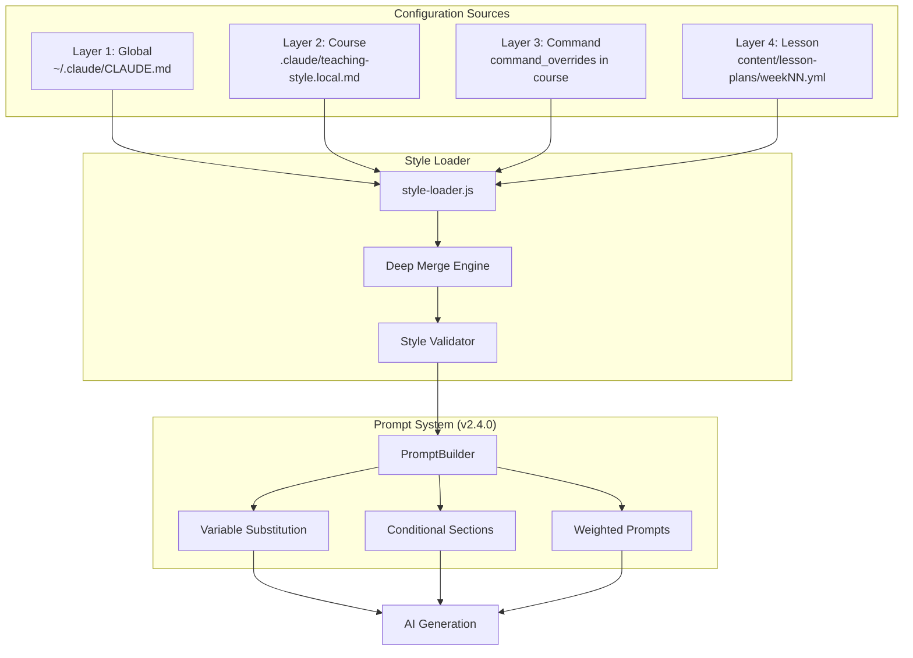
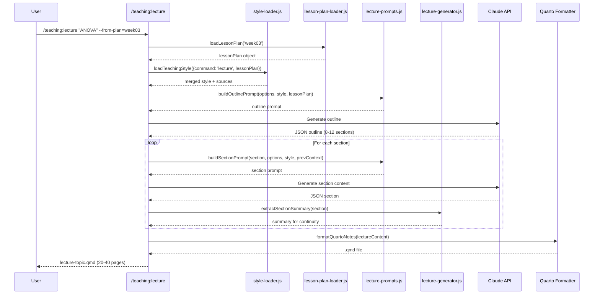

# Scholar Plugin Architecture

## Overview (Scholar Plugin Architecture)

Scholar is a Claude Code plugin that provides AI-powered academic workflows for research and teaching. This document describes the architecture of the teaching module, which generates course materials including exams, quizzes, assignments, syllabi, slides, rubrics, feedback, and demonstration materials.

## System Architecture

```mermaid
graph TB
    subgraph "User Interface"
        CMD[Slash Commands<br>/teaching:exam, /teaching:quiz, etc.]
        CONFIG[.flow/teach-config.yml]
    end

    subgraph "Command Layer"
        EXAM[Exam Command]
        QUIZ[Quiz Command]
        ASSIGN[Assignment Command]
        SYLLABUS[Syllabus Command]
        SLIDES[Slides Command]
        RUBRIC[Rubric Command]
        FEEDBACK[Feedback Command]
        DEMO[Demo Command]
    end

    subgraph "Generation Layer"
        EXAMGEN[Exam Generator]
        QUIZGEN[Quiz Generator]
        ASSIGNGEN[Assignment Generator]
        SYLLGEN[Syllabus Generator]
        SLIDEGEN[Slides Generator]
    end

    subgraph "Foundation Layer"
        TEMPLATE[Template System<br>JSON Schema]
        CONFIGLOAD[Config Loader<br>YAML Parser]
        VALIDATOR[Validator Engine<br>Schema Validation]
        AI[AI Provider<br>Claude API]
    end

    subgraph "Export Layer"
        MARKDOWN[Markdown Formatter]
        QUARTO[Quarto Formatter]
        LATEX[LaTeX Formatter]
        CANVAS[Canvas QTI Formatter]
        EXAMARK[Examark Integration]
    end

    subgraph "Output"
        JSON[JSON Files]
        MD[Markdown Files]
        QMD[Quarto Documents]
        TEX[LaTeX Documents]
        QTI[Canvas QTI Packages]
    end

    CMD --> EXAM & QUIZ & ASSIGN & SYLLABUS & SLIDES & RUBRIC & FEEDBACK & DEMO
    CONFIG --> CONFIGLOAD

    EXAM --> EXAMGEN
    QUIZ --> QUIZGEN
    ASSIGN --> ASSIGNGEN
    SYLLABUS --> SYLLGEN
    SLIDES --> SLIDEGEN

    EXAMGEN & QUIZGEN & ASSIGNGEN & SYLLGEN & SLIDEGEN --> TEMPLATE
    EXAMGEN & QUIZGEN & ASSIGNGEN & SYLLGEN & SLIDEGEN --> CONFIGLOAD
    EXAMGEN & QUIZGEN & ASSIGNGEN & SYLLGEN & SLIDEGEN --> VALIDATOR
    EXAMGEN & QUIZGEN & ASSIGNGEN & SYLLGEN & SLIDEGEN --> AI

    EXAMGEN & QUIZGEN & ASSIGNGEN & SYLLGEN & SLIDEGEN --> MARKDOWN
    EXAMGEN & QUIZGEN & ASSIGNGEN & SYLLGEN & SLIDEGEN --> QUARTO
    EXAMGEN & QUIZGEN & ASSIGNGEN & SYLLGEN & SLIDEGEN --> LATEX
    EXAMGEN --> CANVAS
    CANVAS --> EXAMARK

    MARKDOWN --> MD
    QUARTO --> QMD
    LATEX --> TEX
    CANVAS --> QTI
    EXAMGEN & QUIZGEN & ASSIGNGEN & SYLLGEN & SLIDEGEN --> JSON
```



## Core Components (Scholar Plugin Architecture)

### 1. Command Layer (`src/plugin-api/commands/teaching/`)

The command layer provides the user-facing interface through Claude Code slash commands. Each command:

- Parses user input and options
- Invokes the appropriate generator
- Handles output formatting and file writing
- Provides user feedback and statistics

### Commands (Core Components (Scholar)

- `/teaching:exam` - Generate comprehensive exams
- `/teaching:quiz` - Create quiz questions
- `/teaching:assignment` - Generate homework assignments
- `/teaching:syllabus` - Create course syllabi
- `/teaching:slides` - Generate lecture slides
- `/teaching:rubric` - Create grading rubrics
- `/teaching:feedback` - Generate student feedback
- `/teaching:demo` - Run demonstration mode (test all commands)

### 2. Generation Layer (`src/teaching/generators/`)

The generation layer contains the core logic for creating teaching content:

### Generator Modules

- `exam.js` / `exam-conversational.js` - Exam generation
- `quiz.js` / `quiz-conversational.js` - Quiz generation
- `assignment.js` / `assignment-conversational.js` - Assignment generation
- `syllabus.js` / `syllabus-conversational.js` - Syllabus generation
- `lecture.js` / `lecture-conversational.js` - Lecture/slides generation

Each generator:

1. Loads configuration from `.flow/teach-config.yml`
2. Loads appropriate JSON schema template
3. Builds AI prompts with context
4. Generates content using AI Provider
5. Validates output against schema
6. Returns structured JSON content

### Conversational vs. API Mode

- `*-conversational.js` - Optimized for interactive Claude Code sessions
- `*.js` - Programmatic API for direct invocation

### 3. Foundation Layer

#### Template System (`src/teaching/templates/`)

Defines JSON schemas for all content types:

- `base.json` - Common fields shared across all content
- `exam.json` - Exam structure with questions and answer keys
- `quiz.json` - Quiz structure with feedback and timing
- `assignment.json` - Assignment with problems and solutions
- `syllabus.json` - Course syllabus with schedule and policies
- `lecture.json` - Lecture slides with speaker notes

### Template Loader (`loader.js`)

- Loads templates from JSON files
- Merges templates (base + specific)
- Injects auto-generated fields (timestamps, version)
- Applies default values from config

#### Config Loader (`src/teaching/config/loader.js`)

Discovers and loads course configuration:

```javascript
// Searches parent directories for .flow/teach-config.yml
const config = loadTeachConfig(process.cwd());

// Access configuration values
const courseInfo = getCourseInfo(config);
const defaults = getDefaults(config);
const style = getStyle(config);
```

### Features (Core Components (Scholar)

- Parent directory search (finds config in project root)
- Fallback defaults (works without config file)
- Deep merge strategy (user config overrides defaults)
- Validation with helpful error messages
- Dot-path access (`scholar.course_info.level`)

#### Validator Engine (`src/teaching/validators/engine.js`)

Validates generated content:

- JSON Schema validation using Ajv
- LaTeX syntax checking (`validators/latex.js`)
- Content completeness verification
- Answer key validation
- Warning generation (non-fatal issues)

#### AI Provider (`src/teaching/ai/provider.js`)

Wraps Claude API with production features:

```javascript
const ai = new AIProvider({
  apiKey: process.env.ANTHROPIC_API_KEY,
  model: 'claude-3-5-sonnet-20241022',
  maxRetries: 3,
  timeout: 30000,
  maxTokens: 4096,
  debug: false
});

const result = await ai.generate(prompt, {
  format: 'json',
  temperature: 0.7,
  context: { config, template }
});
```

### Features

- Retry logic with exponential backoff
- Rate limiting (100ms minimum between requests)
- Timeout management (30s default)
- Error classification (retryable vs. fatal)
- Usage statistics tracking
- Debug logging

### 4. Sync Engine (v2.2.0) (`src/teaching/sync/`)

The sync engine provides automatic YAML→JSON synchronization with hash-based change detection and sub-100ms latency.

#### Architecture (4. Sync Engine)

```
┌─────────────────┐         ┌──────────────────┐
│  YAML (source)  │ ────→   │  JSON (auto)     │
│  User edits     │  sync   │  Machine reads   │
└─────────────────┘         └──────────────────┘
     ↓                            ↓
  Validation                 Auto-generated
     ↓
  Hash cache (SHA-256)
```

#### Core Components (4. Sync Engine)

### Sync Engine (`sync/sync-engine.js`)

```javascript
const engine = new SyncEngine({
  yamlDir: '.flow/',              // Search for *.yml files
  cacheDir: '.scholar-cache/',    // Hash tracking
  validateOnSync: true,           // 4-level validation
  hashAlgorithm: 'sha256',        // SHA-256 for change detection
  debug: false
});

// Sync all YAML files
const result = await engine.syncAll();
// { synced: 2, skipped: 7, failed: 1, totalTime: '155ms' }

// Sync specific file
await engine.syncFile('teach-config.yml');

// Force re-sync (ignore cache)
await engine.syncAll({ force: true });
```

### Hash Cache (`sync/hash-cache.js`)

```javascript
{
  "teach-config.yml": {
    "yamlHash": "a3b2c1d4e5f6...",
    "jsonHash": "a3b2c1d4e5f6...",
    "lastSync": "2026-01-15T10:30:00Z",
    "yamlPath": ".flow/teach-config.yml",
    "jsonPath": ".flow/teach-config.json"
  }
}
```

### Features - Core Components Scholar

- Hash-based change detection (SHA-256)
- Skip unchanged files (~5ms overhead)
- Parse + validate + write only changed files (~80ms)
- Automatic cache invalidation on YAML modification
- Cache rebuilds automatically if corrupted

#### Sync Process

```
1. Find YAML files (.flow/*.yml, content/lesson-plans/*.yml)
   ↓
2. For each YAML file:
   a. Compute SHA-256 hash
   b. Compare with cached hash
   c. If unchanged → skip (5ms)
   d. If changed → sync (80ms)
   ↓
3. Validation (4 levels):
   a. YAML syntax (js-yaml parser)
   b. JSON schema (Ajv validator)
   c. LaTeX validation (custom validator)
   d. Completeness check (required fields)
   ↓
4. Parse YAML → JSON
   ↓
5. Write JSON to same directory
   ↓
6. Update cache with new hash
```

#### Automatic Sync Triggers

### Pre-Command Hook (`hooks/pre-command.js`)

```javascript
// Runs before any teaching command
export async function preCommand() {
  const engine = new SyncEngine();
  await engine.syncAll({ silent: true });
  // Ensures configs are always in sync before commands run
}
```

### Pre-Commit Hook (`scripts/pre-commit-hook.sh`)

```bash
#!/bin/bash
# Runs before git commits

echo "[scholar pre-commit hook] Validating YAML files..."

# Find all YAML files
YAML_FILES=$(find .flow content/lesson-plans -name "*.yml" 2>/dev/null)

# Validate each file
for file in $YAML_FILES; do
  scholar validate "$file" || exit 1
done

# Sync YAML to JSON
scholar sync

echo "✅ All configs validated and synced"
```

### GitHub Actions Workflow (`.github/workflows/validate.yml`)

```yaml
- name: Validate and Sync Configs
  run: |
    npm install -g @data-wise/scholar

    # Validate all YAML files
    for file in .flow/*.yml content/lesson-plans/*.yml; do
      if [ -f "$file" ]; then
        scholar validate "$file"
      fi
    done

    # Check sync status
    scholar diff --all
```

#### Validation Integration

The sync engine integrates with the validator engine:

### 4-Level Validation

1. **YAML Syntax** - Valid YAML structure (indentation, colons, quotes)
2. **JSON Schema** - Conforms to teach-config or lesson-plan schema
3. **LaTeX Validation** - Math notation compiles (`$...$`, `$$...$$`)
4. **Completeness** - Required fields present

### Validator (`sync/validator.js`)

```javascript
const validator = new Validator({
  schemaPath: 'src/teaching/templates/',
  latexEngine: 'katex',         // or 'mathjax'
  strictMode: false,             // warnings vs. errors
  debug: false
});

const result = await validator.validate('teach-config.yml');
// {
//   valid: false,
//   errors: [
//     { file: 'teach-config.yml', line: 12, col: 5,
//       message: 'Invalid difficulty: "meduim" (did you mean "medium"?)' }
//   ],
//   warnings: [
//     { file: 'teach-config.yml', line: 25, col: 3,
//       message: 'Missing "examples" field (recommended)' }
//   ]
// }
```

### IDE-Style Error Output

```
teach-config.yml:12:5: error: Invalid difficulty: "meduim" (did you mean "medium"?)
teach-config.yml:25:3: warning: Missing "examples" field (recommended)

❌ Validation failed (1 error, 1 warning)
```

#### Cache Management

### Cache Location

```
.scholar-cache/
  sync-status.json    # Hash tracking and sync timestamps
```

### Cache Structure

```json
{
  "version": "2.2.0",
  "created": "2026-01-15T10:00:00Z",
  "lastUpdated": "2026-01-15T10:30:00Z",
  "files": {
    "teach-config.yml": {
      "yamlHash": "a3b2c1d4e5f6...",
      "jsonHash": "a3b2c1d4e5f6...",
      "lastSync": "2026-01-15T10:30:00Z",
      "yamlPath": ".flow/teach-config.yml",
      "jsonPath": ".flow/teach-config.json",
      "syncDuration": "80ms"
    }
  }
}
```

### Cache Operations

- **Invalidate** - Clear cache for specific file (force re-sync)
- **Rebuild** - Recreate cache from scratch (on corruption)
- **Prune** - Remove entries for deleted YAML files

### Cache API

```javascript
const cache = new HashCache('.scholar-cache/sync-status.json');

// Get cached hash
const hash = cache.getHash('teach-config.yml');

// Update hash after sync
cache.updateHash('teach-config.yml', newHash, {
  yamlPath: '.flow/teach-config.yml',
  jsonPath: '.flow/teach-config.json',
  syncDuration: '80ms'
});

// Check if file changed
const changed = cache.hasChanged('teach-config.yml', currentHash);

// Clear cache
cache.clear();
```

#### Performance Characteristics

### Benchmarks (10 YAML files)

- Unchanged files (hash check only): ~50ms total (~5ms per file)
- All changed (parse + validate + write): ~800ms total (~80ms per file)
- Mixed (2 changed, 8 unchanged): ~160ms total
- Typical project (90% unchanged): ~100ms total

### Optimization Strategies

1. **Hash-based skipping** - Avoid parsing unchanged files
2. **Parallel processing** - Sync multiple files concurrently
3. **Incremental cache** - Update only changed entries
4. **Lazy validation** - Validate only on sync, not on read

### Memory Usage

- Cache file: ~2KB for 10 files
- In-memory cache: ~5KB
- YAML parsing: ~100KB per file
- Total: < 1MB for typical projects

#### Commands (Memory Usage)

The sync engine provides three teaching commands:

**/teaching:validate** - Validate YAML against schema

```bash
/teaching:validate .flow/teach-config.yml
/teaching:validate --all  # Validate all YAML files
```

**/teaching:diff** - Check YAML↔JSON sync status

```bash
/teaching:diff teach-config.yml
/teaching:diff --all  # Check all files
```

**/teaching:sync** - Manual sync trigger

```bash
/teaching:sync                   # Sync all files
/teaching:sync teach-config.yml  # Sync specific file
/teaching:sync --force           # Force re-sync (ignore cache)
```

#### Error Handling (Memory Usage)

### Validation Errors Block Sync

```javascript
try {
  await engine.syncFile('teach-config.yml');
} catch (err) {
  if (err.code === 'VALIDATION_FAILED') {
    console.error('Validation failed:', err.errors);
    // Sync blocked, JSON not updated
  }
}
```

### Graceful Degradation

- Missing YAML files → Warning, skip sync
- Corrupt cache → Rebuild cache automatically
- Invalid YAML syntax → Parse error with line/col
- Schema validation errors → IDE-style error output
- LaTeX errors → Specific math expression highlighted

#### Integration with -config Flag

The sync engine works seamlessly with the `--config` flag:

```bash
# Auto-sync before command execution
/teaching:quiz "Linear Regression" --config /path/to/config.yml
# ↑ Pre-command hook syncs config if needed

# Manual sync with explicit path
/teaching:sync /path/to/custom-config.yml

# Validate before sync
/teaching:validate /path/to/custom-config.yml
```

### Behavior

- `--config` flag bypasses directory search
- Sync engine uses explicit path for YAML
- JSON generated in same directory as YAML
- Cache tracks files by absolute path

### 5. Export Layer (`src/teaching/formatters/`)

Converts JSON content to multiple output formats:

### Formatters

- `markdown.js` - examark-compatible Markdown
- `quarto.js` - Quarto documents for PDF/HTML
- `latex.js` - LaTeX exam class documents
- `canvas.js` - Canvas LMS QTI packages (via examark)
- `examark.js` - Direct examark integration

### Base Formatter (`base.js`)

```javascript
class BaseFormatter {
  format(content, options) { /* abstract */ }
  validate(output) { /* optional */ }
  getFileExtension() { /* abstract */ }

  // Helpers
  formatLatex(text, format)
  escapeMarkdown(text)
  escapeLatex(text)
  validateContent(content)
}
```

All formatters extend `BaseFormatter` and provide:

- Format-specific rendering
- LaTeX math preservation
- Answer key handling
- Validation support

## Data Flow

### Exam Generation Example

```
User Input: /teaching:exam midterm --questions 10 --difficulty hard
    ↓
Command Parser: Extract type="midterm", questionCount=10, difficulty="hard"
    ↓
Config Loader: Load .flow/teach-config.yml (course info, defaults, style)
    ↓
Template System: Load base.json + exam.json, merge schemas
    ↓
AI Provider: Build prompt with context, call Claude API
    ↓
    "Generate a midterm exam for STAT 440 (Regression Analysis)
     with 10 questions at hard difficulty. Include multiple-choice,
     short-answer, and essay questions. Follow this schema: {...}"
    ↓
AI Response: JSON content with questions and answer key
    ↓
Validator: Check schema compliance, LaTeX syntax, completeness
    ↓
Formatters: Convert JSON → Markdown, Quarto, LaTeX, Canvas QTI
    ↓
Output: exam-midterm-1234567890.json (and other formats)
```

## Configuration System

### Configuration Hierarchy

1. **Default Configuration** (in `config/loader.js`)
2. **User Configuration** (`.flow/teach-config.yml`)
3. **Command Options** (CLI flags)

Each level overrides the previous level.

### Configuration Schema

```yaml
scholar:
  course_info:
    code: "STAT-440"
    title: "Regression Analysis"
    level: "undergraduate"  # or "graduate"
    field: "statistics"
    difficulty: "intermediate"  # "beginner", "intermediate", "advanced"
    instructor:
      name: "Dr. Jane Smith"
      email: "jane@university.edu"
      office: "Room 301"

  defaults:
    exam_format: "markdown"  # "md", "qmd", "tex", "canvas"
    lecture_format: "quarto"
    question_types:
      - "multiple-choice"
      - "short-answer"
      - "essay"

  style:
    tone: "formal"  # or "conversational"
    notation: "statistical"  # LaTeX notation style
    examples: true

  ai_generation:
    model: "claude-3-5-sonnet-20241022"
    temperature: 0.7
    max_tokens: 4096
    timeout: 30000
    api_key: "sk-..."  # Optional, uses env var if not set
```

## Template System

### Template Structure

All templates follow a consistent structure:

```json
{
  "schema_version": "1.0",
  "template_type": "exam",
  "metadata": {
    "title": "...",
    "course": "...",
    "date": "auto"
  },
  "generated_by": {
    "tool": "scholar",
    "version": "auto",
    "timestamp": "auto",
    "model": "auto"
  },
  // Content-specific fields...
}
```

### Auto-Injected Fields

The template system automatically injects:

- `schema_version` - Template compatibility version
- `generated_by.tool` - Always "scholar"
- `generated_by.version` - Plugin version
- `generated_by.timestamp` - ISO 8601 generation time
- `generated_by.model` - AI model used
- `metadata.date` - Current date (if set to "auto")

### Template Merging

Templates are merged in layers:

1. **Base Template** (`base.json`) - Common fields
2. **Content-Specific Template** (`exam.json`, `quiz.json`, etc.)
3. **Config Defaults** - From `.flow/teach-config.yml`
4. **User Input** - Command options

## Validation Pipeline

### Three-Stage Validation

1. **Schema Validation** (Ajv)
   - Validates JSON structure against schema
   - Checks required fields
   - Verifies types and formats
   - Enforces constraints (min/max, patterns)

2. **LaTeX Validation**
   - Checks for unmatched delimiters (`$...$`, `$$...$$`)
   - Validates common LaTeX commands
   - Warns on potential rendering issues

3. **Content Validation**
   - Verifies answer keys match questions
   - Checks question ID consistency
   - Validates point totals
   - Ensures completeness (e.g., MC options)

### Validation Results

```javascript
{
  valid: true,
  errors: [],
  warnings: [
    "Question Q3: LaTeX might have unmatched braces",
    "Total points (95) doesn't match sum of question points (100)"
  ]
}
```

- **Errors** - Fatal issues, generation fails
- **Warnings** - Non-fatal issues, generation succeeds

## Error Handling (Validate before sync)

### Error Types

1. **Configuration Errors**
   - Missing API key
   - Invalid config file syntax
   - Schema validation failures

2. **Generation Errors**
   - API timeout
   - Rate limit exceeded
   - Invalid AI response

3. **Validation Errors**
   - Schema non-compliance
   - LaTeX syntax errors
   - Missing required fields

4. **Export Errors**
   - Missing dependencies (examark, quarto)
   - File write failures
   - Format conversion errors

### Error Recovery

- **Retry with backoff** - For transient API errors
- **Fallback to defaults** - For config errors
- **Partial success** - For validation warnings
- **User notification** - Clear error messages with solutions

## Security Considerations

### Command Injection Prevention

All external command execution uses `execFile` (not `exec`) to prevent shell injection attacks. This project provides a safe wrapper utility:

```javascript
import { execFileNoThrow } from '../utils/execFileNoThrow.js';

// Safe: Array args prevent injection, handles Windows compatibility
await execFileNoThrow('examark', [mdPath, '-o', qtiPath]);
```

### DO NOT USE

```javascript
// UNSAFE: String concatenation allows shell injection
exec(`examark "${userInput}" -o output.zip`)  // VULNERABLE
```

The `execFileNoThrow` utility:

- Uses `execFile` instead of `exec` (prevents shell injection)
- Handles Windows compatibility automatically
- Provides proper error handling
- Returns structured output with stdout, stderr, and status

### Input Validation

- All user input is validated before processing
- File paths are sanitized
- Shell metacharacters are escaped
- API keys are never logged

### Data Privacy

- No user data is sent to external services (except Claude API)
- Temporary files are cleaned up
- API keys are read from environment variables
- Config files are project-specific

## Performance Optimization

### Caching Strategy

- Templates are loaded once and cached
- Config files are cached per session
- AI responses are not cached (each generation is unique)

### Rate Limiting

- 100ms minimum between API requests
- Exponential backoff on failures
- Retry budget (3 attempts max)

### Async Operations

- All I/O operations are async
- Multiple format exports can run in parallel
- Streaming responses for large content

## Testing Strategy

### Unit Tests

- Template loading and merging
- Config parsing and validation
- Formatter output correctness
- Validator logic

### Integration Tests

- End-to-end exam generation
- Format conversion pipelines
- Canvas QTI package creation
- Error handling scenarios

### E2E Tests

- Full command execution
- Real API calls (demo mode)
- Multi-format export
- Config discovery

## Extension Points

### Adding New Content Types

1. Create JSON schema in `src/teaching/templates/`
2. Add generator in `src/teaching/generators/`
3. Create command in `src/plugin-api/commands/teaching/`
4. Update formatters to support new type

### Adding New Export Formats

1. Extend `BaseFormatter` in `src/teaching/formatters/`
2. Implement `format()` and `getFileExtension()`
3. Add format to `formatters/index.js`
4. Update generator to support new format

### Custom Validation Rules

1. Add validator in `src/teaching/validators/`
2. Register in `validators/engine.js`
3. Call from generators

## Dependencies

### Runtime Dependencies

- `js-yaml` - YAML config parsing
- `ajv` - JSON schema validation
- `ajv-keywords` - Additional schema keywords

### Optional Dependencies

- `examark` - Canvas QTI export (npm package)
- `quarto` - Quarto rendering (system binary)
- `texlive` - LaTeX compilation (system package)

### Development Dependencies

- `jest` - Testing framework
- `eslint` - Code linting
- `prettier` - Code formatting

## File Structure

```
scholar/
├── src/
│   ├── plugin-api/
│   │   ├── commands/
│   │   │   └── teaching/       # Command definitions
│   │   └── skills/             # Research skills
│   └── teaching/
│       ├── ai/                 # AI provider
│       │   └── provider.js
│       ├── config/             # Config loading
│       │   └── loader.js
│       ├── formatters/         # Export formats
│       │   ├── base.js
│       │   ├── markdown.js
│       │   ├── quarto.js
│       │   ├── latex.js
│       │   ├── canvas.js
│       │   └── index.js
│       ├── generators/         # Content generation
│       │   ├── exam.js
│       │   ├── exam-conversational.js
│       │   ├── quiz.js
│       │   ├── assignment.js
│       │   ├── syllabus.js
│       │   └── lecture.js
│       ├── templates/          # JSON schemas
│       │   ├── base.json
│       │   ├── exam.json
│       │   ├── quiz.json
│       │   ├── assignment.json
│       │   ├── syllabus.json
│       │   ├── lecture.json
│       │   └── loader.js
│       └── validators/         # Validation
│           ├── engine.js
│           └── latex.js
├── tests/
│   └── teaching/               # Test suite
├── docs/
│   ├── ARCHITECTURE.md         # This file
│   ├── API-REFERENCE.md        # Command API docs
│   ├── USER-GUIDE.md           # User guide
│   └── CONFIGURATION.md        # Config reference
└── .flow/
    └── teach-config.yml        # Example config
```

## 4-Layer Teaching Style System (v2.1.0+)

### Overview (4-Layer Teaching Style)

The teaching style system enables instructor-defined pedagogical preferences that automatically propagate to all generated content. Teaching styles are loaded hierarchically from multiple sources and merged with configurable precedence.



### Layer Precedence

| Layer   | Source                                    | Precedence         | Scope            |
| ------- | ----------------------------------------- | ------------------ | ---------------- |
| Layer 1 | `~/.claude/CLAUDE.md`                     | Lowest             | All courses      |
| Layer 2 | `.claude/teaching-style.local.md`         | ↑                  | Single course    |
| Layer 3 | `command_overrides.{lecture,exam,...}`    | ↑                  | Specific command |
| Layer 4 | `teaching_style_overrides` in lesson plan | Highest (but < L3) | Single lesson    |

### Core Components (`src/teaching/config/style-loader.js`)

```javascript
// Load teaching style with full layer resolution
import { loadTeachingStyle, toPromptStyle } from './config/style-loader.js';

const { style, promptStyle, sources, courseRoot } = loadTeachingStyle({
  command: 'lecture',
  startDir: process.cwd(),
  lessonPlan: null  // Optional: from --from-plan flag
});

// promptStyle provides simplified attributes for AI prompts
// style provides full merged configuration
```

### Prompt System Integration (v2.4.0 - Planned)

The prompt generation system transforms teaching styles into optimized AI prompts:

```
Teaching Style Config → PromptBuilder → Optimized Prompt → AI Generation
```

### PromptBuilder Strategies

1. **Variable Substitution** - Replace `{{notation_rules}}` with actual values
2. **Conditional Sections** - Include/exclude prompt sections based on style
3. **Weighted Prompts** - Adjust emphasis based on instructor preferences

### Two-Tier Schema

- **Core Schema (v2.0):** `pedagogical_approach`, `explanation_style`, `assessment_philosophy`
- **Extension Schema (v2.1):** `r_packages`, `notation_conventions`, `latex_configuration`

For detailed specifications, see the original spec in git history (`docs/specs/SPEC-prompt-generation-system-2026-01-21.md`).

---

## Lecture Generation Pipeline (v2.1.0+)

### Architecture (Lecture Generation Pipeline)



### Section Types

| Type           | Has Code | Has Math | Description                      |
| -------------- | -------- | -------- | -------------------------------- |
| `introduction` | No       | No       | Motivation and preview           |
| `concept`      | No       | Yes      | Core theoretical content         |
| `definition`   | No       | Yes      | Formal definitions               |
| `theorem`      | No       | Yes      | Theorem statements               |
| `proof`        | No       | Yes      | Mathematical proofs              |
| `example`      | Yes      | Yes      | Worked problems                  |
| `code`         | Yes      | No       | R/Python implementation          |
| `practice`     | Yes      | Yes      | Practice problems with solutions |
| `discussion`   | No       | No       | Open-ended questions             |
| `summary`      | No       | No       | Key takeaways                    |

---

## v2.4.0 Prompt Generation System (Planned)

### System Overview

```
┌─────────────────────────────────────────────────────────────────────┐
│  Layer 1: Configuration Files (User-Editable)                       │
├─────────────────────────────────────────────────────────────────────┤
│  ~/.claude/CLAUDE.md                  ← Global teaching defaults   │
│  .flow/teach-config.yml                ← flow-cli workflow config   │
│  .claude/teaching-style.local.md       ← Course-specific style      │
└─────────────────────────────────────────────────────────────────────┘
                                   ↓
┌─────────────────────────────────────────────────────────────────────┐
│  Layer 2: Schema System (Two-Tier)                                  │
├─────────────────────────────────────────────────────────────────────┤
│  Core Schema (v2.0)                    ← Required fields            │
│    - pedagogical_approach, explanation_style, assessment_philosophy │
│                                                                      │
│  Extension Schema (v2.1)               ← Advanced fields            │
│    - r_packages, notation_conventions, latex_configuration          │
│    - statistical_methods, cross_listing                             │
└─────────────────────────────────────────────────────────────────────┘
                                   ↓
┌─────────────────────────────────────────────────────────────────────┐
│  Layer 3: Style Loader (Existing)                                   │
├─────────────────────────────────────────────────────────────────────┤
│  src/teaching/config/style-loader.js   ← Loads & merges configs    │
└─────────────────────────────────────────────────────────────────────┘
                                   ↓
┌─────────────────────────────────────────────────────────────────────┐
│  Layer 4: Prompt Builder (v2.4.0)                                   │
├─────────────────────────────────────────────────────────────────────┤
│  src/teaching/ai/prompt-builder.js     ← NEW                        │
│    - Multi-strategy adaptation                                      │
│    - Versioned templates (prompts/v2/)                              │
│    - LaTeX defaults (Plugin → Global → Course)                      │
└─────────────────────────────────────────────────────────────────────┘
                                   ↓
┌─────────────────────────────────────────────────────────────────────┐
│  Layer 5: AI Generation (Enhanced)                                  │
├─────────────────────────────────────────────────────────────────────┤
│  All teaching commands use PromptBuilder for consistent prompts    │
└─────────────────────────────────────────────────────────────────────┘
```

For implementation details, see the original spec in git history (`docs/specs/SPEC-prompt-generation-system-2026-01-21.md`).

---

## Related Documentation

- [API Reference](API-REFERENCE.md) - Command documentation
- [User Guide](USER-GUIDE.md) - Step-by-step workflows
- [Configuration Reference](CONFIGURATION.md) - Config options
- [Developer Guide](DEVELOPER-GUIDE.md) - Contributing guide
