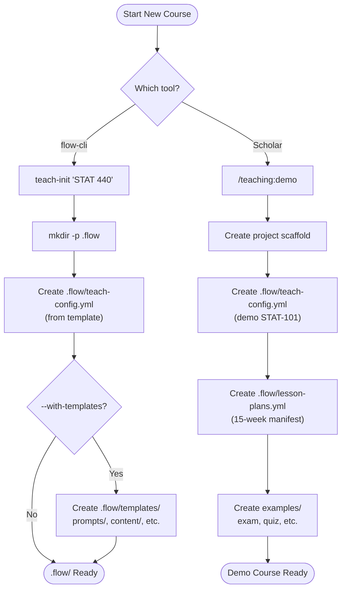
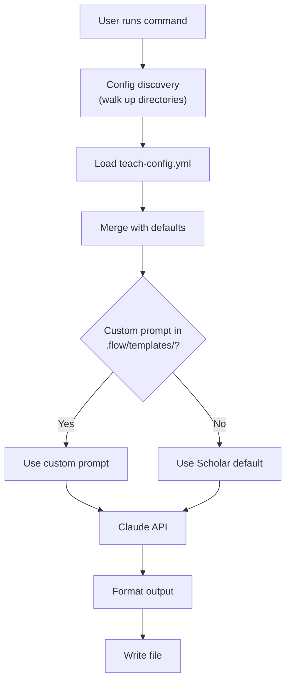
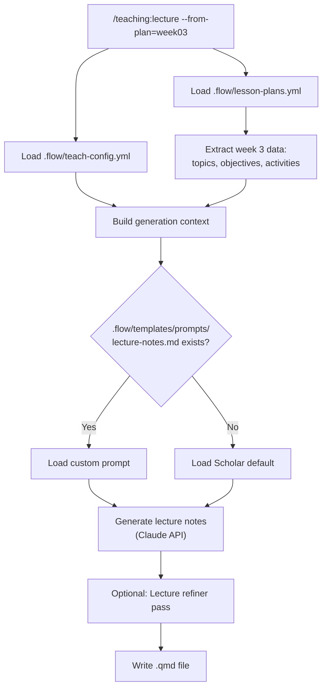
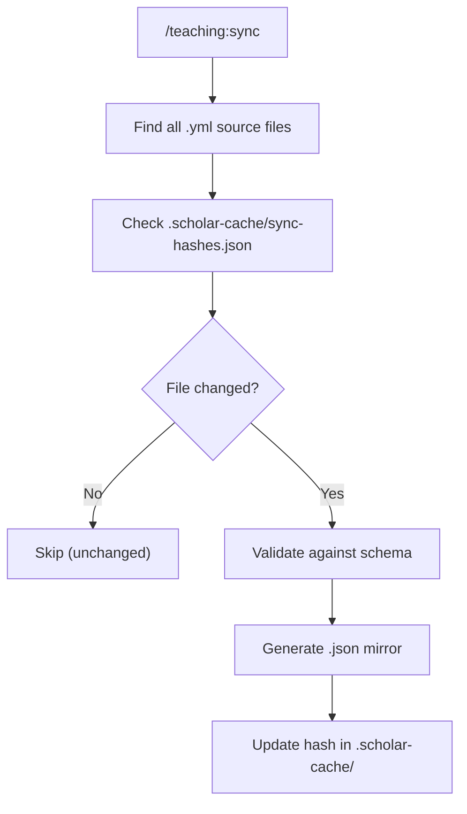
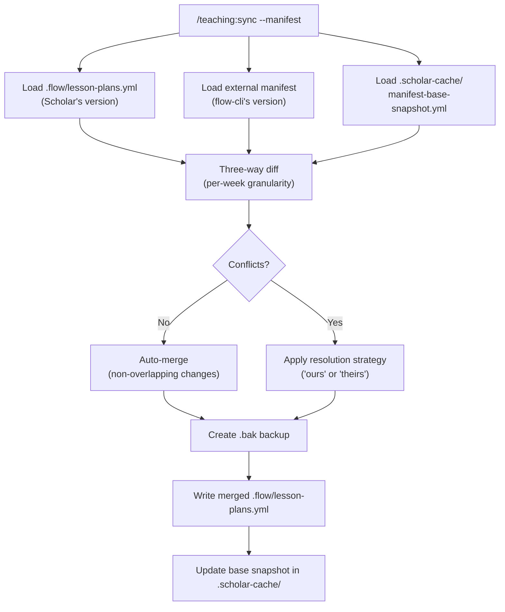
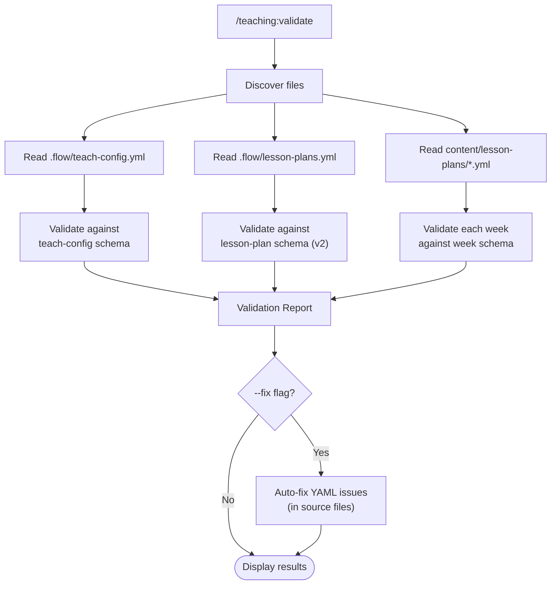
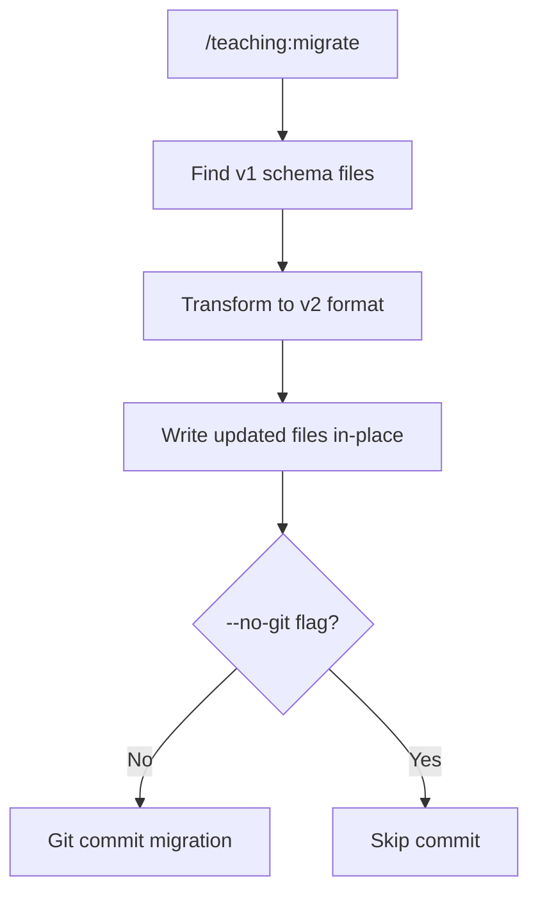
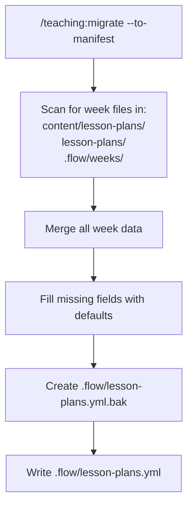

# `.flow/` Directory Reference

> Complete reference for the `.flow/` configuration directory — the coordination hub between **flow-cli** and **Scholar**.

---

## Overview

The `.flow/` directory is a project-level configuration folder that lives at the root of a teaching course project. It serves as the **contract** between two tools:

- **flow-cli** — Creates and maintains `.flow/`, manages teaching workflows, deployment, and project sessions
- **Scholar** — Reads `.flow/` configuration for AI-powered content generation (exams, lectures, quizzes, etc.)

```
flow-cli owns .flow/    →    Scholar reads .flow/
(writes config)              (generates content)
```

---

## Directory Structure

```
<course-root>/
├── .flow/                              # Configuration hub
│   ├── teach-config.yml                # Primary config (REQUIRED)
│   ├── teach-config.yml.bak            # Auto-backup before writes
│   ├── lesson-plans.yml                # Semester manifest (optional)
│   ├── lesson-plans.yml.bak            # Auto-backup before writes
│   ├── .scholar-version                # Scholar version marker (auto-created by upgrade detection)
│   ├── teaching.yml                    # Quarto profile settings (optional)
│   ├── deploy-history.yml              # Deployment tracking (auto-created)
│   │
│   ├── templates/                      # Project-level templates
│   │   ├── prompts/                    # Custom AI prompt overrides
│   │   │   ├── lecture-notes.md        # Lecture generation prompt
│   │   │   ├── exam.md                 # Exam generation prompt
│   │   │   ├── quiz.md                 # Quiz generation prompt
│   │   │   ├── slides.md              # Slides generation prompt
│   │   │   ├── assignment.md          # Assignment generation prompt
│   │   │   ├── syllabus.md            # Syllabus generation prompt
│   │   │   ├── rubric.md              # Rubric generation prompt
│   │   │   └── feedback.md            # Feedback generation prompt
│   │   ├── content/                    # Content templates
│   │   ├── metadata/                   # Metadata templates
│   │   └── checklists/                 # Workflow checklists
│   │
│   ├── macros/                         # LaTeX macro management
│   │   └── registry.yml                # Parsed macro definitions
│   │
│   ├── weeks/                          # Per-week files (legacy)
│   │   ├── week01.yml
│   │   └── ...
│   │
│   └── archives/                       # Versioned backups
│       └── <semester>/
│           ├── exams/
│           ├── quizzes/
│           └── lectures/
│
├── .scholar-cache/                     # Scholar sync cache (at course root)
│   ├── sync-hashes.json               # File change detection hashes
│   ├── .sync-base-hash                 # Three-way merge baseline
│   └── manifest-base-snapshot.yml      # Manifest snapshot for merge
│
└── content/lesson-plans/               # Per-week files (preferred location)
    ├── week01.yml
    └── ...
```

---

## File Reference

### `.flow/teach-config.yml` — Primary Configuration

**Status:** Required | **Created by:** `teach-init` or `/teaching:demo`

The source of truth for course settings. Every teaching command reads this file.

```yaml
# ── Course Information (flow-cli) ────────────────────
course:
  name: "STAT 440"
  full_name: "Regression Analysis"
  semester: "January 2026"
  year: 2026
  instructor: "Dr. Name"

# ── Git Workflow (flow-cli) ──────────────────────────
branches:
  draft: "draft"
  production: "production"

# ── Scholar Integration ──────────────────────────────
scholar:
  course_info:
    level: "undergraduate"        # undergraduate | graduate | both
    field: "statistics"           # Subject domain
    difficulty: "intermediate"    # beginner | intermediate | advanced
    credits: 3

  defaults:
    exam_format: "markdown"       # md | qmd | tex | json
    lecture_format: "markdown"
    question_types:
      - "multiple-choice"
      - "short-answer"
      - "essay"

  style:
    tone: "formal"                # formal | conversational
    notation: "statistical"       # LaTeX notation style
    examples: true                # Include worked examples

  topics:
    - "Simple Linear Regression"
    - "Multiple Regression"
    - "Model Diagnostics"

  grading:
    homework: 20
    quizzes: 15
    midterm1: 15
    final: 35

  latex_macros:
    enabled: true
    sources:
      - path: "_macros.qmd"
        format: "qmd"
    auto_discover: true
    validation:
      warn_undefined: true
      warn_unused: true
    export:
      format: "json"
      include_in_prompts: true

# ── Examark Integration (optional) ──────────────────
examark:
  enabled: false
  exam_dir: "exams"
  default_duration: 120
  default_points: 100

# ── Backup Policy ────────────────────────────────────
backups:
  retention:
    assessments: archive
    syllabi: archive
    lectures: semester
  archive_dir: ".flow/archives"

# ── Workflow Shortcuts (flow-cli) ────────────────────
shortcuts:
  stat440: "work stat440"
  stat440d: "./scripts/quick-deploy.sh"
```

---

### `.flow/lesson-plans.yml` — Semester Manifest

**Status:** Optional (recommended) | **Created by:** `teach plan create`, `/teaching:demo`, or `/teaching:migrate`

Week-by-week curriculum structure. Provides context for lecture generation and weekly content creation.

```yaml
schema_version: "1.0"

semester:
  total_weeks: 16
  schedule: "MWF"               # MWF | TR | weekly | custom
  milestones:
    - week: 5
      type: "midterm"
      label: "Midterm Exam"
    - week: 9
      type: "break"
      label: "Spring Break"
    - week: 16
      type: "final"
      label: "Final Exam"

weeks:
  - week: 1
    title: "Introduction to Regression"
    status: "published"           # draft | generated | reviewed | published
    subtitle: "Course overview and foundations"
    date_range: "Jan 14-18"
    topics:
      - "Simple Linear Regression"
      - "Least Squares Estimation"
    learning_outcomes:
      - "Fit a simple linear regression model"
      - "Interpret slope and intercept"
    key_concepts:
      - "slope"
      - "intercept"
      - "residuals"
    prerequisites:
      - "Basic algebra"
    activities:
      - type: "lecture"
        duration: "50 min"
        description: "Introduction and motivation"
      - type: "practice"
        duration: "30 min"
        description: "Fitting models in R"
    assessments:
      - type: "homework"
        description: "Problem Set 1"
  # ... more weeks
```

---

### `.flow/templates/prompts/*.md` — Custom AI Prompts

**Status:** Optional | **Created by:** Manual or `teach prompt`

Override Scholar's default AI prompts with project-specific versions. Scholar checks this directory first before falling back to built-in defaults.

**Resolution order:**
1. `.flow/templates/prompts/{type}.md` (project-specific — highest priority)
2. Scholar built-in defaults (lowest priority)

**Available prompt types:** `lecture-notes`, `exam`, `quiz`, `slides`, `assignment`, `syllabus`, `rubric`, `feedback`

> **Tip:** Use `/teaching:config scaffold <type>` to copy a Scholar default prompt template here for customization, rather than creating prompts from scratch. Run `/teaching:config diff` to see how your customized prompts differ from Scholar defaults.

---

### `.flow/macros/registry.yml` — LaTeX Macro Registry

**Status:** Auto-generated | **Created by:** Macro parser / `teach macros sync`

Parsed LaTeX macro definitions from source files, used to optimize AI generation prompts.

```yaml
macros:
  Bias:
    expansion: "\\text{Bias}"
    source: "_macros.qmd"
    line: 12:0
  Corr:
    expansion: "\\text{Corr}(#1, #2)"
    source: "_macros.qmd"
    line: 18:0
  MSE:
    expansion: "\\text{MSE}"
    source: "_macros.qmd"
    line: 24:0
```

---

### `.flow/teaching.yml` — Quarto Profile Settings

**Status:** Optional | **Created by:** `teach profiles`

Quarto-specific configuration for rendering and deployment profiles.

---

### `.flow/deploy-history.yml` — Deployment Tracking

**Status:** Auto-generated | **Created by:** `teach deploy`

Tracks course website deployments for rollback and auditing.

---

### `.flow/.scholar-version` — Version Marker

**Status:** Auto-created | **Created by:** `/teaching:config` upgrade detection

Tracks the last-seen Scholar version for upgrade detection. When Scholar is updated, running any config command will detect the version change and notify about potential prompt differences.

```
2.7.0
```

**Used by:** `/teaching:config diff`, `/teaching:config validate`

---

### `.flow/*.yml.bak` — Automatic Backups

**Status:** Auto-generated | **Created by:** Scholar's `safeWriteYaml`

Before any write to `teach-config.yml` or `lesson-plans.yml`, Scholar creates a `.bak` copy. Recovery: `cp .flow/lesson-plans.yml.bak .flow/lesson-plans.yml`

---

### `.scholar-cache/` — Sync State Cache

**Status:** Auto-generated | **Lives at:** Course root (not inside `.flow/`)

| File | Purpose |
|------|---------|
| `sync-hashes.json` | SHA-256 hashes for change detection (skip unchanged files) |
| `.sync-base-hash` | Three-way merge baseline hash for manifest sync |
| `manifest-base-snapshot.yml` | Full manifest snapshot for conflict resolution |

---

## Config Discovery

Scholar searches **upward** from the current directory until it finds `.flow/teach-config.yml`, similar to how git searches for `.git/`:

```
Starting in: /courses/stat-440/exams/midterm/
  ├── Check: ./exams/midterm/.flow/teach-config.yml  ✗
  ├── Check: ./exams/.flow/teach-config.yml          ✗
  ├── Check: ./stat-440/.flow/teach-config.yml       ✓ FOUND
  └── Stop searching
```

This means you can run Scholar commands from **any subdirectory** within a course project.

---

## Command Interaction Map

### Which Commands Touch Which Files

**Read-only** — these 9 Scholar commands read `.flow/teach-config.yml` for course context:

> `exam` | `quiz` | `slides` | `assignment` | `syllabus` | `rubric` | `feedback` | `validate` | `lecture`\*
>
> \*`lecture` also optionally reads `lesson-plans.yml` and `templates/prompts/`

**Write** — which tools create or modify each `.flow/` file:

| `.flow/` file | Created by | Written by |
|---------------|-----------|------------|
| `teach-config.yml` | `teach-init`, `/teaching:demo` | — |
| `lesson-plans.yml` | `teach plan`, `/teaching:demo` | `/teaching:sync`, `/teaching:migrate` |
| `templates/prompts/` | `teach-init --with-templates` | `teach prompt` |
| `macros/registry.yml` | `teach macros` | `teach macros` |
| `deploy-history.yml` | `teach deploy` | `teach deploy` |
| `teaching.yml` | `teach profiles` | `teach profiles` |

---

### Detailed Command × File Matrix

| Command | `teach-config.yml` | `lesson-plans.yml` | `templates/prompts/` | `macros/registry.yml` | `.scholar-cache/` | `deploy-history.yml` | `teaching.yml` |
|---------|:--:|:--:|:--:|:--:|:--:|:--:|:--:|
| **Scholar** | | | | | | | |
| `/teaching:exam` | R | — | — | — | — | — | — |
| `/teaching:quiz` | R | — | — | — | — | — | — |
| `/teaching:slides` | R | — | — | — | — | — | — |
| `/teaching:assignment` | R | — | — | — | — | — | — |
| `/teaching:syllabus` | R | — | — | — | — | — | — |
| `/teaching:rubric` | R | — | — | — | — | — | — |
| `/teaching:feedback` | R | — | — | — | — | — | — |
| `/teaching:lecture` | R | R* | R* | — | — | — | — |
| `/teaching:demo` | **C** | **C** | — | — | — | — | — |
| `/teaching:validate` | R | R | — | — | — | — | — |
| `/teaching:diff` | — | R | — | — | — | — | — |
| `/teaching:sync` | R | R/W | — | — | R/W | — | — |
| `/teaching:migrate` | — | R/W | — | — | — | — | — |
| **flow-cli** | | | | | | | |
| `teach-init` | **C** | — | C** | — | — | — | — |
| `teach plan` | — | **C**/R/W | — | — | — | — | — |
| `teach profiles` | — | — | — | — | — | — | **C**/R/W |
| `teach macros` | R | — | — | W | — | — | — |
| `teach prompt` | — | — | R/W | — | — | — | — |
| `teach deploy` | R | — | — | — | — | **C**/W | — |
| `teach validate` | R | R | — | — | — | — | — |
| `work <course>` | R | — | — | — | — | — | — |

**Legend:** R = Read | W = Write | **C** = Create | — = No interaction | * = Optional/conditional | ** = With `--with-templates` flag

---

## Flowcharts

### How `.flow/` Gets Created



---

### Content Generation Pipeline

All content generation commands (exam, quiz, slides, assignment, syllabus, rubric, feedback) follow the same pipeline:



---

### Lecture Notes Pipeline (with Lesson Plan)



---

### Sync & Merge Pipeline

`/teaching:sync` has two modes. **Default mode** syncs YAML source files to JSON mirrors:



**Manifest mode** (`--manifest`) performs a three-way merge between Scholar and flow-cli versions:



---

### Validation Pipeline



---

### Migration Pipeline

`/teaching:migrate` has two modes. **Schema migration** upgrades v1 files to v2:



**Manifest migration** (`--to-manifest`) consolidates scattered week files:



---

## Getting Started

### Create a New Course (flow-cli)

```bash
mkdir stat-440 && cd stat-440
teach-init "STAT 440"
# Creates .flow/teach-config.yml with course template

# Optional: add prompt templates
teach-init "STAT 440" --with-templates
# Also creates .flow/templates/ directory structure
```

### Create a Demo Course (Scholar)

```bash
/teaching:demo
# Creates full scaffold:
#   .flow/teach-config.yml
#   .flow/lesson-plans.yml
#   examples/ with sample files
#   README.md, TEST-CHECKLIST.md
```

### Add Lesson Plans

```bash
# Via flow-cli
teach plan create
# Creates .flow/lesson-plans.yml interactively

# Via Scholar migration (from existing week files)
/teaching:migrate --to-manifest
# Consolidates scattered week files into .flow/lesson-plans.yml
```

### Customize AI Prompts

```bash
# Create custom prompt directory
mkdir -p .flow/templates/prompts

# Override the lecture prompt
cat > .flow/templates/prompts/lecture-notes.md << 'EOF'
You are generating lecture notes for {{course_name}}.
Focus on {{style.notation}} notation.
Include R code examples for all concepts.
EOF
```

---

## Tool Ownership Summary

| Aspect | flow-cli | Scholar |
|--------|----------|---------|
| Creates `.flow/` directory | `teach-init` | `/teaching:demo` |
| Writes `teach-config.yml` | `teach-init` | `/teaching:demo` |
| Writes `lesson-plans.yml` | `teach plan` | `/teaching:demo`, `/teaching:sync`, `/teaching:migrate` |
| Manages templates | `teach prompt`, `teach templates` | Reads only |
| Manages macros | `teach macros` | Reads via config |
| Tracks deployments | `teach deploy` | — |
| Validates config | `teach validate` | `/teaching:validate` |
| Syncs YAML/JSON | — | `/teaching:sync` |
| Session management | `work <course>` | — |

---

## Lesson Plan Discovery Locations

When Scholar looks for per-week lesson plan files (legacy mode, without manifest):

| Priority | Location | Notes |
|----------|----------|-------|
| 1 (highest) | `content/lesson-plans/` | Preferred location |
| 2 | `lesson-plans/` | Alternative |
| 3 | `content/plans/` | Alternative |
| 4 | `plans/` | Alternative |
| 5 (lowest) | `.flow/weeks/` | Legacy location |

With a manifest (`.flow/lesson-plans.yml`), all week data is consolidated in a single file and these directories are not searched.

---

## Related Documentation

- [Configuration Reference](CONFIGURATION.md) — Full config file options
- [Config Architecture Deep Dive](DEEP-DIVE-teach-config-architecture.md) — Internal loader design
- [Phase 2 Config & Flow API](PHASE2-CONFIG-FLOW-API.md) — Sync engine details
- [Prompt Customization Guide](PROMPT-CUSTOMIZATION-GUIDE.md) — Custom prompt templates
- [Lecture Pipeline Diagrams](LECTURE-PIPELINE-DIAGRAMS.md) — Lecture generation flow
- [What's New in v2.5.0](WHATS-NEW-v2.5.0.md) — Weekly lecture production release
