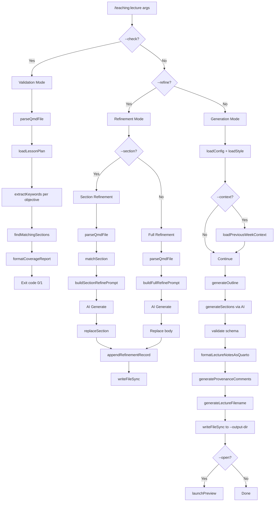
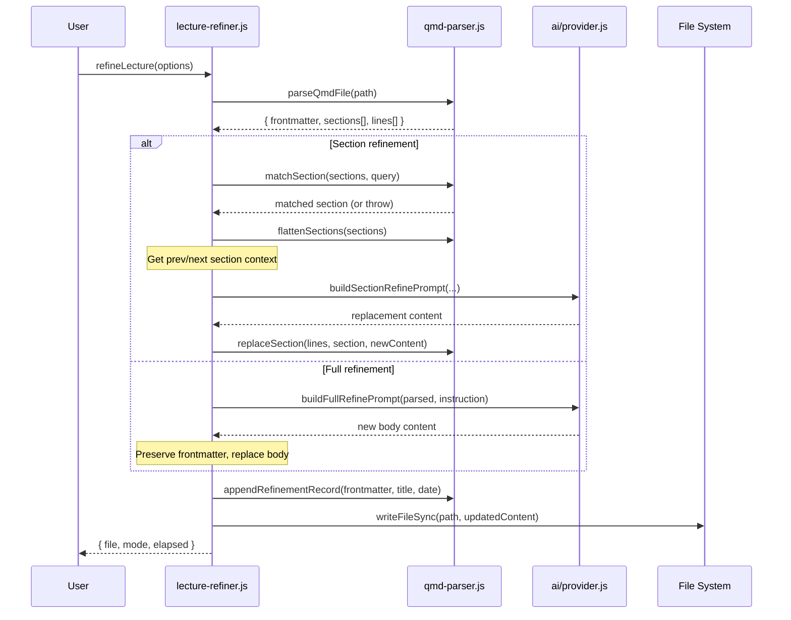
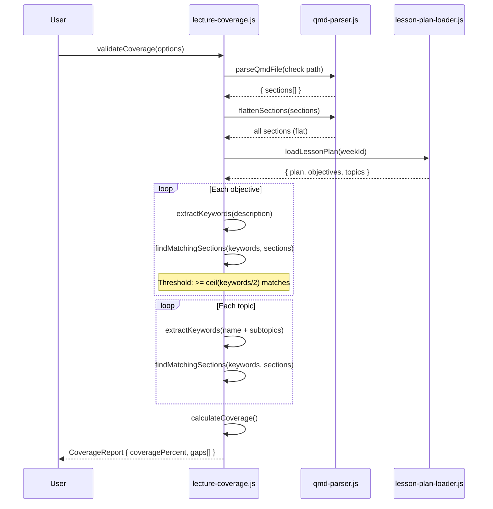
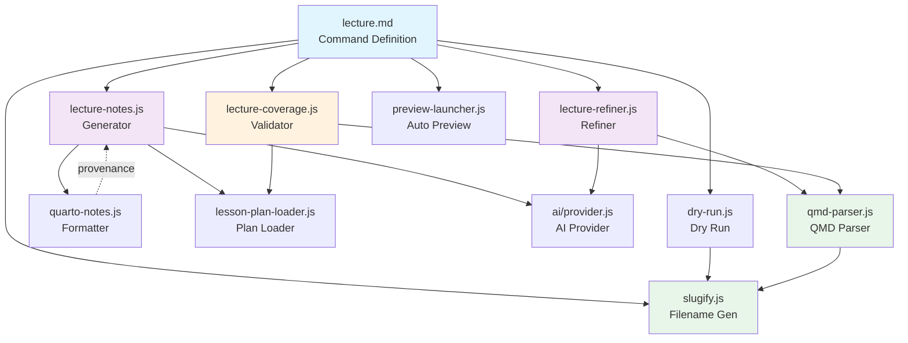
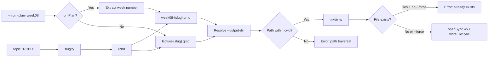
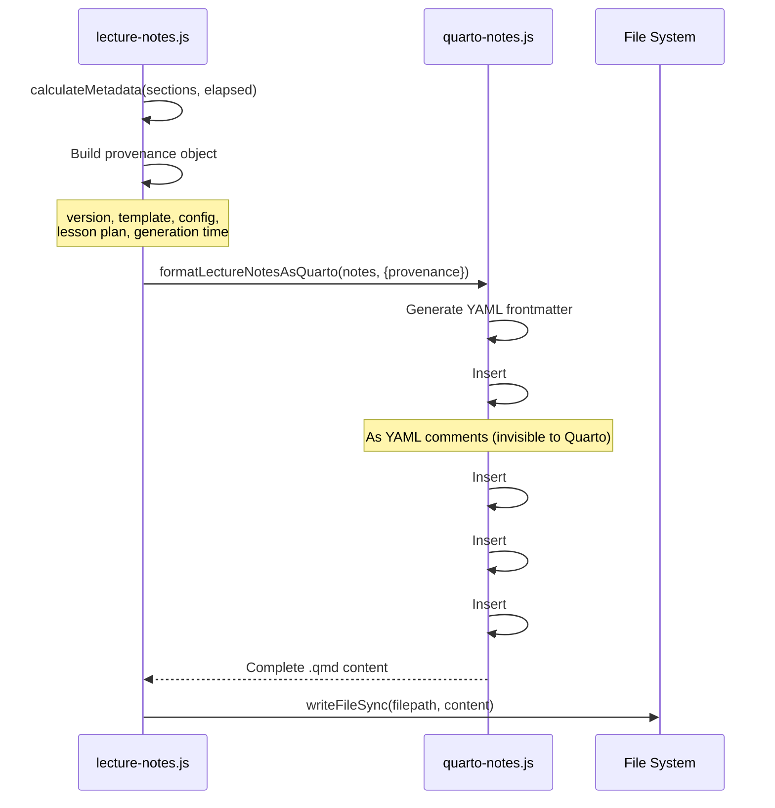
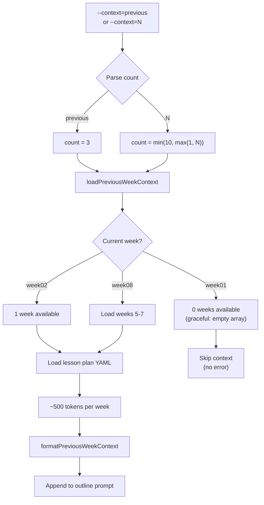

# Lecture Generation Pipeline - Sequence Diagrams

This document provides comprehensive sequence diagrams for the lecture notes generation pipeline in the Scholar plugin. These diagrams map the complete data flow from command invocation to final Quarto output.

---

## Table of Contents

1. [Full Lecture Generation Flow](#1-full-lecture-generation-flow)
2. [AI Interaction Sequence](#2-ai-interaction-sequence)
3. [Style Merge Sequence](#3-style-merge-sequence)
4. [Error Handling Flow](#4-error-handling-flow)

---

## 1. Full Lecture Generation Flow

This diagram shows the complete lifecycle of lecture generation, from command invocation through outline generation, section-by-section content creation, and final Quarto document assembly.

```mermaid
sequenceDiagram
    participant User
    participant Command as lecture-notes.js<br/>Command Entry Point
    participant ConfigLoader as config/loader.js<br/>Config System
    participant StyleLoader as config/style-loader.js<br/>4-Layer Style System
    participant LessonLoader as utils/lesson-plan-loader.js<br/>Lesson Plan Parser
    participant Generator as generators/lecture-notes.js<br/>Main Generator
    participant AI as ai/provider.js<br/>AI Provider
    participant PromptBuilder as ai/lecture-prompts.js<br/>Prompt Builder
    participant Validator as validators/engine.js<br/>Schema Validator
    participant Formatter as formatters/quarto-notes.js<br/>Quarto Formatter

    %% Phase 1: Initialization
    Note over User,Formatter: Phase 1: Load Configuration & Context

    User->>Command: /teaching:lecture "Linear Regression"<br/>--from-plan week03 --format html,pdf
    activate Command

    Command->>ConfigLoader: loadTeachConfig(cwd, options)
    activate ConfigLoader
    ConfigLoader->>ConfigLoader: findConfigFile(cwd)
    ConfigLoader->>ConfigLoader: Load .flow/teach-config.yml
    ConfigLoader-->>Command: config (course_info, defaults, style)
    deactivate ConfigLoader

    Command->>LessonLoader: loadLessonPlan('week03')
    activate LessonLoader
    LessonLoader->>LessonLoader: findCourseRoot(cwd)
    LessonLoader->>LessonLoader: Read content/lesson-plans/week03.yml
    LessonLoader->>LessonLoader: Validate schema
    LessonLoader-->>Command: lessonPlan<br/>(topic, objectives, activities, style_overrides)
    deactivate LessonLoader

    Command->>StyleLoader: loadTeachingStyle({command: 'lecture', lessonPlan})
    Note over StyleLoader: See Diagram 3 for detailed style merge
    activate StyleLoader
    StyleLoader->>StyleLoader: Load Layer 1: Global (~/.claude/CLAUDE.md)
    StyleLoader->>StyleLoader: Load Layer 2: Course (.claude/teaching-style.local.md)
    StyleLoader->>StyleLoader: Extract Layer 3: command_overrides.lecture
    StyleLoader->>StyleLoader: Extract Layer 4: lessonPlan.teaching_style_overrides
    StyleLoader->>StyleLoader: mergeTeachingStyles(4 layers)
    StyleLoader->>StyleLoader: toPromptStyle(mergedStyle)
    StyleLoader-->>Command: {style, promptStyle, sources, courseRoot}
    deactivate StyleLoader

    %% Phase 2: Outline Generation
    Note over User,Formatter: Phase 2: Generate Lecture Outline

    Command->>Generator: generateLectureNotes(options, onProgress)
    activate Generator

    Generator->>Generator: reportProgress('outline', 0, 1, 'Generating outline')

    Generator->>Generator: generateOutline(options, teachingStyle, lessonPlan, ai)
    activate Generator

    Generator->>PromptBuilder: buildOutlinePrompt(options, teachingStyle, lessonPlan)
    activate PromptBuilder
    PromptBuilder->>PromptBuilder: Build objectives from lesson plan
    PromptBuilder->>PromptBuilder: buildStyleGuidance(teachingStyle)
    PromptBuilder->>PromptBuilder: Format JSON schema requirements
    PromptBuilder-->>Generator: outlinePrompt (3000-4000 tokens)
    deactivate PromptBuilder

    Generator->>AI: generate(outlinePrompt, {format: 'json', temperature: 0.7})
    Note over AI: See Diagram 2 for AI interaction details
    activate AI
    AI-->>Generator: {success: true, content: outlineJSON, metadata}
    deactivate AI

    Generator->>Generator: Parse JSON response
    Generator->>Generator: Validate outline structure<br/>(8-12 sections, 20-30 pages)
    Generator->>Generator: Ensure required section types<br/>(intro, concept, example, practice, summary)
    Generator-->>Generator: outline<br/>(title, objectives, sections[])
    deactivate Generator

    %% Phase 3: Section Generation
    Note over User,Formatter: Phase 3: Generate Sections (One AI call per section)

    Generator->>Generator: countSections(outline.sections) → totalSections
    Generator->>Generator: generateSections(outline, options, teachingStyle, ai, onProgress)
    activate Generator

    loop For each section (including subsections recursively)
        Generator->>Generator: reportProgress('sections', current, total, sectionTitle)

        Generator->>Generator: generateSectionContent(sectionOutline, options, teachingStyle, previousContext, objectives, ai)
        activate Generator

        Generator->>PromptBuilder: buildSectionPrompt(sectionOutline, options, teachingStyle, previousContext, objectives)
        activate PromptBuilder
        PromptBuilder->>PromptBuilder: Get SECTION_TYPES[type] characteristics
        PromptBuilder->>PromptBuilder: buildStyleGuidance(teachingStyle)
        PromptBuilder->>PromptBuilder: buildTypeInstructions(type, language, pages)
        PromptBuilder->>PromptBuilder: buildLevelGuidance(level)
        PromptBuilder->>PromptBuilder: Format JSON schema for section type
        PromptBuilder-->>Generator: sectionPrompt (2000-3000 tokens)
        deactivate PromptBuilder

        Generator->>AI: generate(sectionPrompt, {format: 'json', temperature: 0.7, context})
        activate AI
        AI-->>Generator: {success: true, content: sectionJSON, metadata}
        deactivate AI

        Generator->>Generator: Parse section JSON
        Generator->>Generator: Ensure required fields (id, type, title, content)
        Generator->>Generator: extractSectionSummary(section)
        Generator->>Generator: Append to previousContext

        alt Has subsections
            Generator->>Generator: Recursively process subsections
        end

        Generator-->>Generator: section (with content, code, math, problems)
        deactivate Generator
    end

    Generator-->>Generator: sections[] (complete hierarchy)
    deactivate Generator

    %% Phase 4: Assembly & Validation
    Note over User,Formatter: Phase 4: Assemble & Validate

    Generator->>Generator: Assemble lectureNotes object<br/>(title, sections, objectives, metadata)

    Generator->>Validator: validate(lectureNotes, lectureNotesTemplate)
    activate Validator
    Validator->>Validator: Validate against lecture-notes.json schema
    Validator->>Validator: Check required fields
    Validator->>Validator: Validate section structure
    Validator-->>Generator: {valid: true, errors: [], warnings: []}
    deactivate Validator

    Generator->>Formatter: formatLectureNotesAsQuarto(lectureNotes, {formats, language})
    activate Formatter
    Formatter->>Formatter: Build YAML frontmatter<br/>(title, author, date, format specs)
    Formatter->>Formatter: Format learning objectives
    Formatter->>Formatter: Recursively format sections<br/>(headings, content, code blocks, math)
    Formatter->>Formatter: stripMathBlankLines()<br/>(remove blank lines from $$...$$ blocks)
    Formatter->>Formatter: Format practice problems
    Formatter->>Formatter: Add references
    Formatter-->>Generator: quartoContent (complete .qmd file)
    deactivate Formatter

    Generator->>Generator: calculateMetadata(lectureNotes, elapsed, aiStats)
    Generator-->>Command: {content, json, metadata, validation}
    deactivate Generator

    %% Phase 5: Output
    Note over User,Formatter: Phase 5: Write Output

    Command->>Command: Write content to output/lecture-linear-regression.qmd
    Command->>Command: Write JSON to output/lecture-linear-regression.json
    Command->>User: ✅ Generated 25-page lecture in 120s<br/>8 sections, 12 code blocks, 15 equations
    deactivate Command
```



### Key Phases Explained

1. **Initialization (Lines 1-40)**: Load configuration, lesson plan, and merge 4-layer teaching style
2. **Outline Generation (Lines 41-55)**: Single AI call to generate 8-12 section outline with page estimates
3. **Section Generation (Lines 56-85)**: One AI call per section, building context progressively
4. **Assembly & Validation (Lines 86-108)**: Validate against schema, format as Quarto, and auto-fix math blank lines
5. **Output (Lines 106-109)**: Write .qmd and .json files

### Data Flow Summary

- **Input**: Topic, lesson plan ID, configuration
- **Intermediate**: Outline → 8-12 sections with metadata → Content for each section
- **Output**: Quarto document (20-40 pages), JSON representation, metadata

---

## 2. AI Interaction Sequence

This diagram shows the detailed interaction between the generator and the Claude API, including retry logic, error handling, rate limiting, and response parsing.

```mermaid
sequenceDiagram
    participant Generator as generators/lecture-notes.js
    participant AI as ai/provider.js<br/>AIProvider Class
    participant RateLimit as Rate Limiter<br/>(internal)
    participant API as Claude API<br/>(api.anthropic.com)
    participant Retry as Retry Logic<br/>(exponential backoff)

    %% Successful Request Flow
    Note over Generator,Retry: Scenario 1: Successful Request

    Generator->>AI: generate(prompt, {format: 'json', temperature: 0.7})
    activate AI

    AI->>AI: stats.totalRequests++
    AI->>AI: startTime = Date.now()

    AI->>RateLimit: enforceRateLimit()
    activate RateLimit
    RateLimit->>RateLimit: timeSinceLastRequest = now - lastRequestTime
    alt timeSinceLastRequest < minRequestInterval (100ms)
        RateLimit->>RateLimit: delay = minRequestInterval - timeSinceLastRequest
        RateLimit->>RateLimit: sleep(delay)
    end
    RateLimit->>RateLimit: lastRequestTime = Date.now()
    RateLimit-->>AI: Rate limit enforced
    deactivate RateLimit

    AI->>AI: makeRequest(prompt, options)
    activate AI

    AI->>AI: Build system prompt for JSON output
    AI->>AI: Build request body<br/>(model, max_tokens, temperature, messages)
    AI->>AI: Create AbortController with timeout (30s)

    AI->>API: POST /v1/messages<br/>Headers: x-api-key, anthropic-version<br/>Body: {model, messages, max_tokens, temperature}
    activate API

    API->>API: Process request
    API->>API: Generate content with Claude model
    API-->>AI: 200 OK<br/>{content: [{type: 'text', text: '...'}], usage, model, stop_reason}
    deactivate API

    AI->>AI: Extract text content from response
    AI->>AI: Parse JSON (handle markdown code blocks)
    alt JSON parsing successful
        AI->>AI: content = parsed JSON object
    else JSON parsing failed
        AI->>AI: content = raw text (let caller handle)
        AI->>AI: Log warning
    end

    AI-->>AI: {content, metadata: {model, tokens, inputTokens, stopReason}}
    deactivate AI

    AI->>AI: stats.successfulRequests++
    AI->>AI: stats.totalTokens += tokens + inputTokens
    AI->>AI: duration = Date.now() - startTime

    AI-->>Generator: {success: true, content: JSON, error: null, metadata: {...}}
    deactivate AI

    %% Retry Flow with Rate Limit Error
    Note over Generator,Retry: Scenario 2: Rate Limit Error with Retry

    Generator->>AI: generate(prompt, options)
    activate AI

    AI->>RateLimit: enforceRateLimit()
    activate RateLimit
    RateLimit-->>AI: OK
    deactivate RateLimit

    loop Retry loop (attempt = 0; attempt < maxRetries; attempt++)
        alt attempt > 0
            AI->>AI: stats.retriedRequests++
            AI->>AI: log(`Retry attempt ${attempt}/${maxRetries}`)
            AI->>Retry: exponentialBackoff(attempt)
            activate Retry
            Retry->>Retry: baseDelay = 1000ms
            Retry->>Retry: delay = min(baseDelay * 2^attempt, 10000)
            Retry->>Retry: jitter = delay * 0.2 * (random -1 to +1)
            Retry->>Retry: sleep(delay + jitter)
            Retry-->>AI: Backoff complete
            deactivate Retry
        end

        AI->>AI: makeRequest(prompt, options)
        activate AI
        AI->>API: POST /v1/messages
        activate API

        alt Attempt 1: Rate limit
            API-->>AI: 429 Too Many Requests<br/>{error: "rate_limit_exceeded"}
            AI->>AI: error.status = 429
            AI->>AI: error.message = 'Rate limit exceeded'
            AI-->>AI: throw error
        else Attempt 2: Success after backoff
            API-->>AI: 200 OK (content)
            AI-->>AI: {content, metadata}
        end
        deactivate API
        deactivate AI

        alt isRetryable(error) && attempt < maxRetries - 1
            AI->>AI: Continue to next attempt
        else Success or non-retryable error
            break Exit retry loop
        end
    end

    AI->>AI: stats.successfulRequests++
    AI-->>Generator: {success: true, content, error: null, metadata}
    deactivate AI

    %% Timeout Flow
    Note over Generator,Retry: Scenario 3: Request Timeout

    Generator->>AI: generate(prompt, options)
    activate AI
    AI->>RateLimit: enforceRateLimit()
    activate RateLimit
    RateLimit-->>AI: OK
    deactivate RateLimit

    AI->>AI: makeRequest(prompt, options)
    activate AI
    AI->>AI: controller = new AbortController()
    AI->>AI: timeoutId = setTimeout(() => controller.abort(), 30000)
    AI->>API: POST /v1/messages (with signal)
    activate API

    Note over API: Request takes > 30 seconds

    API-->>AI: (timeout - AbortController triggers)
    deactivate API

    AI->>AI: clearTimeout(timeoutId)
    AI->>AI: error.name = 'AbortError'
    AI->>AI: throw new Error('Request timeout')
    AI-->>AI: TimeoutError
    deactivate AI

    alt isRetryable(TimeoutError) && attempts < maxRetries
        AI->>Retry: exponentialBackoff(attempt)
        activate Retry
        Retry-->>AI: Backoff complete
        deactivate Retry
        AI->>AI: makeRequest(prompt, options) (retry)
        Note over AI,API: Retry with longer timeout or fail
    else Max retries exceeded
        AI->>AI: stats.failedRequests++
        AI-->>Generator: {success: false, content: null, error: 'Request timeout', metadata}
    end

    deactivate AI

    %% Non-retryable Error Flow
    Note over Generator,Retry: Scenario 4: Non-retryable Error (Invalid API Key)

    Generator->>AI: generate(prompt, options)
    activate AI

    AI->>AI: makeRequest(prompt, options)
    activate AI

    alt API key not configured
        AI->>AI: throw new Error('API key not configured')
    else Invalid API key
        AI->>API: POST /v1/messages
        activate API
        API-->>AI: 401 Unauthorized<br/>{error: "invalid_api_key"}
        deactivate API
        AI->>AI: error.status = 401
        AI->>AI: error.message = 'API error 401: invalid_api_key'
    end

    AI-->>AI: throw error
    deactivate AI

    AI->>AI: isRetryable(error) → false (ConfigurationError)
    AI->>AI: stats.failedRequests++
    AI-->>Generator: {success: false, content: null, error: 'API key not configured', metadata}
    deactivate AI
```

### AI Interaction Key Points

1. **Rate Limiting**: Enforces minimum 100ms between requests to prevent API throttling
2. **Retry Logic**: 3 attempts with exponential backoff (1s, 2s, 4s) + jitter
3. **Timeout Management**: 30-second timeout per request using AbortController
4. **Error Classification**:
   - **Retryable**: Rate limit (429), service unavailable (5xx), network errors (ECONNRESET)
   - **Non-retryable**: Authentication (401), configuration errors, invalid input (400)
5. **JSON Parsing**: Handles markdown-wrapped JSON (`\`\`\`json ... \`\`\``), falls back to raw text
6. **Statistics Tracking**: totalRequests, successfulRequests, failedRequests, retriedRequests, totalTokens

### Typical Token Usage

- **Outline Prompt**: ~3500 input tokens, ~1500 output tokens
- **Section Prompt**: ~2500 input tokens, ~1000-2000 output tokens
- **Total for 10-section lecture**: ~30,000 tokens (input + output)

---

## 3. Style Merge Sequence

This diagram shows the 4-layer teaching style system and how configuration cascades from global defaults to lesson-specific overrides.

```mermaid
sequenceDiagram
    participant Generator as generators/lecture-notes.js
    participant StyleLoader as config/style-loader.js<br/>Main Style Loader
    participant L1 as Layer 1<br/>~/.claude/CLAUDE.md
    participant L2 as Layer 2<br/>.claude/teaching-style.local.md
    participant L3 as Layer 3<br/>command_overrides.lecture
    participant L4 as Layer 4<br/>lesson-plan.teaching_style_overrides
    participant Merger as Deep Merge Engine

    Note over Generator,Merger: 4-Layer Teaching Style Cascade

    Generator->>StyleLoader: loadTeachingStyle({command: 'lecture', startDir, lessonPlan})
    activate StyleLoader

    %% Layer 1: Global
    Note over StyleLoader,L1: Layer 1: Load Global Teaching Style

    StyleLoader->>StyleLoader: loadGlobalStyle()
    activate StyleLoader
    StyleLoader->>L1: Check existence: ~/.claude/CLAUDE.md
    activate L1
    alt File exists
        L1->>L1: readFileSync(CLAUDE.md)
        L1->>L1: parseYamlFrontmatter(content)
        L1->>L1: Extract teaching_style from frontmatter
        L1-->>StyleLoader: globalStyle<br/>{pedagogical_approach: {...}, explanation_style: {...}}
        Note over L1: Source: ~/.claude/CLAUDE.md
    else File not found
        L1-->>StyleLoader: null (use defaults)
    end
    deactivate L1
    StyleLoader-->>StyleLoader: globalStyle (or null)
    deactivate StyleLoader

    %% Layer 2: Course
    Note over StyleLoader,L2: Layer 2: Load Course-Specific Style

    StyleLoader->>StyleLoader: findCourseRoot(startDir)
    activate StyleLoader
    StyleLoader->>StyleLoader: Search upward for .claude/ or .flow/ directory
    StyleLoader-->>StyleLoader: courseRoot (e.g., /Users/dt/teaching/stat-440)
    deactivate StyleLoader

    StyleLoader->>StyleLoader: loadCourseStyle(courseRoot)
    activate StyleLoader
    StyleLoader->>L2: Check existence: courseRoot/.claude/teaching-style.local.md
    activate L2
    alt File exists
        L2->>L2: readFileSync(teaching-style.local.md)
        L2->>L2: parseYamlFrontmatter(content)
        L2->>L2: Extract teaching_style and command_overrides
        L2-->>StyleLoader: courseStyle<br/>{pedagogical_approach: {primary: 'problem-based'}, command_overrides: {...}}
        Note over L2: Source: .claude/teaching-style.local.md
    else File not found
        L2-->>StyleLoader: null
    end
    deactivate L2
    StyleLoader-->>StyleLoader: courseStyle (or null)
    deactivate StyleLoader

    %% Layer 3: Command Overrides
    Note over StyleLoader,L3: Layer 3: Extract Command-Specific Overrides

    StyleLoader->>StyleLoader: extractCommandOverrides(courseStyle, 'lecture')
    activate StyleLoader
    alt courseStyle.command_overrides exists
        StyleLoader->>L3: Access command_overrides.lecture
        activate L3
        alt command_overrides.lecture exists
            L3-->>StyleLoader: commandOverrides<br/>{explanation_style: {formality: 'formal', proof_style: 'rigorous'}}
            Note over L3: Source: command_overrides.lecture
        else No lecture overrides
            L3-->>StyleLoader: null
        end
        deactivate L3
    else No command_overrides
        StyleLoader-->>StyleLoader: null
    end
    StyleLoader-->>StyleLoader: commandOverrides (or null)
    deactivate StyleLoader

    %% Layer 4: Lesson Plan
    Note over StyleLoader,L4: Layer 4: Extract Lesson Plan Style Overrides

    StyleLoader->>StyleLoader: Extract teaching_style_overrides from lessonPlan
    activate StyleLoader
    alt lessonPlan.teaching_style_overrides exists
        StyleLoader->>L4: Access teaching_style_overrides
        activate L4
        L4-->>StyleLoader: lessonStyle<br/>{explanation_style: {analogies: 'frequent'}, content_preferences: {real_world_examples: 'extensive'}}
        Note over L4: Source: lesson-plan (week03.yml)
        deactivate L4
    else No lesson plan or no overrides
        StyleLoader-->>StyleLoader: null
    end
    StyleLoader-->>StyleLoader: lessonStyle (or null)
    deactivate StyleLoader

    %% Merge Process
    Note over StyleLoader,Merger: Merge All Layers (Precedence: Command > Lesson > Course > Global > Default)

    StyleLoader->>Merger: mergeTeachingStyles({globalStyle, courseStyle, commandOverrides, lessonStyle})
    activate Merger

    Merger->>Merger: Start with getDefaultTeachingStyle()
    Note over Merger: Default: {pedagogical_approach: 'active-learning', explanation_style: {...}, assessment_philosophy: {...}}

    Merger->>Merger: deepMerge(default, globalStyle)
    Note over Merger: Apply Layer 1: Global overrides defaults

    Merger->>Merger: Extract courseStyleWithoutOverrides<br/>(exclude command_overrides from merge)
    Merger->>Merger: deepMerge(current, courseStyleWithoutOverrides)
    Note over Merger: Apply Layer 2: Course overrides global

    Merger->>Merger: deepMerge(current, lessonStyle)
    Note over Merger: Apply Layer 4: Lesson overrides course<br/>(applied BEFORE command to allow command highest priority)

    Merger->>Merger: deepMerge(current, commandOverrides)
    Note over Merger: Apply Layer 3: Command overrides lesson<br/>(highest precedence)

    Merger-->>StyleLoader: mergedStyle<br/>(fully merged teaching style)
    deactivate Merger

    %% Convert to Prompt Format
    Note over StyleLoader: Convert to Prompt-Friendly Format

    StyleLoader->>StyleLoader: toPromptStyle(mergedStyle)
    activate StyleLoader
    StyleLoader->>StyleLoader: Extract key attributes:<br/>- tone (from formality)<br/>- pedagogical_approach (primary)<br/>- explanation_style (proof_style)<br/>- example_depth, analogies, real_world_examples
    StyleLoader->>StyleLoader: Flatten nested structure for buildStyleGuidance()
    StyleLoader-->>StyleLoader: promptStyle<br/>{tone, pedagogical_approach, explanation_style, ...}
    deactivate StyleLoader

    %% Return Complete Result
    StyleLoader->>StyleLoader: Build sources object<br/>(track which layers were applied)
    StyleLoader-->>Generator: {style: mergedStyle, promptStyle, sources: {global, course, command, lesson}, courseRoot}
    deactivate StyleLoader

    Note over Generator: Generator now has complete teaching style<br/>ready for buildStyleGuidance() in prompts
```



### Style Merge Example

Given the following layers:

**Layer 1 (Global)**:

```yaml
teaching_style:
  pedagogical_approach:
    primary: active-learning
  explanation_style:
    formality: balanced
    proof_style: rigorous-with-intuition
```

**Layer 2 (Course)**:

```yaml
teaching_style:
  pedagogical_approach:
    primary: problem-based
  explanation_style:
    formality: conversational
```

**Layer 3 (Command Override - lecture)**:

```yaml
command_overrides:
  lecture:
    explanation_style:
      formality: formal
      proof_style: rigorous
```

**Layer 4 (Lesson Plan - week03)**:

```yaml
teaching_style_overrides:
  explanation_style:
    analogies: frequent
  content_preferences:
    real_world_examples: extensive
```

**Final Merged Result** (precedence: Command > Lesson > Course > Global):

```yaml
pedagogical_approach:
  primary: problem-based              # From Layer 2 (Course)
explanation_style:
  formality: formal                   # From Layer 3 (Command) ✓ Highest precedence
  proof_style: rigorous               # From Layer 3 (Command) ✓
  analogies: frequent                 # From Layer 4 (Lesson)
content_preferences:
  real_world_examples: extensive      # From Layer 4 (Lesson)
```

### Key Merge Behaviors

1. **Precedence Order**: Command > Lesson > Course > Global > Default
2. **Deep Merge**: Nested objects merge recursively (not replaced wholesale)
3. **Null Handling**: `null` values are not overwritten by lower layers
4. **Command Overrides Applied Last**: Ensures command-specific requirements always win
5. **Lesson Overrides Applied Second-to-Last**: Allows per-week customization while respecting command requirements

---

## 4. Error Handling Flow

This diagram shows how the system handles errors during generation, including retry logic, fallback content, validation failures, and recovery strategies.

```mermaid
sequenceDiagram
    participant Generator as generators/lecture-notes.js
    participant AI as ai/provider.js
    participant API as Claude API
    participant FallbackEngine as Fallback Content Generator
    participant Validator as validators/engine.js
    participant Logger as Console Logger

    %% Scenario 1: Outline Generation Failure with Fallback
    Note over Generator,Logger: Scenario 1: Outline Generation Failure → Fallback

    Generator->>Generator: generateOutline(options, teachingStyle, lessonPlan, ai)
    activate Generator

    Generator->>AI: generate(outlinePrompt, options)
    activate AI

    AI->>API: POST /v1/messages (attempt 1)
    activate API
    API-->>AI: 500 Internal Server Error
    deactivate API

    AI->>AI: isRetryable(error) → true (server error)
    AI->>AI: exponentialBackoff(attempt=1) → sleep(1000ms)

    AI->>API: POST /v1/messages (attempt 2)
    activate API
    API-->>AI: 500 Internal Server Error
    deactivate API

    AI->>AI: exponentialBackoff(attempt=2) → sleep(2000ms)

    AI->>API: POST /v1/messages (attempt 3)
    activate API
    API-->>AI: 500 Internal Server Error
    deactivate API

    AI->>AI: stats.failedRequests++
    AI-->>Generator: {success: false, error: 'Service unavailable', metadata}
    deactivate AI

    Generator->>Logger: console.warn('⚠️ AI outline generation failed: Service unavailable')
    activate Logger
    Logger->>Logger: Display warning to user
    Logger-->>Generator: Warning logged
    deactivate Logger

    Generator->>Logger: console.warn('   Falling back to template outline')
    activate Logger
    Logger-->>Generator: Fallback message logged
    deactivate Logger

    Generator->>FallbackEngine: getFallbackOutline(options, lessonPlan)
    activate FallbackEngine
    FallbackEngine->>FallbackEngine: Use lesson plan objectives (if available)
    FallbackEngine->>FallbackEngine: Generate default section structure:<br/>- Introduction (2 pages)<br/>- Core Concepts (4 pages)<br/>- Worked Example (5 pages)<br/>- Code Implementation (3 pages)<br/>- Practice Problems (3 pages)<br/>- Summary (1 page)
    FallbackEngine-->>Generator: fallbackOutline<br/>(6 sections, 18 estimated pages)
    deactivate FallbackEngine

    Generator->>Generator: Validate section structure<br/>(≥5 sections, reasonable page count)
    Generator-->>Generator: outline (fallback)
    deactivate Generator

    Note over Generator: Generation continues with fallback outline

    %% Scenario 2: Section Generation Failure with Per-Section Fallback
    Note over Generator,Logger: Scenario 2: Section Content Generation Failure → Per-Section Fallback

    Generator->>Generator: generateSectionContent(sectionOutline, options, teachingStyle, previousContext, objectives, ai)
    activate Generator

    Generator->>AI: generate(sectionPrompt, options)
    activate AI

    AI->>API: POST /v1/messages (attempt 1)
    activate API
    API-->>AI: 200 OK<br/>{content: "Invalid JSON: missing closing brace..."}
    deactivate API

    AI->>AI: Attempt JSON.parse(content)
    AI->>AI: JSON parse error: Unexpected end of JSON input
    AI->>AI: Log warning, return raw text
    AI-->>Generator: {success: true, content: "Invalid JSON...", metadata}
    deactivate AI

    Generator->>Generator: Attempt JSON.parse(result.content)
    Generator->>Generator: JSON parse error caught
    Generator->>Logger: console.warn('⚠️ Failed to parse section JSON for S2: Unexpected end of JSON input')
    activate Logger
    Logger-->>Generator: Warning logged
    deactivate Logger

    Generator->>FallbackEngine: getFallbackSectionContent(sectionOutline, options)
    activate FallbackEngine
    FallbackEngine->>FallbackEngine: Check section type (e.g., 'concept')
    FallbackEngine->>FallbackEngine: Generate type-specific placeholder:<br/>- content: Generic explanation<br/>- math: Placeholder equation (if hasMath)<br/>- code: Placeholder code (if hasCode)
    FallbackEngine-->>Generator: fallbackSection<br/>(id, type, title, content, math/code)
    deactivate FallbackEngine

    Generator->>Generator: Ensure required fields from outline<br/>(id, type, title, level, estimated_pages)
    Generator-->>Generator: section (fallback content)
    deactivate Generator

    Note over Generator: Section added with fallback content, generation continues

    %% Scenario 3: Validation Failure (Non-blocking)
    Note over Generator,Logger: Scenario 3: Schema Validation Failure → Warning Only

    Generator->>Generator: Assemble lectureNotes object<br/>(title, sections, objectives, metadata)

    Generator->>Validator: validate(lectureNotes, lectureNotesTemplate)
    activate Validator
    Validator->>Validator: Load lecture-notes.json schema
    Validator->>Validator: Validate with AJV (JSON Schema)

    alt Validation failure (non-critical)
        Validator->>Validator: Collect errors:<br/>- sections[2].code.language should be enum ['r', 'python']<br/>- sections[4].problems is missing required field 'difficulty'
        Validator-->>Generator: {valid: false, errors: [...], warnings: [...]}
    else Validation success
        Validator-->>Generator: {valid: true, errors: [], warnings: []}
    end
    deactivate Validator

    alt !validation.valid
        Generator->>Logger: console.warn('⚠️ Validation warnings:', validation.errors)
        activate Logger
        Logger->>Logger: Display validation warnings to user
        Logger-->>Generator: Warnings displayed
        deactivate Logger
        Note over Generator: Generation continues despite validation errors
    end

    %% Scenario 4: Timeout Recovery
    Note over Generator,Logger: Scenario 4: Request Timeout → Retry with Backoff

    Generator->>Generator: generateSectionContent(sectionOutline, options, teachingStyle, previousContext, objectives, ai)
    activate Generator

    Generator->>AI: generate(sectionPrompt, options)
    activate AI

    AI->>API: POST /v1/messages (timeout: 30s, attempt 1)
    activate API
    Note over API: Request processing takes > 30 seconds
    API-->>AI: (AbortController triggers timeout)
    deactivate API

    AI->>AI: clearTimeout(timeoutId)
    AI->>AI: error.name = 'AbortError' → throw TimeoutError
    AI->>AI: isRetryable(TimeoutError) → true
    AI->>AI: exponentialBackoff(attempt=1) → sleep(1000ms + jitter)

    AI->>API: POST /v1/messages (timeout: 30s, attempt 2)
    activate API
    API-->>AI: 200 OK (content)
    deactivate API

    AI->>AI: Parse JSON successfully
    AI-->>Generator: {success: true, content: sectionJSON, metadata: {attempts: 2}}
    deactivate AI

    Generator->>Generator: section = parsed JSON
    Generator-->>Generator: section (recovered after timeout)
    deactivate Generator

    Note over Generator: Section successfully generated after retry

    %% Scenario 5: Non-retryable Error → Immediate Failure
    Note over Generator,Logger: Scenario 5: Configuration Error → Immediate Failure

    Generator->>Generator: generateOutline(options, teachingStyle, lessonPlan, ai)
    activate Generator

    Generator->>AI: generate(outlinePrompt, options)
    activate AI

    AI->>AI: makeRequest(prompt, options)
    activate AI
    AI->>AI: Check apiKey
    alt API key not configured
        AI->>AI: throw new Error('API key not configured')
    end
    AI-->>AI: ConfigurationError
    deactivate AI

    AI->>AI: isRetryable(ConfigurationError) → false
    AI->>AI: stats.failedRequests++
    AI-->>Generator: {success: false, error: 'API key not configured', metadata: {attempts: 1}}
    deactivate AI

    Generator->>Logger: console.warn('⚠️ AI outline generation failed: API key not configured')
    activate Logger
    Logger-->>Generator: Warning logged
    deactivate Logger

    Generator->>FallbackEngine: getFallbackOutline(options, lessonPlan)
    activate FallbackEngine
    FallbackEngine-->>Generator: fallbackOutline
    deactivate FallbackEngine

    Generator-->>Generator: outline (fallback)
    deactivate Generator

    Note over Generator: Generation continues with fallback<br/>(user must fix API key for next run)

    %% Scenario 6: Partial Generation Success
    Note over Generator,Logger: Scenario 6: Some Sections Fail → Partial Content with Fallbacks

    Generator->>Generator: generateSections(outline, options, teachingStyle, ai, onProgress)
    activate Generator

    loop For each section in outline
        alt Section 1-3: Success
            Generator->>AI: generate(sectionPrompt)
            activate AI
            AI-->>Generator: {success: true, content: sectionJSON}
            deactivate AI
            Generator->>Generator: sections[0-2] = parsed sections
        else Section 4: API Failure
            Generator->>AI: generate(sectionPrompt)
            activate AI
            AI-->>Generator: {success: false, error: 'Rate limit exceeded'}
            deactivate AI
            Generator->>FallbackEngine: getFallbackSectionContent(sectionOutline)
            activate FallbackEngine
            FallbackEngine-->>Generator: fallbackSection
            deactivate FallbackEngine
            Generator->>Generator: sections[3] = fallback section
        else Section 5-8: Success
            Generator->>AI: generate(sectionPrompt)
            activate AI
            AI-->>Generator: {success: true, content: sectionJSON}
            deactivate AI
            Generator->>Generator: sections[4-7] = parsed sections
        end
    end

    Generator-->>Generator: sections[] (7 AI-generated + 1 fallback)
    deactivate Generator

    Note over Generator: Lecture completed with mixed content<br/>(mostly AI, one fallback section)
```



### Error Handling Strategies

1. **Outline Generation Failure**:
   - **Strategy**: Fall back to template outline based on lesson plan (if available) or generic structure
   - **Impact**: Generation continues with reasonable defaults
   - **User notification**: Console warning

2. **Section Generation Failure**:
   - **Strategy**: Fall back to type-specific placeholder content per section
   - **Impact**: Partial content (some sections AI-generated, others template-based)
   - **User notification**: Console warning for each failed section

3. **JSON Parsing Failure**:
   - **Strategy**: Return raw text to caller, let caller fall back to template
   - **Impact**: Section uses fallback content
   - **User notification**: Console warning

4. **Validation Failure**:
   - **Strategy**: Log warnings but continue generation (non-blocking)
   - **Impact**: Output may have schema violations but is still usable
   - **User notification**: Console warning listing validation errors

5. **Timeout**:
   - **Strategy**: Retry with exponential backoff (up to 3 attempts)
   - **Impact**: Slower generation but eventually succeeds or falls back
   - **User notification**: Progress indicator shows retry attempts

6. **Configuration Error** (API key):
   - **Strategy**: Immediate failure with fallback content for entire document
   - **Impact**: All sections use template content
   - **User notification**: Console error, suggests fixing configuration

### Retryable vs Non-retryable Errors

**Retryable** (up to 3 attempts):

- Rate limit (429)
- Server errors (5xx)
- Network errors (ECONNRESET, ETIMEDOUT, ECONNREFUSED)
- Timeout (AbortError)

**Non-retryable** (immediate failure):

- Authentication errors (401)
- Configuration errors (missing API key)
- Invalid input (400)
- JSON parsing errors (handled separately with fallback)

### Fallback Content Quality

- **Outline Fallback**: Uses lesson plan objectives (if available), generates 6-section structure matching typical lecture format
- **Section Fallback**: Type-specific placeholders (e.g., code sections get valid R/Python syntax, concept sections get structured prose)
- **Validation**: Schema violations are logged but don't block generation (allows graceful degradation)

---

## Summary

These sequence diagrams document the complete lecture generation pipeline, including:

1. **Full Generation Flow**: 5 phases from initialization to output
2. **AI Interaction**: Retry logic, rate limiting, timeout handling, and response parsing
3. **Style Merging**: 4-layer cascade with deep merge and precedence rules
4. **Error Handling**: 6 failure scenarios with fallback strategies

### Key Architectural Patterns

- **Progressive Context Building**: Each section's summary becomes context for the next
- **Graceful Degradation**: Failures at any level fall back to reasonable defaults
- **Layered Configuration**: Teaching style merges from 4 sources with clear precedence
- **Retry with Backoff**: Transient errors retry up to 3 times with exponential delays
- **Non-blocking Validation**: Schema validation warns but doesn't prevent output

### Performance Characteristics

- **Typical 10-section lecture**: ~2-3 minutes total (1 outline call + 10 section calls)
- **Token usage**: ~30,000 tokens (input + output) for 25-page document
- **Retry overhead**: 1-4 seconds per retry (with backoff)
- **Rate limiting**: Minimum 100ms between API calls

---

**Generated**: 2026-01-28
**Version**: v2.1.0 (Lecture command implementation)
**Related Files**:

- `/Users/dt/projects/dev-tools/scholar/src/teaching/generators/lecture-notes.js`
- `/Users/dt/projects/dev-tools/scholar/src/teaching/ai/lecture-prompts.js`
- `/Users/dt/projects/dev-tools/scholar/src/teaching/ai/provider.js`
- `/Users/dt/projects/dev-tools/scholar/src/teaching/config/style-loader.js`

---

## 5. v2.5.0 — Three-Mode Command Architecture

Added in v2.5.0 to support generation, refinement, and validation modes.

### Mode Selection Flow



### Section Refinement Sequence



### Coverage Validation Sequence



### Module Dependency Graph



### Output Filename Generation (F1)



### Provenance Metadata Injection (F2)



### Previous Week Context Loading (F4)



**Updated**: 2026-01-29
**Version**: v2.5.0 (Weekly Lecture Production)
