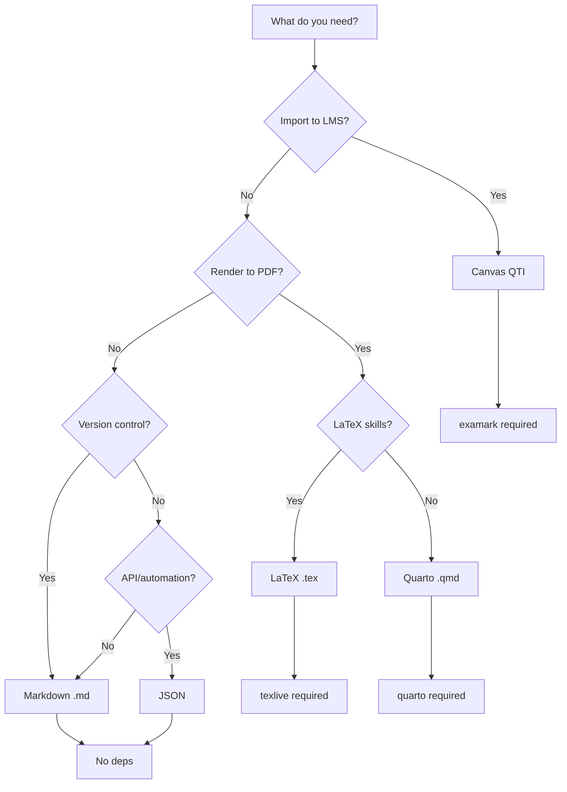

# Scholar Output Formats Guide

Comprehensive reference for all output formats supported by Scholar teaching commands.

---

## TL;DR - Quick Decision Tree



### Quick Picks

- **Canvas LMS** → `--format canvas` (requires examark)
- **Print to PDF** → `--format quarto` (requires quarto)
- **Maximum control** → `--format latex` (requires texlive)
- **Simple/portable** → `--format markdown` (no dependencies)
- **Automation** → JSON output (built-in, no flag needed)

---

## Format Comparison Table

| Format           | Extension  | Use Case                            | Dependencies  | Command Flag      | Output Type     |
| ---------------- | ---------- | ----------------------------------- | ------------- | ----------------- | --------------- |
| **JSON**         | `.json`    | Raw data, APIs, automation          | None          | (default)         | Structured data |
| **Markdown**     | `.md`      | Version control, examark export     | None          | `--format md`     | Plain text      |
| **Quarto**       | `.qmd`     | PDF/HTML rendering, literate docs   | quarto        | `--format quarto` | Renderable doc  |
| **Quarto Notes** | `.qmd`     | Long-form lecture notes             | quarto        | (lecture command) | Renderable doc  |
| **LaTeX**        | `.tex`     | Academic typesetting                | texlive       | `--format latex`  | Compilable doc  |
| **LaTeX Export** | `.tex`     | Multi-version exports (student/key) | texlive       | (advanced)        | Compilable doc  |
| **Canvas QTI**   | `.qti.zip` | Canvas LMS import                   | examark (npm) | `--format canvas` | ZIP archive     |
| **Examark**      | `.md`      | Canvas QTI via examark              | examark (npm) | (intermediate)    | Plain text      |
| **Diff**         | Terminal   | Sync preview (YAML↔JSON)            | None          | `--dry-run`       | Colored text    |
| **Error**        | Terminal   | Validation errors                   | None          | `--validate`      | Colored text    |

---

## When to Use Each Format

### JSON (`.json`) - Raw Structured Data

### Best for (When to Use)

- API integration
- Automation scripts
- Data processing pipelines
- Feeding other tools
- Programmatic access to exam data

### Characteristics (When to Use)

- Always available (no dependencies)
- Machine-readable
- Lossless (preserves all metadata)
- Not human-friendly for editing
- Schema-validated

### Example Output (When to Use)

```json
{
  "title": "Midterm Exam - STAT 440",
  "exam_type": "midterm",
  "duration_minutes": 60,
  "total_points": 100,
  "questions": [
    {
      "id": "Q1",
      "type": "multiple-choice",
      "text": "What is the purpose of hypothesis testing?",
      "options": ["A", "B", "C", "D"],
      "points": 10
    }
  ],
  "answer_key": {
    "Q1": "B"
  }
}
```

### Common Issues (When to Use)

- Not suitable for direct student distribution
- Requires additional processing for rendering

---

### Markdown (`.md`) - Plain Text Format

### Best for

- Version control (git-friendly)
- Human-readable editing
- examark preprocessing
- Quick previews
- Documentation

### Characteristics

- examark-compatible YAML frontmatter
- LaTeX math preserved (`$...$`, `$$...$$`)
- Multiple-choice with answer marking (`*`)
- No rendering required
- GitHub preview-friendly

### Command (When to Use)

```bash
/teaching:exam midterm --format md
```

### Example Output

```markdown
---
title: Midterm Exam
points: 100
duration: 60 minutes
---

## Question 1 (Scholar Output Formats)

What is the purpose of hypothesis testing?

* To test assumptions about population parameters
- To calculate sample statistics
- To visualize data distributions
- To transform variables

Points: 10
```

### Rendering (Question 1 (Scholar)

- No rendering needed (plain text)
- Compatible with examark for Canvas export
- GitHub/GitLab preview available

### Common Issues (Question 1 (Scholar)

- No automatic PDF generation
- LaTeX math not rendered in all viewers
- Limited formatting control

---

### Quarto (`.qmd`) - Literate Document Format

### Best for (Question 1 (Scholar)

- PDF/HTML output
- Multi-format rendering
- Professional documents
- Code-executable exams
- Cross-platform compatibility

### Characteristics (Question 1 (Scholar)

- Enhanced YAML frontmatter
- PDF/HTML/DOCX output
- LaTeX package configuration
- Executable code blocks (R/Python)
- Callout boxes and tables
- Template-driven styling

### Command (Question 1 (Scholar)

```bash
/teaching:exam midterm --format quarto
```

### Example Output (Question 1 (Scholar)

```markdown
---
title: "Midterm Exam - STAT 440"
subtitle: "Regression Analysis"
date: 2026-01-28
format:
  pdf:
    documentclass: exam
    toc: false
    number-sections: false
    include-in-header:
      text: |
        \usepackage{amsmath}
        \usepackage{amssymb}
total_points: 100
duration: "60 minutes"
---

::: {.callout-note}
## Instructions

Show all work. Partial credit will be awarded.
:::

## Question 1

What is the purpose of hypothesis testing?

\begin{choices}
  \choice To test assumptions about population parameters
  \choice To calculate sample statistics
\end{choices}

Points: 10
```

### Rendering (Question 1)

```bash
quarto render exam.qmd --to pdf
quarto render exam.qmd --to html
quarto render exam.qmd --to docx
```

### Output Files

- `exam.pdf` - Professional PDF
- `exam.html` - Interactive HTML
- `exam.docx` - Editable Word document

### Common Issues (Question 1)

- Requires Quarto installation (`quarto install`)
- PDF requires LaTeX distribution (texlive, mactex)
- Rendering can be slow for large documents

### Troubleshooting (Question 1)

```bash
# Install quarto
brew install quarto  # macOS
# or download from https://quarto.org

# Check installation
quarto check

# Debug rendering
quarto render exam.qmd --to pdf --verbose
```

---

### Quarto Notes (`.qmd`) - Long-form Lecture Notes

### Best for (Debug rendering)

- 20-40 page instructor notes
- Hierarchical content structure
- Code-executable examples
- Multi-format output (HTML, PDF, DOCX)
- Collapsible solutions

### Characteristics (Debug rendering)

- Specialized for `/teaching:lecture` command
- Supports definitions, theorems, proofs
- Callout blocks (tips, warnings, notes)
- Practice problems with solutions
- Cross-referenced sections
- Student/instructor differentiation

### Command (Debug rendering)

```bash
/teaching:lecture "Linear Regression" --format quarto
```

### Example Output (Debug rendering)

```markdown
---
title: "Linear Regression"
subtitle: "STAT 440"
date: "2026-01-28"
toc: true
toc-depth: 3
number-sections: true
format:
  html:
    theme: cosmo
    code-fold: false
  pdf:
    documentclass: article
    geometry:
      - margin=1in
execute:
  echo: true
  warning: false
---

::: {.callout-tip title="Learning Objectives"}
By the end of this lecture, you should be able to:

1. Apply regression models to real data
2. Interpret model coefficients
:::

# Introduction {#sec-intro}

Linear regression models the relationship between...

::: {#def-ols .callout-note title="Definition"}
**Ordinary Least Squares (OLS)** minimizes:

$$
\text{SSE} = \sum_{i=1}^n (y_i - \hat{y}_i)^2
$$
:::

# Practice Problems

**Problem 1** (medium)

Derive the OLS estimator...

::: {.callout-tip title="Hint" collapse="true"}
Start by taking the derivative of SSE...
:::

::: {.callout-note title="Solution" collapse="true"}
The OLS estimator is $\hat{\beta} = (X^T X)^{-1} X^T y$...
:::
```

### Rendering (Practice Problems)

```bash
quarto render lecture.qmd --to html  # Interactive HTML
quarto render lecture.qmd --to pdf   # Print-ready PDF
```

### Special Features

- Collapsible hints/solutions (HTML only)
- Cross-references (@sec-intro, @def-ols)
- Differentiation for cross-listed courses
- Code execution with output

### Math Auto-Fix

Scholar automatically strips blank lines from display math blocks (`$$...$$`) in Quarto lecture output. Blank lines inside math blocks break LaTeX PDF rendering but are tolerated by MathJax (HTML). This fix runs silently — no user action required.

See the [Auto-Fixer Guide](AUTO-FIXER-GUIDE.md#qw4-math-blank-line-auto-fix-priority-5) for details.

---

### LaTeX (`.tex`) - Academic Typesetting

### Best for (Practice Problems)

- Maximum typesetting control
- Academic publishing
- Complex mathematical notation
- Custom document classes
- Professional formatting

### Characteristics (Practice Problems)

- Uses `exam` documentclass
- Professional math rendering
- Multiple-choice as `\begin{choices}`
- Point allocation with `\question[10]`
- Formula sheet appendix
- Full LaTeX control

### Command (Practice Problems)

```bash
/teaching:exam midterm --format latex
```

### Example Output (Practice Problems)

```latex
\documentclass[12pt,letterpaper]{exam}

% Packages
\usepackage{amsmath}
\usepackage{amssymb}
\usepackage{graphicx}

% Exam configuration
\pointsinrightmargin
\bracketedpoints

\title{Midterm Exam}
\author{STAT 440}
\date{Fall 2026}

\begin{document}

\maketitle

\noindent\textbf{Instructions:} Show all work.

\begin{questions}

\question[10] What is the purpose of hypothesis testing?

\begin{choices}
  \CorrectChoice To test assumptions about population parameters
  \choice To calculate sample statistics
  \choice To visualize data distributions
  \choice To transform variables
\end{choices}

\end{questions}

\end{document}
```

### Rendering

```bash
pdflatex exam.tex
# or
xelatex exam.tex
# or 2
lualatex exam.tex
```

**Output:** `exam.pdf`

### Common Issues (or)

- Requires LaTeX distribution (texlive, mactex)
- Compilation errors can be cryptic
- Math escaping issues with special characters

### Troubleshooting (or)

```bash
# Install texlive (macOS)
brew install texlive

# Compile with verbose output
pdflatex -interaction=nonstopmode exam.tex

# View compilation log
cat exam.log

# Common fixes
# 1. Missing package: \usepackage{missing-package}
# 2. Math mode: wrap in $...$ or $$...$$
# 3. Special chars: escape with \ (e.g., \& \$ \%)
```

---

### LaTeX Export (`.tex`) - Multi-version Export

### Best for (3. Special chars)

- Generating student + answer key versions
- Grading rubrics
- Multiple exam variations
- Custom answer spacing
- Professional printing

### Characteristics (3. Special chars)

- Exports 3 versions: student, answer key, rubric
- Configurable answer space
- Rubric with point breakdown
- Uses `LatexExporter` class
- Advanced customization options

### Usage (programmatic)

```javascript
import { LatexExporter } from './formatters/latex-export.js';

const exporter = new LatexExporter(examData, {
  formatStyle: 'exam-class',
  answerSpace: {
    'short-answer': '3in',
    'essay': '5in'
  }
});

// Student version (no answers)
const studentTex = exporter.exportStudentVersion();

// Answer key (answers highlighted)
const answerKeyTex = exporter.exportAnswerKey();

// Grading rubric
const rubricTex = exporter.exportRubric();
```

### Example Student Version

```latex
\documentclass[11pt,letterpaper]{exam}
% ... packages ...
\begin{document}
\begin{center}
\LARGE \textbf{Midterm Exam} \\
\large Midterm \\
\normalsize Duration: 60 minutes
\end{center}

\begin{questions}
\question[10] What is the purpose of hypothesis testing?

\begin{choices}
  \choice To test assumptions
  \choice To calculate statistics
\end{choices}

\vspace{0in}  % No extra space for MC
\end{questions}
\end{document}
```

### Example Answer Key

```latex
% ... same preamble ...
\begin{questions}
\question[10] What is the purpose of hypothesis testing?

\begin{choices}
  \correctchoice To test assumptions  % Highlighted
  \choice To calculate statistics
\end{choices}

\textbf{Answer:} A
\end{questions}
```

### Example Rubric

```latex
\section*{Point Distribution}

\begin{longtable}{|p{0.5in}|p{4in}|r|}
\hline
\textbf{ID} & \textbf{Question} & \textbf{Points} \\
\hline
Q1 & What is the purpose of hypothesis testing? & 10 \\
\hline
\multicolumn{2}{|r|}{\textbf{Total Points:}} & \textbf{100} \\
\hline
\end{longtable}
```

---

### Canvas QTI (`.qti.zip`) - LMS Import Package

### Best for - 3. Special chars

- Canvas LMS import
- Automated quiz deployment
- Large-scale assessments
- Online testing
- Grade syncing

### Characteristics - 3. Special chars

- QTI 1.2 standard (Canvas-compatible)
- ZIP archive with XML files
- Automatic validation
- Import simulation testing
- Secure command execution

### Command (3. Special chars)

```bash
/teaching:exam midterm --format canvas
```

### Dependencies

```bash
npm install -g examark
```

### Process

1. Scholar generates examark markdown
2. examark converts to QTI 1.2
3. Creates `.qti.zip` file
4. Validates package structure
5. Optional: emulate Canvas import

### Example Workflow

```bash
# Generate QTI package
/teaching:quiz "Linear Regression" --format canvas

# Output: quiz-linear-regression.qti.zip

# Validate package
examark verify quiz-linear-regression.qti.zip

# Emulate Canvas import (dry-run)
examark emulate-canvas quiz-linear-regression.qti.zip
```

### Import to Canvas

1. Navigate to Canvas course
2. Settings → Import Course Content
3. Choose "QTI .zip file"
4. Upload `quiz.qti.zip`
5. Select content to import
6. Click "Import"

### Common Issues (Emulate Canvas import)

- examark not installed → `npm install -g examark`
- QTI validation errors → check question formatting
- Canvas import fails → verify QTI 1.2 compatibility

### Troubleshooting (Emulate Canvas import)

```bash
# Check examark installation
which examark
examark --version

# Validate QTI package
examark verify quiz.qti.zip

# Debug mode
examark quiz.md -o quiz.qti.zip --validate --verbose

# Common fixes 2
# 1. LaTeX math issues: ensure $...$ delimiters
# 2. Special characters: avoid unescaped HTML entities
# 3. Image paths: use absolute URLs or base64 encoding
```

---

### Examark (`.md`) - Canvas Export Intermediate

### Best for (3. Image paths)

- examark preprocessing
- Canvas QTI generation
- Custom QTI workflows
- Debugging Canvas exports

### Characteristics (3. Image paths)

- Numbered list format (`1.`, `2.`, `3.`)
- Question type tags (`[MC]`, `[TF]`, `[Essay]`)
- Inline points (`[10pts]`)
- Correct answer marking (`[x]`)
- Lettered options (`a)`, `b)`, `c)`)

### Command (3. Image paths)

```bash
# examark format used internally by Canvas formatter
# Not directly accessible via CLI flag
```

### Example Output (Not directly accessible)

```markdown
# Midterm Exam

1. [MC] What is the purpose of hypothesis testing? [10pts]

a) To test assumptions about population parameters [x]
b) To calculate sample statistics
c) To visualize data distributions
d) To transform variables

2. [Essay, 20pts] Explain the Central Limit Theorem.

3. [TF] The p-value is the probability the null hypothesis is true. [10pts]

a) True
b) False [x]

4. [Numeric] Calculate the sample mean for: 2, 4, 6, 8, 10. [5pts]

Answer: 6
```

### Conversion to QTI

```bash
examark exam.md -o exam.qti.zip
```

### Format Rules

- Questions numbered sequentially (`1.`, `2.`, ...)
- Type tags: `[MC]`, `[TF]`, `[Essay]`, `[Short]`, `[Numeric]`
- Points: `[10pts]` or combined `[Essay, 20pts]`
- Options: lowercase letters (`a)`, `b)`, `c)`)
- Correct answers: `[x]` marker
- Numerical answers: `Answer: 42`

---

### Diff Formatter (Terminal) - Sync Preview

### Best for (Midterm Exam)

- YAML↔JSON sync preview
- Change detection
- Dry-run mode
- Pre-commit validation
- Multi-file comparison

### Characteristics (Midterm Exam)

- Color-coded diff output (green/yellow/red)
- Shows added (+), changed (~), removed (-) fields
- Unified diff format
- Summary statistics
- Terminal-friendly

### Command (Midterm Exam)

```bash
/teaching:sync --dry-run
/teaching:diff --all
```

### Example Output (Midterm Exam)

```
Dry-run mode: No files will be modified

YAML → JSON sync preview:
  ✓ teach-config.yml → teach-config.json (unchanged)
  ⚠ week03.yml → week03.json (would update)
      + learning_objectives[2]: "Apply bootstrap methods"
      ~ duration: "50" → "75"
      - deprecated_field: "old value"

Summary:
  ✓ 5 file(s) in sync (no changes)
  ⚠ 3 file(s) would be updated
  ○ 1 file(s) never synced (would create JSON)

Run without --dry-run to apply these changes.
```

### Color Coding

- Green (+) = Added fields
- Yellow (~) = Changed fields
- Red (-) = Removed fields
- Gray = Metadata/context

### Use Cases

- Pre-commit hook: verify sync status before git commit
- Code review: show YAML changes alongside JSON diffs
- Debugging: identify why sync failed
- Batch operations: preview multi-file updates

---

### Error Formatter (Terminal) - Validation Errors

### Best for - Midterm Exam

- Validation error display
- IDE-compatible output
- CI/CD pipelines
- Development debugging
- Syntax checking

### Characteristics - Midterm Exam

- file:line:col format (eslint-like)
- Color-coded severity (error/warning/info)
- Documentation links
- Fix suggestions
- Summary statistics

### Command

```bash
/teaching:validate teach-config.yml
/teaching:validate --all
```

### Example Output - Midterm Exam

```
.flow/teach-config.yml:12:3: error: Missing required field 'course_title'
  Suggestion: Add course_title field under course_info

.flow/teach-config.yml:15:5: warning: Deprecated field 'title' (use 'course_title')

content/lesson-plans/week03.yml:8:10: error: Invalid LaTeX: unclosed $
  Suggestion: Close math delimiter ($$\sum_{i=1}^n$$)

─────────────────────────────────────────────────────────
Validation: 2 errors, 1 warning in 3 files (125ms)
```

### Error Levels

- **error** (red) = Blocking issue, must fix
- **warning** (yellow) = Potential issue, should review
- **info** (blue) = Informational message

### Exit Codes

- `0` = Validation passed
- `1` = Validation failed (errors found)
- `2` = File not found or parse error

### IDE Integration

```bash
# VS Code problem matcher
/teaching:validate --all

# Output: file:line:col: level: message
# Clickable in VS Code terminal
```

---

## Format Decision Matrix

### By Use Case

| Use Case                  | Recommended Format | Alternative             |
| ------------------------- | ------------------ | ----------------------- |
| **Canvas import**         | Canvas QTI         | examark → manual import |
| **Print exam**            | Quarto PDF         | LaTeX                   |
| **Version control**       | Markdown           | JSON                    |
| **Multi-format output**   | Quarto             | Markdown                |
| **Maximum control**       | LaTeX              | Quarto PDF              |
| **API integration**       | JSON               | -                       |
| **Quick preview**         | Markdown           | Quarto HTML             |
| **Student version + key** | LaTeX Export       | 2x Quarto renders       |
| **Standalone solution key** | Quarto (via `/teaching:solution`) | Markdown, JSON |
| **Lecture notes**         | Quarto Notes       | Markdown                |
| **Sync debugging**        | Diff Formatter     | JSON comparison         |
| **Validation**            | Error Formatter    | Manual review           |

### By Dependencies

| No Dependencies | Quarto Only  | LaTeX Only   | examark Only |
| --------------- | ------------ | ------------ | ------------ |
| JSON            | Quarto       | LaTeX        | Canvas QTI   |
| Markdown        | Quarto Notes | LaTeX Export | examark      |
| Diff Formatter  |              |              |              |
| Error Formatter |              |              |              |

### By Output Type

| Structured Data | Renderable Docs | Terminal Output |
| --------------- | --------------- | --------------- |
| JSON            | Quarto          | Diff Formatter  |
|                 | Markdown        | Error Formatter |
|                 | LaTeX           |                 |
|                 | Canvas QTI      |                 |

---

## Format Conversion Tips

### JSON → Other Formats

All formatters accept JSON as input:

```javascript
import { QuartoFormatter } from './formatters/quarto.js';

const examData = JSON.parse(fs.readFileSync('exam.json'));
const formatter = new QuartoFormatter();
const qmd = formatter.format(examData);
```

### Markdown → Canvas QTI

```bash
# 1. Generate markdown
/teaching:exam midterm --format md

# 2. Convert to examark (if needed)
#    Scholar markdown is already examark-compatible

# 3. Convert to QTI
examark exam.md -o exam.qti.zip
```

### Quarto → Multiple Formats

```bash
# Generate Quarto
/teaching:exam midterm --format quarto

# Render to all formats
quarto render exam.qmd --to pdf
quarto render exam.qmd --to html
quarto render exam.qmd --to docx
```

### LaTeX → PDF

```bash
# Generate LaTeX
/teaching:exam midterm --format latex

# Compile to PDF
pdflatex exam.tex

# Multi-pass for references
pdflatex exam.tex
pdflatex exam.tex
```

### Batch Conversion

```bash
# Generate all formats at once
/teaching:exam midterm --formats "md,qmd,tex,canvas,json"

# Output:
# - exam.json
# - exam.md
# - exam.qmd
# - exam.tex
# - exam.qti.zip
```

---

## Best Practices

### Version Control

### Recommended

- Store JSON or Markdown in git
- `.gitignore` rendered outputs (PDF, HTML)
- Track YAML configs, not JSON (use sync)

### Example `.gitignore`

```gitignore
# Rendered outputs
*.pdf
*.html
*.docx
*.qti.zip

# Temporary files
*.aux
*.log
*.out

# Generated JSON (synced from YAML)
.flow/*.json
content/**/*.json

# Cache
.scholar-cache/
```

### Automation Workflows

### CI/CD Example

```yaml
# .github/workflows/exam-validation.yml
name: Validate Exams

on: [push, pull_request]

jobs:
  validate:
    runs-on: ubuntu-latest
    steps:
      - uses: actions/checkout@v3
      - uses: actions/setup-node@v3

      - name: Install Scholar
        run: npm install -g @scholar/cli

      - name: Validate all configs
        run: /teaching:validate --all

      - name: Sync YAML to JSON
        run: /teaching:sync --dry-run

      - name: Generate exam PDFs
        run: |
          /teaching:exam midterm --format quarto
          quarto render exam.qmd --to pdf
```

### Multi-format Strategy

### Recommended workflow

1. **Development**: JSON (structured data, version control)
2. **Review**: Markdown (human-readable diffs)
3. **Testing**: Quarto HTML (quick preview)
4. **Production**:
   - Canvas QTI (LMS)
   - Quarto PDF (print)
   - LaTeX (custom formatting)

### Example

```bash
# Step 1: Generate JSON (development)
/teaching:exam midterm  # defaults to JSON

# Step 2: Review in Markdown
/teaching:exam midterm --format md

# Step 3: Preview in HTML
/teaching:exam midterm --format quarto
quarto render exam.qmd --to html

# Step 4: Production outputs
/teaching:exam midterm --format canvas  # LMS
/teaching:exam midterm --format quarto
quarto render exam.qmd --to pdf         # Print
```

### Performance Optimization

### For large batches

```bash
# Parallel rendering (quarto)
ls *.qmd | xargs -P 4 -I {} quarto render {}

# Batch sync (with caching)
/teaching:sync --all  # Only updates changed files

# Skip validation (faster, risky)
/teaching:sync --no-validate  # Not recommended
```

### Caching

- Scholar caches YAML→JSON sync (hash-based)
- Quarto caches rendered outputs (`_freeze/`)
- LaTeX caches compilation (`.aux`, `.log`)

---

## Common Issues & Troubleshooting

### JSON Format

**Issue:** Can't read JSON output
**Fix:** Use JSON formatter/viewer (jq, JSONView browser extension)

```bash
cat exam.json | jq .
```

### Markdown Format

**Issue:** LaTeX math not rendering
**Fix:** Use Markdown preview with MathJax support (VS Code, Typora)

**Issue:** examark conversion fails
**Fix:** Ensure answer markers (`*`) are correct

### Quarto Format

**Issue:** `quarto: command not found`
**Fix:** Install Quarto

```bash
brew install quarto  # macOS
# or download from https://quarto.org 2
```

**Issue:** PDF rendering fails
**Fix:** Install LaTeX distribution

```bash
brew install texlive  # macOS (large download)
# or 3
quarto install tinytex  # Minimal LaTeX
```

**Issue:** Code blocks not executing
**Fix:** Install language runtime (R, Python, Julia)

```bash
brew install r  # macOS
# or 4
pip install jupyter  # Python
```

### LaTeX Format

**Issue:** Compilation errors
**Fix:** Check LaTeX log file

```bash
cat exam.log | grep "^!"
```

**Issue:** Missing package
**Fix:** Install via TeX package manager

```bash
tlmgr install <package-name>
```

**Issue:** Math escaping errors
**Fix:** Use `\(...\)` or `\[...\]` instead of `$...$` in LaTeX

### Canvas QTI Format

**Issue:** examark not found
**Fix:** Install examark globally

```bash
npm install -g examark
which examark  # Verify
```

**Issue:** QTI validation fails
**Fix:** Check examark output

```bash
examark verify exam.qti.zip
```

**Issue:** Canvas import fails
**Fix:**

1. Verify QTI 1.2 format (not 2.0)
2. Check for unsupported question types
3. Test with small quiz first

### Diff/Error Formatters

**Issue:** No color output
**Fix:** Ensure terminal supports ANSI colors

```bash
export FORCE_COLOR=1
/teaching:validate --all
```

**Issue:** Output too verbose
**Fix:** Use `--quiet` flag

```bash
/teaching:validate --all --quiet  # Errors only
```

---

## Advanced Usage

### Custom Formatters

Create custom formatter by extending `BaseFormatter`:

```javascript
import { BaseFormatter } from './base.js';

export class CustomFormatter extends BaseFormatter {
  format(content, options = {}) {
    // Your custom formatting logic
    return customOutput;
  }

  getFileExtension() {
    return '.custom';
  }
}
```

### Programmatic Usage

```javascript
import { getFormatter } from './formatters/index.js';

const formatter = getFormatter('quarto');
const output = formatter.format(examData, {
  documentClass: 'exam',
  format: 'pdf'
});

fs.writeFileSync('exam.qmd', output);
```

### Template Customization

Modify templates for consistent branding:

```javascript
// src/teaching/templates/exam.json
{
  "title": "{{course_code}} - {{exam_type}}",
  "instructions": "Custom instructions...",
  // ... custom template ...
}
```

---

## Related Documentation

- [TEACHING-COMMANDS-REFERENCE.md](TEACHING-COMMANDS-REFERENCE.md) - Command syntax and options
- [CONFIGURATION.md](CONFIGURATION.md) - Configuration options
- [ARCHITECTURE.md](ARCHITECTURE.md) - System design and formatters
- [USER-GUIDE.md](USER-GUIDE.md) - Step-by-step workflows

---

**Created:** 2026-01-28
**Scholar Version:** v2.1.0+
**Author:** Scholar Plugin Documentation Team
