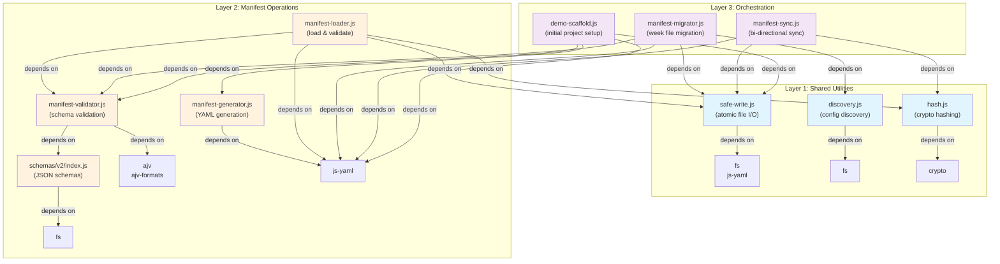
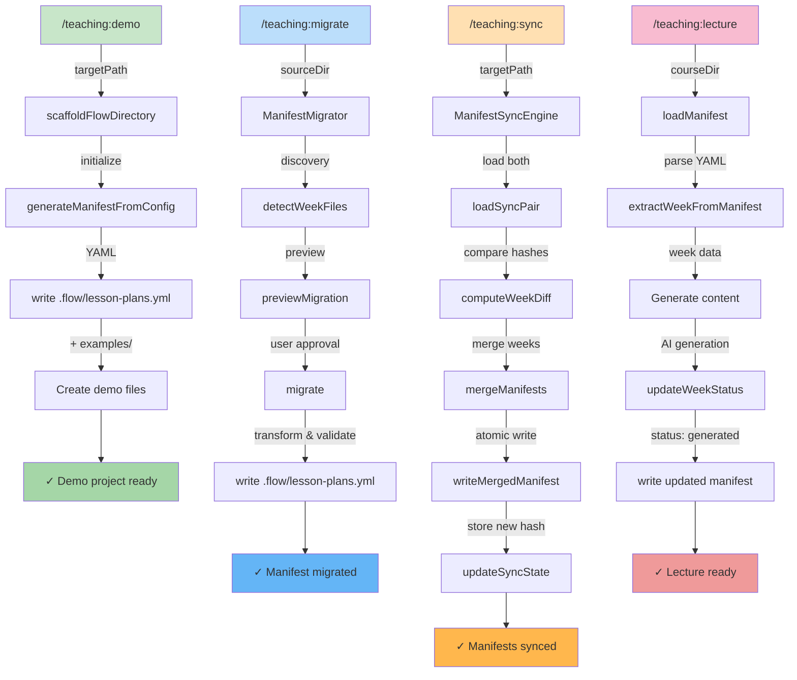
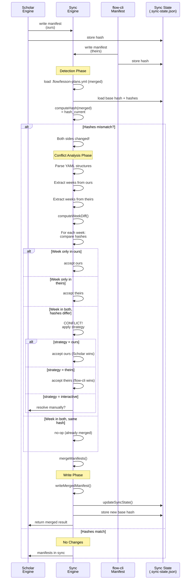

# Phase 2: Config & Flow-CLI Integration

> **Phase 2:** Config & Flow-CLI Integration
> **Version:** {{ scholar.version }}
> **Last Updated:** 2026-02-02

---

## Overview

Phase 2 introduces configuration discovery, manifest management, and bi-directional synchronization with flow-cli. This document visualizes the architectural relationships, data flows, and state transitions across the three-layer module system.

---

## 1. Module Dependency Graph

**What This Shows:**
The dependency tree across three architectural layers. Layer 1 contains shared utilities used by all higher layers. Layer 2 implements manifest operations (validation, generation, loading). Layer 3 orchestrates complex workflows (migration, synchronization, scaffolding).

**When This Matters:**
Understanding module dependencies helps identify circular references, plan test isolation, and trace bug origins through the dependency chain.



**Color Legend:**
- Light Blue (Layer 1): Shared utilities - stable, low-level I/O and hashing
- Light Orange (Layer 2): Manifest operations - schema validation and file management
- Light Purple (Layer 3): Orchestration - high-level workflows combining Layer 1 & 2

---

## 2. Manifest Lifecycle Flowchart

**What This Shows:**
The four primary entry points into manifest management and how each command transforms or creates manifests. Each path shows the sequence of operations from user command to file write.

**When This Triggered:**
- `/teaching:demo` — Scaffolds new teaching projects
- `/teaching:migrate` — Migrates legacy week files to manifest format
- `/teaching:sync` — Bi-directional sync between Scholar and flow-cli
- `/teaching:lecture` — Reads manifest to generate lecture content



**Flow Legend:**
- Green: Demo scaffolding (initialization)
- Blue: Migration from legacy format
- Orange: Bi-directional synchronization
- Pink: Content generation with manifest updates

---

## 3. Three-Way Merge Sequence Diagram

**What This Shows:**
The manifest synchronization protocol when flow-cli and Scholar both write manifests. Shows how the system detects conflicts, merges non-conflicting weeks, and resolves conflicts using a configurable strategy.

**When This Triggered:**
`/teaching:sync` command - detected when `.flow/.sync-state.json` indicates both sides have changed since the last sync point.



**Key Concepts:**
- **Ours**: Current Scholar-written manifest
- **Theirs**: Current flow-cli-written manifest
- **Base**: Last known-good synced state (hash stored)
- **Strategy**: Conflict resolution method (ours, theirs, interactive)

---

## 4. Week Status Lifecycle State Diagram

**What This Shows:**
The state machine for individual weeks within a manifest. Each week progresses through states as it's generated, reviewed, and published for teaching.

**When This Triggered:**
Each time a week is processed by `/teaching:lecture` or `/teaching:review` or `/teaching:publish` commands.

```mermaid
stateDiagram-v2
    [*] --> Draft: create week<br/>in manifest

    Draft --> Generated: /teaching:lecture<br/>generates content
    Generated --> Reviewed: /teaching:review<br/>instructor review
    Reviewed --> Draft: /teaching:revise<br/>revert for edits
    Reviewed --> Published: /teaching:publish<br/>ready for class

    Draft -.->|auto-update| Draft: manifest sync<br/>non-conflicting
    Generated -.->|auto-update| Generated: manifest sync<br/>non-conflicting
    Reviewed -.->|auto-update| Reviewed: manifest sync<br/>non-conflicting
    Published -.->|auto-update| Published: manifest sync<br/>non-conflicting

    Published --> [*]

    note right of Draft
        Initial state when week
        is added to manifest.
        No content generated.
    end

    note right of Generated
        /teaching:lecture has created
        content. Waiting for review.
    end

    note right of Reviewed
        Instructor reviewed generated
        content. Manual edits allowed.
    end

    note right of Published
        Ready for teaching.
        Lock state from further
        auto-generation.
    end
```

**State Descriptions:**
- **Draft**: Week created, awaiting content generation
- **Generated**: Content created by AI, pending instructor review
- **Reviewed**: Instructor reviewed and approved changes
- **Published**: Final state, used in actual teaching sessions

**Transitions:**
- Forward progression driven by `/teaching:*` commands
- Manifest sync preserves state during non-conflicting merges
- Revise command resets to Draft for re-editing

---

## 5. Data Flow: Demo Scaffolding

**What This Shows:**
The input/output structure when scaffolding a new teaching project. Shows what files are created and how configuration is initialized for flow-cli integration.

**When This Triggered:**
`/teaching:demo` command with a target path - typically run once per course.

```mermaid
graph LR
    Input["📁 Input<br/>targetPath<br/>ex: ~/teaching/stat440"]

    Input -->|scaffoldFlowDirectory| Init["Initialize<br/>.flow directory"]

    Init --> Config["📄 .flow/teach-config.yml<br/>course_info:<br/>  level: undergraduate<br/>  field: statistics<br/>  difficulty: intermediate<br/>defaults:<br/>  exam_format: markdown<br/>  lecture_format: quarto"]

    Init --> Manifest["📄 .flow/lesson-plans.yml<br/>(scaffolded with week stubs)<br/>weeks:<br/>  - week: 1<br/>    status: draft<br/>  - week: 2<br/>    status: draft"]

    Init --> SyncState["📄 .flow/.sync-state.json<br/>(sync metadata)<br/>base_hash: abc123<br/>last_sync: 2026-02-02"]

    Init --> README["📄 README.md<br/>(Getting started guide)"]

    Init --> Examples["📁 examples/<br/>├── lecture-template.qmd<br/>├── exam-template.md<br/>└── syllabus-template.yml"]

    Init --> DemoWeeks["📁 demo-weeks/<br/>(sample content)<br/>├── week-01-intro.qmd<br/>├── week-02-methods.qmd<br/>└── ..."]

    Config --> Output["✓ Project Structure Ready"]
    Manifest --> Output
    SyncState --> Output
    README --> Output
    Examples --> Output
    DemoWeeks --> Output

    Output --> Commands["`Next: Use Commands`<br/>/teaching:lecture<br/>/teaching:slides<br/>/teaching:exam"]

    style Input fill:#e3f2fd
    style Output fill:#c8e6c9
    style Commands fill:#fff9c4
    style Config fill:#f3e5f5
    style Manifest fill:#f3e5f5
    style SyncState fill:#f3e5f5
    style README fill:#ffe0b2
    style Examples fill:#ffe0b2
    style DemoWeeks fill:#ffe0b2
```

**Created Artifacts:**

| File | Purpose |
|------|---------|
| `.flow/teach-config.yml` | Course configuration (level, field, difficulty, defaults) |
| `.flow/lesson-plans.yml` | Week manifest with stubs (status: draft) |
| `.flow/.sync-state.json` | Sync metadata (hashes, timestamps) |
| `README.md` | Project setup guide and quick reference |
| `examples/` | Template files for lectures, exams, syllabi |
| `demo-weeks/` | Sample week content for reference |

**Manifest Structure After Scaffolding:**
```yaml
version: "2.0"
course_info:
  title: "Course Title"
  level: "undergraduate"
  field: "statistics"
  difficulty: "intermediate"

weeks:
  - week: 1
    topic: "Week 1 Topic"
    status: "draft"
    config:
      difficulty: "beginner"
    lectures: []
    exams: []

  - week: 2
    topic: "Week 2 Topic"
    status: "draft"
    config:
      difficulty: "intermediate"
    lectures: []
    exams: []
```

---

## Integration Points

### Config Discovery Chain
```
1. Command executed in course directory
2. discovery.js searches parent directories
3. .flow/teach-config.yml found
4. Config loaded and merged with defaults
5. Config passed to command handler
```

### Manifest Sync Flow
```
1. /teaching:sync called
2. Load current merged manifest
3. Compute hashes (ours, theirs, base)
4. If all match → no-op
5. If mismatch → three-way merge
6. Resolve conflicts by strategy
7. Atomic write + hash update
```

### Atomic File Operations
All writes use `safe-write.js`:
```
1. Write to temporary file (.tmp suffix)
2. Validate written content
3. Atomic rename (temp → target)
4. Verify on-disk content
5. Log operation with timestamp
```

---

## Error Handling Patterns

**Validation Failures:**
- Schema validation errors caught by `manifest-validator.js`
- AJV errors formatted with path and suggestion
- Operation aborted, file unchanged

**Merge Conflicts:**
- Week-level conflicts detected and reported
- Strategy applied (ours/theirs/interactive)
- User notified of resolution choice

**Sync State Corruption:**
- `.sync-state.json` validation on load
- Missing/invalid hash triggers full rehash
- Manual recovery via `--reset-sync` flag

---

## Performance Considerations

### Hashing Strategy
- `hash.js` uses SHA256 for collision resistance
- Hashes computed at week level (granular diffing)
- Base hash stored to detect changes since last sync

### Atomic Writes
- `safe-write.js` uses temp file pattern
- Protects against partial writes during crashes
- Atomic rename operation (kernel level)

### Discovery Caching
- `discovery.js` caches config location per session
- Parent directory search stops at first match
- Can be cleared with `--no-cache` flag

---

## Testing Fixtures

### Mock Manifests
- Valid v2.0 format manifests
- Conflicting week scenarios
- Edge cases (empty weeks, missing status)

### Sync State Scenarios
- Both sides unchanged (no-op case)
- Scholar only (accept ours)
- flow-cli only (accept theirs)
- Both changed, non-conflicting (auto-merge)
- Both changed, conflicting (strategy application)

### Config Discovery
- Config in course root
- Config in parent directory
- Missing config (error case)
- Multiple configs (choose nearest)

---

## Related Documentation

- **API Reference:** `/docs/API-REFERENCE.md`
- **Weekly Lecture Pipeline:** `/docs/LECTURE-PIPELINE-DIAGRAMS.md`
- **Architecture:** `/docs/ARCHITECTURE-DIAGRAMS.md`
- **Changelog:** `/CHANGELOG.md`

---

*Generated: 2026-02-09 | Scholar v{{ scholar.version }}*
