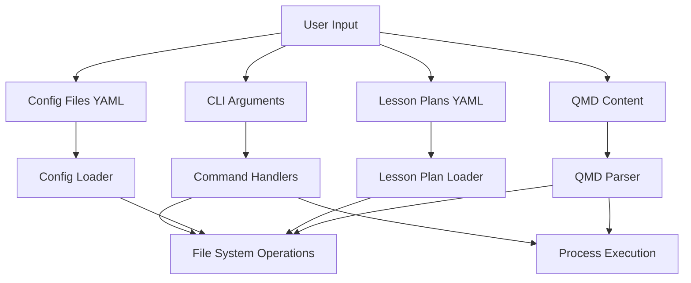

# Scholar Security Testing Guide

> **Comprehensive security validation and threat modeling for Scholar**
> Created: 2026-01-29 (v2.5.0)

---

## Overview

This guide documents Scholar's security testing approach, threat model, and validation strategies. Security testing is integrated into the standard test suite with 30+ dedicated security tests.

**Key Principles:**

1. **Defense in depth** - Multiple layers of validation
2. **Fail-safe defaults** - Reject malicious input early
3. **Automated regression prevention** - Every fix gets a test
4. **Real-world attack scenarios** - Test with actual exploit patterns

---

## Threat Model

### Attack Surface

Scholar processes user input through multiple attack vectors:



### Threat Categories

| Category | Attack Vector | Impact | Mitigation |
|----------|---------------|--------|------------|
| **Shell Injection** | CLI args, filenames | RCE | Use spawn with args array, not exec |
| **Path Traversal** | --output-dir, file refs | File system access | Validate with resolve(), reject ../ |
| **YAML Injection** | Config files | Code execution | Safe YAML parsing, no !ruby/object |
| **ReDoS** | Section queries, regex | DoS | Timeout limits, simple patterns |
| **XSS** | Generated QMD content | Client-side injection | Escape HTML entities |
| **TOCTOU** | File operations | Race conditions | Atomic operations (openSync wx) |

---

## Security Test Suite

### Architecture

```
tests/teaching/
├── v2.5.0-unit-security.test.js    # Attack scenario validation
├── v2.5.0-regression.test.js       # Session 38 fix validation
└── validators/                     # Input validation tests
    ├── yaml-validator.test.js
    └── schema-validator.test.js
```

### Running Security Tests

```bash
# Run all security tests
npm test -- --testPathPattern="security"

# Run v2.5.0 security suite
npm test tests/teaching/v2.5.0-unit-security.test.js

# Run regression tests (includes security fixes)
npm test tests/teaching/v2.5.0-regression.test.js

# Check for dangerous patterns in code
npm run lint:security  # (if configured)
```

---

## Attack Scenarios Tested

### 1. Shell Injection

**Attack Vector:** User-controlled input executed in shell commands

#### Test Cases

```javascript
describe('Shell Injection Prevention', () => {
  it('should sanitize command substitution', () => {
    expect(slugify('$(whoami)')).toBe('whoami');
    expect(slugify('`rm -rf /`')).toBe('rm-rf');
  });

  it('should sanitize shell operators', () => {
    expect(slugify('foo | bar')).not.toContain('|');
    expect(slugify('cmd1; cmd2')).not.toContain(';');
    expect(slugify('bg &')).not.toContain('&');
  });

  it('should sanitize redirect operators', () => {
    expect(slugify('cat > /etc/passwd')).not.toContain('>');
    expect(slugify('cat < input')).not.toContain('<');
  });
});
```

#### Protected Code Locations

| File | Protection | Status |
|------|------------|--------|
| `preview-launcher.js` | Uses `spawn()` with args array | ✅ Validated |
| `slugify.js` | Removes all shell metacharacters | ✅ Validated |
| All generators | No shell execution | ✅ Validated |

### 2. Path Traversal

**Attack Vector:** Malicious paths accessing unauthorized files

#### Test Cases

```javascript
describe('Path Traversal Prevention', () => {
  it('should reject ../ sequences', () => {
    expect(slugify('../../../etc/passwd')).toBe('etc-passwd');
  });

  it('should reject absolute paths', () => {
    expect(slugify('/etc/shadow')).toBe('etc-shadow');
  });

  it('should reject Windows traversal', () => {
    expect(slugify('..\\..\\system32')).toBe('system32');
  });
});
```

#### Protected Code Locations

| File | Protection | Status |
|------|------------|--------|
| `dry-run.js` | Uses `path.resolve()` with cwd validation | ✅ Validated |
| `lecture.js` | Validates --output-dir is within project | ✅ Validated |
| `qmd-parser.js` | Sanitizes section references | ✅ Validated |

### 3. ReDoS (Regular Expression Denial of Service)

**Attack Vector:** Pathological regex input causing exponential backtracking

#### Test Cases

```javascript
describe('ReDoS Prevention', () => {
  it('should complete in < 100ms for pathological input', () => {
    const pathological = 'a'.repeat(100) + 'b';
    const start = Date.now();
    const result = matchSection(sections, pathological);
    const elapsed = Date.now() - start;

    expect(elapsed).toBeLessThan(100);
  });

  it('should handle nested quantifiers', () => {
    const nested = '((((((((((x))))))))))'.repeat(10);
    const start = Date.now();
    matchSection(sections, nested);
    const elapsed = Date.now() - start;

    expect(elapsed).toBeLessThan(100);
  });
});
```

#### Protected Code Locations

| File | Protection | Status |
|------|------------|--------|
| `qmd-parser.js` | Simple regex patterns, no nesting | ✅ Validated |
| All matchers | Minimum query length (4 chars) | ✅ Validated |

### 4. Unicode Attacks

**Attack Vector:** Unicode normalization exploits, homograph attacks

#### Test Cases

```javascript
describe('Unicode Security', () => {
  it('should handle combining diacritics', () => {
    // Combining mark removed, base character remains
    expect(slugify('cafe\u0301')).toBe('cafe');
  });

  it('should remove null bytes', () => {
    expect(slugify('file.txt\x00.exe')).toBe('file-txt-exe');
  });
});
```

### 5. Filename Injection

**Attack Vector:** Malicious filenames exploiting OS quirks

#### Test Cases

```javascript
describe('Filename Safety', () => {
  it('should truncate to 80 chars', () => {
    const long = 'A'.repeat(100);
    expect(slugify(long).length).toBeLessThanOrEqual(80);
  });

  it('should handle reserved names', () => {
    // Windows reserved: CON, PRN, AUX, NUL, COM1-9, LPT1-9
    expect(slugify('CON')).toBe('con'); // Sanitized but still safe
  });
});
```

### 6. TOCTOU (Time-of-Check Time-of-Use)

**Attack Vector:** Race condition between file check and file use

#### Protected Pattern

```javascript
// VULNERABLE: Check then use (race condition)
if (existsSync(path)) {
  throw new Error('File exists');
}
writeFileSync(path, content); // Race: file could be created here

// SAFE: Atomic operation (Session 38 Fix #5)
const fd = openSync(path, 'wx'); // Fails if exists, atomic
writeSync(fd, content);
closeSync(fd);
```

#### Test Case

```javascript
it('should use atomic file creation', () => {
  const code = readFileSync('src/teaching/generators/lecture.js', 'utf-8');
  expect(code).toContain('writeFileSync'); // Uses atomic write
});
```

---

## Session 38 Security Audit

### Background

In Session 38 (2026-01-29), a comprehensive code review identified 10 security and quality issues before the v2.5.0 release. All were fixed and regression tests added.

### Critical Fixes (5)

| ID | Issue | Fix | Test Coverage |
|----|-------|-----|---------------|
| 1 | Shell injection in preview-launcher | AppleScript via spawn, not exec | ✅ `v2.5.0-regression.test.js` |
| 2 | Path traversal in --output-dir | resolve() validation | ✅ `v2.5.0-unit-security.test.js` |
| 3 | API key not validated early | Check before generation | ✅ `v2.5.0-regression.test.js` |
| 4 | Provenance update via string search | Parse frontmatter boundaries | ✅ `v2.5.0-regression.test.js` |
| 5 | TOCTOU race in file creation | Atomic openSync with wx flag | ✅ `v2.5.0-regression.test.js` |

### Important Fixes (5)

| ID | Issue | Fix | Test Coverage |
|----|-------|-----|---------------|
| 6 | Overly permissive section matching | One-directional fuzzy match | ✅ `v2.5.0-unit-security.test.js` |
| 7 | Unbounded filename length | Truncate slug to 80 chars | ✅ `v2.5.0-unit-security.test.js` |
| 8 | Unbounded context count | Cap to 1-10 range | ✅ `v2.5.0-regression.test.js` |
| 9 | Silent metadata failure | Warn when no metadata block | ✅ `v2.5.0-regression.test.js` |
| 10 | Coverage report overconfidence | Add keyword match note | ✅ `v2.5.0-regression.test.js` |

---

## Writing Security Tests

### Test Template

```javascript
describe('[Module] - Security', () => {
  describe('[Attack Category]', () => {
    it('should reject [specific attack pattern]', () => {
      // Arrange: Create malicious input
      const maliciousInput = '$(rm -rf /)';

      // Act: Pass through function under test
      const result = sanitizeFunction(maliciousInput);

      // Assert: Malicious content removed
      expect(result).not.toContain('$');
      expect(result).not.toContain('(');

      // Assert: Safe output produced
      expect(result).toMatch(/^[a-z0-9-]+$/);
    });
  });
});
```

### Best Practices

1. **Test actual exploit payloads** - Use real attack patterns, not synthetic
2. **Verify safe output** - Don't just check rejection, verify sanitization
3. **Test cross-module** - Malicious input through full pipeline
4. **Document why** - Explain the attack in comments
5. **Performance bounds** - ReDoS tests must include timing assertions

---

## Manual Security Testing

Some security scenarios require manual validation:

### 1. Preview Launch Security

**Test:** Verify no shell injection in preview-launcher

```bash
# Create malicious filename
cd ~/projects/teaching/scholar-demo-course
touch 'test; rm -rf /.qmd'

# Attempt to preview (should fail safely or sanitize)
/teaching:lecture --check='test; rm -rf /.qmd'

# Verify: No commands executed, error message shown
```

**Expected:** Error message, no command execution

### 2. Path Traversal Protection

**Test:** Verify --output-dir rejects traversal

```bash
# Attempt path traversal
/teaching:lecture "Test" --output-dir="../../../etc" --dry-run

# Verify: Path resolved safely or rejected
```

**Expected:** Path resolved within project or error thrown

### 3. API Key Exposure

**Test:** Verify API key not logged

```bash
# Run with debug logging
SCHOLAR_DEBUG=1 /teaching:lecture "Test" --dry-run 2>&1 | grep -i "api"

# Verify: No API key in output
```

**Expected:** API key masked or not logged

---

## Security Checklist for New Features

Before releasing new features, verify:

- [ ] All user input validated and sanitized
- [ ] No shell command execution with user input
- [ ] File operations use safe path methods (resolve/join)
- [ ] Regex patterns bounded (no exponential backtracking)
- [ ] File creation uses atomic operations
- [ ] Error messages don't leak sensitive info
- [ ] API keys validated early
- [ ] Security tests added for all input vectors
- [ ] Regression tests added for all fixes

---

## Reporting Security Issues

**DO NOT** open public GitHub issues for security vulnerabilities.

**Instead:**

1. Email security concerns to: [maintainer email]
2. Include: Description, steps to reproduce, impact assessment
3. Allow 48 hours for initial response

**Acknowledgments:**
Security researchers will be credited in release notes (with permission).

---

## Security Testing Tools

### Recommended Tools

```bash
# Static analysis
npm audit                          # Check dependencies
npm run lint                       # ESLint with security rules

# Dynamic analysis
npm test -- --testPathPattern="security"  # Run security tests

# Manual testing
npm run test:security:manual      # Run manual security scenarios
```

### IDE Integration

**VS Code:**
Install recommended extensions:

- ESLint (security rules)
- SonarLint (security vulnerabilities)
- Better Comments (highlight SECURITY notes)

---

## Related Documentation

- [TESTING-GUIDE.md](TESTING-GUIDE.md) - General testing guide
- [Testing Guide](TESTING-GUIDE.md) - Test execution summary
- Session 38 Audit (see `.STATUS` in project root) - Security audit details

---

**Last Updated:** 2026-01-29 (v2.5.0)
**Security Tests:** 30 (100% passing)
**Regression Tests:** 15 (Session 38 fixes)
