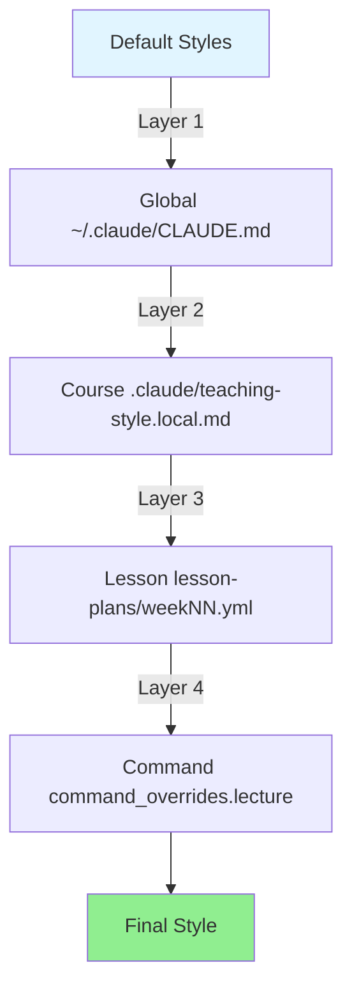
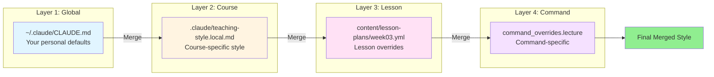
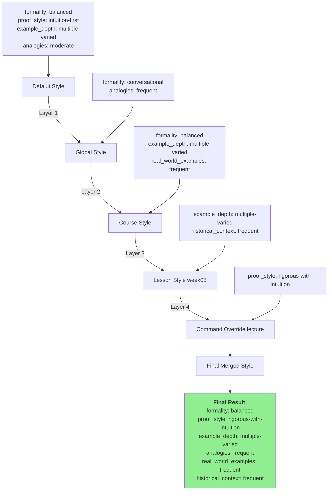
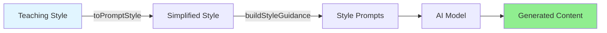

# Teaching Style Guide

> **Version:** 2.3.0
> **Last Updated:** 2026-01-28
> **Audience:** Instructors using Scholar plugin

This guide explains the 4-layer teaching style system that lets you customize how Scholar generates course materials.

---

## TL;DR



### Key Points

- 4 layers: Global → Course → Lesson → Command
- Higher layers override lower layers
- Each layer is optional (fallback to defaults)
- Styles flow into AI prompts automatically

### Minimal Setup

```yaml
# .claude/teaching-style.local.md
---
teaching_style:
  explanation_style:
    formality: conversational
    proof_style: intuition-first
---
```

---

## Quick Start

### 1. Create Course Style (5 minutes)

Create `.claude/teaching-style.local.md` in your course directory:

```yaml
---
teaching_style:
  pedagogical_approach:
    primary: active-learning
    secondary: problem-based

  explanation_style:
    formality: balanced
    proof_style: rigorous-with-intuition
    example_depth: multiple-varied
    analogies: moderate

  content_preferences:
    real_world_examples: frequent
    computational_tools: integrated
    historical_context: moderate
---

# My Teaching Style

This course emphasizes active learning with real-world examples.
```

### 2. Test It

```bash
cd /path/to/course
scholar teaching:lecture "Linear Regression" --verbose
```

The `--verbose` flag shows which style files were loaded.

### 3. Customize Commands (Optional)

Override styles for specific commands:

```yaml
teaching_style:
  explanation_style:
    formality: balanced

  command_overrides:
    lecture:
      explanation_style:
        formality: formal
        proof_style: rigorous

    quiz:
      explanation_style:
        formality: conversational
```

Now lectures will be formal but quizzes remain conversational.

---

## Understanding the 4 Layers

### Layer System Architecture



### Layer Precedence

**Higher layers override lower layers** using deep merge:

| Priority        | Layer   | Source                            | Use Case                                                 |
| --------------- | ------- | --------------------------------- | -------------------------------------------------------- |
| **1** (lowest)  | Global  | `~/.claude/CLAUDE.md`             | Personal teaching preferences across all courses         |
| **2**           | Course  | `.claude/teaching-style.local.md` | Course-specific style (undergrad vs grad)                |
| **3**           | Lesson  | `content/lesson-plans/weekNN.yml` | Week-specific adjustments (hard topics)                  |
| **4** (highest) | Command | `command_overrides.{command}`     | Command-specific style (formal lectures, casual quizzes) |

### Deep Merge Example

```yaml
# Layer 1 (Global)
explanation_style:
  formality: conversational
  proof_style: intuition-first
  example_depth: multiple-varied

# Layer 2 (Course) - Overrides formality only
explanation_style:
  formality: balanced

# Final Merged Result
explanation_style:
  formality: balanced              # ← Overridden by Layer 2
  proof_style: intuition-first     # ← From Layer 1
  example_depth: multiple-varied   # ← From Layer 1
```

### When to Use Each Layer

#### Layer 1: Global (`~/.claude/CLAUDE.md`) (When to Use)

**Use for:** Your default teaching philosophy across all courses.

```yaml
---
teaching_style:
  explanation_style:
    formality: conversational
    proof_style: intuition-first
    analogies: frequent

  student_interaction:
    questioning: socratic
    group_work: structured
---
```

### Who should use this

- Instructors teaching multiple courses
- Establishing a consistent "voice" across courses
- Setting organization-wide defaults

#### Layer 2: Course (`.claude/teaching-style.local.md`) (Who should use this)

**Use for:** Course-specific adjustments.

```yaml
---
teaching_style:
  pedagogical_approach:
    primary: active-learning
    class_structure:
      - "Problem introduction (5 min)"
      - "Group work (15 min)"
      - "Discussion (10 min)"

  explanation_style:
    formality: balanced           # More formal than global default
    proof_style: rigorous-with-intuition

  content_preferences:
    computational_tools: R-heavy
    interdisciplinary_connections: "statistics-biology"

  course_specific_notes:
    - "Students have limited R experience"
    - "Emphasize biological applications"
---
```

### Common scenarios (Final Merged Result)

- Undergraduate vs graduate course
- Different fields (biology vs economics)
- Varying student backgrounds

#### Layer 3: Lesson (`content/lesson-plans/weekNN.yml`)

**Use for:** Week/topic-specific overrides.

```yaml
# content/lesson-plans/week08.yml
title: "Maximum Likelihood Estimation"
week: 8
learning_objectives:
  - "Derive MLE for common distributions"
  - "Understand asymptotic properties"

teaching_style_overrides:
  explanation_style:
    proof_style: rigorous         # This week needs proofs
    formality: formal
    example_depth: single-detailed

  content_preferences:
    historical_context: frequent  # Show Fisher's contributions
```

### Common scenarios (content/lesson-plans/week08.yml)

- Advanced topics requiring more rigor
- Review weeks requiring lighter touch
- Topics needing extra examples

#### Layer 4: Command (`command_overrides`)

**Use for:** Different styles for different Scholar commands.

```yaml
# In .claude/teaching-style.local.md
teaching_style:
  explanation_style:
    formality: balanced

  command_overrides:
    lecture:
      explanation_style:
        formality: formal
        proof_style: rigorous-with-intuition
      custom_instructions: "Include 20-40 pages with detailed proofs"

    quiz:
      explanation_style:
        formality: conversational
        example_depth: minimal
      difficulty_adjustment: easier
      time_pressure: moderate

    exam:
      explanation_style:
        formality: formal
        proof_style: rigorous
      difficulty_adjustment: same
      time_pressure: strict
      custom_instructions: "Mix question types: 40% MC, 30% short answer, 30% problems"

    slides:
      explanation_style:
        formality: engaging
        analogies: frequent
      custom_instructions: "25+ slides, use animations, include quiz questions"
```

### Common patterns

- Formal lectures, conversational quizzes
- Detailed examples in assignments, minimal in exams
- Rigorous proofs in lectures, intuition in slides

---

## Configuration Reference

### Full Schema

#### `pedagogical_approach`

Overall teaching philosophy.

```yaml
pedagogical_approach:
  primary: active-learning
  secondary: problem-based
  class_structure:
    - "Warm-up problem (5 min)"
    - "Mini-lecture (15 min)"
    - "Group activity (20 min)"
    - "Wrap-up (10 min)"
```

| Field             | Type   | Options                                                                               | Description                   |
| ----------------- | ------ | ------------------------------------------------------------------------------------- | ----------------------------- |
| `primary`         | string | `active-learning`, `lecture`, `flipped`, `socratic`, `inquiry-based`, `project-based` | Main teaching approach        |
| `secondary`       | string | Same as primary                                                                       | Secondary approach (optional) |
| `class_structure` | array  | Free-form strings                                                                     | Typical class segments        |

### Options explained

- `active-learning` - Students engage with material during class
- `lecture` - Traditional instructor-led presentation
- `flipped` - Pre-class reading, in-class application
- `socratic` - Guided questioning to discover concepts
- `inquiry-based` - Students formulate research questions
- `project-based` - Learning through extended projects

#### `explanation_style`

How concepts are explained.

```yaml
explanation_style:
  formality: balanced
  proof_style: rigorous-with-intuition
  notation_preference: standard
  example_depth: multiple-varied
  analogies: moderate
```

| Field                 | Type   | Options                                           | Description                  |
| --------------------- | ------ | ------------------------------------------------- | ---------------------------- |
| `formality`           | string | `formal`, `conversational`, `balanced`            | Writing tone                 |
| `proof_style`         | string | `proof-first`, `intuition-first`, `both-parallel` | Order of proofs vs intuition |
| `notation_preference` | string | `standard`, `custom`                              | Mathematical notation style  |
| `example_depth`       | string | `single-detailed`, `multiple-varied`, `minimal`   | How many examples            |
| `analogies`           | string | `frequent`, `moderate`, `rare`                    | Use of analogies             |

### Formality options

- `formal` - "We derive the estimator by minimizing the sum of squared residuals"
- `conversational` - "Let's figure out the best-fit line by making errors as small as possible"
- `balanced` - "We find the estimator by minimizing squared residuals (making errors small)"

### Proof style options

- `proof-first` - State theorem, prove, then explain intuition
- `intuition-first` - Explain idea, motivate, then prove
- `both-parallel` - Interweave intuition throughout proof

### Example depth

- `single-detailed` - One thorough example with commentary
- `multiple-varied` - 3-5 examples showing different cases
- `minimal` - Brief example, focus on concepts

#### `assessment_philosophy`

Assessment approach.

```yaml
assessment_philosophy:
  primary_focus: balanced
  feedback_style: descriptive
  revision_policy: encouraged
  partial_credit: true
```

| Field             | Type    | Options                                  | Description           |
| ----------------- | ------- | ---------------------------------------- | --------------------- |
| `primary_focus`   | string  | `formative`, `summative`, `balanced`     | Assessment focus      |
| `feedback_style`  | string  | `descriptive`, `rubric-based`, `minimal` | How feedback is given |
| `revision_policy` | string  | `encouraged`, `allowed`, `not-allowed`   | Revision policy       |
| `partial_credit`  | boolean | `true`, `false`                          | Give partial credit   |

### Focus options

- `formative` - Focus on learning through assessment
- `summative` - Focus on evaluating mastery
- `balanced` - Both formative and summative

### Feedback style

- `descriptive` - Detailed written feedback
- `rubric-based` - Structured rubric scores
- `minimal` - Brief comments only

#### `student_interaction`

Classroom interaction style.

```yaml
student_interaction:
  questioning: socratic
  group_work: structured
  discussion_format: whole-class
```

| Field               | Type   | Options                                                  | Description             |
| ------------------- | ------ | -------------------------------------------------------- | ----------------------- |
| `questioning`       | string | `socratic`, `cold-call`, `volunteer`, `think-pair-share` | How questions are asked |
| `group_work`        | string | `structured`, `open-ended`, `minimal`                    | Group work format       |
| `discussion_format` | string | `whole-class`, `small-group`, `one-on-one`               | Discussion format       |

### Questioning styles

- `socratic` - Guided questions to lead students to discovery
- `cold-call` - Call on students randomly
- `volunteer` - Students raise hands
- `think-pair-share` - Individual thinking, pair discussion, class sharing

#### `content_preferences`

Content and topic preferences.

```yaml
content_preferences:
  real_world_examples: frequent
  historical_context: moderate
  computational_tools: R-heavy
  interdisciplinary_connections: statistics-economics
```

| Field                           | Type   | Options                                                             | Description                   |
| ------------------------------- | ------ | ------------------------------------------------------------------- | ----------------------------- |
| `real_world_examples`           | string | `frequent`, `moderate`, `theoretical-focus`                         | Real-world examples frequency |
| `historical_context`            | string | `frequent`, `moderate`, `minimal`                                   | Historical context amount     |
| `computational_tools`           | string | `integrated`, `separate-labs`, `minimal`, `R-heavy`, `Python-heavy` | How tools are used            |
| `interdisciplinary_connections` | string | Free-form                                                           | Related fields (optional)     |

### Computational tools

- `integrated` - Code mixed with theory throughout
- `separate-labs` - Theory in lectures, code in labs
- `minimal` - Occasional computational examples
- `R-heavy` / `Python-heavy` - Language-specific emphasis

#### `command_overrides`

Command-specific style overrides.

```yaml
command_overrides:
  lecture:
    explanation_style:
      formality: formal
      proof_style: rigorous-with-intuition
    difficulty_adjustment: same
    custom_instructions: "20-40 pages, include proofs"

  quiz:
    explanation_style:
      formality: conversational
    difficulty_adjustment: easier
    time_pressure: moderate
    custom_instructions: "3-5 questions, focus on concepts"
```

| Field                   | Type   | Options                                           | Description                 |
| ----------------------- | ------ | ------------------------------------------------- | --------------------------- |
| `formality`             | string | `formal`, `conversational`, `balanced`            | Override formality          |
| `proof_style`           | string | `proof-first`, `intuition-first`, `both-parallel` | Override proof style        |
| `example_depth`         | string | `single-detailed`, `multiple-varied`, `minimal`   | Override example depth      |
| `difficulty_adjustment` | string | `easier`, `same`, `harder`                        | Adjust difficulty           |
| `time_pressure`         | string | `relaxed`, `moderate`, `strict`                   | Time pressure (assessments) |
| `custom_instructions`   | string | Free-form                                         | Additional instructions     |

### Available commands

- `lecture` - `/teaching:lecture`
- `quiz` - `/teaching:quiz`
- `exam` - `/teaching:exam`
- `assignment` - `/teaching:assignment`
- `slides` - `/teaching:slides`
- `syllabus` - `/teaching:syllabus`
- `rubric` - `/teaching:rubric`
- `feedback` - `/teaching:feedback`

---

## Real-World Example

### Demo Course (STAT-101)

Full 4-layer configuration for an introductory statistics course.

#### Layer 1: Global (`~/.claude/CLAUDE.md`) (Demo Course (STAT-101))

```yaml
---
teaching_style:
  pedagogical_approach:
    primary: active-learning
    secondary: socratic

  explanation_style:
    formality: conversational
    proof_style: intuition-first
    analogies: frequent

  student_interaction:
    questioning: socratic
    group_work: structured
---
```

#### Layer 2: Course (`.claude/teaching-style.local.md`) (Demo Course (STAT-101))

```yaml
---
teaching_style:
  pedagogical_approach:
    primary: active-learning
    secondary: problem-based

  explanation_style:
    formality: balanced              # More formal than global default
    proof_style: intuition-first
    example_depth: multiple-varied
    analogies: frequent

  content_preferences:
    real_world_examples: frequent
    computational_tools: integrated
    historical_context: moderate

  command_overrides:
    lecture:
      explanation_style:
        formality: balanced
        proof_style: rigorous-with-intuition

    quiz:
      explanation_style:
        formality: conversational
      difficulty_adjustment: easier
---

# STAT-101 Teaching Style

This course uses an active learning approach with emphasis on real-world applications.

## Philosophy
- Start with intuition, then formalize
- Use R for all computational examples
- Connect statistics to everyday decisions
```

#### Layer 3: Lesson (`content/lesson-plans/week05.yml`)

```yaml
# Week 5: Hypothesis Testing (challenging topic)
title: "Introduction to Hypothesis Testing"
week: 5
learning_objectives:
  - "Understand null and alternative hypotheses"
  - "Calculate p-values and interpret results"
  - "Distinguish between statistical and practical significance"

teaching_style_overrides:
  explanation_style:
    formality: balanced
    proof_style: intuition-first
    example_depth: multiple-varied  # Extra examples for hard topic
    analogies: frequent

  content_preferences:
    real_world_examples: frequent
    historical_context: frequent    # Mention Fisher/Neyman-Pearson debate
```

#### Layer 4: Command Override (from Layer 2)

The `command_overrides.lecture` from Layer 2 applies when running `/teaching:lecture`:

```yaml
# Applies to all lectures
command_overrides:
  lecture:
    explanation_style:
      formality: balanced
      proof_style: rigorous-with-intuition
```

### Merge Behavior

When running `/teaching:lecture "Hypothesis Testing" --from-plan week05`:



### Final merged style

```yaml
pedagogical_approach:
  primary: active-learning        # From Layer 2
  secondary: problem-based        # From Layer 2

explanation_style:
  formality: balanced              # From Layer 2 (overrides Layer 1)
  proof_style: rigorous-with-intuition  # From Layer 4 (command override)
  example_depth: multiple-varied   # From Layer 3 (lesson override)
  analogies: frequent              # From Layer 1 (no overrides)

content_preferences:
  real_world_examples: frequent    # From Layer 2
  historical_context: frequent     # From Layer 3 (lesson override)
  computational_tools: integrated  # From Layer 2
```

---

## Common Patterns

### Pattern 1: Formal Graduate Course

**Scenario:** Graduate-level theory course with rigorous proofs.

```yaml
# .claude/teaching-style.local.md 2
---
teaching_style:
  pedagogical_approach:
    primary: lecture
    secondary: inquiry-based

  explanation_style:
    formality: formal
    proof_style: proof-first
    notation_preference: standard
    example_depth: single-detailed
    analogies: rare

  assessment_philosophy:
    primary_focus: summative
    feedback_style: rubric-based
    revision_policy: not-allowed
    partial_credit: true

  content_preferences:
    real_world_examples: moderate
    historical_context: frequent
    computational_tools: minimal

  command_overrides:
    exam:
      explanation_style:
        formality: formal
        proof_style: rigorous
      difficulty_adjustment: harder
      time_pressure: strict
---
```

### Pattern 2: Interactive Undergraduate Course

**Scenario:** Introductory course emphasizing engagement and applications.

```yaml
# .claude/teaching-style.local.md 3
---
teaching_style:
  pedagogical_approach:
    primary: active-learning
    secondary: problem-based
    class_structure:
      - "Quick quiz (5 min)"
      - "New concept introduction (10 min)"
      - "Group problem-solving (25 min)"
      - "Debrief and synthesis (10 min)"

  explanation_style:
    formality: conversational
    proof_style: intuition-first
    example_depth: multiple-varied
    analogies: frequent

  assessment_philosophy:
    primary_focus: formative
    feedback_style: descriptive
    revision_policy: encouraged
    partial_credit: true

  student_interaction:
    questioning: think-pair-share
    group_work: structured
    discussion_format: small-group

  content_preferences:
    real_world_examples: frequent
    computational_tools: integrated
    historical_context: moderate

  command_overrides:
    quiz:
      explanation_style:
        formality: conversational
      difficulty_adjustment: easier
      time_pressure: relaxed
      custom_instructions: "3-5 questions, focus on understanding over speed"

    assignment:
      explanation_style:
        formality: balanced
        example_depth: multiple-varied
      custom_instructions: "Include R code examples, encourage exploration"
---
```

### Pattern 3: Mixed Undergrad/Grad Course

**Scenario:** Cross-listed course serving both populations.

```yaml
# .claude/teaching-style.local.md 4
---
teaching_style:
  pedagogical_approach:
    primary: active-learning
    secondary: lecture

  explanation_style:
    formality: balanced
    proof_style: both-parallel
    example_depth: multiple-varied
    analogies: moderate

  content_preferences:
    real_world_examples: frequent
    computational_tools: integrated
    historical_context: moderate

  course_specific_notes:
    - "Undergraduate students: focus on intuition and applications"
    - "Graduate students: complete additional theoretical problems"

  command_overrides:
    lecture:
      explanation_style:
        formality: balanced
        proof_style: both-parallel
      custom_instructions: "Include intuition first, then formal proof. Mark advanced sections with [Graduate]"

    quiz:
      explanation_style:
        formality: conversational
      difficulty_adjustment: easier
      custom_instructions: "Core concepts for all students"

    exam:
      explanation_style:
        formality: formal
      difficulty_adjustment: same
      custom_instructions: "Part A: Core concepts (all students). Part B: Advanced (graduate only)"
---
```

### Pattern 4: Flipped Classroom

**Scenario:** Pre-class videos, in-class application.

```yaml
# .claude/teaching-style.local.md 5
---
teaching_style:
  pedagogical_approach:
    primary: flipped
    secondary: active-learning
    class_structure:
      - "Concept check (10 min)"
      - "Application problem setup (5 min)"
      - "Group work (30 min)"
      - "Presentations and discussion (15 min)"

  explanation_style:
    formality: conversational
    proof_style: intuition-first
    example_depth: multiple-varied

  content_preferences:
    real_world_examples: frequent
    computational_tools: integrated

  command_overrides:
    lecture:
      explanation_style:
        formality: conversational
      custom_instructions: "Design for video: 10-15 min chunks, frequent pauses for reflection"

    assignment:
      explanation_style:
        formality: balanced
      custom_instructions: "Application-focused, build on pre-class videos"
---
```

---

## Troubleshooting

### Problem: "My style isn't being applied"

### Debug steps

1. **Check file location**

   ```bash
   # Course style should be here:
   ls -la .claude/teaching-style.local.md

   # Global style (optional):
   ls -la ~/.claude/CLAUDE.md
   ```

2. **Verify YAML syntax**

   ```bash
   # Install yq if needed: brew install yq
   yq '.teaching_style' .claude/teaching-style.local.md
   ```

   If you see an error, fix YAML syntax (common issues: indentation, colons, quotes).

3. **Run with verbose flag**

   ```bash
   scholar teaching:lecture "Topic" --verbose
   ```

   Look for lines like:

   ```
   Teaching Style Configuration:
     Sources:
       - Course: /path/to/.claude/teaching-style.local.md
     Applied Style:
       - Tone: conversational
   ```

4. **Check frontmatter format**

   Must have exactly this structure:

   ```yaml
   ---
   teaching_style:
     explanation_style:
       formality: conversational
   ---

   # Rest of document
   ```

### Common mistakes

- Missing `---` delimiters
- Indentation errors (use 2 spaces)
- Missing `teaching_style:` key

1. **Test with minimal config**

   Replace file contents with:

   ```yaml
   ---
   teaching_style:
     explanation_style:
       formality: formal
   ---
   ```

   If this works, gradually add back sections.

### Problem: "Command overrides not working"

### Check

1. **Correct command name**

   Valid names: `lecture`, `quiz`, `exam`, `assignment`, `slides`, `syllabus`, `rubric`, `feedback`

### Wrong (Troubleshooting)

   ```yaml
   command_overrides:
     lectures:        # ❌ Should be singular
   ```

### Right (Troubleshooting)

   ```yaml
   command_overrides:
     lecture:         # ✓
   ```

1. **Structure nesting**

   Command overrides must be inside `teaching_style`:

### Wrong

   ```yaml
   teaching_style:
     explanation_style:
       formality: balanced

   command_overrides:  # ❌ Outside teaching_style
     lecture:
   ```

### Right

   ```yaml
   teaching_style:
     explanation_style:
       formality: balanced

     command_overrides:  # ✓ Inside teaching_style
       lecture:
   ```

1. **Override scope**

   Command overrides apply to specific style fields:

   ```yaml
   command_overrides:
     lecture:
       explanation_style:           # ✓ Valid
         formality: formal
         proof_style: rigorous
       difficulty_adjustment: same  # ✓ Valid
       custom_instructions: "..."   # ✓ Valid
       pedagogical_approach:        # ❌ Not supported in overrides
         primary: lecture
   ```

### Supported fields

- `formality`
- `proof_style`
- `example_depth`
- `difficulty_adjustment`
- `time_pressure`
- `custom_instructions`

### Problem: "Styles seem random/inconsistent"

### Possible causes

1. **Multiple config files**

   Check if you have both:
   - `.claude/teaching-style.local.md` (new location)
   - `.flow/teach-config.yml` (older location)

   **Solution:** Consolidate into `.claude/teaching-style.local.md`

2. **Lesson plan overrides**

   If using `--from-plan week03`, lesson plans can override course styles.

   Check:

   ```yaml
   # content/lesson-plans/week03.yml
   teaching_style_overrides:
     explanation_style:
       formality: formal  # This overrides course default
   ```

3. **Cached results**

   Scholar doesn't cache, but check if you're looking at old output files:

   ```bash
   # Clear old output
   rm -rf output/

   # Generate fresh
   scholar teaching:lecture "Topic"
   ```

### Problem: "How do I see what style was used?"

### Use verbose mode

```bash
scholar teaching:lecture "Topic" --verbose
```

### Output shows

```
Teaching Style Configuration:
  Sources:
    - Global: /Users/you/.claude/CLAUDE.md
    - Course: /path/to/course/.claude/teaching-style.local.md
    - Command: .claude/teaching-style.local.md#command_overrides.lecture
  Applied Style:
    - Tone: formal
    - Approach: active-learning
    - Explanation: rigorous-with-intuition
    - Examples: multiple-varied
```

### Programmatic access

```javascript
import { loadTeachingStyle, getStyleSummary } from './config/style-loader.js';

const result = loadTeachingStyle({ command: 'lecture' });
console.log(getStyleSummary(result));
console.log('Full style:', JSON.stringify(result.style, null, 2));
```

### Problem: "Validation warnings"

If you see warnings like:

```
Warning: Unknown pedagogical_approach.primary: "lecture-based"
Valid: active-learning, lecture, flipped, socratic, inquiry-based, project-based
```

**Solution:** Use exact option names from schema (see [Configuration Reference](#configuration-reference)).

### To check valid options

```bash
# View schema
cat src/teaching/schemas/v2/teaching-style.schema.json | jq '.definitions'
```

---

## Integration with Prompts (v2.4.0 Preview)

### How Styles Flow into AI Prompts

Teaching styles automatically influence AI-generated content through the **PromptBuilder** system (planned for v2.4.0).



### Prompt Adaptation Strategies

1. **Variable Substitution**

   Template:

   ```
   Use {{formality}} tone. Provide {{example_depth}} examples.
   ```

   After substitution:

   ```
   Use conversational tone. Provide multiple-varied examples.
   ```

2. **Conditional Sections**

   ```javascript
   if (style.proof_style === 'rigorous-with-intuition') {
     prompt += "First provide intuition, then formal proof.";
   } else if (style.proof_style === 'intuition-first') {
     prompt += "Focus on intuition, formal proof optional.";
   }
   ```

3. **Weighted Emphasis**

   ```javascript
   if (style.real_world_examples === 'frequent') {
     prompt += "IMPORTANT: Include 3-5 real-world examples.";
   } else if (style.real_world_examples === 'moderate') {
     prompt += "Include 1-2 real-world examples.";
   }
   ```

### Example: Lecture Prompt Generation

### Input style

```yaml
explanation_style:
  formality: conversational
  proof_style: intuition-first
  example_depth: multiple-varied
  analogies: frequent

content_preferences:
  real_world_examples: frequent
  computational_tools: integrated
```

### Generated prompt excerpt

```
Generate lecture notes on "Hypothesis Testing" using these guidelines:

TONE & STYLE:
- Use conversational, engaging language
- Explain concepts before formalizing
- Include frequent analogies to everyday situations

EXAMPLES & APPLICATIONS:
- Provide 3-5 varied examples covering different scenarios
- Include frequent real-world applications (medical, business, etc.)
- Integrate R code throughout (not separate section)

PROOFS & THEORY:
- Start with intuition and motivation
- Formal proofs are optional or secondary
- Connect math to conceptual understanding
```

### PromptBuilder API (Preview)

```javascript
import { PromptBuilder } from './ai/prompt-builder.js';
import { loadTeachingStyle } from './config/style-loader.js';

// Load style
const { style } = loadTeachingStyle({ command: 'lecture' });

// Build prompt
const builder = new PromptBuilder();
const prompt = builder.buildFromStyle('lecture', 'Hypothesis Testing', style);

// Result: fully customized prompt for AI
console.log(prompt);
```

---

## Best Practices

### 1. Start Simple

Don't configure everything at once. Start with:

```yaml
teaching_style:
  explanation_style:
    formality: conversational
    proof_style: intuition-first
```

Add more as you discover what matters.

### 2. Use Course Notes

Document your reasoning:

```yaml
teaching_style:
  course_specific_notes:
    - "Students struggle with proofs - emphasize intuition"
    - "Class is 80% biology majors - use biological examples"
    - "Limited class time - minimize historical context"
```

### 3. Test Incrementally

After each change:

```bash
scholar teaching:lecture "Test Topic" --verbose
```

Check output matches expectations before proceeding.

### 4. Reuse Patterns

Copy working configs to new courses:

```bash
# Save as template
cp .claude/teaching-style.local.md ~/templates/undergrad-style.md

# Start new course
cp ~/templates/undergrad-style.md /path/to/new-course/.claude/teaching-style.local.md
```

### 5. Command Overrides are Powerful

Use them for:

- Formal lectures, casual quizzes
- Minimal examples in exams, detailed in assignments
- Different difficulty levels per assessment type

```yaml
command_overrides:
  quiz:
    difficulty_adjustment: easier
    time_pressure: relaxed

  exam:
    difficulty_adjustment: same
    time_pressure: strict
```

### 6. Lesson Overrides for Hard Topics

```yaml
# week08.yml - Difficult topic
teaching_style_overrides:
  explanation_style:
    example_depth: multiple-varied  # Extra examples
    analogies: frequent             # More analogies

  content_preferences:
    real_world_examples: frequent   # Ground in applications
```

### 7. Version Control Your Styles

```bash
git add .claude/teaching-style.local.md
git commit -m "style: emphasize intuition over proofs"
```

Track what works across semesters.

---

## FAQ

### Q: Do I need all 4 layers?

**A:** No. Any layer is optional. Minimum setup:

```yaml
# .claude/teaching-style.local.md 6
---
teaching_style:
  explanation_style:
    formality: conversational
---
```

### Q: Which layer should I use for most customization?

**A:** Layer 2 (Course) for 90% of your configuration. Use:

- Layer 1 (Global) only if teaching multiple courses
- Layer 3 (Lesson) for topic-specific adjustments
- Layer 4 (Command) for different styles per command type

### Q: Can I override just one field?

**A:** Yes! Deep merge preserves everything else.

```yaml
# Only override formality
explanation_style:
  formality: formal
```

All other `explanation_style` fields use defaults or lower layers.

### Q: What happens if I don't specify a style?

**A:** Scholar uses sensible defaults:

```yaml
pedagogical_approach:
  primary: active-learning

explanation_style:
  formality: balanced
  proof_style: intuition-first
  example_depth: multiple-varied
  analogies: moderate
```

See `getDefaultTeachingStyle()` in `style-loader.js` for full defaults.

### Q: Can I have different styles for different sections?

**A:** Not directly. Workaround:

1. Create separate course directories per section:

   ```
   courses/
     stat101-section-a/
     stat101-section-b/
   ```

2. Different styles in each `.claude/teaching-style.local.md`

3. Or use lesson plans for topic-level differentiation.

### Q: How do I migrate from old `.flow/teach-config.yml`?

**A:** Copy `teaching_style` section:

```bash
# Extract teaching_style from old location
yq '.teaching_style' .flow/teach-config.yml > temp.yml

# Create new file with frontmatter
cat > .claude/teaching-style.local.md <<EOF
---
teaching_style:
$(cat temp.yml)
---

# Course Teaching Style
EOF

rm temp.yml
```

### Q: Can custom_instructions be multi-line?

**A:** Yes, use YAML multi-line syntax:

```yaml
command_overrides:
  lecture:
    custom_instructions: |
      Generate 20-40 page lecture notes.
      Include worked examples with step-by-step solutions.
      Add "Think About It" callout boxes for reflection questions.
      Use section headings: Introduction, Theory, Examples, Summary.
```

### Q: How do I debug merged styles?

**A:** Use `getStyleSummary()`:

```javascript
import { loadTeachingStyle, getStyleSummary } from './config/style-loader.js';

const result = loadTeachingStyle({ command: 'lecture' });
console.log(getStyleSummary(result));
```

Or use `--verbose` flag:

```bash
scholar teaching:lecture "Topic" --verbose
```

### Q: Are styles validated?

**A:** Yes, `validateTeachingStyle()` checks for:

- Unknown values (e.g., `formality: "super-formal"`)
- Invalid command names in `command_overrides`
- Structural issues

Run validation:

```javascript
import { validateTeachingStyle } from './config/style-loader.js';

const { isValid, errors, warnings } = validateTeachingStyle(style);
if (!isValid) console.error('Errors:', errors);
if (warnings.length) console.warn('Warnings:', warnings);
```

---

## Additional Resources

### Documentation

- [Teaching Commands Reference](TEACHING-COMMANDS-REFERENCE.md) - User-facing command documentation
- [API Reference](API-REFERENCE.md) - Developer API documentation

### Example Courses

- **scholar-demo-course** - `/Users/dt/projects/teaching/scholar-demo-course/`
- **STAT-545** - `/Users/dt/projects/teaching/stat-545/` (see `.flow/teach-config.yml`)

### Schema Definition

**File:** `src/teaching/schemas/v2/teaching-style.schema.json`

Full JSON Schema definition with all valid options.

### Source Code

**Core implementation:** `src/teaching/config/style-loader.js` (441 lines)

Key functions:

- `loadTeachingStyle()` - Main loader
- `mergeTeachingStyles()` - Deep merge logic
- `toPromptStyle()` - Convert to prompt format
- `validateTeachingStyle()` - Validation
- `getStyleSummary()` - Debug output

---

## Change Log

### v2.3.0 (2026-01-28)

- Teaching Style Guide created
- 4-layer system fully documented
- Real-world examples added
- Troubleshooting section

### v2.2.0 (2026-01-21)

- Added `toPromptStyle()` conversion
- Lesson plan `teaching_style_overrides` support
- Validation improvements

### v2.1.0 (2026-01-15)

- Command overrides (Layer 4)
- Schema validation
- Deep merge implementation

### v2.0.0 (2026-01-14)

- Initial teaching style system
- Global, Course, Lesson layers
- Auto-discovery of config files

---

**Questions or issues?** See [Troubleshooting](#troubleshooting) or file an issue in the Scholar repository.
