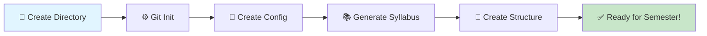
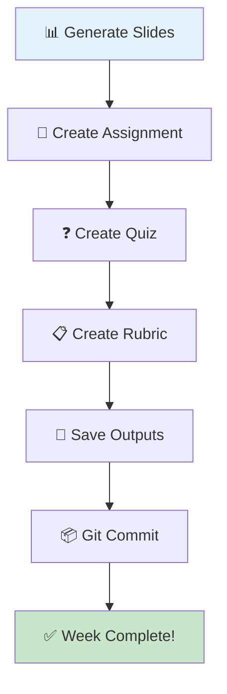
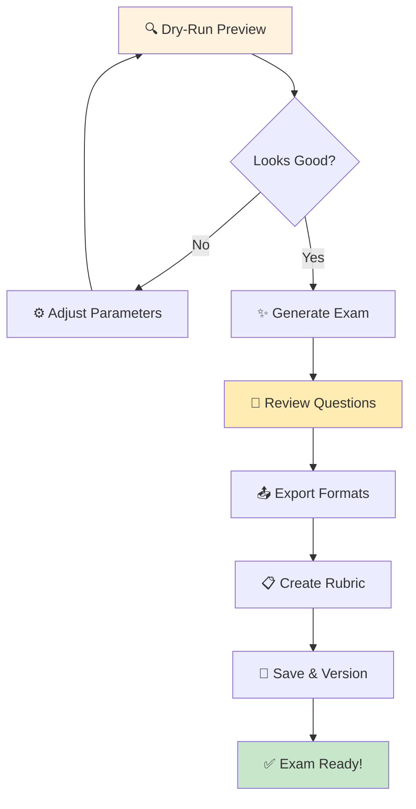
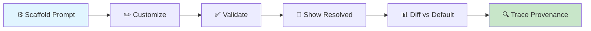
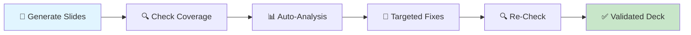

# Scholar Teaching Workflows

> **Version:** 2.17.0
> **Last Updated:** 2026-02-09
> **Audience:** Educators using Scholar for course material generation
>
> **📌 TL;DR - Quick Workflow Summary**
>
> **Semester Setup:** ⏱️ 10 min - Create config, generate syllabus
>
> **Weekly Content:** ⏱️ 15 min - Slides + assignment + quiz
>
> **Midterm Exam:** ⏱️ 20 min - Generate, review, create rubric
>
> **Slide Revision (v2.8.0):** ⏱️ 10 min - Check, auto-analyze, targeted fixes
>
> **Time Savings:** ~50% reduction vs manual creation
>
> **Full workflows below** ↓
>

This guide demonstrates common teaching workflows and best practices using Scholar commands.

---

## Table of Contents

- [Semester Setup](#semester-setup-10-minutes)
- [Weekly Content Creation](#weekly-content-creation-15-minutes-per-week)
- [Assessment Creation](#assessment-creation-20-minutes)
- [Grading Workflows](#grading-workflows)
- [Course Iteration](#course-iteration)
- [Slide Revision & Validation (v2.8.0)](#slide-revision-validation)
- [Config Management Workflow](#config-management-workflow)
- [Advanced Patterns](#advanced-patterns)

---

## Semester Setup ⏱️ 10 minutes {#semester-setup-10-minutes}

### Visual Workflow (Semester Setup ⏱️)



### Initial Course Configuration

**Goal:** Set up Scholar for a new course at the start of semester.

**Time Required:** ⏱️ ~10 minutes (one-time setup)

### Steps (Semester Setup ⏱️)

1. **Create course directory**

   ```bash
   mkdir -p ~/teaching/stat-440-spring-2026
   cd ~/teaching/stat-440-spring-2026
   ```

2. **Initialize Git**

   ```bash
   git init
   git add .
   git commit -m "Initial commit: Course setup"
   ```

3. **Create configuration**

   ```bash
   mkdir -p .flow
   ```

4. **Configure course settings** (.flow/teach-config.yml)

   ```yaml
   scholar:
     course_info:
       level: "undergraduate"
       field: "statistics"
       difficulty: "intermediate"
       
     defaults:
       exam_format: "markdown"
       lecture_format: "quarto"
       question_types:
         - "multiple-choice"
         - "short-answer"
         - "essay"
         
     style:
       tone: "formal"
       notation: "statistical"
       examples: true
   ```

5. **Generate syllabus**

   ```
   /teaching:syllabus "STAT 440: Regression Analysis" "Spring 2026"
   ```

6. **Create course structure**

   ```bash
   mkdir -p {exams,quizzes,assignments,slides,rubrics}
   ```

**Result:** Course ready for content creation throughout the semester.

---

## Weekly Content Creation ⏱️ 15 minutes per week {#weekly-content-creation-15-minutes-per-week}

### Visual Workflow (Weekly Content Creation)



### Week 1: Introduction

**Goal:** Create all materials for the first week of class.

**Time Required:** ⏱️ ~15 minutes total

### Workflow (Weekly Content Creation)

1. **Generate lecture slides**

   ```
   /teaching:slides "Introduction to Regression Analysis" --format quarto
   ```

2. **Create assignment**

   ```
   /teaching:assignment "R Setup and Data Exploration"
   ```

3. **Prepare quiz**

   ```
   /teaching:quiz "Week 1: Course Introduction and R Basics" --questions 5
   ```

4. **Create grading rubric for assignment**

   ```
   /teaching:rubric "Week 1 Assignment"
   ```

5. **Save outputs**

   ```bash
   # Save each output to appropriate directory
   mv lecture-slides-week01.qmd slides/
   mv assignment-week01.md assignments/
   mv quiz-week01.json quizzes/
   mv rubric-week01.md rubrics/
   ```

6. **Commit to Git**

   ```bash
   git add .
   git commit -m "Week 1: Introduction materials"
   ```

> **✅ ⚡ Time Saved: ~4 hours vs manual creation**
>
> One 15-minute session replaces 4+ hours of manual work!
>

---

## Assessment Creation ⏱️ 20 minutes {#assessment-creation-20-minutes}

### Visual Workflow (Assessment Creation ⏱️)



### Midterm Exam Workflow

**Goal:** Create a comprehensive midterm exam with answer key.

**Time Required:** ⏱️ ~20 minutes total

> **💡 🎯 Best Practice - Always Use Dry-Run First**
>
> Save time and API costs by previewing structure before generating:
>
> ```

/teaching:exam midterm --dry-run  # See structure instantly
    ```
    Adjust parameters, then generate for real.

### Steps (Assessment Creation ⏱️)

1. **Preview with dry-run**

   ```
   /teaching:exam midterm --questions 15 --difficulty medium --dry-run
   ```

   Review output. Adjust parameters if needed.

2. **Generate exam**

   ```
   /teaching:exam midterm --questions 15 --difficulty medium
   ```

3. **Review generated questions**

> **⚠️ ⚠️ Critical - Never Skip Human Review**
>
> AI-generated exams MUST be reviewed before use:
>
> - ✅ Check accuracy of content
> - ✅ Verify alignment with learning objectives
> - ✅ Ensure appropriate difficulty
> - ✅ Look for unintended bias or errors
>

1. **Export to multiple formats**

   ```
   # JSON saved automatically
   # Convert to LaTeX for printing
   # Convert to Canvas QTI for LMS
   ```

2. **Create answer key (included in generation)**
   - Review correctness
   - Add grading guidelines

3. **Generate standalone solution key** (v2.13.0)

   ```
   /teaching:solution midterm-exam.qmd --include-rubric
   ```

4. **Email solution to TA** (v2.13.0)

   ```
   /teaching:solution midterm-exam.qmd --send ta@university.edu
   ```

5. **Generate grading rubric**

   ```
   /teaching:rubric "Midterm Exam"
   ```

6. **Save and version**

   ```bash
   mkdir -p exams/midterm-spring2026
   mv midterm-exam.json exams/midterm-spring2026/
   mv midterm-rubric.md exams/midterm-spring2026/
   git add exams/
   git commit -m "Midterm exam: Spring 2026"
   git tag midterm-spring2026
   ```

### Best practices

- Generate 1-2 extra variations for makeup exams
- Review all AI-generated content before using
- Keep exams in version control for iteration

---

## Grading Workflows

### Assignment Grading

**Goal:** Efficiently grade student assignments with consistent feedback.

### Workflow (Grading Workflows)

1. **Review assignment submission**
   - Check student work
   - Identify common issues

2. **Generate feedback template**

   ```
   /teaching:feedback
   # Describe assignment and common issues
   # Scholar generates structured feedback template
   ```

3. **Customize feedback for each student**
   - Use template as starting point
   - Personalize based on specific errors
   - Add encouraging comments

4. **Track grading progress**

   ```bash
   # Create grading checklist
   touch grading/assignment1-progress.md
   ```

**Time saved:** ~30% reduction in grading time with consistent feedback quality

---

## Course Iteration

### Semester-to-Semester Updates

**Goal:** Improve course materials based on previous semester feedback.

### Workflow (Course Iteration)

1. **Review previous semester**

   ```bash
   git checkout fall-2025
   git diff spring-2025 fall-2025 -- exams/
   ```

2. **Update configuration if needed**

   ```yaml
   # Adjust difficulty based on student performance
   difficulty: "intermediate"  # was "advanced"
   ```

3. **Regenerate improved content**

   ```
   /teaching:exam midterm --questions 15 --difficulty intermediate
   ```

4. **Compare versions**

   ```bash
   diff exams/midterm-fall2025/midterm.json exams/midterm-spring2026/midterm.json
   ```

5. **Commit improvements**

   ```bash
   git add .
   git commit -m "Midterm: Adjusted difficulty based on Fall 2025 results"
   git tag spring-2026-midterm-v2
   ```

**Pattern:** Continuous improvement through version control and regeneration.

---

## Config Management Workflow

### Visual Workflow (Config Management)



### Steps (Config Management)

**Goal:** Customize Scholar prompts and configuration, then verify everything works before generating content.

**Time Required:** 5-10 minutes for initial setup; seconds for ongoing checks.

1. **Scaffold a prompt template for customization**

   Copy a Scholar default prompt to your project for editing:

   ```bash
   /teaching:config scaffold lecture-notes
   # Creates: .flow/templates/prompts/lecture-notes.md
   ```

   Valid types: lecture-notes, lecture-outline, section-content, exam, quiz, slides, revealjs-slides, assignment, syllabus, rubric, feedback.

2. **Edit the template to match your teaching style**

   Open the scaffolded prompt and customize it:

   ```bash
   # Edit the prompt template
   # Add your preferred tone, examples, notation style
   vim .flow/templates/prompts/lecture-notes.md
   ```

3. **Validate all configuration before generating content**

   Run pre-flight checks to catch issues early:

   ```bash
   /teaching:config validate

   # Strict mode for CI/CD or pre-release checks
   /teaching:config validate --strict

   # JSON output for automated pipelines
   /teaching:config validate --json
   ```

4. **Review the resolved config hierarchy**

   See exactly what config will be used for a given command and week:

   ```bash
   # See full resolved config
   /teaching:config show

   # See config for a specific command and week
   /teaching:config show --command lecture --week 4
   ```

5. **Compare project prompts against Scholar defaults**

   After upgrading Scholar or customizing prompts, check for drift:

   ```bash
   # Diff all project prompts vs defaults
   /teaching:config diff

   # Diff a specific prompt type
   /teaching:config diff lecture-notes
   ```

6. **After generating, trace provenance to verify what was used**

   Confirm that generated files used the correct config and prompt:

   ```bash
   /teaching:config trace content/lectures/week04-regression.qmd
   # Shows: Scholar version, prompt template, config layers, reproducibility hash
   ```

**Pattern:** Scaffold once, customize, validate before every generation, trace after generation for audit trail.

---

## Advanced Patterns

### Batch Quiz Generation

**Goal:** Create quizzes for entire semester at once.

### Script

```bash
#!/bin/bash
# generate-weekly-quizzes.sh

TOPICS=(
  "Introduction to Regression"
  "Simple Linear Regression"
  "Multiple Regression"
  "Model Diagnostics"
  "Variable Selection"
  "Interaction Effects"
  "Polynomial Regression"
  "Logistic Regression"
  "Generalized Linear Models"
  "Mixed Effects Models"
)

for i in "${!TOPICS[@]}"; do
  week=$((i + 1))
  topic="${TOPICS[$i]}"
  
  echo "Generating quiz for Week $week: $topic"
  /teaching:quiz "Week $week: $topic" --questions 5 > "quizzes/week-$week.json"
  
  sleep 2  # Rate limiting
done

git add quizzes/
git commit -m "Generated all weekly quizzes for semester"
```

**Use case:** Front-load quiz creation at semester start.

### Exam Variations

**Goal:** Create multiple exam variations to prevent cheating.

### Workflow (generate-weekly-quizzes.sh)

```
/teaching:exam midterm --questions 15 --variations 3
```

This generates:

- `midterm-v1.json`
- `midterm-v2.json`
- `midterm-v3.json`

Each variation:

- Same topics and difficulty
- Different specific questions
- Different answer choices (for MC)

### Deployment

- Randomly assign students to versions
- Track which student got which version

### Configuration Validation Workflow

**Goal:** Ensure all course configs are valid before generating content.

### Pre-generation checklist

```bash
# 1. Validate all configs
/teaching:validate --all

# 2. Auto-fix any issues
/teaching:validate --fix

# 3. Check sync status
/teaching:diff

# 4. Synchronize if needed
/teaching:sync

# 5. Verify fixes
/teaching:validate --all
```

### Add to Git hooks

```bash
#!/bin/bash
# .git/hooks/pre-commit

# Validate all configs before committing
/teaching:validate --all || {
  echo "❌ Config validation failed"
  echo "Run: /teaching:validate --fix"
  exit 1
}
```

---

## Slide Revision & Validation (v2.8.0) {#slide-revision-validation}

### Visual Workflow (Slide Revision)



### Iterative Check-Revise Workflow

**Goal:** Validate and improve slide decks against lesson plans with automated analysis.

**Time Required:** ⏱️ ~10 minutes per deck

### Steps (Slide Revision)

1. **Run baseline validation**

   ```bash
   /teaching:slides --check slides/week-03.qmd --from-plan=week03
   ```

   Review the 3-layer report: coverage (objectives), structure (ratios), style (formatting rules).

2. **Preview auto-analysis**

   ```bash
   /teaching:slides --revise slides/week-03.qmd --dry-run
   ```

   Scholar scans 7 dimensions: density, practice-distribution, style-compliance, math-depth, worked-examples, content-completeness, r-output-interpretation.

3. **Apply auto-analysis improvements**

   ```bash
   /teaching:slides --revise slides/week-03.qmd
   ```

4. **Apply targeted fixes** from the check report

   ```bash
   # Fix missing practice slides
   /teaching:slides --revise slides/week-03.qmd --section "Methods" \
     --instruction "Add a practice slide after the worked example"

   # Fix all quiz slides
   /teaching:slides --revise slides/week-03.qmd --type quiz \
     --instruction "Add 4th answer option to each question"

   # Fix specific slide
   /teaching:slides --revise slides/week-03.qmd --slides 8 \
     --instruction "Wrap definition in {.callout-important}"
   ```

5. **Re-check to verify improvements**

   ```bash
   /teaching:slides --check slides/week-03.qmd --from-plan=week03
   ```

   Continue until `Overall: PASS`.

### Targeting Options

| Target | Flag | Example |
|--------|------|---------|
| Section | `--section` | `--section "Methods"` (fuzzy matched) |
| Range | `--slides` | `--slides 5-12` or `--slides 3,5,8` |
| Type | `--type` | `--type quiz`, `--type practice` |
| Combined | Multiple | `--section "Methods" --type quiz` |

### Batch Validation (All Weeks)

```bash
# Validate all slide decks at semester start
for week in {01..15}; do
  /teaching:slides --check slides/week-${week}_*.qmd \
    --from-plan=week${week} \
    --json >> validation-report.json
done
```

**Pattern:** Check → auto-revise → targeted fixes → re-check until all layers pass.

---

## Integration Patterns

### Flow-CLI Integration

See [With Version Control (Git)](#with-version-control-git) section below for flow-cli coordination and workflow automation.

### Version Control

See [With Version Control (Git)](#with-version-control-git) section below for Git branching strategies and workflow integration.

---

### With Learning Management Systems (LMS)

#### Canvas Integration

### Export quiz to Canvas

1. Generate quiz with Canvas QTI format

   ```
   /teaching:quiz "Week 3: Hypothesis Testing" --format canvas
   ```

2. Import to Canvas
   - Go to Canvas course
   - Quizzes → Import QTI
   - Upload generated .xml file

3. Review and publish
   - Verify questions rendered correctly
   - Set due date and availability
   - Publish quiz

#### Moodle Integration

1. Generate quiz as JSON

   ```
   /teaching:quiz "Week 3" --format json
   ```

2. Convert JSON to Moodle XML

   ```bash
   # Use converter script (see examark project)
   convert-to-moodle.js quiz.json > quiz-moodle.xml
   ```

3. Import to Moodle

### With Version Control (Git)

### Branching strategy

```
main (published course content)
├── dev (active development)
├── feature/new-exam
├── feature/updated-slides
└── archive/fall-2025
```

### Workflow (Integration Patterns)

1. Create feature branch

   ```bash
   git checkout -b feature/midterm-exam
   ```

2. Generate content

   ```
   /teaching:exam midterm --questions 15
   ```

3. Review and refine
   - Test questions
   - Check difficulty
   - Verify alignment

4. Merge to dev

   ```bash
   git add exams/
   git commit -m "Add midterm exam"
   git checkout dev
   git merge feature/midterm-exam
   ```

5. Publish to main when ready

   ```bash
   git checkout main
   git merge dev
   git tag midterm-spring2026
   ```

---

## Time Management

### Weekly Schedule

### Monday

- Review last week's student performance
- Adjust difficulty if needed
- Plan this week's content

### Tuesday

- Generate lecture slides
- Create assignment
- Prepare quiz

### Wednesday

- Review and refine generated content
- Commit to Git
- Upload to LMS

### Thursday

- Office hours (no generation)
- Student questions inform future content

### Friday

- Grade assignments with Scholar feedback
- Collect data for next week's adjustments

### Time investment

- Setup: ~2 hours (one-time)
- Weekly: ~3-4 hours (vs 8-10 hours manual)
- **Savings: ~50% time reduction**

---

## Quality Assurance

### Review Checklist

Before using generated content:

- [ ] **Accuracy:** All facts and formulas correct
- [ ] **Alignment:** Matches learning objectives
- [ ] **Difficulty:** Appropriate for student level
- [ ] **Clarity:** Questions are unambiguous
- [ ] **Fairness:** No trick questions or gotchas
- [ ] **Coverage:** Represents full topic range
- [ ] **Formatting:** LaTeX renders correctly
- [ ] **Answer key:** All answers verified

### Student Feedback Loop

1. **Collect feedback** after each assessment
2. **Update config** based on difficulty reports
3. **Regenerate** with adjusted settings
4. **Compare** old vs new versions
5. **Deploy** improved version next semester

---

## Troubleshooting Common Workflows

### Problem: Generated content too easy/hard

### Solution (Troubleshooting Common Workflows)

```yaml
# Adjust in .flow/teach-config.yml
difficulty: "advanced"  # was "intermediate"
```

Regenerate with new settings.

### Problem: Questions don't match syllabus

### Solution (Adjust in .flow/teach-config.yml)

1. Update course_info in config
2. Use `--topics` flag to be specific

   ```
   /teaching:exam midterm --topics "regression,hypothesis-testing,anova"
   ```

### Problem: Need to regenerate everything

### Solution

```bash
# Use batch script (see Advanced Patterns)
./scripts/regenerate-all.sh
```

---

## Best Practices Summary

> **💡 🎯 Follow These 6 Rules for Best Results**
>
> Copy this checklist for every semester!
>

**1. Version control everything** 📦

- Configs, exams, quizzes, assignments
- Tag each semester for historical reference

   ```bash
   git tag spring-2026  # Easy rollback later!
   ```

**2. Validate before generating** ✅

- Run `/teaching:validate` first
- Fix any config issues

   ```bash
   /teaching:validate --fix  # Auto-fix common errors
   ```

**3. Review all AI content** 👀

> **🚨 ⚠️ NEVER use AI content without human review**
>
> This is non-negotiable for academic integrity!
>

**4. Iterate and improve** 🔄

- Use `--dry-run` for quick previews
- Adjust based on student performance

   ```bash
   /teaching:exam midterm --dry-run  # Preview first, always
   ```

**5. Maintain consistent style** 🎨

- Use config files for uniformity
- Update config, not individual commands

**6. Document your process** 📝

- Keep notes on what works
- Share with colleagues

---

## Resources

- [User Guide](USER-GUIDE.md) - Getting started with Scholar
- [Teaching Commands Reference](TEACHING-COMMANDS-REFERENCE.md) - Complete command list
- [Configuration Guide](AUTO-FIXER-GUIDE.md) - Config troubleshooting
- [Examples](examples/teaching.md) - More workflow examples

---

**Last updated:** 2026-02-09
**Version:** 2.17.0
**Contribute your workflows:** [GitHub Issues](https://github.com/Data-Wise/scholar/issues)
