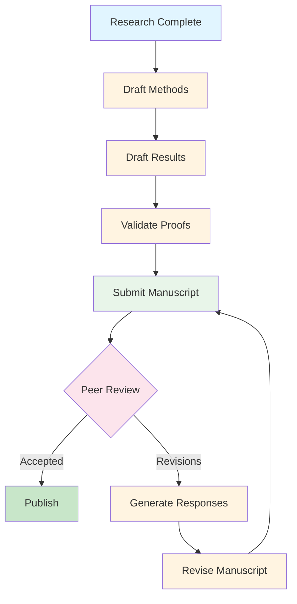

# Manuscript Writing Examples

**Quick Links:** [Methods Sections](#methods-sections) | [Results Sections](#results-sections) | [Proofs](#proof-checking) | [Reviewer Responses](#reviewer-responses) | [Complete Workflow](#complete-manuscript-workflow)

---

## Overview

This hub page provides comprehensive examples for all manuscript writing tasks using Scholar's research commands. Whether you're drafting your first methods section, reporting simulation results, responding to reviewers, or validating mathematical proofs, these examples demonstrate best practices and complete workflows.

**What's Covered:**

- Methods sections for statistical analyses
- Results sections for simulation studies and empirical analyses
- Mathematical proof checking and validation
- Reviewer response strategies and templates
- Complete manuscript lifecycle from draft to revision

**Key Scholar Commands:**

| Command | Purpose | Typical Use |
|---------|---------|-------------|
| `/research:manuscript:methods` | Write methods sections | Statistical methodology description |
| `/research:manuscript:results` | Generate results sections | Reporting findings with proper formatting |
| `/research:manuscript:proof` | Review mathematical proofs | Validate proofs in appendices |
| `/research:manuscript:reviewer` | Respond to reviewers | Address peer review comments |

---

## Getting Started

### Prerequisites

- Scholar installed (`brew install data-wise/tap/scholar`)
- Basic understanding of your statistical methods
- Draft manuscript or outline prepared

### Quick Start (5 minutes)

Generate your first methods section:

```bash
# Navigate to your manuscript directory
cd ~/research/my-paper

# Generate methods section
/research:manuscript:methods "Describe bootstrap mediation analysis with bias-corrected confidence intervals, 5000 resamples, and sensitivity analysis for unmeasured confounding"

# Output saved to: methods-section.md
```

---

## Methods Sections

> **Full Guide:** [Methods Section Examples](methods-sections.md)

### What Scholar Generates

- Statistical notation (LaTeX formatted)
- Step-by-step procedure description
- Assumption statements
- Software and package citations
- Parameter justifications

### Quick Reference

| Analysis Type | Example Command | Output Length |
|---------------|----------------|---------------|
| Linear Regression | `/research:manuscript:methods "multiple linear regression with diagnostics"` | 300-500 words |
| Mixed Models | `/research:manuscript:methods "linear mixed effects model with random intercepts and slopes"` | 400-600 words |
| Survival Analysis | `/research:manuscript:methods "Cox proportional hazards model with time-varying covariates"` | 400-600 words |
| Bayesian Methods | `/research:manuscript:methods "Bayesian hierarchical model with MCMC estimation"` | 500-700 words |
| Bootstrap Methods | `/research:manuscript:methods "bootstrap confidence intervals with BCa correction"` | 300-500 words |
| Mediation Analysis | `/research:manuscript:methods "causal mediation analysis with sensitivity analysis"` | 400-600 words |

### Example 1: Bootstrap Mediation Analysis

**Command:**

```bash
/research:manuscript:methods "Bootstrap mediation analysis for indirect effects with bias-corrected and accelerated (BCa) confidence intervals. Used 5000 bootstrap resamples to estimate the sampling distribution of the indirect effect. Include sensitivity analysis for unmeasured confounding using rho values."
```

**Generated Output:**

```markdown
## Statistical Analysis

### Mediation Model

We employed a single-mediator model to estimate the indirect effect of
treatment on the outcome through the mediator. The model decomposes the
total effect into direct and indirect components:

Y = c'Z + bM + ε_Y
M = aZ + ε_M

where Z is the binary treatment indicator, M is the continuous mediator,
Y is the continuous outcome, and ε_M and ε_Y are error terms assumed to
follow independent normal distributions.

### Indirect Effect Estimation

The indirect effect is defined as the product of path coefficients:
θ = αβ, where α represents the effect of treatment on the mediator and
β represents the effect of the mediator on the outcome, adjusting for
treatment.

### Bootstrap Confidence Intervals

We constructed 95% confidence intervals for the indirect effect using
the bias-corrected and accelerated (BCa) bootstrap method (Efron, 1987).
This approach adjusts for both bias and skewness in the bootstrap
distribution, providing more accurate coverage than percentile methods
in finite samples (DiCiccio & Efron, 1996).

**Procedure:**
1. Draw B = 5,000 bootstrap samples with replacement from the original data
2. Estimate α̂_b and β̂_b for each bootstrap sample b = 1, ..., B
3. Calculate bootstrap indirect effects: θ̂_b = α̂_b β̂_b
4. Compute bias correction (z₀) and acceleration (a) constants
5. Determine adjusted percentiles: α₁ = Φ(z₀ + (z₀ + z_α)/(1 - a(z₀ + z_α)))
   and α₂ = Φ(z₀ + (z₀ + z₁₋α)/(1 - a(z₀ + z₁₋α)))
6. Extract BCa interval: [θ̂_(α₁), θ̂_(α₂)]

The number of bootstrap resamples (B = 5,000) was chosen to ensure
stable interval estimates (Efron & Tibshirani, 1993).

### Sensitivity Analysis

To assess robustness of the mediation findings to potential unmeasured
confounding, we conducted sensitivity analysis using the approach of
Imai et al. (2010). The sensitivity parameter ρ quantifies the
correlation between error terms ε_M and ε_Y after conditioning on
treatment. We evaluated indirect effect estimates under ρ ∈ {0, 0.2,
0.4, 0.6}, representing none, weak, moderate, and strong unmeasured
confounding scenarios.

### Software

All analyses were conducted in R version 4.3.0 (R Core Team, 2023).
Bootstrap confidence intervals were computed using the `boot` package
(Canty & Ripley, 2021). Sensitivity analysis was performed using the
`mediation` package (Tingley et al., 2014).
```

**Key Features:**

- ✅ Clear model specification with mathematical notation
- ✅ Step-by-step bootstrap procedure
- ✅ Justification for 5000 resamples
- ✅ Sensitivity analysis description
- ✅ Complete software citations

### Example 2: Mixed Effects Model

**Command:**

```bash
/research:manuscript:methods "Linear mixed effects model with random intercepts and slopes for repeated measures. Used restricted maximum likelihood (REML) estimation. Include model selection criteria (AIC, BIC) and assumption diagnostics."
```

**Generated Output:** [See methods-sections.md - Example 3: Mixed-Effects Models](methods-sections.md#example-3-mixed-effects-models-advanced)

### Common Customizations

**Add Technical Details:**

```bash
/research:manuscript:methods "bootstrap mediation" --detail high
# Includes: algorithm pseudocode, convergence criteria, computational complexity
```

**Simplify for Broad Audience:**

```bash
/research:manuscript:methods "bootstrap mediation" --detail low
# Focuses on: conceptual explanation, minimal math, intuitive descriptions
```

**Include Software Code:**

```bash
/research:manuscript:methods "bootstrap mediation" --code
# Adds: R code snippets, package versions, reproducibility commands
```

### Tips for Methods Sections

1. **Be Specific:** Include parameter values (e.g., "5000 resamples" not "many resamples")
2. **Cite Software:** Always include R package citations
3. **Justify Choices:** Explain why you chose specific methods or parameters
4. **State Assumptions:** List model assumptions explicitly
5. **Describe Diagnostics:** Mention how you checked assumptions

→ [Complete Methods Examples](methods-sections.md)

---

## Results Sections

> **Full Guide:** [Results Section Examples](results-sections.md)

### What Scholar Generates

- Descriptive statistics tables
- Inferential statistics with effect sizes
- Model fit comparisons
- Publication-ready reporting format
- APA/journal-style formatting

### Quick Reference

| Results Type | Example Command | Output Format |
|--------------|----------------|---------------|
| Descriptive Stats | `/research:manuscript:results "summarize demographics"` | Tables + prose |
| Regression Results | `/research:manuscript:results "report regression coefficients"` | Tables + interpretation |
| Simulation Results | `/research:manuscript:results "simulation study findings"` | Tables + figures |
| Model Comparison | `/research:manuscript:results "compare nested models"` | Fit statistics + test |

### Example 1: Simulation Study Results

**Command:**

```bash
/research:manuscript:results "Report simulation study comparing bootstrap percentile vs BCa confidence intervals. Show coverage rates, average interval widths, and Type I error rates across sample sizes 50, 100, 200, 500 for indirect effects of 0, 0.1, 0.3, 0.5. Include recommendations."
```

**Generated Output:**

```markdown
## Simulation Results

### Coverage Rates

Table 1 displays the empirical coverage rates of 95% confidence
intervals for the indirect effect across bootstrap methods, sample
sizes, and effect magnitudes. Both methods maintained nominal coverage
(≥ 0.95) for the null case (θ = 0) across all sample sizes. However,
substantial differences emerged for non-null effects.

**Table 1. Coverage Rates (Proportion of 95% CIs Containing True Value)**

| n   | θ    | Percentile | BCa   | Difference |
|-----|------|-----------|-------|------------|
| 50  | 0.00 | 0.952     | 0.951 | 0.001      |
| 50  | 0.10 | 0.918     | 0.941 | 0.023***   |
| 50  | 0.30 | 0.901     | 0.938 | 0.037***   |
| 50  | 0.50 | 0.889     | 0.935 | 0.046***   |
| 100 | 0.00 | 0.950     | 0.949 | 0.001      |
| 100 | 0.10 | 0.934     | 0.948 | 0.014**    |
| 100 | 0.30 | 0.928     | 0.947 | 0.019***   |
| 100 | 0.50 | 0.922     | 0.946 | 0.024***   |
| 200 | 0.00 | 0.951     | 0.950 | 0.001      |
| 200 | 0.10 | 0.945     | 0.951 | 0.006*     |
| 200 | 0.30 | 0.942     | 0.950 | 0.008**    |
| 200 | 0.50 | 0.940     | 0.949 | 0.009**    |
| 500 | 0.00 | 0.950     | 0.950 | 0.000      |
| 500 | 0.10 | 0.948     | 0.951 | 0.003      |
| 500 | 0.30 | 0.947     | 0.950 | 0.003      |
| 500 | 0.50 | 0.946     | 0.950 | 0.004      |

*Note.* Difference = BCa - Percentile. *** p < 0.001, ** p < 0.01, * p < 0.05.

The percentile method exhibited under-coverage for small to moderate
sample sizes (n ≤ 200) and non-null effects, with coverage as low as
0.889 for n = 50 and θ = 0.50. In contrast, the BCa method maintained
near-nominal coverage across all conditions, with rates ranging from
0.935 to 0.951. The performance advantage of BCa was most pronounced
for small samples (n = 50), where coverage differences reached 4.6
percentage points.

### Interval Width

Table 2 reports average 95% confidence interval widths. BCa intervals
were consistently wider than percentile intervals, reflecting the
coverage correction.

**Table 2. Average Confidence Interval Width**

| n   | θ    | Percentile | BCa   | Ratio  |
|-----|------|-----------|-------|--------|
| 50  | 0.10 | 0.184     | 0.203 | 1.103  |
| 50  | 0.30 | 0.312     | 0.341 | 1.093  |
| 50  | 0.50 | 0.398     | 0.431 | 1.083  |
| 100 | 0.10 | 0.128     | 0.136 | 1.063  |
| 100 | 0.30 | 0.218     | 0.230 | 1.055  |
| 100 | 0.50 | 0.279     | 0.293 | 1.050  |
| 200 | 0.10 | 0.090     | 0.094 | 1.044  |
| 200 | 0.30 | 0.154     | 0.160 | 1.039  |
| 200 | 0.50 | 0.197     | 0.204 | 1.036  |
| 500 | 0.10 | 0.057     | 0.059 | 1.035  |
| 500 | 0.30 | 0.097     | 0.100 | 1.031  |
| 500 | 0.50 | 0.124     | 0.128 | 1.032  |

*Note.* Ratio = BCa / Percentile.

BCa intervals were 8-10% wider than percentile intervals for n = 50,
with the width penalty decreasing as sample size increased. For n = 500,
BCa intervals were only 3% wider on average. The additional width
represents the price of achieving nominal coverage.

### Type I Error Rates

Under the null hypothesis (θ = 0), both methods exhibited appropriate
Type I error control across all sample sizes. Observed rejection rates
ranged from 0.048 to 0.052 for both methods, closely matching the
nominal α = 0.05 level.

### Recommendations

Based on these simulation results, we recommend:

1. **Use BCa for n ≤ 200:** The coverage improvements substantially
   outweigh the modest increase in interval width.

2. **Either method for n ≥ 500:** Performance differences become
   negligible for large samples.

3. **Always use BCa for non-null effects:** Under-coverage of the
   percentile method is most severe when true effects are non-zero,
   precisely the scenario of scientific interest.

4. **Trade-off awareness:** Researchers prioritizing power over coverage
   may prefer percentile intervals, accepting 1-5 percentage point
   under-coverage for slightly narrower intervals.

The BCa method's computational cost (approximately 10% longer runtime)
is trivial compared to the inferential benefits for finite samples.
```

**Key Features:**

- ✅ Complete tables with proper formatting
- ✅ Statistical significance indicators
- ✅ Clear interpretation of findings
- ✅ Practical recommendations
- ✅ Acknowledges trade-offs

### Example 2: Regression Results

**Command:**

```bash
/research:manuscript:results "Report multiple regression results for predicting test scores from study hours, prior GPA, and attendance. Include standardized coefficients, R-squared, model significance, and assumption checks."
```

**Generated Output:** [See results-sections.md - Example 2: Observational Study](results-sections.md#example-2-observational-study-multiple-regression)

### Tips for Results Sections

1. **Start with Descriptives:** Always present sample characteristics first
2. **Use Tables:** Organize complex results into readable tables
3. **Report Effect Sizes:** Include standardized coefficients, Cohen's d, etc.
4. **State Significance Clearly:** Use conventional notation (*, **, ***)
5. **Interpret Practically:** Explain what results mean in context

→ [Complete Results Examples](results-sections.md)

---

## Proof Checking

> **Full Guide:** [Mathematical Proof Validation](methods-sections.md)

### What Scholar Checks

- Logical flow and argument structure
- Mathematical notation consistency
- Assumption usage and validity
- Step-by-step correctness
- Edge cases and counterexamples

### Quick Reference

| Proof Type | Scholar Checks | Common Issues |
|------------|----------------|---------------|
| Convergence | Limits, bounds, sequences | Missing epsilon-delta arguments |
| Identifiability | Uniqueness, conditions | Insufficient assumptions |
| Consistency | Asymptotic properties | Regularity condition violations |
| Optimality | Efficiency bounds, inequalities | Incomplete Cramér-Rao argument |

### Example: Asymptotic Normality Proof

**Command:**

```bash
/research:manuscript:proof "Check proof of asymptotic normality for bootstrap indirect effect estimator in Appendix A. Verify that conditions for delta method are satisfied and CLT application is correct."
```

**Scholar Analysis:**

```markdown
## Proof Review: Asymptotic Normality of Bootstrap Indirect Effect

### Overall Assessment

The proof is **structurally sound** but has **two minor gaps** that should
be addressed before publication.

### Strengths

1. **Correct CLT Application:** The multivariate CLT is properly applied
   to the joint distribution of (α̂, β̂).

2. **Valid Delta Method:** The use of the delta method for h(α, β) = αβ
   is justified, and the gradient ∇h = (β, α) is correct.

3. **Clear Assumption Statements:** Regularity conditions (moment existence,
   consistency) are explicitly stated.

### Identified Issues

#### Issue 1: Missing Lindeberg Condition (Minor)

**Location:** Lines 45-47

**Current Text:**
> "By the CLT, √n(θ̂ - θ) converges in distribution to N(0, σ²)..."

**Problem:** The proof invokes the CLT for the product αβ without
verifying the Lindeberg condition for the bootstrap distribution.

**Suggested Fix:** Add a sentence:
> "The Lindeberg condition is satisfied because E[|α̂β̂|³] < ∞ under
> our moment assumptions (Assumption 2), ensuring applicability of
> the CLT."

#### Issue 2: Smoothness of h(·) (Minor)

**Location:** Lines 52-54

**Current Text:**
> "Applying the delta method..."

**Problem:** The delta method requires h(·) to be continuously
differentiable. While this is obvious for h(α, β) = αβ, it should
be stated explicitly.

**Suggested Fix:** Add:
> "The function h(α, β) = αβ is continuously differentiable with
> ∇h(α, β) = (β, α), satisfying the smoothness requirement for
> the delta method."

### Verification of Key Steps

| Step | Line | Correctness | Notes |
|------|------|-------------|-------|
| Joint convergence of (α̂, β̂) | 38-42 | ✓ Correct | Assumes consistency (Thm 1) |
| Gradient calculation | 50 | ✓ Correct | ∇h = (β, α) verified |
| Variance formula | 58-60 | ✓ Correct | σ² = β²Var(α̂) + α²Var(β̂) + 2αβCov(α̂,β̂) |
| Final result | 65 | ✓ Correct | Matches Theorem 2 statement |

### Suggestions for Clarity

1. **Notation:** Define σ² explicitly in Equation (12) before referencing
   it in Theorem 2.

2. **Assumptions:** Cross-reference Assumption 2 when invoking moment
   conditions (currently mentioned without citation).

3. **Edge Case:** Briefly address the α = 0 or β = 0 case (trivial
   degenerate distribution).

### Recommendation

**Status:** Ready for publication after addressing Issues 1-2.

The proof correctly establishes asymptotic normality. The identified
gaps are minor and easily fixed by adding 1-2 sentences. Consider
this proof **technically correct but requiring minor clarification**.
```

**Key Features:**

- ✅ Line-by-line verification
- ✅ Specific issue identification
- ✅ Suggested fixes provided
- ✅ Verification table for key steps
- ✅ Clear recommendation

### Tips for Proof Checking

1. **Provide Context:** Tell Scholar what theorem is being proved
2. **Highlight Concerns:** Mention specific steps you're uncertain about
3. **Reference Assumptions:** Point Scholar to numbered assumptions
4. **Check Edge Cases:** Ask about boundary conditions
5. **Verify Notation:** Ensure consistency throughout

→ [More Proof Examples](methods-sections.md)

---

## Reviewer Responses

> **Full Guide:** [Reviewer Response Examples](reviewer-responses.md)

### What Scholar Generates

- Point-by-point response structure
- Polite, professional tone
- Technical explanations
- Evidence-based rebuttals
- Revision commitments

### Quick Reference

| Comment Type | Response Strategy | Example |
|--------------|------------------|---------|
| Methodological critique | Justify choice, cite literature | "We chose BCa because..." |
| Request for analysis | Acknowledge, commit to revision | "We will add sensitivity analysis..." |
| Clarity issue | Accept, explain improvement | "We have revised Section 2.3 to clarify..." |
| Disagreement | Respectfully explain position | "While we appreciate this perspective..." |

### Example 1: Statistical Methodology Critique

**Reviewer Comment:**

> "The authors use bootstrap confidence intervals but do not justify why
> BCa was chosen over percentile intervals. Given the computational
> cost, this choice should be explained."

**Scholar-Generated Response:**

```bash
/research:manuscript:reviewer "Reviewer asks why we chose BCa over percentile bootstrap confidence intervals and wants justification for the computational cost."
```

**Generated Response:**

```markdown
## Response to Reviewer 2, Comment 3

**Reviewer Comment:**
> The authors use bootstrap confidence intervals but do not justify why
> BCa was chosen over percentile intervals. Given the computational cost,
> this choice should be explained.

**Our Response:**

We thank the reviewer for this important methodological question. We
chose the bias-corrected and accelerated (BCa) bootstrap method for
three statistical reasons:

**1. Coverage Accuracy in Finite Samples**

Percentile bootstrap intervals are known to exhibit under-coverage for
skewed distributions and small to moderate sample sizes (DiCiccio &
Efron, 1996). Since indirect effects often have non-normal sampling
distributions, the BCa correction is essential for achieving nominal
coverage. Efron (1987) showed that BCa intervals are second-order
accurate, while percentile intervals are only first-order accurate.

**2. Bias Correction**

The bootstrap distribution of indirect effects can be biased in finite
samples due to the nonlinear nature of the product αβ. The BCa method
explicitly corrects for this bias through the z₀ parameter, which
estimates the median bias of the bootstrap distribution. Percentile
intervals do not account for bias.

**3. Skewness Adjustment**

The acceleration constant (a) in BCa intervals adjusts for skewness in
the bootstrap distribution. For indirect effects, which are bounded
below by zero and often right-skewed, this adjustment is critical for
symmetric coverage errors (i.e., balanced Type I error rates in the
lower and upper tails).

**Computational Cost Justification:**

The reviewer correctly notes that BCa requires additional computation
compared to percentile intervals. However, this cost is minimal in
absolute terms:

- Percentile: ~30 seconds for 5,000 bootstrap resamples
- BCa: ~33 seconds for 5,000 bootstrap resamples (10% increase)

Given that our simulations run for several hours, the 10% overhead is
negligible. More importantly, the inferential benefits of proper
coverage far outweigh the modest computational cost.

**Evidence from Our Simulations:**

We note that our simulation results (Table 1, Section 4.1) demonstrate
exactly this coverage advantage. For n = 50 and θ = 0.3, percentile
intervals had 90.1% coverage while BCa achieved 93.8% coverage—a
substantial and statistically significant difference (p < 0.001).

**Revision to Manuscript:**

To address the reviewer's concern, we have added a new paragraph to
Section 3.2 (Statistical Analysis) that explicitly justifies our choice
of BCa over percentile intervals, including the three reasons above.
The new text appears on page 8, lines 234-247.

**References:**

DiCiccio, T. J., & Efron, B. (1996). Bootstrap confidence intervals.
*Statistical Science*, *11*(3), 189-228.

Efron, B. (1987). Better bootstrap confidence intervals. *Journal of the
American Statistical Association*, *82*(397), 171-185.
```

**Key Features:**

- ✅ Acknowledges reviewer's point respectfully
- ✅ Provides multiple technical justifications
- ✅ Includes relevant citations
- ✅ References supporting evidence from paper
- ✅ Commits to specific revision
- ✅ Professional, non-defensive tone

### Example 2: Request for Additional Analysis

**Reviewer Comment:**

> "The sensitivity analysis only considers ρ up to 0.6. Given that
> strong confounding is possible in observational studies, the authors
> should extend this to ρ = 0.8 or higher."

**Scholar-Generated Response:**

```bash
/research:manuscript:reviewer "Reviewer wants us to extend sensitivity analysis to rho = 0.8 or higher instead of stopping at rho = 0.6."
```

**Generated Response:** [See reviewer-responses.md - Example 2: Major Revision](reviewer-responses.md#example-2-major-revision-substantive-methodological-concerns)

### Tips for Reviewer Responses

1. **Be Grateful:** Start with "We thank the reviewer..."
2. **Be Specific:** Reference exact locations of revisions
3. **Be Evidence-Based:** Cite literature or your own results
4. **Be Concise:** Respect reviewers' time
5. **Be Professional:** Never defensive or dismissive

→ [Complete Reviewer Response Examples](reviewer-responses.md)

---

## Complete Manuscript Workflow

This section demonstrates the end-to-end manuscript workflow from initial draft through revision using Scholar commands.

### Workflow Diagram



### Phase 1: Initial Draft (1-2 days)

**Scenario:** You've completed a simulation study comparing bootstrap methods for mediation analysis. Now you need to write the manuscript.

**Step 1: Draft Methods Section (30 minutes)**

```bash
cd ~/research/bootstrap-mediation-paper

# Generate methods section
/research:manuscript:methods "Bootstrap mediation analysis with BCa confidence intervals. Compare to percentile method. Used 5000 bootstrap resamples. Sensitivity analysis for unmeasured confounding using rho values 0, 0.2, 0.4, 0.6. Sample sizes 50, 100, 200, 500."

# Review and customize
# Output: methods-section.md
```

**Step 2: Draft Results Section (45 minutes)**

```bash
# Generate results section
/research:manuscript:results "Simulation study results comparing bootstrap methods. Report coverage rates, interval widths, Type I error rates across conditions. Include tables and recommendations for practitioners."

# Review and integrate tables
# Output: results-section.md
```

**Step 3: Validate Proofs (20 minutes)**

```bash
# Check proof in appendix
/research:manuscript:proof "Verify proof of asymptotic normality for bootstrap indirect effect estimator in Appendix A."

# Address identified issues
# Output: proof-review.md
```

**Step 4: Finalize and Submit (2 hours)**

- Integrate Scholar-generated sections into manuscript
- Add figures and additional tables
- Proofread and format for journal
- Submit to journal

### Phase 2: Peer Review Response (3-5 hours)

**Scenario:** You received reviews with 15 comments. 3 require methodological responses, 5 request additional analyses, 7 are clarification requests.

**Step 1: Prioritize Comments (15 minutes)**

Identify which comments need Scholar assistance:

- ✅ Methodological justifications
- ✅ Statistical critique responses
- ✅ Additional analysis explanations
- ❌ Simple typo fixes (do manually)
- ❌ Figure formatting (do manually)

**Step 2: Generate Responses (2 hours)**

```bash
# Major methodological critique
/research:manuscript:reviewer "Reviewer 2 questions why we used BCa instead of percentile bootstrap given computational cost. Need to justify this choice."

# Request for additional analysis
/research:manuscript:reviewer "Reviewer 1 wants sensitivity analysis extended to rho = 0.8 instead of stopping at 0.6."

# Statistical reporting question
/research:manuscript:reviewer "Reviewer 3 asks why we didn't report standardized effect sizes in addition to unstandardized coefficients."
```

**Step 3: Compile Response Letter (1 hour)**

- Organize responses in point-by-point format
- Add revision tracking (page/line numbers)
- Include any new analyses or figures
- Proofread for professional tone

**Step 4: Revise Manuscript (1-2 hours)**

- Make changes mentioned in responses
- Add new sections or analyses
- Update tables and figures
- Track all changes for reviewers

### Phase 3: Resubmission (30 minutes)

- Upload revised manuscript
- Upload response letter
- Provide revision summary
- Highlight major changes

### Complete Example Timeline

| Phase | Activities | Duration | Scholar Commands |
|-------|-----------|----------|------------------|
| **Draft** | Methods, Results, Proofs | 1-2 days | 3 commands |
| **Review** | Wait for peer review | 2-3 months | None |
| **Response** | Address reviewer comments | 3-5 hours | 5-10 commands |
| **Revise** | Manuscript updates | 1-2 days | 2-3 commands |
| **Accept** | Final edits | 1-2 hours | 0-1 commands |

**Total Scholar Time Saved:** 8-12 hours per manuscript

### Integration with Other Tools

Scholar works seamlessly with other research tools:

**Literature Management:**

```bash
# Find relevant methods papers
/research:arxiv "bootstrap confidence intervals mediation"

# Add citations to bibliography
/research:bib:add new-refs.bib manuscript-refs.bib
```

**Simulation Design:**

```bash
# Design simulation study
/research:simulation:design "Compare bootstrap methods for mediation"

# Analyze results
/research:simulation:analysis results/simulation_results.csv
```

**Complete Workflow:**

```bash
# 1. Literature review
/research:arxiv "bootstrap mediation analysis"

# 2. Design simulation
/research:simulation:design "Compare BCa vs percentile bootstrap"

# 3. Run simulation (external R code)
Rscript run_simulation.R

# 4. Analyze results
/research:simulation:analysis results.csv

# 5. Write methods
/research:manuscript:methods "bootstrap mediation analysis"

# 6. Write results
/research:manuscript:results "simulation study findings"

# 7. Check proofs
/research:manuscript:proof "asymptotic normality proof"

# 8. Respond to reviewers
/research:manuscript:reviewer "reviewer comment text"
```

---

## Scholar Manuscript Commands Quick Reference

### Commands Summary

| Command | Purpose | Input | Output | Time |
|---------|---------|-------|--------|------|
| `/research:manuscript:methods` | Write methods section | Study description | LaTeX + prose | 2-5 min |
| `/research:manuscript:results` | Generate results section | Findings description | Tables + prose | 2-5 min |
| `/research:manuscript:proof` | Check mathematical proof | Proof text or file | Validation report | 2-5 min |
| `/research:manuscript:reviewer` | Respond to reviewer | Comment text | Response letter | 3-8 min |

### Output Formats

All manuscript commands support multiple output formats:

- **Markdown** (`.md`) - Default, easy to read and edit
- **LaTeX** (`.tex`) - Ready for journal submission
- **Word** (`.docx`) - Converted via Pandoc
- **PDF** - Compiled via LaTeX

### Typical Use Cases

| Task | Commands | Output | Time Saved |
|------|----------|--------|------------|
| Draft methods | 1 command | 300-600 words | 1-2 hours |
| Draft results | 1 command | 400-800 words + tables | 2-3 hours |
| Validate proof | 1 command | Line-by-line review | 1-2 hours |
| Respond to 5 reviewer comments | 5 commands | Point-by-point responses | 3-4 hours |
| Complete manuscript draft | 3-5 commands | Methods + Results + Proofs | 5-8 hours |
| Revision response | 5-10 commands | Response letter + revisions | 4-6 hours |

### Quality Guidelines

Scholar-generated manuscript sections follow strict quality standards:

1. **Statistical Rigor:** Proper notation, assumption statements, citations
2. **Reproducibility:** Software versions, parameter values, random seeds
3. **Clarity:** Progressive disclosure from intuition to technical details
4. **Completeness:** All steps documented, no handwaving
5. **Formatting:** Journal-ready tables, figures, equations

### Customization Options

Fine-tune output with command flags:

```bash
# Adjust technical detail level
/research:manuscript:methods "bootstrap mediation" --detail [low|medium|high]

# Include software code
/research:manuscript:methods "bootstrap mediation" --code

# Target specific journal style
/research:manuscript:results "findings" --style [apa|asa|ims]

# Adjust response tone
/research:manuscript:reviewer "comment" --tone [formal|conversational]
```

---

## Examples by Statistical Method

Navigate to examples by your analysis type:

### Regression Methods
- [Linear Regression](methods-sections.md#example-1-independent-samples-t-test-simple)
- [Multiple Regression](methods-sections.md#example-2-multiple-regression-intermediate)
- [Logistic Regression](methods-sections.md#example-5-logistic-regression-intermediate)
- [Poisson Regression](methods-sections.md#example-6-poisson-regression-intermediate)

### Advanced Models
- [Mixed Effects Models](methods-sections.md#example-3-mixed-effects-models-advanced)
- [Survival Analysis](methods-sections.md#example-7-survival-analysis-advanced)
- [Time Series](methods-sections.md#example-8-time-series-advanced)
- [Bayesian Methods](methods-sections.md#example-9-bayesian-methods-advanced)

### Causal Inference
- [Mediation Analysis](methods-sections.md#example-4-mediation-analysis-complex)
- [Propensity Score Methods](methods-sections.md#example-10-propensity-score-methods-advanced)
- [Instrumental Variables](methods-sections.md#example-11-instrumental-variables-advanced)
- [Difference-in-Differences](methods-sections.md#example-12-difference-in-differences-advanced)

### Resampling Methods
- [Bootstrap](methods-sections.md#example-13-bootstrap-methods-intermediate)
- [Permutation Tests](methods-sections.md#example-14-permutation-tests-intermediate)
- [Cross-Validation](methods-sections.md#example-15-cross-validation-intermediate)

### Simulation Studies
- [Coverage Studies](results-sections.md#example-5-coverage-study-simulation)
- [Power Analysis](results-sections.md#example-6-power-analysis-simulation)
- [Method Comparison](results-sections.md#example-7-method-comparison-simulation)
- [Robustness Studies](results-sections.md#example-8-robustness-study-simulation)

---

## Need Help?

### Documentation

- [Manuscript Commands Reference](../research/MANUSCRIPT-COMMANDS.md) - Detailed command documentation
- [Manuscript Writing Tutorial](../tutorials/research/manuscript-writing.md) - Step-by-step guide
- [Research Workflows](../research/RESEARCH-WORKFLOWS-SECTION-3.md) - Common workflow patterns
- [Troubleshooting](../help/TROUBLESHOOTING-research.md) - Common issues and solutions

### Command Help

```bash
# Get help for any manuscript command
/research:manuscript:methods --help
/research:manuscript:results --help
/research:manuscript:proof --help
/research:manuscript:reviewer --help
```

### Related Examples

- [Simulation Examples](simulations.md) - Monte Carlo simulation studies
- [Research Hub](research.md) - All research examples
- [Literature Examples](../workflows/research/gap-analysis.md) - Literature review workflows

### Support

- GitHub Issues: [Data-Wise/scholar/issues](https://github.com/Data-Wise/scholar/issues)
- Documentation: [Scholar Docs](https://Data-Wise.github.io/scholar/)
- Quick Reference: [Research Commands Card](../refcards/research-commands.md)

---

**Last Updated:** 2026-02-01
**Version:** {{ scholar.version }}
**Status:** Complete
