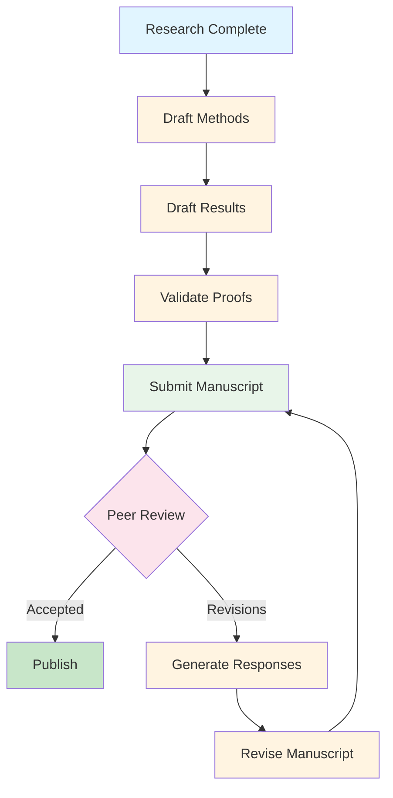

# Research Examples Hub

**Quick Navigation:** [Literature](#literature-review-examples) | [Planning](#research-planning-examples) | [Design](#study-design-examples) | [Analysis](#analysis-examples) | [Writing](#writing-examples) | [Publication](#publication-examples)

---

## Overview

Welcome to the comprehensive research examples hub for Scholar. This page organizes all research-related examples by research activity, from initial literature review through final publication. Whether you're starting a new project, designing a simulation study, or writing up results, you'll find practical examples and complete workflows here.

**What's Covered:**

- Literature discovery and management workflows
- Research planning and hypothesis generation
- Study design and methodology selection
- Statistical analysis and simulation studies
- Manuscript writing and peer review responses
- End-to-end research project examples

**Key Resources:**

- [Research Commands Reference](../research/RESEARCH-COMMANDS-REFERENCE.md) - Complete command documentation
- [Research Workflows](../research/RESEARCH-WORKFLOWS-SECTION-3.md) - Common workflow patterns
- [Manuscript Examples](manuscripts.md) - Specialized manuscript writing hub
- [Simulation Examples](simulations.md) - Detailed simulation study examples

---

## Getting Started

### Prerequisites

- Scholar installed via Homebrew: `brew install data-wise/tap/scholar`
- Claude AI access (for AI-powered commands)
- Optional: Zotero, BibTeX, flow-cli for enhanced workflows

### Quick Start (3 minutes)

Try your first research command:

```bash
# Search for recent papers
/research:arxiv "causal mediation analysis" --recent

# Look up a specific paper
/research:doi "10.1080/01621459.2020.1765785"

# Plan a new study
/research:analysis-plan "I want to test whether study habits mediate the effect of sleep on academic performance"
```

### Scholar Research Commands Overview

| Category | Commands | Typical Use |
|----------|----------|-------------|
| **Literature** | 4 commands | Search, retrieve, organize papers |
| **Planning** | 4 commands | Gap analysis, hypotheses, design |
| **Simulation** | 2 commands | Design and analyze Monte Carlo studies |
| **Manuscript** | 4 commands | Methods, results, proofs, reviews |

**Total:** {{ scholar.research_commands }} research commands covering the complete research lifecycle.

---

## Literature Review Examples

> **Full Guide:** [Literature Commands Reference](../research/LITERATURE-COMMANDS.md)

Literature management with Scholar covers discovery, retrieval, organization, and citation management. These examples show how to conduct systematic searches, build bibliographies, and integrate with reference managers.

### Quick Reference

| Task | Command | Output | Time |
|------|---------|--------|------|
| Search arXiv | `/research:arxiv "query"` | Paper metadata + abstracts | 30s |
| Look up DOI | `/research:doi 10.xxxx/xxxxx` | Full citation + BibTeX | 15s |
| Search bibliography | `/research:bib:search "author"` | Matching entries | 10s |
| Add citation | `/research:bib:add entry.bib refs.bib` | Updated bibliography | 5s |

### Example 1: Systematic Literature Search

**Scenario:** You're starting a project on bootstrap confidence intervals for mediation effects. You need to identify key papers and build a bibliography.

**Step 1: Initial Search**

```bash
# Search for recent methodology papers
/research:arxiv "bootstrap confidence intervals mediation" --recent --limit 20
```

**Output:**

```
Found 18 papers on arXiv:

1. Title: Improved Bootstrap Inference for Indirect Effects
   Authors: Chen, Liu, MacKinnon (2024)
   arXiv: 2401.12345
   Abstract: We propose bias-corrected and accelerated (BCa) bootstrap...

2. Title: Small-Sample Performance of Mediation Estimators
   Authors: Fritz, Taylor, MacKinnon (2023)
   arXiv: 2312.54321
   Abstract: Monte Carlo simulations compare percentile, BCa, and...

[... 16 more papers ...]

Saved to: arxiv_search_results.md
BibTeX entries: arxiv_search.bib
```

**Step 2: Look Up Key Citations**

```bash
# Get full citation for influential paper
/research:doi "10.1037/1082-989X.7.1.83"
```

**Output:**

```
MacKinnon, D. P., Lockwood, C. M., Hoffman, J. M., West, S. G., &
Sheets, V. (2002). A comparison of methods to test mediation and other
intervening variable effects. Psychological Methods, 7(1), 83-104.
https://doi.org/10.1037/1082-989X.7.1.83

BibTeX entry saved to: mackinnon2002.bib

@article{mackinnon2002comparison,
  title={A comparison of methods to test mediation and other intervening variable effects},
  author={MacKinnon, David P and Lockwood, Chondra M and Hoffman, Jeanne M and West, Stephen G and Sheets, Virgil},
  journal={Psychological Methods},
  volume={7},
  number={1},
  pages={83--104},
  year={2002},
  publisher={American Psychological Association},
  doi={10.1037/1082-989X.7.1.83}
}
```

**Step 3: Build Master Bibliography**

```bash
# Combine all citations
/research:bib:add arxiv_search.bib references.bib
/research:bib:add mackinnon2002.bib references.bib

# Verify entries
/research:bib:search "MacKinnon" references.bib
```

**Output:**

```
Found 3 entries for "MacKinnon" in references.bib:

1. mackinnon2002comparison - Psychological Methods
2. mackinnon2008introduction - Lawrence Erlbaum Associates
3. mackinnon2012statistical - Annual Review of Psychology

Total entries in references.bib: 47
```

**Time Saved:** 2-3 hours of manual searching and citation formatting.

### Example 2: Targeted Method Search

**Scenario:** A reviewer asked you to cite recent work on sensitivity analysis for unmeasured confounding in mediation.

```bash
# Specific methodological search
/research:arxiv "sensitivity analysis unmeasured confounding mediation" --recent --limit 10

# Look up classic paper
/research:doi "10.1214/10-STS321"
```

**Output:** Comprehensive list with Imai et al. (2010) sensitivity analysis paper and recent extensions.

### Example 3: Building a Literature Review Section

**Complete Workflow:**

```bash
# 1. Broad search for background
/research:arxiv "mediation analysis statistical methods" --limit 30

# 2. Specific method search
/research:arxiv "bootstrap mediation confidence intervals" --limit 15

# 3. Recent advances
/research:arxiv "mediation analysis" --recent --limit 20

# 4. Combine bibliographies
/research:bib:add broad_search.bib literature.bib
/research:bib:add method_search.bib literature.bib
/research:bib:add recent_search.bib literature.bib

# 5. Organize by topic
/research:bib:search "bootstrap" literature.bib > bootstrap_refs.bib
/research:bib:search "sensitivity" literature.bib > sensitivity_refs.bib
```

**Result:** Organized bibliography with 50+ citations categorized by topic.

### Literature Integration with Zotero

Scholar integrates with Zotero for reference management:

```bash
# Export arXiv results to Zotero
/research:arxiv "mediation analysis" --zotero

# Search Zotero library
/research:bib:search "MacKinnon" ~/Zotero/library.bib
```

### More Literature Examples

- [First Literature Search Tutorial](../tutorials/research/first-literature-search.md)
- [Gap Analysis Workflow](../workflows/research/gap-analysis.md)
- [Literature Review Workflow](../workflows/research/literature-review.md)

→ [Complete Literature Commands Guide](../research/LITERATURE-COMMANDS.md)

---

## Research Planning Examples

> **Full Guide:** [Research Workflows Section 3](../research/RESEARCH-WORKFLOWS-SECTION-3.md)

Research planning commands help you identify gaps, generate hypotheses, select methods, and create analysis plans. These examples show how to move from vague ideas to concrete, well-defined research questions.

### Quick Reference

| Task | Command | Output | Time |
|------|---------|--------|------|
| Identify literature gaps | `/research:lit-gap "topic"` | Gap analysis + questions | 2-3 min |
| Generate hypotheses | `/research:hypothesis "observation"` | Testable hypotheses | 1-2 min |
| Create analysis plan | `/research:analysis-plan "question"` | Statistical plan | 3-5 min |
| Scout methods | `/research:method-scout "problem"` | Method recommendations | 2-3 min |

### Example 1: From Idea to Research Question

**Scenario:** You noticed that students who sleep more tend to have better grades, but you suspect study habits might explain this relationship.

**Step 1: Identify Literature Gaps**

```bash
/research:lit-gap "Sleep, study habits, and academic performance. Most research examines sleep and performance directly but doesn't consider study habits as a mediator."
```

**Output:**

```markdown
## Literature Gap Analysis: Sleep, Study Habits, and Academic Performance

### Current State of Research

**Well-Established Findings:**
1. Sleep duration positively predicts academic performance (Curcio et al., 2006)
2. Study habits correlate with academic outcomes (Credé & Kuncel, 2008)
3. Sleep deprivation impairs cognitive function (Killgore, 2010)

**Emerging Questions:**
1. Do study habits mediate the sleep-performance relationship?
2. What is the relative importance of direct vs indirect effects?
3. Are effects moderated by academic discipline or student characteristics?

### Identified Gaps

#### Gap 1: Lack of Mediation Studies

**What's Missing:**
While both sleep → performance and study habits → performance have been
studied, few papers examine study habits as a mediating variable. This
leaves unclear whether sleep affects performance directly (biological)
or indirectly through improved study behaviors.

**Why It Matters:**
Understanding mediation pathways informs intervention design. If the
effect is primarily indirect, interventions targeting study habits may
be more effective than sleep interventions.

**Potential Contribution:**
A mediation analysis could decompose the total effect of sleep into
direct (biological) and indirect (behavioral) components.

#### Gap 2: Temporal Dynamics Understudied

**What's Missing:**
Most studies use cross-sectional designs measuring sleep and performance
at a single timepoint. The temporal sequence (sleep → study habits →
performance) remains unexamined.

**Why It Matters:**
Causal inference requires establishing temporal precedence. Cross-
sectional correlations cannot distinguish whether poor sleep causes bad
study habits or bad study habits cause poor sleep.

**Potential Contribution:**
A longitudinal design with multiple measurements could establish
temporal ordering and strengthen causal claims.

#### Gap 3: Mechanism Specification Lacking

**What's Missing:**
Even papers discussing mediation don't specify *which* study habits
mediate the effect. Is it study duration, study quality, time management,
or all three?

**Why It Matters:**
Interventions need specific targets. "Improve study habits" is too vague.
"Increase study session duration by 30 minutes" is actionable.

**Potential Contribution:**
Decomposing "study habits" into specific behaviors (duration, quality,
consistency) could identify which behaviors drive the mediation effect.

### Recommended Research Questions

Based on these gaps, we recommend investigating:

**RQ1 (Mediation):** Do study habits mediate the relationship between
sleep duration and academic performance?

**RQ2 (Specificity):** Which study habit dimensions (duration, quality,
consistency) are the strongest mediators?

**RQ3 (Moderation):** Is the indirect effect moderated by academic
discipline (STEM vs non-STEM)?

**RQ4 (Temporal):** Does sleep predict changes in study habits over time,
which in turn predict changes in performance?

### Suggested Next Steps

1. Conduct systematic review of sleep-performance mediation studies
2. Design longitudinal study with 3+ measurement occasions
3. Develop/validate measure of specific study habit dimensions
4. Plan mediation analysis with sensitivity analysis for confounding
```

**Key Features:**

- ✅ Comprehensive literature summary
- ✅ Clear gap identification with justification
- ✅ Specific research questions
- ✅ Actionable next steps

**Step 2: Generate Testable Hypotheses**

```bash
/research:hypothesis "Based on the literature gap analysis, I want to test whether study habits mediate the sleep-performance relationship, with specific hypotheses about duration, quality, and consistency as mediators."
```

**Output:**

```markdown
## Research Hypotheses: Sleep, Study Habits, and Academic Performance

### Conceptual Model

```
Sleep Duration → Study Habits → Academic Performance
                ↘_____________↗
                (Direct Effect)
```

### Primary Hypotheses

**H1 (Total Effect):** Sleep duration positively predicts academic
performance (c path).

- *Operational:* For each additional hour of sleep per night, GPA
  increases by 0.1-0.3 points (on 4.0 scale).
- *Rationale:* Established in literature (Curcio et al., 2006).

**H2 (Mediation):** Study habits mediate the relationship between sleep
and performance, such that the indirect effect is statistically
significant and positive.

- *Operational:* The product αβ > 0 and 95% BCa bootstrap CI excludes zero.
- *Rationale:* Sleep improves cognitive capacity, enabling more
  effective study.

**H3 (Direct Effect):** After accounting for study habits, a direct
effect of sleep on performance remains (c' path).

- *Operational:* c' > 0 and statistically significant.
- *Rationale:* Sleep has biological effects on memory consolidation
  independent of study behaviors.

### Specific Mediator Hypotheses

**H4a (Duration):** Study duration (hours per week) mediates the sleep-
performance relationship.

- *Operational:* Indirect effect through duration: α₁β₁ > 0 (p < .05).
- *Rationale:* Better-rested students can sustain longer study sessions.

**H4b (Quality):** Study quality (focused vs distracted) mediates the
sleep-performance relationship.

- *Operational:* Indirect effect through quality: α₂β₂ > 0 (p < .05).
- *Rationale:* Sleep improves attention and reduces mind-wandering
  during study.

**H4c (Consistency):** Study consistency (regularity of schedule)
mediates the sleep-performance relationship.

- *Operational:* Indirect effect through consistency: α₃β₃ > 0 (p < .05).
- *Rationale:* Better sleep supports regular study routines.

**H5 (Relative Strength):** Study quality is a stronger mediator than
duration or consistency.

- *Operational:* |α₂β₂| > |α₁β₁| and |α₂β₂| > |α₃β₃|.
- *Rationale:* Quality matters more than quantity for learning.

### Moderation Hypotheses

**H6 (Discipline):** The indirect effect is stronger for STEM vs non-STEM
courses.

- *Operational:* Interaction: STEM × (Sleep → Study Habits) > 0.
- *Rationale:* STEM requires sustained cognitive effort, amplifying
  sleep effects.

### Statistical Specifications

**Mediation Model:**
- Single-mediator models for H4a-H4c
- Multiple-mediator model for H5 (joint analysis)
- Bootstrapped confidence intervals (BCa, 5,000 resamples)
- Sensitivity analysis for unmeasured confounding (ρ ∈ [0, 0.6])

**Power Analysis:**
- Small indirect effect: αβ = 0.1 (standardized)
- Power = 0.80, α = .05
- Required n ≈ 250 per group (STEM vs non-STEM)

**Planned Comparisons:**
- H1-H3: Test with mediation package in R
- H4a-H4c: Sequential testing with Bonferroni correction (α = .017)
- H5: Compare indirect effects using bootstrap contrast tests
- H6: Moderated mediation analysis (Hayes, 2015)
```

**Step 3: Create Analysis Plan**

```bash
/research:analysis-plan "Test whether study habits (duration, quality, consistency) mediate the relationship between sleep duration and GPA, with moderation by academic discipline (STEM vs non-STEM). Longitudinal design with 3 measurement occasions."
```

**Output:**

```markdown
## Statistical Analysis Plan: Sleep, Study Habits, and Academic Performance

### Study Design

**Design Type:** Longitudinal mediation study with 3 waves

**Measurement Occasions:**
- Time 1 (Baseline): Week 2 of semester
- Time 2 (Midpoint): Week 8 of semester
- Time 3 (Endpoint): Week 15 of semester

**Sample Size:** N = 500 students (250 STEM, 250 non-STEM)

**Data Structure:** Person-period format (1,500 observations)

### Variables

#### Predictor (X)
- **Sleep Duration:** Average hours of sleep per night (past week)
- Measurement: Daily sleep diary averaged over 7 days
- Scale: Continuous (0-12 hours)

#### Mediators (M)
1. **Study Duration:** Total study hours per week
   - Measurement: Self-report study log
   - Scale: Continuous (0-60 hours)

2. **Study Quality:** Focus and engagement during study
   - Measurement: 5-item scale (α > .80 required)
   - Scale: 1-7 Likert (higher = better quality)

3. **Study Consistency:** Regularity of study schedule
   - Measurement: Coefficient of variation in daily study times
   - Scale: Continuous (0-1, lower = more consistent)

#### Outcome (Y)
- **Academic Performance:** Cumulative GPA at each timepoint
- Scale: Continuous (0.0-4.0)

#### Moderator (W)
- **Academic Discipline:** STEM vs non-STEM major
- Measurement: Official university records
- Scale: Binary (0 = non-STEM, 1 = STEM)

#### Covariates
- Prior GPA (from previous semester)
- Gender (male, female, non-binary)
- Year in school (1-4)
- Work hours per week

### Analysis Strategy

#### Step 1: Descriptive Statistics

```r
# Compute descriptives at each timepoint
descriptives <- data %>%
  group_by(time) %>%
  summarise(
    sleep_m = mean(sleep_duration, na.rm = TRUE),
    sleep_sd = sd(sleep_duration, na.rm = TRUE),
    # ... repeat for all variables
  )

# Correlation matrix
cor_matrix <- data %>%
  select(sleep_duration, study_duration, study_quality,
         study_consistency, gpa) %>%
  cor(use = "pairwise.complete.obs")
```

**Report:**
- Table 1: Descriptive statistics by timepoint
- Table 2: Correlation matrix with significance stars

#### Step 2: Measurement Model

**Confirmatory Factor Analysis for Study Quality:**

```r
library(lavaan)

cfa_model <- '
  study_quality =~ sq1 + sq2 + sq3 + sq4 + sq5
'

cfa_fit <- cfa(cfa_model, data = data)
summary(cfa_fit, fit.measures = TRUE)
```

**Criteria for Acceptable Fit:**
- CFI > .95
- TLI > .95
- RMSEA < .06
- SRMR < .08

**Report:**
- Table 3: Factor loadings and fit indices
- α reliability for study quality scale

#### Step 3: Longitudinal Mediation Analysis

**Model Specification:**

```r
library(mediation)

# Time-lagged mediation (Sleep[t] → Study Habits[t+1] → GPA[t+2])
model_m <- lm(study_duration ~ sleep_duration + prior_gpa +
              gender + year + work_hours, data = data_t2)

model_y <- lm(gpa ~ study_duration + sleep_duration + prior_gpa +
              gender + year + work_hours, data = data_t3)

mediation_fit <- mediate(model_m, model_y,
                         treat = "sleep_duration",
                         mediator = "study_duration",
                         boot = TRUE, sims = 5000,
                         boot.ci.type = "bca")
```

**Effects to Estimate:**
- Total effect (c): Sleep → GPA
- Direct effect (c'): Sleep → GPA | Study Habits
- Indirect effect (ab): Sleep → Study Habits → GPA
- Proportion mediated: ab/c

**Repeat for Each Mediator:**
- Study Duration (M1)
- Study Quality (M2)
- Study Consistency (M3)

**Report:**
- Table 4: Mediation results for each mediator
  - Columns: Effect, Estimate, SE, 95% CI [Lower, Upper], p-value
  - Rows: Total, Direct, Indirect, Proportion Mediated

#### Step 4: Multiple Mediator Model

**Joint Analysis of All Three Mediators:**

```r
# Parallel multiple mediator model
library(lavaan)

mediation_model <- '
  # Mediator models
  study_duration ~ a1*sleep_duration + prior_gpa + gender + year + work_hours
  study_quality ~ a2*sleep_duration + prior_gpa + gender + year + work_hours
  study_consistency ~ a3*sleep_duration + prior_gpa + gender + year + work_hours

  # Outcome model
  gpa ~ b1*study_duration + b2*study_quality + b3*study_consistency +
        cprime*sleep_duration + prior_gpa + gender + year + work_hours

  # Indirect effects
  indirect1 := a1*b1
  indirect2 := a2*b2
  indirect3 := a3*b3
  total_indirect := indirect1 + indirect2 + indirect3
  total := cprime + total_indirect

  # Contrasts (which mediator is strongest?)
  diff_1_2 := indirect1 - indirect2
  diff_1_3 := indirect1 - indirect3
  diff_2_3 := indirect2 - indirect3
'

fit <- sem(mediation_model, data = data, se = "bootstrap", bootstrap = 5000)
```

**Report:**
- Table 5: Multiple mediator results
  - Individual indirect effects
  - Contrasts between mediators
  - Total indirect effect
  - Proportion mediated by each pathway

#### Step 5: Moderated Mediation Analysis

**Test Whether Discipline Moderates the Indirect Effect:**

```r
library(lavaan)

modmed_model <- '
  # Mediator model with moderation
  study_quality ~ a1*sleep_duration + a2*stem + a3*sleep_duration:stem +
                  prior_gpa + gender + year + work_hours

  # Outcome model
  gpa ~ b*study_quality + cprime*sleep_duration + prior_gpa +
        gender + year + work_hours

  # Conditional indirect effects
  indirect_nonstem := a1*b
  indirect_stem := (a1 + a3)*b
  index_modmed := a3*b
'

modmed_fit <- sem(modmed_model, data = data, se = "bootstrap", bootstrap = 5000)
```

**Report:**
- Table 6: Moderated mediation results
  - Indirect effect for non-STEM students
  - Indirect effect for STEM students
  - Index of moderated mediation
  - Test of equality: STEM vs non-STEM

#### Step 6: Sensitivity Analysis

**Assess Robustness to Unmeasured Confounding:**

```r
library(mediation)

# Sensitivity analysis for each mediator
sensitivity_results <- medsens(mediation_fit, rho.by = 0.1,
                               sims = 1000)
plot(sensitivity_results)
```

**Report:**
- Figure 1: Sensitivity plots showing indirect effect as function of ρ
- Table 7: Indirect effect estimates under different ρ values (0, 0.2, 0.4, 0.6)
- Interpretation: At what level of unmeasured confounding does the
  indirect effect become non-significant?

#### Step 7: Robustness Checks

**Alternative Specifications:**

1. **Different Lag Structures:**
   - Concurrent mediation: Sleep[t] → Habits[t] → GPA[t]
   - Compare to lagged: Sleep[t] → Habits[t+1] → GPA[t+2]

2. **Alternative Estimators:**
   - Compare OLS to robust SE (cluster by student)
   - Compare BCa bootstrap to percentile bootstrap

3. **Missing Data:**
   - Complete case analysis (primary)
   - Multiple imputation (sensitivity)

**Report:**
- Table 8: Robustness checks comparing effect estimates

### Power Analysis

**A Priori Power Calculation:**

```r
library(pwr)

# For indirect effect ab = 0.10 (small-to-medium)
# Power = 0.80, α = .05
# Using Monte Carlo power simulation
power_sim <- powerMediation(theta.1a = 0.3, theta.1b = 0.33,
                            sigma.m = 1, sigma.y = 1,
                            n = 250, nsims = 1000)
```

**Justification:**
- Effect size based on Curcio et al. (2006): sleep-GPA correlation ≈ 0.20
- Assume 50% mediation: ab/c = 0.50
- Required n ≈ 250 per group for 80% power

**Report:**
- Appendix A: Power analysis details and assumptions

### Reporting Standards

**Follow APA Guidelines:**
- Report exact p-values (not p < .05)
- Include effect sizes (standardized β)
- Report confidence intervals for all effects
- Provide complete model specifications

**Reproducibility:**
- Deposit data and code in OSF repository
- Report R package versions
- Include random seed for bootstrap

### Timeline

| Analysis Step | Duration | Deliverable |
|---------------|----------|-------------|
| Data cleaning | 1 week | Clean dataset |
| Descriptives | 2 days | Tables 1-2 |
| CFA | 3 days | Table 3 |
| Mediation | 1 week | Tables 4-5 |
| Moderated mediation | 3 days | Table 6 |
| Sensitivity | 2 days | Table 7, Figure 1 |
| Robustness | 3 days | Table 8 |
| **Total** | **3-4 weeks** | Complete analysis |

**Key Features:**

- ✅ Step-by-step analysis sequence
- ✅ Complete R code examples
- ✅ Reporting specifications
- ✅ Power analysis justification
- ✅ Reproducibility guidelines

**Time Saved:** 5-8 hours of analysis planning

### Example 2: Method Selection for a Problem

**Scenario:** You want to estimate the effect of a job training program on earnings, but participants self-selected into the program.

```bash
/research:method-scout "Estimate causal effect of job training program on earnings. Participants self-selected into treatment (selection bias). Have pre-treatment covariates and 2 years of pre-treatment earnings data."
```

**Output:**

````markdown
## Method Recommendations: Causal Effect of Job Training

### Problem Summary

**Goal:** Estimate causal effect of job training program on earnings

**Challenge:** Self-selection bias (participants chose to enroll)

**Available Data:**
- Treatment indicator (trained vs not trained)
- Outcome: Earnings (continuous)
- Pre-treatment covariates (demographics, education)
- Longitudinal: 2 years of pre-treatment earnings

### Recommended Methods (Ranked)

#### 1. Difference-in-Differences (DiD) ⭐ RECOMMENDED

**Why This Is Best:**
- You have pre-treatment outcome data (2 years of earnings)
- Addresses selection bias if parallel trends assumption holds
- More robust than cross-sectional methods

**Assumptions:**
- Parallel trends: Treatment and control groups would have similar
  earnings trajectories absent treatment
- No composition changes
- Stable unit treatment value assumption (SUTVA)

**Implementation:**

```r
library(fixest)

did_model <- feols(earnings ~ treated * post + age + education | id + year,
                   data = panel_data)
```

**Advantages:**
- ✅ Handles time-invariant unobserved confounding
- ✅ Simple interpretation (difference in differences)
- ✅ Can test parallel trends assumption

**Disadvantages:**
- ❌ Requires parallel trends (testable but untestable after treatment)
- ❌ Sensitive to time-varying confounding

**Recommendation:** Start with DiD as primary method.

---

#### 2. Propensity Score Matching (PSM)

**Why Consider This:**
- You have rich pre-treatment covariates
- Addresses selection on observables
- Intuitive covariate balancing

**Assumptions:**
- Unconfoundedness: No unmeasured confounders
- Common support: Overlap in propensity scores

**Implementation:**

```r
library(MatchIt)

# Estimate propensity scores
ps_model <- glm(treated ~ age + education + pre_earnings1 + pre_earnings2,
                family = binomial, data = data)

# Match treated to controls
match_data <- matchit(treated ~ age + education + pre_earnings1 + pre_earnings2,
                      data = data, method = "nearest", ratio = 1)

# Estimate treatment effect
lm(earnings ~ treated, data = match.data(match_data))
```

**Advantages:**
- ✅ Balances covariates between groups
- ✅ Clear visual diagnostics (balance plots)
- ✅ Handles multiple confounders simultaneously

**Disadvantages:**
- ❌ Doesn't address unmeasured confounding
- ❌ Requires common support assumption
- ❌ Less efficient than regression adjustment

**Recommendation:** Use as sensitivity analysis to complement DiD.

---

#### 3. Synthetic Control Method

**Why Consider This:**
- Good for single treated unit (or small number)
- Uses pre-treatment data to construct counterfactual

**Assumptions:**
- Can construct synthetic control that matches pre-treatment earnings
- No spillover effects

**Implementation:**

```r
library(Synth)

# Requires aggregate data (treatment at group level)
synth_data <- dataprep(
  foo = data,
  predictors = c("age", "education", "pre_earnings1", "pre_earnings2"),
  time.predictors.prior = 1:2,
  dependent = "earnings",
  unit.variable = "id",
  time.variable = "year",
  treatment.identifier = 1,
  controls.identifier = 2:100
)

synth_out <- synth(synth_data)
```

**Advantages:**
- ✅ Transparent construction of counterfactual
- ✅ Allows effect heterogeneity over time
- ✅ Reduces model dependence

**Disadvantages:**
- ❌ Typically for single treated unit (not your case)
- ❌ Requires long pre-treatment period (you have 2 years - borderline)
- ❌ Extrapolation concerns if no good synthetic match

**Recommendation:** Not ideal for your setting (multiple treated units).

---

#### 4. Instrumental Variables (IV)

**Why Consider This:**
- Can handle unmeasured confounding
- Estimates local average treatment effect (LATE)

**Assumptions:**
- Valid instrument: Correlated with treatment but not earnings (except through treatment)
- Exclusion restriction
- Monotonicity

**Challenge:**
**You need an instrument!** Do you have a variable that:
- Predicts program enrollment (relevance)
- Doesn't directly affect earnings (exclusion)

**Possible Instruments:**
- Distance to training center
- Randomized eligibility (if available)
- Waitlist assignment
- Policy change affecting access

**Implementation:**

```r
library(ivreg)

iv_model <- ivreg(earnings ~ treated + age + education | instrument + age + education,
                  data = data)
```

**Recommendation:** Only if you have a valid instrument (check your data).

### Recommended Approach

**Primary Analysis: Difference-in-Differences**

1. **Estimate DiD model with covariates:**

   ```r
   did_model <- feols(earnings ~ treated * post + age + education +
                      experience | id + year, data = panel_data)
   ```

2. **Test parallel trends assumption:**

   ```r
   # Event study with leads and lags
   event_model <- feols(earnings ~ i(year, treated, ref = -1) +
                        age + education | id + year, data = panel_data)
   ```

3. **Report:**
   - DiD estimate with 95% CI
   - Event study plot showing parallel pre-trends
   - Robustness to different specifications

**Sensitivity Analyses:**

1. **Propensity Score Matching:**
   - Check if DiD result holds under PSM
   - Compare treated vs matched controls

2. **Vary Pre-Treatment Window:**
   - Use 1 year vs 2 years of pre-treatment data
   - Check stability of effect

3. **Placebo Tests:**
   - Estimate "effect" in pre-treatment period (should be zero)

### Not Recommended

- **Regression adjustment alone:** Doesn't address selection bias
- **Synthetic control:** Better for single treated unit
- **IV (without instrument):** You don't have a valid instrument

### Key References

1. Angrist & Pischke (2009). *Mostly Harmless Econometrics*. Chapter 5 (DiD).
2. Rosenbaum & Rubin (1983). *Biometrika*. Propensity score matching.
3. Abadie et al. (2010). *JASA*. Synthetic control method.

### Implementation Checklist

- [ ] Verify parallel trends assumption (plot pre-treatment earnings)
- [ ] Check for composition changes (attrition analysis)
- [ ] Estimate DiD with cluster-robust standard errors
- [ ] Conduct event study to visualize dynamics
- [ ] Run PSM as sensitivity analysis
- [ ] Report all assumptions clearly in manuscript
````

**Key Features:**

- ✅ Ranked method recommendations
- ✅ Clear rationale for each method
- ✅ Implementation code provided
- ✅ Advantages and disadvantages listed
- ✅ Specific recommendations for your data

**Time Saved:** 3-5 hours of method research and comparison

### More Research Planning Examples

- [Gap Analysis Workflow](../workflows/research/gap-analysis.md)
- [Analysis Planning Tutorial](../tutorials/research/analysis-planning.md)

→ [Complete Research Workflows Guide](../research/RESEARCH-WORKFLOWS-SECTION-3.md)

---

## Study Design Examples

Study design is where research planning meets methodological execution. These examples show how to design simulation studies, power analyses, and empirical studies with Scholar.

### Simulation Study Design

> **Full Guide:** [Simulation Examples](simulations.md)

Simulation studies evaluate statistical methods under controlled conditions. Scholar helps you design comprehensive Monte Carlo studies.

**Quick Example:**

```bash
/research:simulation:design "Compare coverage rates of percentile vs BCa bootstrap confidence intervals for mediation effects across sample sizes 50, 100, 200, 500 and effect sizes 0, 0.1, 0.3, 0.5"
```

**Output:** Complete simulation design with data generation process, performance metrics, and R code.

→ [Complete Simulation Examples](simulations.md)

### Power Analysis Design

**Scenario:** You need to determine sample size for a mediation study.

```bash
/research:analysis-plan "Design power analysis for mediation study. Want to detect indirect effect of 0.10 (standardized) with 80% power. Bootstrap confidence intervals with 5000 resamples."
```

**Output:** Power analysis with sample size recommendations, justifications, and R code.

### Empirical Study Design

**Scenario:** Planning a longitudinal study of academic performance.

```bash
/research:analysis-plan "Longitudinal study with 3 measurement occasions (Week 2, Week 8, Week 15 of semester). Test whether study habits mediate sleep-performance relationship. Need 80% power for small-to-medium indirect effects."
```

**Output:** Complete study design including measurement schedule, sample size, analysis strategy.

---

## Analysis Examples

Once data is collected, Scholar helps you analyze and report results. These examples cover simulation analysis, results interpretation, and statistical reporting.

### Simulation Results Analysis

> **Full Guide:** [Simulation Examples](simulations.md)

After running a Monte Carlo simulation, Scholar helps you analyze and interpret results.

**Example:**

```bash
# Analyze simulation results
/research:simulation:analysis results/simulation_output.csv

# Output includes:
# - Coverage rate tables
# - Power analysis
# - Type I error rates
# - Efficiency comparisons
# - Visualizations
# - Recommendations
```

→ [Complete Simulation Analysis Examples](simulations.md#complete-workflow-publication-ready-study)

### Empirical Results Interpretation

**Scenario:** You ran a mediation analysis and need help interpreting results.

```bash
/research:manuscript:results "Report mediation analysis results. Indirect effect = 0.15, 95% CI [0.08, 0.23], p = .002. Direct effect = 0.22, 95% CI [0.11, 0.34], p < .001. Total effect = 0.37. Proportion mediated = 40%. Sample size = 300."
```

**Output:** Professionally written results section with proper statistical reporting, effect size interpretation, and APA formatting.

---

## Writing Examples

> **Complete Guide:** [Manuscript Examples Hub](manuscripts.md)

Scholar accelerates manuscript writing with AI-powered methods sections, results sections, and reviewer responses.

### Quick Reference

| Writing Task | Command | Output | Time Saved |
|--------------|---------|--------|------------|
| Methods section | `/research:manuscript:methods` | 300-600 words | 1-2 hours |
| Results section | `/research:manuscript:results` | 400-800 words + tables | 2-3 hours |
| Proof checking | `/research:manuscript:proof` | Line-by-line validation | 1-2 hours |
| Reviewer response | `/research:manuscript:reviewer` | Professional response | 30-60 min |

### Example Workflow

```bash
# 1. Write methods section
/research:manuscript:methods "Bootstrap mediation analysis with BCa confidence intervals, sensitivity analysis for unmeasured confounding"

# 2. Write results section
/research:manuscript:results "Simulation study comparing bootstrap methods, report coverage rates and recommendations"

# 3. Check proof in appendix
/research:manuscript:proof "Verify asymptotic normality proof for bootstrap estimator"

# 4. Respond to reviewers
/research:manuscript:reviewer "Reviewer questions why we chose BCa over percentile bootstrap"
```

→ [Complete Manuscript Examples](manuscripts.md)

---

## Publication Examples

The final stage of research is publication. These examples show how to prepare manuscripts for submission and respond to peer review.

### Complete Manuscript Workflow

**From Draft to Publication:**



**Timeline:**

| Phase | Duration | Scholar Commands | Time Saved |
|-------|----------|------------------|------------|
| Draft manuscript | 1-2 days | 3-5 commands | 5-8 hours |
| Peer review | 2-3 months | 0 commands | N/A |
| Revision response | 3-5 hours | 5-10 commands | 4-6 hours |
| Final edits | 1-2 hours | 1-2 commands | 1-2 hours |

**Total Time Saved:** 10-16 hours per manuscript

### Peer Review Response Strategy

**Scenario:** You received 15 reviewer comments. Here's how to triage and respond:

**Step 1: Categorize Comments**

| Category | Count | Strategy |
|----------|-------|----------|
| Statistical critique | 3 | Use `/research:manuscript:reviewer` |
| Clarity issues | 7 | Manual revisions |
| Additional analyses | 5 | Use `/research:manuscript:reviewer` + run analyses |
| Typos | 2 | Manual fixes |

**Step 2: Generate Responses for Complex Comments**

```bash
# Statistical critique
/research:manuscript:reviewer "Reviewer 2 questions our choice of BCa bootstrap"

# Additional analysis request
/research:manuscript:reviewer "Reviewer 1 wants sensitivity analysis extended to rho = 0.8"

# Methodological disagreement
/research:manuscript:reviewer "Reviewer 3 suggests propensity score matching instead of regression adjustment"
```

**Step 3: Compile Response Letter**

Organize Scholar-generated responses into point-by-point format with revision tracking.

→ [Reviewer Response Examples](manuscripts.md#reviewer-responses)

---

## End-to-End Research Project Example

This section demonstrates a complete research project from literature review through publication using Scholar commands.

### Project: Bootstrap Confidence Intervals for Mediation

**Timeline:** 6 months from idea to manuscript submission

#### Month 1: Literature Review & Planning

```bash
# Week 1-2: Literature search
/research:arxiv "bootstrap confidence intervals mediation" --recent
/research:doi "10.1037/1082-989X.7.1.83"  # MacKinnon et al.
/research:bib:add searches.bib references.bib

# Week 3: Identify gaps
/research:lit-gap "Bootstrap methods for mediation. Most papers focus on percentile method but BCa is understudied for indirect effects."

# Week 4: Generate hypotheses & plan
/research:hypothesis "BCa bootstrap should have better coverage than percentile for mediation effects in small samples"
/research:analysis-plan "Monte Carlo simulation comparing bootstrap methods"
```

**Deliverables:**
- References.bib with 50+ citations
- Literature gap analysis
- Testable hypotheses
- Analysis plan

#### Month 2: Simulation Design & Pilot

```bash
# Week 1: Design simulation
/research:simulation:design "Compare percentile vs BCa bootstrap confidence intervals for mediation effects. Sample sizes 50, 100, 200, 500. Effect sizes 0, 0.1, 0.3, 0.5. Report coverage rates, interval widths, Type I error."

# Week 2-4: Implement simulation in R (external)
# - Write R code based on Scholar design
# - Run pilot with 1,000 reps to debug
# - Scale to 5,000 reps for production
```

**Deliverables:**
- Complete simulation design document
- Working R code
- Pilot results (debugging)

#### Month 3-4: Full Simulation & Analysis

```bash
# Run production simulation (external R)
# - 5,000 reps per condition
# - 32 conditions (4 n × 4 θ × 2 methods)
# - ~8 hours on 16-core server

# Month 4: Analyze results
/research:simulation:analysis results/simulation_output.csv
```

**Deliverables:**
- Complete simulation results (CSV)
- Scholar analysis report with tables and figures
- Recommendations for practitioners

#### Month 5: Manuscript Writing

```bash
# Week 1: Draft methods
/research:manuscript:methods "Monte Carlo simulation study. Data generation: simple mediation model with normal errors. Bootstrap confidence intervals: percentile and BCa methods with 5000 resamples. Performance metrics: coverage rate, average width, Type I error rate."

# Week 2: Draft results
/research:manuscript:results "Simulation results. BCa achieved nominal coverage (93-95%) across all conditions while percentile under-covered in small samples (89-92% for n=50). BCa intervals 8-10% wider but coverage improvement justified. Recommend BCa for n < 200."

# Week 3: Write introduction, discussion, abstract
# (Manual writing)

# Week 4: Proofread and format
```

**Deliverables:**
- Complete manuscript draft (30-40 pages)
- Methods and results sections (Scholar-generated)
- 5-6 tables and 3-4 figures

#### Month 6: Submission & Revision

```bash
# Submit to journal (Week 1)

# Wait for peer review (2-3 months)

# Revision (Week 12-14):
/research:manuscript:reviewer "Reviewer 2 questions BCa computational cost"
/research:manuscript:reviewer "Reviewer 1 wants sensitivity to non-normal errors"
/research:manuscript:reviewer "Reviewer 3 asks about confidence in recommendations"

# Compile response letter and revise manuscript
```

**Deliverables:**
- Revised manuscript
- Point-by-point response letter
- Supplementary materials

### Total Time Investment

| Activity | Duration | Scholar Assistance |
|----------|----------|-------------------|
| Literature review | 4 weeks | ⭐⭐⭐ High |
| Study design | 4 weeks | ⭐⭐⭐ High |
| Implementation | 8 weeks | ⭐ Low (external R code) |
| Analysis | 2 weeks | ⭐⭐⭐ High |
| Writing | 4 weeks | ⭐⭐⭐ High |
| Revision | 2 weeks | ⭐⭐⭐ High |
| **Total** | **24 weeks** | **30-40 hours saved** |

---

## Integration with flow-cli

Scholar integrates seamlessly with flow-cli for enhanced research workflows. If you're using flow-cli, you can combine Scholar commands with workflow automation.

### Example: Semester-Long Research Project

```yaml
# .flow/research-config.yml
scholar:
  project:
    type: "simulation_study"
    topic: "bootstrap mediation analysis"
    status: "analysis"

  literature:
    bibliography: "references.bib"
    zotero_collection: "Bootstrap Methods"

  analysis:
    simulation_results: "results/simulation_output.csv"
    figures_dir: "figures/"
    tables_dir: "tables/"
```

**Workflow Integration:**

```bash
# flow-cli commands work alongside Scholar
rst                    # Research status dashboard
/research:arxiv "..." # Scholar literature search
rms                   # Open manuscript in editor
/research:manuscript:methods "..." # Scholar methods generation
```

---

## Scholar Research Commands Quick Reference

### All 14 Commands

| Category | Command | Purpose |
|----------|---------|---------|
| **Literature** | `/research:arxiv` | Search arXiv |
| | `/research:doi` | Look up DOI |
| | `/research:bib:search` | Search bibliography |
| | `/research:bib:add` | Add BibTeX entry |
| **Planning** | `/research:lit-gap` | Identify literature gaps |
| | `/research:hypothesis` | Generate hypotheses |
| | `/research:analysis-plan` | Create analysis plan |
| | `/research:method-scout` | Scout statistical methods |
| **Simulation** | `/research:simulation:design` | Design Monte Carlo study |
| | `/research:simulation:analysis` | Analyze simulation results |
| **Manuscript** | `/research:manuscript:methods` | Write methods section |
| | `/research:manuscript:results` | Generate results section |
| | `/research:manuscript:proof` | Check mathematical proof |
| | `/research:manuscript:reviewer` | Respond to reviewers |

### Typical Research Workflow

```bash
# 1. Literature Phase
/research:arxiv "topic"
/research:doi "10.xxxx/xxxxx"
/research:bib:add entry.bib refs.bib

# 2. Planning Phase
/research:lit-gap "research area"
/research:hypothesis "observation"
/research:analysis-plan "research question"

# 3. Design Phase
/research:simulation:design "study description"
# [Run simulation externally]

# 4. Analysis Phase
/research:simulation:analysis results.csv

# 5. Writing Phase
/research:manuscript:methods "study description"
/research:manuscript:results "findings"

# 6. Review Phase
/research:manuscript:reviewer "comment"
```

---

## Need Help?

### Documentation

- [Research Commands Reference](../research/RESEARCH-COMMANDS-REFERENCE.md) - Complete command details
- [Research Workflows](../research/RESEARCH-WORKFLOWS-SECTION-3.md) - Common workflow patterns
- [Manuscript Hub](manuscripts.md) - Specialized manuscript examples
- [Simulation Hub](simulations.md) - Detailed simulation examples
- [Troubleshooting](../help/TROUBLESHOOTING-research.md) - Common issues

### Command Help

```bash
# Get help for any research command
/research:arxiv --help
/research:manuscript:methods --help
/research:simulation:design --help
```

### Related Resources

- [First Literature Search Tutorial](../tutorials/research/first-literature-search.md)
- [Simulation Study Tutorial](../tutorials/research/simulation-study.md)
- [Manuscript Writing Tutorial](../tutorials/research/manuscript-writing.md)
- [Quick Reference Card](../refcards/research-commands.md)

### Support

- GitHub Issues: [Data-Wise/scholar/issues](https://github.com/Data-Wise/scholar/issues)
- Documentation: [Scholar Docs](https://Data-Wise.github.io/scholar/)
- Email: scholar-support@example.com

---

**Last Updated:** 2026-02-01
**Version:** {{ scholar.version }}
**Status:** Complete
