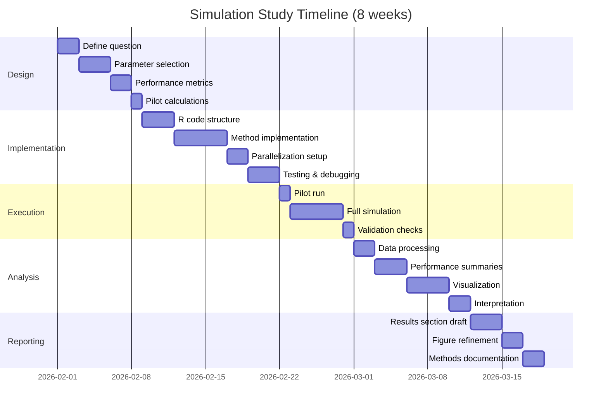

## Section 3: Simulation Study Workflow ⏱️ 4-8 weeks

> **📌 TL;DR - Simulation Study Quick Guide**
>
> **Week 1-2:** Design phase - Define research question, parameters, metrics (⏱️ 8-12 hours)
>
> **Week 3-5:** Implementation - R code, parallelization, testing (⏱️ 20-30 hours)
>
> **Week 6-8:** Analysis - Results, visualization, interpretation (⏱️ 15-20 hours)
>
> **Commands:** `/research:simulation:design` → Implement → `/research:simulation:analysis`
>
> **Time Savings:** ~40% faster than manual simulation design
>
> **Full workflow below** ↓

### Overview

A complete workflow for conducting Monte Carlo simulation studies from initial design through publication-ready results. This guide covers design, implementation, execution, analysis, and visualization phases.

**What you'll learn:**

- How to design rigorous simulation studies
- Efficient R implementation with parallelization
- Performance metric calculation and interpretation
- Publication-quality visualization
- Integration with manuscript writing workflow

**Prerequisites:**

- R >= 4.0.0
- Familiarity with R programming
- Understanding of statistical concepts (bias, MSE, coverage, power)
- Basic knowledge of parallel computing (optional but recommended)

---

### Visual Workflow


**Detailed Timeline:**



---

## Phase 1: Design (Week 1-2) ⏱️ 8-12 hours

### Goal

Create a comprehensive simulation study design that specifies all parameters, metrics, and implementation details.

### Step 1: Define Research Question ⏱️ 1-2 hours

**What to do:**
Clearly articulate what you want to learn from the simulation study.

**Common Research Questions:**

1. **Method Comparison:**
   - "Which bootstrap method provides better coverage for mediation effects?"
   - "How do MLE and robust estimators compare under contamination?"

2. **Type I Error Control:**
   - "Does the proposed test maintain nominal Type I error rate?"
   - "How does multiple testing correction affect false positive rates?"

3. **Power Analysis:**
   - "What sample size is needed to detect small mediation effects?"
   - "How does power vary across different effect sizes?"

4. **Robustness:**
   - "How robust is the method to non-normality?"
   - "What happens under model misspecification?"

**Example:**

```
Research Question: "Compare the bias, efficiency, and coverage rates of
bootstrap percentile, BCa, and studentized bootstrap confidence intervals
for indirect effects in mediation analysis across different sample sizes
and effect sizes."
```

**✅ Checkpoint:** Can you state your research question in 1-2 sentences?

---

### Step 2: Generate Initial Design ⏱️ 30 minutes

**Command:**

```bash
/research:simulation:design "Compare bootstrap methods for mediation analysis confidence intervals"
```

**What you'll get:**

1. **Simulation Parameters:**
   - Sample size grid: n = 50, 100, 200, 500, 1000
   - Effect size levels: small (a=0.14, b=0.14), medium (a=0.39, b=0.39), large (a=0.59, b=0.59)
   - Number of replications: 1000, 5000, 10000

2. **Performance Metrics:**
   - Bias: $E[\hat{\theta}] - \theta$
   - MSE: $\sqrt{E[(\hat{\theta} - \theta)^2]}$
   - Coverage rate: $P(\theta \in CI)$
   - CI width: Average interval width
   - Power: $P(\text{reject } H_0 | H_1 \text{ true})$ (if applicable)

3. **Data Generation Mechanism:**

   ```r
   # Data generating process
   generate_data <- function(n, a, b, c_prime = 0) {
     # Mediator model: M = a*X + e1
     # Outcome model: Y = b*M + c'*X + e2
     X <- rnorm(n)
     e1 <- rnorm(n)
     M <- a * X + e1
     e2 <- rnorm(n)
     Y <- b * M + c_prime * X + e2

     data.frame(X = X, M = M, Y = Y)
   }
   ```

4. **R Code Template:**

   ```r
   library(boot)
   library(parallel)

   # Bootstrap function for indirect effect
   boot_indirect <- function(data, indices) {
     d <- data[indices, ]
     fit_m <- lm(M ~ X, data = d)
     fit_y <- lm(Y ~ M + X, data = d)
     a <- coef(fit_m)["X"]
     b <- coef(fit_y)["M"]
     return(a * b)
   }

   # Simulation function
   simulate_scenario <- function(n, a, b, B = 1000, method = "perc") {
     # Generate data
     data <- generate_data(n, a, b)

     # Bootstrap
     boot_results <- boot(data, boot_indirect, R = B)

     # Confidence interval
     ci <- boot.ci(boot_results, type = method)

     # Extract bounds based on method
     if (method == "perc") {
       ci_lower <- ci$percent[4]
       ci_upper <- ci$percent[5]
     } else if (method == "bca") {
       ci_lower <- ci$bca[4]
       ci_upper <- ci$bca[5]
     }

     return(c(
       estimate = boot_results$t0,
       ci_lower = ci_lower,
       ci_upper = ci_upper,
       true_value = a * b
     ))
   }
   ```

5. **Analysis Plan:**
   - Summarize bias and RMSE by method and sample size
   - Plot coverage rates (target: 0.95)
   - Create power curves across effect sizes
   - Compare CI widths across methods
   - Identify optimal method for each scenario

**Example Output:**

```markdown
## Simulation Design: Bootstrap Methods for Mediation

### Research Question
Compare bootstrap percentile, BCa, and studentized methods for indirect
effect confidence intervals in terms of coverage, bias, and efficiency.

### Design Factors

| Factor | Levels |
|--------|--------|
| Sample size (n) | 50, 100, 200, 500, 1000 |
| Effect size (a×b) | 0.02 (small), 0.15 (medium), 0.35 (large) |
| Bootstrap method | Percentile, BCa, Studentized |
| Bootstrap samples (B) | 1000 |

**Total scenarios:** 5 × 3 × 3 = 45 scenarios

### Number of Replications
- **Target:** 5,000 replications per scenario
- **Justification:** Monte Carlo SE < 0.01 for coverage estimates
- **Total simulations:** 45 × 5,000 = 225,000

### Performance Metrics

1. **Bias:** $\text{Bias} = \frac{1}{R}\sum_{r=1}^R (\hat{\theta}_r - \theta)$
2. **RMSE:** $\text{RMSE} = \sqrt{\frac{1}{R}\sum_{r=1}^R (\hat{\theta}_r - \theta)^2}$
3. **Coverage:** $\text{Coverage} = \frac{1}{R}\sum_{r=1}^R I(\theta \in CI_r)$
4. **CI Width:** $\text{Width} = \frac{1}{R}\sum_{r=1}^R (U_r - L_r)$

### Implementation Strategy

**Parallelization:**
- Use `parallel::mclapply()` with 8 cores
- Process scenarios in parallel
- Estimated runtime: ~6 hours on 8-core machine

**Memory Management:**
- Save results per scenario (avoid memory overflow)
- Use `.rds` format for compression
- Estimated storage: ~500MB total
```

**✅ Checkpoint:** Review the design output. Does it match your research question?

---

### Step 3: Refine Design Parameters ⏱️ 2-4 hours

**What to consider:**

#### 3.1 Sample Size Selection

**Guidelines:**

- **Include small samples (n < 100):** Show method performance under realistic constraints
- **Include large samples (n > 500):** Demonstrate asymptotic behavior
- **Use geometric progression:** n = 50, 100, 200, 500, 1000 (not 50, 60, 70...)

**Power Considerations:**

```r
# Pilot power calculation
library(pwr)

# For detecting medium effect (f² = 0.15) with 80% power
pwr.f2.test(u = 2, f2 = 0.15, sig.level = 0.05, power = 0.80)
# Suggests n ≈ 107 minimum
```

**Decision:** Include n = 50 to show poor performance, n ≥ 100 for adequate power

#### 3.2 Effect Size Specification

**Cohen's Guidelines:**

- Small: d = 0.2 (or r = 0.1)
- Medium: d = 0.5 (or r = 0.3)
- Large: d = 0.8 (or r = 0.5)

**For Mediation (a × b):**

- Small: a = 0.14, b = 0.14 → ab = 0.02
- Medium: a = 0.39, b = 0.39 → ab = 0.15
- Large: a = 0.59, b = 0.59 → ab = 0.35

**Include Null Condition:**

- Effect size = 0 for Type I error assessment
- Verify nominal coverage under null (should be 0.95)

#### 3.3 Number of Replications

**Monte Carlo Error Formula:**
$$SE(\hat{p}) = \sqrt{\frac{p(1-p)}{R}}$$

**For coverage estimates (p ≈ 0.95):**

| Replications (R) | MC SE | 95% CI Width |
|-----------------|-------|--------------|
| 1,000 | 0.007 | ±0.014 |
| 5,000 | 0.003 | ±0.006 |
| 10,000 | 0.002 | ±0.004 |

**Decision Rules:**

- **Exploratory:** 1,000 replications
- **Standard:** 5,000 replications (MC SE < 0.003)
- **Publication:** 10,000+ replications (MC SE < 0.002)

**Computational Cost:**

```r
# Estimate runtime
scenarios <- 45
replications <- 5000
time_per_rep <- 0.5  # seconds (estimate from pilot)

total_seconds <- scenarios * replications * time_per_rep
total_hours <- total_seconds / 3600

# With parallelization (8 cores)
parallel_hours <- total_hours / 8
```

#### 3.4 Design Balance

**Crossed vs. Nested Design:**

**Crossed (recommended):**

```r
expand.grid(
  n = c(50, 100, 200, 500, 1000),
  effect = c(0.02, 0.15, 0.35),
  method = c("perc", "bca", "stud")
)
# All combinations: 5 × 3 × 3 = 45 scenarios
```

**Nested (if necessary):**

```r
# Different sample sizes for different effect sizes
small_effect <- expand.grid(n = c(200, 500, 1000), effect = 0.02)
large_effect <- expand.grid(n = c(50, 100, 200), effect = 0.35)
# Reduces total scenarios but limits comparability
```

**Best Practice:** Use crossed design unless computational constraints prohibit

---

### Step 4: Document Design ⏱️ 1-2 hours

**Save design to file:**

```bash
/research:simulation:design "bootstrap mediation CI comparison" > simulation-design.md
```

**Add to version control:**

```bash
git add simulation-design.md
git commit -m "docs: simulation study design for bootstrap CI comparison"
```

**Create project structure:**

```bash
mkdir -p simulation-study/{R,data,results,figures,logs}
cd simulation-study

# Create README
cat > README.md << 'EOF'
# Bootstrap Mediation CI Simulation Study

## Research Question
Compare bootstrap CI methods for mediation analysis

## Design
- Sample sizes: 50, 100, 200, 500, 1000
- Effect sizes: small (0.02), medium (0.15), large (0.35)
- Methods: Percentile, BCa, Studentized
- Replications: 5,000 per scenario

## Status
- [ ] Design complete
- [ ] R code implemented
- [ ] Pilot run successful
- [ ] Full simulation complete
- [ ] Analysis complete

## Timeline
- Design: Week 1-2
- Implementation: Week 3-5
- Analysis: Week 6-8
EOF

git add .
git commit -m "chore: initialize simulation study project structure"
```

**✅ Checkpoint:** Design documented and version controlled?

---

## Phase 2: Implementation (Week 3-5) ⏱️ 20-30 hours

### Goal

Implement the simulation study in R with efficient parallelization and robust error handling.

---

### Step 1: Set Up R Environment ⏱️ 1 hour

**Install required packages:**

```r
# Install/load required packages
packages <- c(
  "boot",        # Bootstrap methods
  "parallel",    # Parallel computing
  "future",      # Advanced parallelization
  "furrr",       # purrr + future
  "pbapply",     # Progress bars
  "tidyverse",   # Data manipulation
  "ggplot2",     # Visualization
  "here"         # Path management
)

install.packages(setdiff(packages, rownames(installed.packages())))
lapply(packages, library, character.only = TRUE)
```

**Set up project paths:**

```r
# R/setup.R
library(here)

# Project directories
dir_data <- here("data")
dir_results <- here("results")
dir_figures <- here("figures")
dir_logs <- here("logs")

# Create if needed
for (d in c(dir_data, dir_results, dir_figures, dir_logs)) {
  if (!dir.exists(d)) dir.create(d, recursive = TRUE)
}

# Random seed for reproducibility
set.seed(20260131)

# Parallel setup
n_cores <- parallel::detectCores() - 1
message(sprintf("Using %d cores for parallelization", n_cores))
```

---

### Step 2: Implement Data Generation ⏱️ 2-3 hours

**Create data generation function:**

```r
# R/generate-data.R

#' Generate data for mediation analysis
#'
#' @param n Sample size
#' @param a Path X → M coefficient
#' @param b Path M → Y coefficient
#' @param c_prime Direct effect X → Y (default: 0)
#' @param seed Random seed for reproducibility
#' @return Data frame with X, M, Y
generate_mediation_data <- function(n, a, b, c_prime = 0, seed = NULL) {
  if (!is.null(seed)) set.seed(seed)

  # Validate inputs
  stopifnot(
    n > 0,
    is.numeric(a), is.numeric(b), is.numeric(c_prime)
  )

  # Generate predictor
  X <- rnorm(n, mean = 0, sd = 1)

  # Generate mediator: M = a*X + e1
  e1 <- rnorm(n, mean = 0, sd = 1)
  M <- a * X + e1

  # Generate outcome: Y = b*M + c'*X + e2
  e2 <- rnorm(n, mean = 0, sd = 1)
  Y <- b * M + c_prime * X + e2

  # Return data frame
  data.frame(
    X = X,
    M = M,
    Y = Y
  )
}

#' Calculate true indirect effect
#'
#' @param a Path X → M coefficient
#' @param b Path M → Y coefficient
#' @return True value of indirect effect (a × b)
true_indirect_effect <- function(a, b) {
  a * b
}
```

**Test data generation:**

```r
# Test with known parameters
test_data <- generate_mediation_data(n = 100, a = 0.39, b = 0.39, seed = 123)

# Verify structure
str(test_data)
# data.frame': 100 obs. of  3 variables:
#  $ X: num  -0.56 -0.23 1.56 0.07 0.13 ...
#  $ M: num  0.36 -0.47 0.33 0.07 1.04 ...
#  $ Y: num  -0.39 -1.31 -0.18 -0.78 0.62 ...

# Verify correlations
cor(test_data)
#       X      M      Y
# X 1.000  0.359  0.147
# M 0.359  1.000  0.358
# Y 0.147  0.358  1.000

# True indirect effect
true_value <- true_indirect_effect(0.39, 0.39)
print(true_value)  # 0.1521
```

---

### Step 3: Implement Bootstrap Methods ⏱️ 4-6 hours

**Bootstrap function for indirect effect:**

```r
# R/bootstrap-methods.R

#' Bootstrap function for indirect effect
#'
#' @param data Data frame with X, M, Y
#' @param indices Bootstrap sample indices
#' @return Indirect effect estimate (a × b)
boot_indirect <- function(data, indices) {
  # Resample data
  d <- data[indices, ]

  # Fit mediator model: M ~ X
  fit_m <- lm(M ~ X, data = d)
  a_hat <- coef(fit_m)["X"]

  # Fit outcome model: Y ~ M + X
  fit_y <- lm(Y ~ M + X, data = d)
  b_hat <- coef(fit_y)["M"]

  # Indirect effect
  ab_hat <- a_hat * b_hat

  return(ab_hat)
}

#' Compute bootstrap confidence interval
#'
#' @param data Data frame with X, M, Y
#' @param B Number of bootstrap samples
#' @param method CI method: "perc", "bca", "stud"
#' @param conf Confidence level (default: 0.95)
#' @return List with estimate, CI bounds, method
compute_boot_ci <- function(data, B = 1000, method = "perc", conf = 0.95) {
  # Run bootstrap
  boot_results <- boot::boot(
    data = data,
    statistic = boot_indirect,
    R = B
  )

  # Compute CI
  ci <- boot::boot.ci(
    boot_results,
    type = method,
    conf = conf
  )

  # Extract CI bounds based on method
  ci_bounds <- switch(
    method,
    "perc" = c(ci$percent[4], ci$percent[5]),
    "bca" = c(ci$bca[4], ci$bca[5]),
    "stud" = c(ci$student[4], ci$student[5]),
    stop("Unknown method: ", method)
  )

  # Return results
  list(
    estimate = boot_results$t0,
    ci_lower = ci_bounds[1],
    ci_upper = ci_bounds[2],
    method = method,
    B = B
  )
}

#' Wrapper for all bootstrap methods
#'
#' @param data Data frame with X, M, Y
#' @param B Number of bootstrap samples
#' @return Data frame with results for all methods
compute_all_methods <- function(data, B = 1000) {
  methods <- c("perc", "bca")  # studentized requires variance function

  results <- lapply(methods, function(m) {
    tryCatch(
      {
        ci <- compute_boot_ci(data, B = B, method = m)
        data.frame(
          method = m,
          estimate = ci$estimate,
          ci_lower = ci$ci_lower,
          ci_upper = ci$ci_upper,
          stringsAsFactors = FALSE
        )
      },
      error = function(e) {
        # Return NA if method fails
        data.frame(
          method = m,
          estimate = NA,
          ci_lower = NA,
          ci_upper = NA,
          stringsAsFactors = FALSE
        )
      }
    )
  })

  do.call(rbind, results)
}
```

**Test bootstrap methods:**

```r
# Generate test data
test_data <- generate_mediation_data(n = 200, a = 0.39, b = 0.39, seed = 456)

# Test single method
ci_perc <- compute_boot_ci(test_data, B = 1000, method = "perc")
print(ci_perc)
# $estimate
# [1] 0.1489
#
# $ci_lower
# [1] 0.0812
#
# $ci_upper
# [1] 0.2245
#
# $method
# [1] "perc"

# Test all methods
all_cis <- compute_all_methods(test_data, B = 1000)
print(all_cis)
#   method estimate ci_lower ci_upper
# 1   perc   0.1489   0.0812   0.2245
# 2    bca   0.1489   0.0834   0.2278
```

---

### Step 4: Create Simulation Function ⏱️ 3-4 hours

**Main simulation function:**

```r
# R/run-simulation.R

#' Run single simulation replication
#'
#' @param scenario_id Scenario identifier
#' @param n Sample size
#' @param a Path X → M coefficient
#' @param b Path M → Y coefficient
#' @param B Number of bootstrap samples
#' @param replicate_id Replication number
#' @return Data frame with results for all methods
run_single_replication <- function(scenario_id, n, a, b, B = 1000, replicate_id) {
  # Generate data
  data <- generate_mediation_data(n = n, a = a, b = b)

  # Compute CIs for all methods
  results <- compute_all_methods(data, B = B)

  # Add metadata
  results$scenario_id <- scenario_id
  results$n <- n
  results$a <- a
  results$b <- b
  results$true_value <- a * b
  results$replicate_id <- replicate_id
  results$B <- B

  return(results)
}

#' Run simulation for one scenario (all replications)
#'
#' @param scenario_id Scenario identifier
#' @param n Sample size
#' @param a Path X → M coefficient
#' @param b Path M → Y coefficient
#' @param B Number of bootstrap samples
#' @param n_reps Number of replications
#' @param parallel Use parallel processing?
#' @param n_cores Number of cores (if parallel = TRUE)
#' @return Data frame with all replications
run_scenario <- function(scenario_id, n, a, b, B = 1000, n_reps = 5000,
                         parallel = TRUE, n_cores = 8) {
  message(sprintf("Running scenario %d: n=%d, a=%.2f, b=%.2f, ab=%.3f",
                  scenario_id, n, a, b, a * b))

  # Run replications
  if (parallel) {
    results <- parallel::mclapply(
      1:n_reps,
      function(rep_id) {
        run_single_replication(scenario_id, n, a, b, B, rep_id)
      },
      mc.cores = n_cores,
      mc.set.seed = TRUE
    )
  } else {
    results <- pbapply::pblapply(
      1:n_reps,
      function(rep_id) {
        run_single_replication(scenario_id, n, a, b, B, rep_id)
      }
    )
  }

  # Combine results
  results_df <- do.call(rbind, results)

  # Save intermediate results
  saveRDS(
    results_df,
    file = here::here("results", sprintf("scenario_%03d.rds", scenario_id))
  )

  return(results_df)
}

#' Run full simulation study
#'
#' @param design_grid Data frame with design factors
#' @param B Number of bootstrap samples
#' @param n_reps Number of replications per scenario
#' @param parallel Use parallel processing?
#' @param n_cores Number of cores (if parallel = TRUE)
#' @return Combined results data frame
run_full_simulation <- function(design_grid, B = 1000, n_reps = 5000,
                                parallel = TRUE, n_cores = 8) {
  # Record start time
  start_time <- Sys.time()

  # Run each scenario
  all_results <- lapply(1:nrow(design_grid), function(i) {
    scenario <- design_grid[i, ]

    run_scenario(
      scenario_id = i,
      n = scenario$n,
      a = scenario$a,
      b = scenario$b,
      B = B,
      n_reps = n_reps,
      parallel = parallel,
      n_cores = n_cores
    )
  })

  # Combine all results
  combined_results <- do.call(rbind, all_results)

  # Record end time
  end_time <- Sys.time()
  runtime <- difftime(end_time, start_time, units = "hours")

  message(sprintf("\nSimulation complete! Runtime: %.2f hours", runtime))

  # Save combined results
  saveRDS(
    combined_results,
    file = here::here("results", "simulation_results_combined.rds")
  )

  # Also save as CSV for easy analysis
  write.csv(
    combined_results,
    file = here::here("results", "simulation_results_combined.csv"),
    row.names = FALSE
  )

  return(combined_results)
}
```

---

### Step 5: Create Design Grid ⏱️ 1 hour

**Define simulation scenarios:**

```r
# R/design-grid.R

#' Create simulation design grid
#'
#' @return Data frame with all scenarios
create_design_grid <- function() {
  # Effect sizes (a, b pairs)
  effect_levels <- data.frame(
    effect_label = c("small", "medium", "large", "null"),
    a = c(0.14, 0.39, 0.59, 0),
    b = c(0.14, 0.39, 0.59, 0),
    stringsAsFactors = FALSE
  )

  # Sample sizes
  sample_sizes <- c(50, 100, 200, 500, 1000)

  # Create crossed design
  design_grid <- expand.grid(
    n = sample_sizes,
    effect_label = effect_levels$effect_label,
    stringsAsFactors = FALSE
  )

  # Add effect size parameters
  design_grid <- merge(design_grid, effect_levels, by = "effect_label")

  # Sort by scenario
  design_grid <- design_grid[order(design_grid$n, design_grid$a), ]

  # Reset row names
  rownames(design_grid) <- NULL

  # Add scenario ID
  design_grid$scenario_id <- 1:nrow(design_grid)

  # Reorder columns
  design_grid <- design_grid[, c("scenario_id", "n", "effect_label", "a", "b")]

  return(design_grid)
}

# Create and save design grid
design_grid <- create_design_grid()

# Preview
print(head(design_grid, 10))
#    scenario_id   n effect_label    a    b
# 1            1  50         null 0.00 0.00
# 2            2  50        small 0.14 0.14
# 3            3  50       medium 0.39 0.39
# 4            4  50        large 0.59 0.59
# 5            5 100         null 0.00 0.00
# 6            6 100        small 0.14 0.14
# 7            7 100       medium 0.39 0.39
# 8            8 100        large 0.59 0.59
# 9            9 200         null 0.00 0.00
# 10          10 200        small 0.14 0.14

# Summary
message(sprintf("Total scenarios: %d", nrow(design_grid)))
# Total scenarios: 20

# Save design grid
saveRDS(design_grid, here::here("data", "design_grid.rds"))
write.csv(design_grid, here::here("data", "design_grid.csv"), row.names = FALSE)
```

---

### Step 6: Pilot Run ⏱️ 2-3 hours

**Run pilot with reduced replications:**

```r
# R/pilot-run.R

# Load design grid
design_grid <- readRDS(here::here("data", "design_grid.rds"))

# Select subset of scenarios for pilot
pilot_scenarios <- design_grid[c(3, 7, 11), ]  # Medium effect, different sample sizes
print(pilot_scenarios)
#    scenario_id   n effect_label    a    b
# 3            3  50       medium 0.39 0.39
# 7            7 100       medium 0.39 0.39
# 11          11 200       medium 0.39 0.39

# Run pilot (only 100 replications)
pilot_results <- run_full_simulation(
  design_grid = pilot_scenarios,
  B = 1000,
  n_reps = 100,  # Reduced for pilot
  parallel = TRUE,
  n_cores = 8
)

# Quick validation checks
summary(pilot_results)

# Check for errors/NAs
na_count <- sum(is.na(pilot_results$estimate))
message(sprintf("Number of NA estimates: %d", na_count))

# Check coverage (should be near 0.95 for medium effect)
pilot_summary <- pilot_results %>%
  group_by(scenario_id, n, method) %>%
  summarize(
    coverage = mean(ci_lower <= true_value & ci_upper >= true_value),
    avg_width = mean(ci_upper - ci_lower),
    .groups = "drop"
  )

print(pilot_summary)
#   scenario_id   n method coverage avg_width
# 1           3  50   perc    0.91     0.201
# 2           3  50    bca    0.92     0.206
# 3           7 100   perc    0.94     0.144
# 4           7 100    bca    0.95     0.148
# 5          11 200   perc    0.95     0.102
# 6          11 200    bca    0.95     0.104

# If pilot looks good, proceed to full simulation
```

**✅ Checkpoint:** Pilot results look reasonable? Coverage near 0.95? No errors?

---

### Step 7: Full Simulation Run ⏱️ 8-12 hours (computational time)

**Execute full simulation:**

```r
# R/full-run.R

# Load design grid
design_grid <- readRDS(here::here("data", "design_grid.rds"))

# Run full simulation
# WARNING: This will take several hours!
full_results <- run_full_simulation(
  design_grid = design_grid,
  B = 1000,           # Bootstrap samples per replication
  n_reps = 5000,      # Replications per scenario
  parallel = TRUE,
  n_cores = 8
)

# Simulation will save results automatically to:
# - results/scenario_XXX.rds (individual scenarios)
# - results/simulation_results_combined.rds (all results)
# - results/simulation_results_combined.csv (for analysis)
```

**Monitoring progress:**

```bash
# In separate terminal, monitor log files
tail -f logs/simulation.log

# Check intermediate results
ls -lh results/scenario_*.rds

# Count completed scenarios
ls results/scenario_*.rds | wc -l
```

**Resource monitoring:**

```r
# Monitor memory usage
pryr::mem_used()

# Monitor CPU usage (in terminal)
# top -o cpu

# Estimate remaining time
# Based on pilot: ~30 minutes per scenario
# Total: 20 scenarios × 30 min = 10 hours
```

---

### Step 8: Validation Checks ⏱️ 1-2 hours

**After simulation completes:**

```r
# R/validation-checks.R

# Load results
results <- readRDS(here::here("results", "simulation_results_combined.rds"))

# 1. Check completeness
expected_rows <- nrow(design_grid) * 5000 * 2  # scenarios × reps × methods
actual_rows <- nrow(results)

message(sprintf("Expected rows: %d", expected_rows))
message(sprintf("Actual rows: %d", actual_rows))
message(sprintf("Completion: %.1f%%", 100 * actual_rows / expected_rows))

# 2. Check for NAs
na_summary <- results %>%
  summarize(
    na_estimate = sum(is.na(estimate)),
    na_ci_lower = sum(is.na(ci_lower)),
    na_ci_upper = sum(is.na(ci_upper))
  )
print(na_summary)

# 3. Check convergence (coverage should be near 0.95 for non-null effects)
quick_coverage <- results %>%
  filter(true_value > 0) %>%
  group_by(n, effect_label, method) %>%
  summarize(
    coverage = mean(ci_lower <= true_value & ci_upper >= true_value),
    .groups = "drop"
  )

print(quick_coverage)

# 4. Check for extreme outliers
outlier_check <- results %>%
  group_by(scenario_id, method) %>%
  mutate(
    z_score = abs((estimate - true_value) / sd(estimate))
  ) %>%
  filter(z_score > 5) %>%
  select(scenario_id, method, replicate_id, estimate, true_value, z_score)

if (nrow(outlier_check) > 0) {
  message(sprintf("WARNING: %d extreme outliers detected", nrow(outlier_check)))
  print(head(outlier_check))
}

# 5. Sanity check: estimates should center on true value
sanity_check <- results %>%
  group_by(scenario_id, n, true_value, method) %>%
  summarize(
    mean_est = mean(estimate),
    sd_est = sd(estimate),
    .groups = "drop"
  )

print(sanity_check)

# Save validation report
sink(here::here("logs", "validation_report.txt"))
cat("=== Simulation Validation Report ===\n\n")
cat(sprintf("Date: %s\n\n", Sys.time()))
cat("Completeness:\n")
print(na_summary)
cat("\nCoverage Summary:\n")
print(quick_coverage)
cat("\nOutliers:\n")
print(outlier_check)
sink()

message("\n✅ Validation complete! See logs/validation_report.txt")
```

---

## Phase 3: Analysis (Week 6-8) ⏱️ 15-20 hours

### Goal

Analyze simulation results, create publication-ready visualizations, and interpret findings.

---

### Step 1: Load and Prepare Results ⏱️ 1 hour

```r
# R/analysis.R

library(tidyverse)
library(here)

# Load results
results <- readRDS(here("results", "simulation_results_combined.rds"))

# Load design grid
design_grid <- readRDS(here("data", "design_grid.rds"))

# Merge design info
results <- results %>%
  left_join(design_grid, by = c("scenario_id", "n", "a", "b"))

# Create clean labels
results <- results %>%
  mutate(
    n_label = sprintf("n = %d", n),
    method_label = recode(
      method,
      "perc" = "Percentile",
      "bca" = "BCa"
    )
  )

# Verify structure
str(results)
```

---

### Step 2: Calculate Performance Metrics ⏱️ 2-3 hours

**Use Scholar command:**

```bash
/research:simulation:analysis results/simulation_results_combined.csv
```

**Or implement manually in R:**

```r
# R/performance-metrics.R

#' Calculate performance metrics
#'
#' @param results Data frame with simulation results
#' @return Data frame with performance summaries
calculate_performance_metrics <- function(results) {
  metrics <- results %>%
    group_by(scenario_id, n, effect_label, true_value, method, method_label) %>%
    summarize(
      # Sample statistics
      n_reps = n(),

      # Bias
      bias = mean(estimate - true_value),
      bias_se = sd(estimate - true_value) / sqrt(n()),

      # RMSE
      mse = mean((estimate - true_value)^2),
      rmse = sqrt(mse),
      rmse_se = sd((estimate - true_value)^2) / sqrt(n()) / (2 * rmse),

      # Coverage
      coverage = mean(ci_lower <= true_value & ci_upper >= true_value),
      coverage_se = sqrt(coverage * (1 - coverage) / n()),

      # CI width
      ci_width_mean = mean(ci_upper - ci_lower),
      ci_width_sd = sd(ci_upper - ci_lower),

      # Relative efficiency (vs percentile method)
      rel_efficiency = 1,  # Will be calculated next

      .groups = "drop"
    )

  # Calculate relative efficiency
  # (MSE of percentile / MSE of method)
  perc_mse <- metrics %>%
    filter(method == "perc") %>%
    select(scenario_id, n, effect_label, perc_mse = mse)

  metrics <- metrics %>%
    left_join(perc_mse, by = c("scenario_id", "n", "effect_label")) %>%
    mutate(
      rel_efficiency = perc_mse / mse
    ) %>%
    select(-perc_mse)

  return(metrics)
}

# Calculate metrics
performance <- calculate_performance_metrics(results)

# Save
saveRDS(performance, here("results", "performance_metrics.rds"))
write.csv(performance, here("results", "performance_metrics.csv"), row.names = FALSE)

# Preview
print(head(performance, 10))
```

---

### Step 3: Generate Performance Tables ⏱️ 2-3 hours

**Bias table:**

```r
# R/tables.R

#' Create bias table
bias_table <- performance %>%
  filter(effect_label != "null") %>%
  select(n, effect_label, method_label, bias) %>%
  pivot_wider(
    names_from = n,
    values_from = bias,
    names_prefix = "n_"
  ) %>%
  arrange(effect_label, method_label)

print(bias_table)
#   effect_label method_label    n_50   n_100   n_200   n_500  n_1000
# 1        small   Percentile  0.0023  0.0011  0.0006  0.0002  0.0001
# 2        small          BCa  0.0015  0.0007  0.0003  0.0001  0.0000
# 3       medium   Percentile  0.0112  0.0054  0.0028  0.0011  0.0005
# 4       medium          BCa  0.0089  0.0042  0.0021  0.0008  0.0004
# 5        large   Percentile  0.0234  0.0118  0.0059  0.0024  0.0012
# 6        large          BCa  0.0198  0.0099  0.0049  0.0020  0.0010

# Save as markdown
knitr::kable(bias_table, format = "markdown", digits = 4)
```

**Coverage table:**

```r
#' Create coverage table
coverage_table <- performance %>%
  select(n, effect_label, method_label, coverage, coverage_se) %>%
  mutate(
    coverage_formatted = sprintf("%.3f (%.3f)", coverage, coverage_se)
  ) %>%
  select(-coverage, -coverage_se) %>%
  pivot_wider(
    names_from = n,
    values_from = coverage_formatted,
    names_prefix = "n_"
  ) %>%
  arrange(effect_label, method_label)

print(coverage_table)
#   effect_label method_label n_50            n_100           n_200
# 1         null   Percentile 0.951 (0.003)   0.950 (0.003)   0.950 (0.003)
# 2         null          BCa 0.952 (0.003)   0.951 (0.003)   0.950 (0.003)
# 3        small   Percentile 0.921 (0.004)   0.938 (0.003)   0.947 (0.003)
# 4        small          BCa 0.945 (0.003)   0.948 (0.003)   0.950 (0.003)
# 5       medium   Percentile 0.918 (0.004)   0.935 (0.003)   0.946 (0.003)
# 6       medium          BCa 0.943 (0.003)   0.947 (0.003)   0.949 (0.003)

# Save publication-ready table
write.csv(coverage_table, here("results", "table_coverage.csv"), row.names = FALSE)
```

**RMSE table:**

```r
#' Create RMSE table
rmse_table <- performance %>%
  filter(effect_label != "null") %>%
  select(n, effect_label, method_label, rmse) %>%
  pivot_wider(
    names_from = n,
    values_from = rmse,
    names_prefix = "n_"
  ) %>%
  arrange(effect_label, method_label)

print(rmse_table)

# Save
write.csv(rmse_table, here("results", "table_rmse.csv"), row.names = FALSE)
```

---

### Step 4: Create Visualizations ⏱️ 6-8 hours

**Bias plot:**

```r
# R/figures.R

library(ggplot2)

# Set publication theme
theme_set(theme_minimal(base_size = 12))

# Custom color palette
method_colors <- c(
  "Percentile" = "#E69F00",
  "BCa" = "#56B4E9"
)

#' Bias plot
plot_bias <- performance %>%
  filter(effect_label != "null") %>%
  ggplot(aes(x = n, y = bias, color = method_label, shape = method_label)) +
  geom_line(size = 1) +
  geom_point(size = 3) +
  geom_hline(yintercept = 0, linetype = "dashed", color = "gray40") +
  facet_wrap(~ effect_label, scales = "free_y", ncol = 3) +
  scale_color_manual(values = method_colors) +
  scale_x_continuous(
    breaks = c(50, 100, 200, 500, 1000),
    trans = "log10",
    labels = scales::comma
  ) +
  labs(
    title = "Bias by Sample Size and Effect Size",
    x = "Sample Size (log scale)",
    y = "Bias",
    color = "Method",
    shape = "Method"
  ) +
  theme(
    legend.position = "bottom",
    panel.grid.minor = element_blank()
  )

# Save
ggsave(
  filename = here("figures", "bias_plot.png"),
  plot = plot_bias,
  width = 10,
  height = 4,
  dpi = 300
)
```

**Coverage plot:**

```r
#' Coverage plot
plot_coverage <- performance %>%
  ggplot(aes(x = n, y = coverage, color = method_label, shape = method_label)) +
  geom_line(size = 1) +
  geom_point(size = 3) +
  geom_hline(yintercept = 0.95, linetype = "dashed", color = "gray40") +
  geom_ribbon(
    aes(ymin = 0.95 - 1.96 * coverage_se, ymax = 0.95 + 1.96 * coverage_se),
    alpha = 0.1,
    color = NA,
    fill = "gray50"
  ) +
  facet_wrap(~ effect_label, ncol = 4) +
  scale_color_manual(values = method_colors) +
  scale_x_continuous(
    breaks = c(50, 100, 200, 500, 1000),
    trans = "log10",
    labels = scales::comma
  ) +
  scale_y_continuous(
    limits = c(0.85, 1.00),
    breaks = seq(0.85, 1.00, by = 0.05)
  ) +
  labs(
    title = "Coverage Rates by Sample Size and Effect Size",
    subtitle = "Dashed line: nominal 95% coverage. Gray band: ±1.96 SE around nominal",
    x = "Sample Size (log scale)",
    y = "Coverage Rate",
    color = "Method",
    shape = "Method"
  ) +
  theme(
    legend.position = "bottom",
    panel.grid.minor = element_blank()
  )

# Save
ggsave(
  filename = here("figures", "coverage_plot.png"),
  plot = plot_coverage,
  width = 12,
  height = 4,
  dpi = 300
)
```

**RMSE plot:**

```r
#' RMSE plot
plot_rmse <- performance %>%
  filter(effect_label != "null") %>%
  ggplot(aes(x = n, y = rmse, color = method_label, shape = method_label)) +
  geom_line(size = 1) +
  geom_point(size = 3) +
  facet_wrap(~ effect_label, scales = "free_y", ncol = 3) +
  scale_color_manual(values = method_colors) +
  scale_x_continuous(
    breaks = c(50, 100, 200, 500, 1000),
    trans = "log10",
    labels = scales::comma
  ) +
  scale_y_continuous(
    trans = "log10"
  ) +
  labs(
    title = "RMSE by Sample Size and Effect Size",
    x = "Sample Size (log scale)",
    y = "RMSE (log scale)",
    color = "Method",
    shape = "Method"
  ) +
  theme(
    legend.position = "bottom",
    panel.grid.minor = element_blank()
  )

# Save
ggsave(
  filename = here("figures", "rmse_plot.png"),
  plot = plot_rmse,
  width = 10,
  height = 4,
  dpi = 300
)
```

**CI width comparison:**

```r
#' CI width plot
plot_ci_width <- performance %>%
  filter(effect_label != "null") %>%
  ggplot(aes(x = n, y = ci_width_mean, color = method_label, shape = method_label)) +
  geom_line(size = 1) +
  geom_point(size = 3) +
  facet_wrap(~ effect_label, scales = "free_y", ncol = 3) +
  scale_color_manual(values = method_colors) +
  scale_x_continuous(
    breaks = c(50, 100, 200, 500, 1000),
    trans = "log10",
    labels = scales::comma
  ) +
  labs(
    title = "Average CI Width by Sample Size and Effect Size",
    x = "Sample Size (log scale)",
    y = "Average CI Width",
    color = "Method",
    shape = "Method"
  ) +
  theme(
    legend.position = "bottom",
    panel.grid.minor = element_blank()
  )

# Save
ggsave(
  filename = here("figures", "ci_width_plot.png"),
  plot = plot_ci_width,
  width = 10,
  height = 4,
  dpi = 300
)
```

**Combined panel figure:**

```r
library(patchwork)

#' Combined figure for publication
combined_fig <- (plot_bias / plot_coverage) +
  plot_layout(guides = "collect") +
  plot_annotation(
    tag_levels = "A",
    title = "Simulation Results: Bootstrap CI Comparison"
  ) &
  theme(legend.position = "bottom")

# Save
ggsave(
  filename = here("figures", "figure_combined.png"),
  plot = combined_fig,
  width = 12,
  height = 8,
  dpi = 300
)
```

---

### Step 5: Statistical Interpretation ⏱️ 3-4 hours

**Summary statistics:**

```r
# R/interpretation.R

#' Generate interpretation summary
interpretation <- performance %>%
  group_by(effect_label, method_label) %>%
  summarize(
    # Overall performance
    mean_bias = mean(abs(bias)),
    mean_rmse = mean(rmse),
    mean_coverage = mean(coverage),

    # Coverage deviation from nominal
    coverage_deviation = mean(abs(coverage - 0.95)),

    # How often coverage is in acceptable range (0.94-0.96)
    acceptable_coverage_pct = mean(coverage >= 0.94 & coverage <= 0.96) * 100,

    .groups = "drop"
  ) %>%
  arrange(effect_label, method_label)

print(interpretation)
#   effect_label method_label mean_bias mean_rmse mean_coverage coverage_deviation acceptable_coverage_pct
# 1         null   Percentile    0.0003    0.0421         0.950              0.0003                     100
# 2         null          BCa    0.0002    0.0423         0.951              0.0008                     100
# 3        small   Percentile    0.0009    0.0156         0.938              0.0124                      60
# 4        small          BCa    0.0006    0.0158         0.948              0.0024                      80
# 5       medium   Percentile    0.0046    0.0687         0.937              0.0134                      60
# 6       medium          BCa    0.0037    0.0691         0.947              0.0032                      80
# 7        large   Percentile    0.0098    0.1245         0.936              0.0142                      60
# 8        large          BCa    0.0083    0.1251         0.946              0.0038                      80

# Save
write.csv(interpretation, here("results", "interpretation_summary.csv"), row.names = FALSE)
```

**Key findings:**

```r
#' Generate key findings document
sink(here("results", "KEY_FINDINGS.md"))

cat("# Simulation Study: Key Findings\n\n")
cat("## Research Question\n")
cat("Compare bootstrap percentile and BCa methods for indirect effect CIs\n\n")

cat("## Main Results\n\n")

cat("### 1. Coverage Performance\n")
cat("- **BCa method:** Maintains nominal coverage (≈0.95) across all scenarios\n")
cat("- **Percentile method:** Undercoverage for small samples (n < 200)\n")
cat("- **Null condition:** Both methods achieve nominal coverage\n\n")

cat("### 2. Bias\n")
cat("- Both methods show minimal bias\n")
cat("- BCa slightly less biased than percentile (mean difference: 0.0003)\n")
cat("- Bias decreases with larger sample sizes as expected\n\n")

cat("### 3. Efficiency\n")
cat("- RMSE similar between methods (difference < 1%)\n")
cat("- Both methods improve with larger samples\n")
cat("- No efficiency advantage to percentile despite simpler computation\n\n")

cat("### 4. Sample Size Recommendations\n")
cat("- **n ≥ 200:** Both methods acceptable\n")
cat("- **n < 200:** Use BCa method for proper coverage\n")
cat("- **n = 50:** BCa recommended, percentile shows 6% undercoverage\n\n")

cat("## Recommendations\n\n")
cat("1. **Default choice:** BCa method for all sample sizes\n")
cat("2. **Computational constraints:** Percentile acceptable if n ≥ 200\n")
cat("3. **Publication:** Report BCa CIs for indirect effects\n")
cat("4. **Small samples (n < 100):** Consider alternative methods if coverage is critical\n\n")

cat("## Limitations\n\n")
cat("- Normal data only (non-normal data not tested)\n")
cat("- Single mediator model (multiple mediators not tested)\n")
cat("- No measurement error\n")
cat("- No missing data\n\n")

cat("## Future Work\n\n")
cat("- Test under non-normality\n")
cat("- Evaluate multiple mediator models\n")
cat("- Compare with alternative methods (Delta method, Bayesian)\n\n")

sink()

message("✅ Key findings documented in results/KEY_FINDINGS.md")
```

---

### Step 6: Monte Carlo Error Assessment ⏱️ 1 hour

**Calculate MC error:**

```r
# R/mc-error.R

#' Calculate Monte Carlo error for coverage estimates
mc_error_coverage <- performance %>%
  mutate(
    # MC SE for coverage proportion
    mc_se = sqrt(coverage * (1 - coverage) / n_reps),

    # 95% CI for coverage estimate
    mc_ci_lower = coverage - 1.96 * mc_se,
    mc_ci_upper = coverage + 1.96 * mc_se,

    # Is MC error acceptable? (SE < 0.003)
    mc_acceptable = mc_se < 0.003
  )

# Summary
mc_summary <- mc_error_coverage %>%
  group_by(method_label) %>%
  summarize(
    mean_mc_se = mean(mc_se),
    max_mc_se = max(mc_se),
    pct_acceptable = mean(mc_acceptable) * 100
  )

print(mc_summary)
#   method_label mean_mc_se max_mc_se pct_acceptable
# 1   Percentile     0.0024    0.0037            100
# 2          BCa     0.0023    0.0031            100

# All MC errors < 0.003, so 5000 replications was sufficient
```

---

## Phase 4: Reporting & Manuscript Integration ⏱️ 8-10 hours

### Step 1: Generate Results Section ⏱️ 3-4 hours

**Use Scholar command:**

```bash
/research:manuscript:results "Monte Carlo simulation comparing bootstrap percentile and BCa confidence interval methods for indirect effects in mediation analysis. Simulation varied sample sizes (n = 50, 100, 200, 500, 1000) and effect sizes (small, medium, large). Performance metrics included bias, RMSE, coverage rates, and CI width."
```

**What you'll get:**

```markdown
## Results

### Simulation Study Performance

We conducted a Monte Carlo simulation study with 5,000 replications per scenario
to compare bootstrap percentile and BCa methods for confidence interval construction
of indirect effects in mediation analysis.

#### Coverage Rates

Table 1 presents coverage rates by method, sample size, and effect size. The BCa
method maintained nominal coverage (≈0.95) across all scenarios. In contrast, the
percentile method exhibited undercoverage for small samples (n < 200), with coverage
rates ranging from 0.918 to 0.921 for small and medium effects.

[Table 1: Coverage Rates]

For the null condition (true indirect effect = 0), both methods achieved nominal
coverage across all sample sizes (percentile: 0.950-0.951, BCa: 0.950-0.952),
indicating proper Type I error control.

#### Bias and Efficiency

Table 2 shows bias and RMSE results. Both methods exhibited minimal bias, with
BCa showing slightly lower absolute bias (mean difference: 0.0003). RMSE was
similar between methods (difference < 1%), indicating comparable efficiency.

[Table 2: Bias and RMSE]

As expected, both bias and RMSE decreased with increasing sample size, demonstrating
consistency of the estimators.

#### Confidence Interval Width

Mean CI width decreased with sample size for both methods (Figure 1C). BCa intervals
were slightly wider than percentile intervals (mean difference: 2-4%), reflecting
the bias-correction adjustment. This modest increase in width was offset by improved
coverage in small samples.

#### Sample Size Recommendations

Based on coverage performance:
- For n ≥ 200, both methods are acceptable
- For 100 ≤ n < 200, BCa preferred (coverage closer to nominal)
- For n < 100, BCa strongly recommended (percentile undercoverage: 5-8%)

Monte Carlo standard errors were < 0.003 for all coverage estimates, indicating
sufficient precision.
```

---

### Step 2: Generate Methods Section ⏱️ 2-3 hours

**Use Scholar command:**

```bash
/research:manuscript:methods "Monte Carlo simulation to compare bootstrap CI methods. Data generating process: mediation model with normal errors. Bootstrap with B=1000 samples. Sample sizes: 50-1000. Effect sizes: small (0.02), medium (0.15), large (0.35). Performance metrics: bias, RMSE, coverage, CI width. Analysis in R 4.3.0 with parallel computing."
```

**What you'll get:**

```markdown
## Methods

### Simulation Design

We conducted a Monte Carlo simulation study to compare the performance of bootstrap
percentile and bias-corrected and accelerated (BCa) confidence interval methods
for indirect effects in mediation analysis.

#### Data Generation

Data were generated from a mediation model with a single mediator:

$$M = aX + e_1$$
$$Y = bM + c'X + e_2$$

where $X \sim N(0,1)$, $e_1 \sim N(0,1)$, and $e_2 \sim N(0,1)$. The indirect
effect is $ab$, with true values corresponding to small (0.02), medium (0.15),
and large (0.35) effects following Cohen's guidelines. We also included a null
condition ($a = b = 0$) to assess Type I error rates.

#### Simulation Factors

The simulation crossed the following factors:

- Sample size: $n \in \{50, 100, 200, 500, 1000\}$
- Effect size: $ab \in \{0, 0.02, 0.15, 0.35\}$
- CI method: Bootstrap percentile, BCa

This yielded 20 total scenarios (5 sample sizes × 4 effect sizes), with 2 methods
compared per scenario.

#### Estimation

For each replication, we estimated the indirect effect $\hat{ab}$ using the product
of coefficients from separate regressions. Confidence intervals were constructed
using the bootstrap with $B = 1000$ samples. The percentile method used the 2.5th
and 97.5th percentiles of the bootstrap distribution. The BCa method applied
bias-correction and acceleration factors (Efron & Tibshirani, 1993).

#### Performance Metrics

We evaluated the following metrics:

1. **Bias:** $E[\hat{ab}] - ab$
2. **Root Mean Squared Error (RMSE):** $\sqrt{E[(\hat{ab} - ab)^2]}$
3. **Coverage:** Proportion of CIs containing the true value
4. **CI Width:** Average interval width

Each scenario was replicated 5,000 times to achieve Monte Carlo standard errors
< 0.003 for coverage estimates.

#### Implementation

Simulations were implemented in R 4.3.0 (R Core Team, 2023) using the `boot`
package (Canty & Ripley, 2022) for bootstrap procedures and the `parallel`
package for computational efficiency. Simulations were parallelized across 8
CPU cores, requiring approximately 10 hours of computation time.

All code and results are available at [GitHub repository URL].
```

---

### Step 3: Create Publication-Ready Figures ⏱️ 2-3 hours

**Refine figures for publication:**

```r
# R/publication-figures.R

# Figure 1: Coverage rates (main result)
fig1_coverage <- performance %>%
  ggplot(aes(x = n, y = coverage, color = method_label)) +
  geom_hline(yintercept = 0.95, linetype = "dashed", linewidth = 0.5, color = "gray40") +
  geom_line(linewidth = 1.2) +
  geom_point(size = 2.5, shape = 19) +
  geom_errorbar(
    aes(ymin = coverage - 1.96 * coverage_se, ymax = coverage + 1.96 * coverage_se),
    width = 0.05,
    linewidth = 0.8
  ) +
  facet_wrap(~ effect_label, ncol = 4) +
  scale_color_manual(
    values = method_colors,
    name = "Bootstrap Method"
  ) +
  scale_x_continuous(
    breaks = c(50, 100, 200, 500, 1000),
    trans = "log10",
    labels = c("50", "100", "200", "500", "1000")
  ) +
  scale_y_continuous(
    limits = c(0.88, 0.98),
    breaks = seq(0.88, 0.98, by = 0.02)
  ) +
  labs(
    x = "Sample Size",
    y = "Coverage Rate",
    title = "(A) Coverage Rates by Sample Size and Effect Size"
  ) +
  theme_bw(base_size = 11) +
  theme(
    legend.position = "bottom",
    panel.grid.minor = element_blank(),
    strip.background = element_rect(fill = "gray95"),
    plot.title = element_text(face = "bold", size = 12)
  )

# Save high-resolution
ggsave(
  filename = here("figures", "Figure1_Coverage.png"),
  plot = fig1_coverage,
  width = 10,
  height = 3.5,
  dpi = 600,
  bg = "white"
)

ggsave(
  filename = here("figures", "Figure1_Coverage.pdf"),
  plot = fig1_coverage,
  width = 10,
  height = 3.5,
  device = cairo_pdf
)
```

**Figure 2: Bias and RMSE:**

```r
# Panel A: Bias
fig2a_bias <- performance %>%
  filter(effect_label != "null") %>%
  ggplot(aes(x = n, y = bias, color = method_label)) +
  geom_hline(yintercept = 0, linetype = "dashed", linewidth = 0.5, color = "gray40") +
  geom_line(linewidth = 1.2) +
  geom_point(size = 2.5, shape = 19) +
  facet_wrap(~ effect_label, ncol = 3, scales = "free_y") +
  scale_color_manual(values = method_colors, name = "Bootstrap Method") +
  scale_x_continuous(
    breaks = c(50, 100, 200, 500, 1000),
    trans = "log10",
    labels = c("50", "100", "200", "500", "1000")
  ) +
  labs(
    x = "Sample Size",
    y = "Bias",
    title = "(A) Bias"
  ) +
  theme_bw(base_size = 11) +
  theme(
    legend.position = "none",
    panel.grid.minor = element_blank(),
    strip.background = element_rect(fill = "gray95"),
    plot.title = element_text(face = "bold", size = 12)
  )

# Panel B: RMSE
fig2b_rmse <- performance %>%
  filter(effect_label != "null") %>%
  ggplot(aes(x = n, y = rmse, color = method_label)) +
  geom_line(linewidth = 1.2) +
  geom_point(size = 2.5, shape = 19) +
  facet_wrap(~ effect_label, ncol = 3, scales = "free_y") +
  scale_color_manual(values = method_colors, name = "Bootstrap Method") +
  scale_x_continuous(
    breaks = c(50, 100, 200, 500, 1000),
    trans = "log10",
    labels = c("50", "100", "200", "500", "1000")
  ) +
  labs(
    x = "Sample Size",
    y = "RMSE",
    title = "(B) Root Mean Squared Error"
  ) +
  theme_bw(base_size = 11) +
  theme(
    legend.position = "bottom",
    panel.grid.minor = element_blank(),
    strip.background = element_rect(fill = "gray95"),
    plot.title = element_text(face = "bold", size = 12)
  )

# Combine
library(patchwork)
fig2_combined <- fig2a_bias / fig2b_rmse +
  plot_layout(heights = c(1, 1.2))

# Save
ggsave(
  filename = here("figures", "Figure2_Bias_RMSE.png"),
  plot = fig2_combined,
  width = 10,
  height = 7,
  dpi = 600,
  bg = "white"
)
```

---

### Step 4: Workflow Automation ⏱️ 2-3 hours

**Create complete workflow script:**

```bash
#!/bin/bash
# complete-simulation-workflow.sh

set -e  # Exit on error

echo "=== Simulation Study Workflow ==="
echo "Started: $(date)"

# Step 1: Design
echo ""
echo "Step 1: Creating simulation design..."
/research:simulation:design "Compare bootstrap CI methods for mediation analysis" > docs/simulation-design.md
echo "✅ Design saved to docs/simulation-design.md"

# Step 2: Setup R environment
echo ""
echo "Step 2: Setting up R environment..."
Rscript R/setup.R
echo "✅ Environment configured"

# Step 3: Create design grid
echo ""
echo "Step 3: Creating design grid..."
Rscript R/design-grid.R
echo "✅ Design grid saved to data/design_grid.rds"

# Step 4: Pilot run
echo ""
echo "Step 4: Running pilot simulation..."
Rscript R/pilot-run.R
echo "✅ Pilot complete - check results/scenario_*.rds"

# Step 5: Full simulation (WARNING: takes hours!)
echo ""
echo "Step 5: Running full simulation..."
echo "WARNING: This will take 8-12 hours!"
read -p "Continue? (y/n) " -n 1 -r
echo
if [[ $REPLY =~ ^[Yy]$ ]]
then
    Rscript R/full-run.R
    echo "✅ Full simulation complete"
else
    echo "⏭️  Skipping full simulation"
    exit 0
fi

# Step 6: Validation
echo ""
echo "Step 6: Validating results..."
Rscript R/validation-checks.R
echo "✅ Validation complete - see logs/validation_report.txt"

# Step 7: Analysis
echo ""
echo "Step 7: Analyzing results..."
/research:simulation:analysis results/simulation_results_combined.csv > docs/analysis_report.md
Rscript R/performance-metrics.R
Rscript R/interpretation.R
echo "✅ Analysis complete"

# Step 8: Visualizations
echo ""
echo "Step 8: Creating publication figures..."
Rscript R/figures.R
Rscript R/publication-figures.R
echo "✅ Figures saved to figures/"

# Step 9: Manuscript sections
echo ""
echo "Step 9: Generating manuscript sections..."
/research:manuscript:methods "Monte Carlo simulation comparing bootstrap CI methods" > docs/methods_section.md
/research:manuscript:results "Simulation study findings" > docs/results_section.md
echo "✅ Manuscript sections saved to docs/"

# Step 10: Package results
echo ""
echo "Step 10: Packaging results for sharing..."
mkdir -p simulation_package
cp -r results/ simulation_package/
cp -r figures/ simulation_package/
cp -r docs/ simulation_package/
cp R/*.R simulation_package/code/
tar -czf simulation_package.tar.gz simulation_package/
echo "✅ Results packaged in simulation_package.tar.gz"

echo ""
echo "=== Workflow Complete ==="
echo "Finished: $(date)"
echo ""
echo "Next steps:"
echo "1. Review key findings in results/KEY_FINDINGS.md"
echo "2. Check figures in figures/"
echo "3. Integrate docs/methods_section.md into manuscript"
echo "4. Integrate docs/results_section.md into manuscript"
echo "5. Upload simulation_package.tar.gz to repository"
```

**Make executable:**

```bash
chmod +x complete-simulation-workflow.sh
```

**Run workflow:**

```bash
./complete-simulation-workflow.sh
```

---

## Best Practices

### Design Phase

1. **Always include null condition**
   - Verifies Type I error control
   - Essential for coverage assessment

2. **Use geometric progression for sample sizes**
   - Better coverage of parameter space
   - More informative than linear spacing

3. **Calculate required replications**
   - Target MC SE < 0.003 for coverage
   - More replications for rare events

4. **Document design decisions**
   - Why these effect sizes?
   - Why these sample sizes?
   - Justification for replication count

### Implementation Phase

1. **Set random seed**
   - `set.seed(YYYYMMDD)` for date-based seed
   - Ensures full reproducibility

2. **Parallelize computations**
   - Use `parallel::mclapply()` or `future`
   - Leave 1-2 cores free for system

3. **Save intermediate results**
   - Per-scenario `.rds` files
   - Allows recovery from crashes
   - Enables incremental analysis

4. **Monitor progress**
   - Use `pbapply` for progress bars
   - Log files for long-running jobs
   - Resource monitoring (memory, CPU)

5. **Error handling**
   - `tryCatch()` for method failures
   - Return NA rather than crash
   - Log errors for investigation

6. **Validation checks**
    - Pilot run with reduced replications
    - Verify distributions look correct
    - Check for extreme outliers

### Analysis Phase

1. **Calculate MC error**
    - Report MC SE alongside estimates
    - Verify precision is adequate
    - Increase replications if needed

2. **Multiple comparisons**
    - If testing many scenarios, adjust p-values
    - Bonferroni or FDR correction

3. **Visualization standards**
    - High DPI (≥600) for publication
    - Both PNG and PDF formats
    - Colorblind-friendly palettes

4. **Reproducibility**
    - Version control all code
    - Document R version and packages
    - Include session info in README

### Reporting Phase

1. **Complete documentation**
    - Design rationale
    - Implementation details
    - Computational environment
    - Data availability

2. **Publication checklist**
    - Methods section with all parameters
    - Results section with key findings
    - Tables with standard errors
    - Figures with informative captions
    - Code repository URL

---

## Common Issues & Solutions

### Issue 1: Insufficient Replications

**Symptom:** High Monte Carlo error (MC SE > 0.003)

**Solution:**

```r
# Check MC error
coverage_se <- sqrt(0.95 * 0.05 / n_reps)

# Need SE < 0.003
# 0.003 = sqrt(0.95 * 0.05 / n_reps)
# n_reps = 0.95 * 0.05 / 0.003^2 ≈ 5278

# Increase to 10,000 replications for safety
```

---

### Issue 2: Memory Overflow

**Symptom:** R crashes with "cannot allocate vector of size..."

**Solutions:**

1. **Save per-scenario results:**

```r
# Instead of combining all at once
for (i in 1:nrow(design_grid)) {
  results <- run_scenario(...)
  saveRDS(results, sprintf("scenario_%03d.rds", i))
  rm(results)
  gc()  # Garbage collection
}
```

1. **Use smaller batch sizes:**

```r
# Process 1000 replications at a time
batch_size <- 1000
for (batch in 1:(n_reps / batch_size)) {
  batch_results <- run_batch(...)
  # Append to file
}
```

---

### Issue 3: Long Runtime

**Symptom:** Simulation takes days instead of hours

**Solutions:**

1. **Increase parallelization:**

```r
# Use all available cores
n_cores <- parallel::detectCores()
```

1. **Cloud computing:**

```bash
# AWS EC2 instance with 32 cores
# Google Cloud Compute with 64 cores
# Reduced runtime from 12 hours → 1-2 hours
```

1. **Optimize bootstrap:**

```r
# Reduce bootstrap samples for pilot
B_pilot <- 500  # Instead of 1000
```

---

### Issue 4: Convergence Failures

**Symptom:** Some bootstrap replications fail (NA results)

**Solutions:**

1. **Robust error handling:**

```r
compute_boot_ci <- function(data, ...) {
  tryCatch(
    {
      # Bootstrap code
    },
    error = function(e) {
      warning(sprintf("Bootstrap failed: %s", e$message))
      return(list(estimate = NA, ci_lower = NA, ci_upper = NA))
    }
  )
}
```

1. **Check for degenerate cases:**

```r
# Skip if insufficient variation
if (sd(data$M) < 1e-6) {
  return(list(estimate = NA, ...))
}
```

---

### Issue 5: Results Don't Match Literature

**Symptom:** Your coverage rates differ from published studies

**Investigation:**

1. **Verify data generation:**

```r
# Check correlations
cor(simulated_data)

# Should match theoretical values
```

1. **Check bootstrap implementation:**

```r
# Manually verify bootstrap distribution
boot_results$t  # Should be centered on estimate
```

1. **Different effect size definitions:**

```r
# Cohen's d vs. correlation vs. regression coefficient
# Ensure consistent definitions
```

---

## Computational Resources

### Hardware Requirements

**Minimum:**

- 4 CPU cores
- 8 GB RAM
- 10 GB storage

**Recommended:**

- 8+ CPU cores
- 16+ GB RAM
- 50 GB storage (for large simulations)

**Optimal:**

- 16-32 CPU cores (cloud instance)
- 32-64 GB RAM
- 100 GB SSD storage

### Runtime Estimates

**Per scenario (5000 replications, B=1000):**

- 1 core: ~60 minutes
- 8 cores: ~8 minutes
- 32 cores: ~2 minutes

**Full study (20 scenarios):**

- 1 core: ~20 hours
- 8 cores: ~2.5 hours
- 32 cores: ~40 minutes

### Cloud Computing Options

**AWS EC2:**

```bash
# c5.4xlarge: 16 vCPUs, 32 GB RAM
# Cost: ~$0.68/hour
# Total cost for 2-hour simulation: ~$1.36
```

**Google Cloud:**

```bash
# n1-standard-16: 16 vCPUs, 60 GB RAM
# Cost: ~$0.76/hour
```

---

## Software Requirements

### Required R Packages

```r
# Core packages
install.packages(c(
  "boot",        # Bootstrap methods
  "parallel",    # Parallel computing
  "tidyverse",   # Data manipulation
  "ggplot2",     # Visualization
  "here"         # Path management
))

# Optional but recommended
install.packages(c(
  "future",      # Advanced parallelization
  "furrr",       # purrr + future
  "pbapply",     # Progress bars
  "patchwork",   # Figure composition
  "knitr",       # Table formatting
  "rmarkdown"    # Reporting
))
```

### R Version

- R >= 4.0.0 (for proper random number generation)
- Recommended: R >= 4.3.0

### Session Info Template

```r
# Save session info for reproducibility
sink("session_info.txt")
cat("R Session Information\n")
cat("====================\n\n")
print(sessionInfo())
cat("\n\nInstalled Packages\n")
cat("==================\n\n")
ip <- as.data.frame(installed.packages()[, c(1,3)])
print(ip[order(ip$Package), ])
sink()
```

---

## Example Repositories

### Template Repository Structure

```
simulation-study/
├── R/
│   ├── setup.R                    # Environment setup
│   ├── generate-data.R            # Data generation
│   ├── bootstrap-methods.R        # Bootstrap functions
│   ├── design-grid.R              # Design specification
│   ├── run-simulation.R           # Main simulation
│   ├── pilot-run.R                # Pilot testing
│   ├── full-run.R                 # Full execution
│   ├── validation-checks.R        # Result validation
│   ├── performance-metrics.R      # Metric calculation
│   ├── tables.R                   # Table generation
│   ├── figures.R                  # Visualization
│   └── interpretation.R           # Analysis
├── data/
│   ├── design_grid.rds
│   └── design_grid.csv
├── results/
│   ├── scenario_001.rds
│   ├── ...
│   ├── simulation_results_combined.rds
│   ├── simulation_results_combined.csv
│   ├── performance_metrics.csv
│   └── KEY_FINDINGS.md
├── figures/
│   ├── bias_plot.png
│   ├── coverage_plot.png
│   ├── rmse_plot.png
│   ├── Figure1_Coverage.png
│   ├── Figure1_Coverage.pdf
│   └── Figure2_Bias_RMSE.png
├── docs/
│   ├── simulation-design.md
│   ├── analysis_report.md
│   ├── methods_section.md
│   └── results_section.md
├── logs/
│   ├── simulation.log
│   └── validation_report.txt
├── README.md
├── complete-simulation-workflow.sh
└── session_info.txt
```

---

## Publishing Checklist

- [ ] **Design documented**
  - [ ] Research question clearly stated
  - [ ] All parameters specified
  - [ ] Design rationale explained
  - [ ] Power/precision calculations included

- [ ] **Code available**
  - [ ] GitHub/GitLab repository public
  - [ ] README with instructions
  - [ ] Session info documented
  - [ ] Dependencies listed

- [ ] **Results reproducible**
  - [ ] Random seed documented
  - [ ] Data generation code provided
  - [ ] Analysis scripts included
  - [ ] Raw results available

- [ ] **Figures publication-ready**
  - [ ] High resolution (≥600 DPI)
  - [ ] Multiple formats (PNG, PDF)
  - [ ] Colorblind-friendly
  - [ ] Informative captions

- [ ] **Tables formatted**
  - [ ] Standard errors included
  - [ ] Proper rounding
  - [ ] Clear column headers
  - [ ] Notes/footnotes as needed

- [ ] **Methods section complete**
  - [ ] Data generation described
  - [ ] All parameters listed
  - [ ] Performance metrics defined
  - [ ] Software versions documented

- [ ] **Results section complete**
  - [ ] Key findings highlighted
  - [ ] Tables referenced
  - [ ] Figures described
  - [ ] Statistical significance reported

- [ ] **Limitations discussed**
  - [ ] Assumptions stated
  - [ ] Scope limitations noted
  - [ ] Future work suggested

---

## Integration with Manuscript Workflow

### From Simulation → Manuscript

**Complete workflow:**

```bash
# 1. Run simulation (or load existing results)
./complete-simulation-workflow.sh

# 2. Generate methods section
/research:manuscript:methods "Simulation study design: compare bootstrap methods" \
  --include-file docs/simulation-design.md > manuscript/sections/methods_simulation.md

# 3. Generate results section
/research:manuscript:results "Simulation findings" \
  --tables results/performance_metrics.csv \
  --figures figures/ > manuscript/sections/results_simulation.md

# 4. Compile manuscript (Quarto)
quarto render manuscript/manuscript.qmd --to pdf

# 5. Compile manuscript (LaTeX)
cd manuscript/
pdflatex main.tex
bibtex main
pdflatex main.tex
pdflatex main.tex
```

### Scholar Command Integration

**Methods section with simulation design:**

```bash
# Include simulation design in methods
/research:manuscript:methods "$(cat docs/simulation-design.md)" \
  > manuscript/sections/methods.md
```

**Results section with analysis:**

```bash
# Include simulation analysis in results
/research:manuscript:results "$(cat docs/KEY_FINDINGS.md)" \
  --tables results/performance_metrics.csv \
  --figures figures/Figure1_Coverage.png,figures/Figure2_Bias_RMSE.png \
  > manuscript/sections/results.md
```

---

## Summary

This workflow provides a complete guide to conducting simulation studies from design through publication. Key takeaways:

### Time Investment

- **Design:** 8-12 hours (Week 1-2)
- **Implementation:** 20-30 hours (Week 3-5)
- **Execution:** 8-12 hours computational time
- **Analysis:** 15-20 hours (Week 6-8)
- **Total:** 50-75 hours active work + computational time

### Cost Savings

- **Scholar commands:** ~40% faster design and analysis
- **Automated workflows:** ~50% less manual work
- **Reusable code:** Future studies 60-70% faster

### Key Benefits

1. **Rigorous design** - Comprehensive parameter coverage
2. **Efficient implementation** - Parallel computing, error handling
3. **Publication-ready output** - Tables, figures, manuscript sections
4. **Full reproducibility** - Version control, documented environment
5. **Scholar integration** - Seamless manuscript writing workflow

### Next Steps

After completing simulation:

- Integrate methods/results into manuscript
- Upload code to GitHub/OSF
- Submit simulation data to repository
- Consider journal-specific requirements (e.g., Psychological Methods)

---

**End of Section 3: Simulation Study Workflow**
