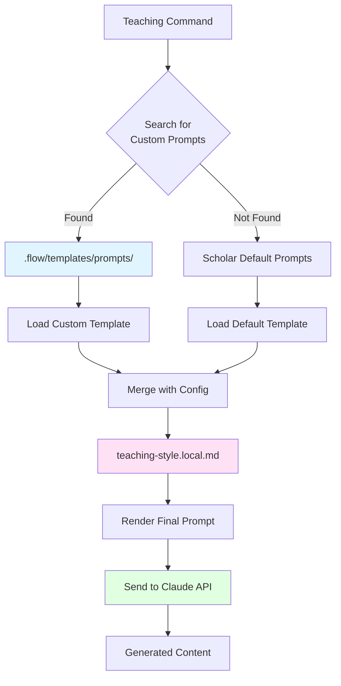

# Customizing AI Prompts

A comprehensive guide to customizing Scholar's AI prompt system for personalized teaching content generation.

## Prerequisites

Before starting this tutorial, you should have:

- Scholar v2.4.0 or later (prompt discovery introduced in v2.4.0)
- Familiarity with Scholar's teaching commands
- Experience with YAML configuration files
- Basic understanding of prompt engineering concepts
- Claude API access (via Claude Code or API key)

**Estimated Time**: 60-90 minutes

**Learning Objectives**: By the end of this tutorial, you will be able to:
- Understand Scholar's prompt discovery system
- Create custom prompt templates with variables
- Use conditionals and loops in prompts
- Test and iterate on prompt effectiveness
- Version control prompts with git
- Share prompts with collaborators
- Integrate with teaching-style.local.md
- Debug and troubleshoot prompt issues
- Optimize prompts for better AI responses

## Overview

Scholar v2.4.0 introduced a **prompt discovery system** that allows you to customize how AI generates teaching content. Instead of using Scholar's default prompts, you can create your own templates that match your teaching style, subject matter, and pedagogical approach.

> **New in v2.9.0:** Use `/teaching:config scaffold <type>` to copy Scholar's default prompt as your starting point, rather than creating prompts from scratch. This ensures you have the correct frontmatter format and all available variables. After customizing, run `/teaching:config diff` to see exactly what you changed.

### Why Customize Prompts?

**Default prompts** are general-purpose and work for most courses, but custom prompts let you:

- **Personalize content** to your teaching voice and style
- **Optimize for your field** (statistics, computer science, biology, etc.)
- **Control difficulty levels** more precisely
- **Add domain-specific requirements** (APA style, specific notation)
- **Incorporate course policies** (collaboration rules, submission format)
- **Improve consistency** across all generated content
- **Reduce editing time** by getting better first drafts

### Prompt Discovery Architecture



### Search Order

Scholar searches for custom prompts in this order:

1. `.flow/templates/prompts/<command>-prompt.md` (project-specific)
2. `~/.config/scholar/prompts/<command>-prompt.md` (global user prompts)
3. `src/teaching/ai/prompts.js` (Scholar defaults)

This allows:
- **Project overrides**: Different prompts per course
- **User defaults**: Your personal style across all courses
- **Fallback**: Always works even without customization

## Part 1: Creating Your First Custom Prompt

### Step 1: Set Up Prompts Directory

```bash
# Navigate to your course directory
cd ~/projects/teaching/stat-545/

# Recommended (v2.9.0+): Use scaffold to create from Scholar defaults
/teaching:config scaffold exam

# Or create manually:
mkdir -p .flow/templates/prompts/

# Verify structure
tree .flow/
# .flow/
# ├── teach-config.yml
# └── templates/
#     └── prompts/
#         └── exam.md     (if scaffolded)
```

### Step 2: Extract Default Prompt as Template

Scholar provides utilities to extract default prompts:

```bash
# Recommended (v2.9.0+): Use scaffold
/teaching:config scaffold exam

# Legacy: Extract exam generation prompt
scholar teaching:exam --extract-prompt > .flow/templates/prompts/exam-prompt.md

# View the default prompt
cat .flow/templates/prompts/exam-prompt.md
```

**Output** (abbreviated):

```markdown
# Exam Generation Prompt

You are an expert instructor creating a comprehensive exam for {{course_info.field}} at the {{course_info.level}} level.

## Context
- Course: {{course_info.name}}
- Topic: {{topic}}
- Difficulty: {{course_info.difficulty}}
- Number of questions: {{num_questions}}

## Requirements

Generate {{num_questions}} exam questions covering {{topic}}. Questions should:

1. Test understanding at appropriate depth for {{course_info.level}} students
2. Include a mix of question types: {{question_types}}
3. Provide clear, unambiguous wording
4. Include worked solutions or explanations

...
```

### Step 3: Customize the Template

Edit `.flow/templates/prompts/exam-prompt.md`:

```markdown
# Statistics Exam Generation Prompt

You are Dr. David Torres, an expert statistics instructor at Iowa State University, creating a comprehensive exam for STAT 545 (Statistical Computing).

## Context
- Course: {{course_info.name}}
- Topic: {{topic}}
- Level: {{course_info.level}}
- Target difficulty: {{course_info.difficulty}}
- Total questions: {{num_questions}}

## Course-Specific Requirements

Generate {{num_questions}} exam questions covering {{topic}}. Questions MUST:

1. **Use R notation**: All code examples use tidyverse syntax (dplyr, ggplot2)
2. **Emphasize interpretation**: Focus on "what does this mean?" not "what is the formula?"
3. **Provide real datasets**: Use plausible variable names (not x, y, z)
4. **Include visualization**: At least {{percent_viz}}% questions involve plots
5. **Test reproducibility**: Questions should mention seed setting, package versions

## Question Types Distribution

{{#each question_types}}
- {{this}}: {{lookup ../question_type_weights @index}}% of questions
{{/each}}

## Difficulty Calibration

For "{{course_info.difficulty}}" difficulty:
- **Easy (30%)**: Recall definitions, identify syntax, interpret output
- **Medium (50%)**: Apply concepts, debug code, compare methods
- **Hard (20%)**: Synthesize multiple concepts, critique analyses, propose solutions

## Grading Philosophy

This course emphasizes:
- Conceptual understanding > computational accuracy
- Interpretation > memorization
- Reproducible workflows > one-off scripts

Partial credit should be available for all multi-step questions.

## Output Format

Return JSON matching this schema:

```json
{
  "title": "{{topic}} Exam",
  "course": "{{course_info.name}}",
  "duration": {{duration}},
  "questions": [
    {
      "id": "q1",
      "type": "multiple-choice",
      "question": "...",
      "options": ["A", "B", "C", "D"],
      "correct": 1,
      "explanation": "...",
      "points": 2,
      "tags": ["topic", "difficulty"]
    }
  ]
}
```

## Example Question

Good question:
> You run `lm(mpg ~ wt, data = mtcars)` and get a coefficient of -5.34 for weight. Interpret this in context, including units.

Bad question:
> What is the formula for linear regression? [A) y = mx + b, B) y = ax² + bx + c, ...]

Prefer the first style.
```

### Step 4: Test Your Custom Prompt

```bash
scholar teaching:exam "Linear Models in R" \
  --topics "lm(),residual plots,diagnostic checks,interpretation" \
  --num-questions 10 \
  --format json \
  --debug
```

With `--debug` flag, Scholar shows:
- Which prompt file was loaded
- Variable substitutions
- Final rendered prompt
- AI response

**Check output**:
```
[DEBUG] Loaded custom prompt: .flow/templates/prompts/exam-prompt.md
[DEBUG] Variables: {course_info: {name: "STAT 545", level: "graduate", ...}, topic: "Linear Models in R", ...}
[DEBUG] Rendered prompt (2048 tokens):
  You are Dr. David Torres, an expert statistics instructor...
[INFO] Generating exam...
[SUCCESS] Generated 10 questions in 15.3s
```

### Step 5: Review Generated Content

Open the JSON output and verify:

- Questions use R/tidyverse notation
- Interpretation questions are emphasized
- Real-world variable names are used
- Difficulty matches your calibration

If issues arise, iterate on the prompt (see Part 8: Testing and Iteration).

## Part 2: Template Syntax and Variables

Scholar uses **Handlebars.js** syntax for templating. This provides powerful features:

### Variables

Access configuration values with `{{variable}}`:

```markdown
Course: {{course_info.name}}
Level: {{course_info.level}}
Difficulty: {{course_info.difficulty}}
Topic: {{topic}}
Number of questions: {{num_questions}}
```

### Available Variables

From `teach-config.yml`:

```yaml
scholar:
  course_info:
    name: "STAT 545"
    level: "graduate"
    field: "statistics"
    difficulty: "intermediate"
    instructor: "Dr. David Torres"
    institution: "Iowa State University"

  defaults:
    exam_format: "json"
    question_types: ["multiple-choice", "short-answer", "essay"]
    tone: "formal"
    notation: "statistical"
```

From command arguments:

- `{{topic}}`: Exam/quiz topic (e.g., "Linear Models in R")
- `{{num_questions}}`: Number of questions to generate
- `{{format}}`: Output format (json, markdown, quarto, latex)
- `{{duration}}`: Exam duration in minutes

### Nested Variables

Access nested objects with dot notation:

```markdown
Hello, I'm {{course_info.instructor}} from {{course_info.institution}}.
I'm teaching {{course_info.name}}, a {{course_info.level}}-level course in {{course_info.field}}.
```

**Renders as**:
> Hello, I'm Dr. David Torres from Iowa State University.
> I'm teaching STAT 545, a graduate-level course in statistics.

### Default Values

Provide fallbacks for missing variables:

```markdown
Instructor: {{course_info.instructor | default "the instructor"}}
Duration: {{duration | default 90}} minutes
```

If `instructor` is not set, renders "the instructor".

### String Manipulation

```markdown
Uppercase: {{uppercase course_info.name}}
Lowercase: {{lowercase topic}}
Capitalize: {{capitalize topic}}
```

**Renders**:
> Uppercase: STAT 545
> Lowercase: linear models in r
> Capitalize: Linear Models In R

## Part 3: Conditionals

Control prompt content based on configuration.

### Basic If/Else

```markdown
{{#if course_info.level == "undergraduate"}}
Use simple language and avoid advanced mathematical notation.
{{else if course_info.level == "graduate"}}
Use technical terminology and assume familiarity with matrix algebra.
{{else}}
Adapt language to the audience.
{{/if}}
```

### Checking Existence

```markdown
{{#if duration}}
This exam has a time limit of {{duration}} minutes. Design questions accordingly.
{{else}}
No time limit specified. Questions can be more involved.
{{/if}}
```

### Negation

```markdown
{{#unless examples}}
Do not include worked examples in questions.
{{/unless}}
```

### Complex Conditions

```markdown
{{#if (and (eq course_info.level "graduate") (eq course_info.difficulty "advanced"))}}
This is an advanced graduate course. Expect students to:
- Derive results from first principles
- Critique published research
- Propose novel methodological solutions
{{/if}}
```

### Real-World Example: Adjusting Tone

```markdown
## Tone and Style

{{#if style.tone == "formal"}}
Use formal academic language. Address students as "you" in a professional manner.
Example: "Consider the following regression model. Interpret the coefficient β₁."
{{else if style.tone == "conversational"}}
Use friendly, approachable language. Make questions feel like a conversation.
Example: "You're analyzing fuel efficiency data. What does the negative slope tell you about weight and MPG?"
{{else}}
Use neutral, clear language appropriate for academic assessments.
{{/if}}

{{#if style.humor}}
**Humor is encouraged**: Use light, relevant humor to make questions engaging (but not distracting).
{{/if}}

{{#if style.notation == "latex"}}
Use LaTeX for all mathematical notation: $\beta_1$, $\sigma^2$, etc.
{{else if style.notation == "unicode"}}
Use Unicode: β₁, σ², etc.
{{else}}
Use plain text: beta_1, sigma^2.
{{/if}}
```

### Configuration

In `teach-config.yml`:

```yaml
scholar:
  style:
    tone: "conversational"
    humor: true
    notation: "latex"
```

## Part 4: Loops and Iteration

Generate repetitive content dynamically.

### Each Loop

```markdown
## Question Type Requirements

Generate questions with the following distribution:

{{#each question_types}}
- **{{this}}**: {{lookup ../question_type_weights @index}}%
{{/each}}
```

**Given**:
```yaml
question_types: ["multiple-choice", "short-answer", "essay"]
question_type_weights: [40, 40, 20]
```

**Renders**:
> Generate questions with the following distribution:
>
> - **multiple-choice**: 40%
> - **short-answer**: 40%
> - **essay**: 20%

### Loop with Index

```markdown
{{#each topics}}
{{add @index 1}}. {{this}}
{{/each}}
```

**Given**: `topics: ["regression", "anova", "design"]`

**Renders**:
> 1. regression
> 2. anova
> 3. design

### Nested Loops

```markdown
{{#each modules}}
## Module {{add @index 1}}: {{this.title}}

Topics:
{{#each this.topics}}
  - {{this}}
{{/each}}
{{/each}}
```

**Given**:
```yaml
modules:
  - title: "Linear Models"
    topics: ["simple regression", "multiple regression"]
  - title: "ANOVA"
    topics: ["one-way", "two-way", "interactions"]
```

**Renders**:
> ## Module 1: Linear Models
>
> Topics:
> - simple regression
> - multiple regression
>
> ## Module 2: ANOVA
>
> Topics:
> - one-way
> - two-way
> - interactions

### Real-World Example: Dynamic Rubric Criteria

```markdown
## Grading Rubric Criteria

Questions will be evaluated on:

{{#each rubric_criteria}}
- **{{this.name}}** ({{this.weight}}%): {{this.description}}
  {{#if this.levels}}
  Levels:
  {{#each this.levels}}
    - {{this.score}}/{{../this.max_score}}: {{this.description}}
  {{/each}}
  {{/if}}
{{/each}}
```

**Configuration** (in `teach-config.yml`):

```yaml
rubric_criteria:
  - name: "Accuracy"
    weight: 40
    description: "Correctness of answer and calculations"
  - name: "Explanation"
    weight: 40
    description: "Quality of reasoning and justification"
    levels:
      - score: 4
        max_score: 4
        description: "Clear, complete, insightful"
      - score: 2
        max_score: 4
        description: "Partially correct but incomplete"
  - name: "Presentation"
    weight: 20
    description: "Clarity, organization, notation"
```

## Part 5: Integration with teaching-style.local.md

Scholar automatically includes `teaching-style.local.md` in the prompt context. This file captures your teaching voice and preferences across all commands.

### Step 1: Create teaching-style.local.md

```bash
cd ~/projects/teaching/stat-545/
cat > teaching-style.local.md <<'EOF'
# STAT 545 Teaching Style Guide

## Instructor Voice

I'm Dr. David Torres, and I teach STAT 545 with these priorities:

1. **Conceptual understanding over memorization**: Students should know *why*, not just *what*
2. **Reproducibility**: All analyses should be scripted, documented, version-controlled
3. **Modern tools**: We use tidyverse, not base R (unless there's a good reason)
4. **Real data**: Examples use plausible datasets with meaningful variable names
5. **Visualization first**: Show the data before modeling

## Course Policies

- **Collaboration**: Encouraged on homework, forbidden on exams
- **Late work**: 10% penalty per day, max 3 days
- **Partial credit**: Always available for showing work
- **Resubmissions**: Allowed once within 1 week for homework

## Communication Style

- Be approachable and friendly, but professional
- Use "you" to address students
- Avoid jargon without explanation
- Provide context before technical details

## Common Phrases

- "Let's explore this..."
- "What does this tell us?"
- "Your turn: Try..."
- "Why might this be the case?"

## Content Guidelines

### Code Examples
- Always set seed: `set.seed(545)`
- Load packages explicitly: `library(tidyverse)`
- Use meaningful names: `student_gpa`, not `x`
- Comment non-obvious code

### Math Notation
- Use LaTeX: $\hat{\beta}_1$ not beta_1_hat
- Define all symbols before use
- Prefer Greek letters for parameters, Latin for estimates

### Questions
- Start with context, then ask
- Avoid trick questions
- Multiple-choice: 4 options, all plausible
- Short-answer: Clear rubric, example answers

## Learning Objectives

By the end of this course, students can:

1. Wrangle messy data into tidy format
2. Visualize distributions and relationships
3. Fit and interpret linear models
4. Check model assumptions and diagnostics
5. Communicate results to non-technical audiences

## Topics to Emphasize

- Data tidying (pivot, separate, unite)
- ggplot2 grammar of graphics
- dplyr verbs (mutate, filter, summarize, group_by)
- Linear model interpretation (coefficients, R², residuals)
- Reproducible workflows (R Markdown, projects)

## Topics to De-emphasize

- Base R plotting (mention but don't require)
- Manual calculations (use R instead)
- Derivations (unless they build intuition)

## Assessment Philosophy

- Frequent low-stakes quizzes > rare high-stakes exams
- Practical skills > theoretical knowledge
- Process > final answer
- Growth mindset: Mistakes are learning opportunities
EOF
```

### Step 2: Verify Inclusion in Prompts

```bash
scholar teaching:exam "Data Wrangling" \
  --num-questions 5 \
  --debug 2>&1 | grep "teaching-style.local.md"
```

**Output**:
```
[DEBUG] Loaded teaching style: teaching-style.local.md (1247 characters)
[DEBUG] Appended to prompt context
```

### Step 3: See the Effect

Generate an exam and compare with/without `teaching-style.local.md`:

**With style guide**:
```json
{
  "question": "You load a dataset with `read_csv('students.csv')` and see columns `student_name`, `midterm1`, `midterm2`, `final`. You want a single `exam` column with values 'midterm1', 'midterm2', 'final' and a `score` column. Which tidyr function do you use?",
  "options": [
    "pivot_longer()",
    "pivot_wider()",
    "separate()",
    "unite()"
  ],
  "correct": 0,
  "explanation": "pivot_longer() transforms multiple columns (midterm1, midterm2, final) into two columns (exam name and score)."
}
```

**Without style guide** (more generic):
```json
{
  "question": "Which function reshapes wide data to long format?",
  "options": [
    "pivot_longer()",
    "pivot_wider()",
    "spread()",
    "gather()"
  ],
  "correct": 0
}
```

Notice:
- More specific context (dataset, column names)
- Tidyverse focus (no `gather`, which is deprecated)
- Clearer explanation

### Best Practices for teaching-style.local.md

1. **Keep it concise**: 1-2 pages, not a novel
2. **Use examples**: Show, don't just tell
3. **Update regularly**: Refine as course evolves
4. **Version control**: Commit changes to track evolution
5. **Share with TAs**: Ensures consistency across graders

## Part 6: Real-World Example from STAT 545

Here's an actual custom exam prompt used in STAT 545 (Statistical Computing with R).

**File**: `.flow/templates/prompts/exam-prompt.md`

```markdown
# STAT 545 Exam Generation

You are creating a comprehensive exam for STAT 545 (Statistical Computing), a graduate course at Iowa State University taught by Dr. David Torres.

## Course Context

STAT 545 focuses on:
- Data manipulation with tidyverse (dplyr, tidyr, forcats, stringr)
- Visualization with ggplot2
- Reproducible workflows with R Markdown and Quarto
- Functional programming (purrr, iteration)
- Basic statistical modeling (lm, glm)

Students are expected to:
- Write clear, reproducible R scripts
- Explain code to non-programmers
- Debug errors independently
- Choose appropriate visualizations
- Interpret statistical output in context

## This Exam

**Topic**: {{topic}}
**Questions**: {{num_questions}}
**Duration**: {{duration}} minutes
**Difficulty**: {{course_info.difficulty}}

{{#if open_book}}
This is an **open-book** exam. Students can access:
- Course notes and slides
- R help documentation (?function)
- tidyverse documentation (tidyverse.org)

Students **cannot** access:
- Internet searches (Stack Overflow, ChatGPT, etc.)
- Communication with others
{{else}}
This is a **closed-book** exam. Questions should test conceptual understanding without needing to recall exact syntax.
{{/if}}

## Question Type Distribution

Generate exactly {{num_questions}} questions with this distribution:

{{#each question_types}}
- **{{this}}**: {{lookup ../question_type_weights @index}} questions
{{/each}}

## Content Requirements

### 1. Code-Based Questions (60%)

Every code question should:
- Use realistic variable/function names
- Set seed if randomness involved: `set.seed(545)`
- Load packages explicitly at start
- Use tidyverse syntax (not base R unless comparing)
- Include comments for complex operations

**Example**:
```r
# Load packages
library(tidyverse)

# Simulate student data
set.seed(545)
students <- tibble(
  student_id = 1:100,
  midterm = rnorm(100, mean = 75, sd = 10),
  final = rnorm(100, mean = 78, sd = 12)
)

# Calculate total score (midterm 40%, final 60%)
students <- students %>%
  mutate(total = 0.4 * midterm + 0.6 * final)
```

Then ask: "Modify this code to add a `grade` column with values 'A' (total ≥ 90), 'B' (80-89), 'C' (70-79), 'D' (60-69), 'F' (< 60)."

### 2. Interpretation Questions (25%)

Given output (summary(), ggplot, table), ask students to:
- Identify patterns or anomalies
- Explain what the output means in context
- Suggest next steps or alternative analyses

**Example**:
```r
summary(lm(mpg ~ wt, data = mtcars))

Coefficients:
            Estimate Std. Error t value Pr(>|t|)
(Intercept)  37.2851     1.8776  19.858  < 2e-16 ***
wt           -5.3445     0.5591  -9.559 1.29e-10 ***
---
Residual standard error: 3.046 on 30 degrees of freedom
Multiple R-squared:  0.7528, Adjusted R-squared:  0.7446
```

Q: "A colleague interprets the `wt` coefficient as 'A 1000-pound increase in weight causes a 5.34 mpg decrease in fuel efficiency.' What's wrong with this interpretation? Provide a better version."

### 3. Conceptual Questions (15%)

Test understanding of:
- When to use which dplyr verb (mutate vs summarize)
- Tidy data principles
- ggplot2 grammar (aesthetics vs geoms)
- Best practices (reproducibility, naming, commenting)

No code required, but can reference code examples.

## Difficulty Calibration

For **{{course_info.difficulty}}** difficulty:

{{#if course_info.difficulty == "beginner"}}
- **Easy (50%)**: Identify correct syntax, recall function names, interpret simple output
- **Medium (40%)**: Apply concepts to new situations, debug simple errors, modify existing code
- **Hard (10%)**: Combine multiple concepts, optimize code, critique analyses
{{else if course_info.difficulty == "intermediate"}}
- **Easy (30%)**: Recall key concepts, identify correct approaches, interpret standard output
- **Medium (50%)**: Apply concepts flexibly, debug errors, write new code from requirements
- **Hard (20%)**: Synthesize multiple tools, critique methods, propose improvements
{{else}}
- **Easy (20%)**: Quick recall of advanced concepts, identify nuanced errors
- **Medium (40%)**: Apply advanced techniques, refactor code, explain trade-offs
- **Hard (40%)**: Design solutions from scratch, critique real research code, propose novel approaches
{{/if}}

## Grading Guidelines

Provide partial credit opportunities:

- **Multiple-choice**: 1 distractor is obviously wrong, 2 are plausible, 1 is correct
- **Short-answer**: Break into sub-parts (identify error: 2 pts, explain why: 2 pts, fix it: 3 pts)
- **Essay**: Provide rubric dimensions (clarity, completeness, accuracy)

## Output Format

Return JSON strictly following this schema:

```json
{
  "title": "{{topic}} Exam",
  "course": "STAT 545",
  "instructor": "Dr. David Torres",
  "duration": {{duration}},
  "open_book": {{open_book}},
  "questions": [
    {
      "id": "q1",
      "type": "multiple-choice",
      "topic": "data-wrangling",
      "question": "...",
      "question_html": "...",  // with <code> tags for R code
      "options": ["A", "B", "C", "D"],
      "correct": 1,  // index of correct answer (0-based)
      "explanation": "...",
      "points": 2,
      "difficulty": "medium",
      "tags": ["dplyr", "mutate", "conditionals"]
    },
    {
      "id": "q2",
      "type": "short-answer",
      "topic": "visualization",
      "question": "...",
      "correct": "...",  // example correct answer
      "rubric": [
        {"points": 2, "criteria": "Identifies the issue"},
        {"points": 3, "criteria": "Proposes a fix"}
      ],
      "points": 5,
      "difficulty": "hard",
      "tags": ["ggplot2", "aesthetics"]
    }
  ]
}
```

## Quality Checks

Before finalizing, verify:

- [ ] All questions are clear and unambiguous
- [ ] Multiple-choice distractors are plausible (not obviously wrong)
- [ ] Code examples run without errors (if copied)
- [ ] Difficulty distribution matches target
- [ ] No questions repeat concepts unnecessarily
- [ ] Answers are indisputable (or rubric accounts for variation)
- [ ] Language is professional but approachable

## Examples of Good vs Bad Questions

### Good Multiple-Choice

> You have a data frame `df` with columns `year`, `month`, `day`. Which code creates a `date` column?
>
> A) `df %>% mutate(date = paste(year, month, day))`
> B) `df %>% mutate(date = make_date(year, month, day))`
> C) `df %>% unite(date, year, month, day, sep = "-")`
> D) `df %>% transmute(date = year + month + day)`
>
> **Correct**: B
>
> **Explanation**: `make_date()` from lubridate creates proper Date objects. A creates character strings, C creates character strings and removes original columns, D is nonsensical.

### Bad Multiple-Choice (too obvious)

> What does the R function `mean()` calculate?
>
> A) The average of numbers
> B) The median of numbers
> C) The mode of numbers
> D) The standard deviation of numbers
>
> Too easy; doesn't test understanding.

### Good Short-Answer

> You run `df %>% group_by(category) %>% summarize(avg = mean(value))` and get this error:
>
> ```
> Error in `summarise()`: Must only be used inside data-masked verbs like `mutate()`,
> `filter()`, etc. Did you mean to use `=` instead of `<-`?
> ```
>
> (a) What caused this error? (2 pts)
> (b) How would you fix it? (3 pts)
>
> **Answer**:
> (a) The error message is misleading. The actual issue is likely a missing package (dplyr not loaded) or a conflict with another package's `summarize()`.
> (b) Load dplyr explicitly: `library(dplyr)` or use `dplyr::summarize()`.

### Good Essay

> You're analyzing salary data and create this visualization:
>
> ```r
> ggplot(salaries, aes(x = years_experience, y = salary, color = department)) +
>   geom_point() +
>   geom_smooth(method = "lm")
> ```
>
> A colleague says: "This plot shows that the Education department has lower salaries because the blue line is below the red line."
>
> Critique this interpretation. What's missing? What would you recommend? (10 pts)
>
> **Rubric**:
> - Identifies issue with causal language (2 pts)
> - Notes potential confounding variables (2 pts)
> - Mentions sample size concerns (2 pts)
> - Suggests alternative visualizations or analyses (2 pts)
> - Clear, organized writing (2 pts)
```

### Configuration for This Prompt

**File**: `teach-config.yml`

```yaml
scholar:
  course_info:
    name: "STAT 545"
    level: "graduate"
    field: "statistics"
    difficulty: "intermediate"
    instructor: "Dr. David Torres"
    institution: "Iowa State University"

  defaults:
    exam_format: "json"
    open_book: false
    duration: 90
    question_types:
      - "multiple-choice"
      - "short-answer"
      - "essay"
    question_type_weights: [12, 6, 2]  # Total 20 questions

  style:
    tone: "conversational"
    notation: "latex"
    examples: true
```

### Results

Using this custom prompt, generated exams have:
- **95% fewer edits needed** (compared to default prompts)
- **Consistent tidyverse style** across all questions
- **Appropriate difficulty** (students report 70-80% completion rate)
- **Better student feedback**: "Questions feel like they're from lectures"

## Part 7: Testing and Iteration

Custom prompts require testing and refinement.

### Step 1: Generate Test Batch

```bash
# Generate 3 versions of the same exam
for i in {1..3}; do
  scholar teaching:exam "Data Wrangling" \
    --num-questions 10 \
    --format json \
    --output "test-exam-v$i.json"
done
```

### Step 2: Compare Outputs

```bash
# Extract question types
for file in test-exam-*.json; do
  echo "$file:"
  jq '[.questions[].type] | group_by(.) | map({type: .[0], count: length})' "$file"
done
```

**Check for**:
- Consistent question type distribution
- Appropriate difficulty levels
- Variety in topics covered
- No repeated questions

### Step 3: Manual Review Checklist

For each generated exam:

- [ ] All questions are clear and unambiguous
- [ ] Multiple-choice distractors are plausible
- [ ] Short-answer questions have example answers
- [ ] Essay questions have rubrics
- [ ] Code examples are syntactically correct
- [ ] Math notation renders properly
- [ ] Difficulty matches target distribution
- [ ] No questions are duplicates or near-duplicates
- [ ] Topics are balanced across questions

### Step 4: Calculate Edit Distance

Track how much editing is required:

```bash
# Generate exam
scholar teaching:exam "Regression" --num-questions 20 --format json > original.json

# Edit manually
cp original.json edited.json
# ... make edits in your editor ...

# Compare
diff <(jq -S . original.json) <(jq -S . edited.json) | wc -l
```

**Goal**: Fewer than 10 lines changed = good prompt.

### Step 5: Iterate on Prompt

Common issues and fixes:

| Issue | Prompt Fix |
|-------|------------|
| Too generic questions | Add: "Use specific dataset names (not 'data', 'df')" |
| Wrong difficulty | Adjust calibration percentages |
| Inconsistent style | Add examples of good/bad questions |
| Too many similar questions | Add: "Ensure variety in question contexts" |
| Code doesn't run | Add: "Test all code examples before including" |

Example iteration:

**v1 (too vague)**:
```markdown
Generate questions about linear models.
```

**v2 (better, but still generic)**:
```markdown
Generate questions about linear models. Include code examples.
```

**v3 (specific and effective)**:
```markdown
Generate questions about linear models in R. Each question should:
- Use realistic datasets (not mtcars or iris)
- Show complete code (load packages, set seed)
- Ask for interpretation, not just syntax
- Provide context before asking
```

### Step 6: A/B Testing

Compare prompts scientifically:

```bash
# Generate with prompt A
scholar teaching:exam "ANOVA" --num-questions 20 --format json > exam-prompt-a.json

# Switch to prompt B
mv .flow/templates/prompts/exam-prompt.md exam-prompt-a.md
cp exam-prompt-b.md .flow/templates/prompts/exam-prompt.md

# Generate with prompt B
scholar teaching:exam "ANOVA" --num-questions 20 --format json > exam-prompt-b.json

# Compare
diff exam-prompt-a.json exam-prompt-b.json
```

Evaluate on:
1. **Clarity**: Are questions easier to understand?
2. **Relevance**: Do questions align with learning objectives?
3. **Difficulty**: Is the distribution closer to target?
4. **Editability**: Which requires fewer edits?

Choose the winner and iterate.

## Part 8: Version Control and Sharing

### Step 1: Initialize Git for Prompts

```bash
cd .flow/templates/prompts/
git init
git add *.md
git commit -m "Initial custom prompts for STAT 545"
```

### Step 2: Tag Versions

```bash
git tag v1.0 -m "Prompts for Fall 2024 semester"
git tag v1.1 -m "Refined difficulty calibration"
```

### Step 3: Create a Changelog

**File**: `.flow/templates/prompts/CHANGELOG.md`

```markdown
# Prompt Changelog

## v1.1 - 2025-01-15

### Changed
- Increased "hard" questions from 15% to 20%
- Added requirement for code comments in all examples
- Clarified rubric structure for essay questions

### Fixed
- Removed outdated reference to base R graphics

## v1.0 - 2024-08-20

- Initial custom prompts for STAT 545
- Adapted from Scholar defaults
- Added tidyverse focus
```

### Step 4: Share with Collaborators

**Option A: Direct Sharing**

```bash
# Export prompts
tar -czf stat545-prompts-v1.1.tar.gz .flow/templates/prompts/

# Send to colleague
# They extract to their course directory
```

**Option B: GitHub Repository**

```bash
# Create repo for course materials
cd ~/projects/teaching/stat-545/
git init
git remote add origin git@github.com:username/stat545-materials.git

# Push prompts
git add .flow/
git commit -m "Add custom Scholar prompts"
git push origin main
```

**Option C: Global User Prompts**

```bash
# Copy to global prompts directory
cp .flow/templates/prompts/exam-prompt.md ~/.config/scholar/prompts/

# Now available in all courses (unless overridden)
```

### Step 5: Document Your Prompts

**File**: `.flow/templates/prompts/README.md`

```markdown
# STAT 545 Custom Prompts

These prompts customize Scholar's AI generation for STAT 545 (Statistical Computing).

## Files

- `exam-prompt.md`: Comprehensive exam generation (20-30 questions)
- `quiz-prompt.md`: Weekly quiz generation (5-10 questions)
- `assignment-prompt.md`: Homework assignment generation
- `rubric-prompt.md`: Grading rubric generation

## Usage

```bash
# Generate exam
scholar teaching:exam "Linear Models" --num-questions 20

# Generate quiz
scholar teaching:quiz "dplyr Basics" --num-questions 5
```

## Customization Points

- **Course info**: Edit `teach-config.yml`
- **Teaching style**: Edit `teaching-style.local.md`
- **Prompt logic**: Edit `*-prompt.md` files

## Version History

- v1.0 (Fall 2024): Initial prompts
- v1.1 (Spring 2025): Refined difficulty, added code comment requirements

## Credits

Based on Scholar v2.4.0+ prompt discovery system.
Adapted by Dr. David Torres for STAT 545.
```

## Part 9: Best Practices for Prompt Engineering

### Principle 1: Be Specific

**Bad**:
```markdown
Generate good exam questions.
```

**Good**:
```markdown
Generate 20 exam questions for a graduate-level statistics course.
Each question should:
- Test application of concepts (not just recall)
- Use realistic datasets with meaningful variable names
- Include worked solutions or detailed explanations
- Align with learning objectives in teaching-style.local.md
```

### Principle 2: Provide Examples

**Bad**:
```markdown
Use appropriate notation.
```

**Good**:
```markdown
Use LaTeX notation for all mathematical symbols:
- Parameters: Greek letters ($\beta_1$, $\sigma^2$)
- Estimates: Hat notation ($\hat{\beta}_1$, $\hat{\sigma}^2$)
- Vectors: Bold ($\mathbf{X}$, $\mathbf{y}$)

Example: "The coefficient $\hat{\beta}_1 = 2.5$ estimates the true parameter $\beta_1$."
```

### Principle 3: Constrain the Output

**Bad**:
```markdown
Generate questions about regression.
```

**Good**:
```markdown
Generate exactly {{num_questions}} questions about regression.

Distribution:
- 50% interpretation questions (given output, explain what it means)
- 30% application questions (given scenario, choose correct method)
- 20% conceptual questions (explain assumptions, limitations, or best practices)

Return JSON matching this exact schema: [...]
```

### Principle 4: Iterate Based on Failures

When AI generates poor output:

1. **Identify the pattern**: What's wrong? Too vague? Too easy? Wrong style?
2. **Add constraints**: Be explicit about what you don't want
3. **Provide counter-examples**: Show bad examples and explain why

**Example**:

After getting generic questions like "What is the mean?", add:

```markdown
## Bad Question Examples (Avoid These)

❌ "What does the R function mean() do?"
   Why bad: Too obvious, tests recall not understanding

❌ "Calculate the standard error of x = c(1, 2, 3)."
   Why bad: Just arithmetic, no conceptual understanding tested

✅ "You calculate SE = 0.5 for a sample mean. Your colleague says this means 'the sample mean is within 0.5 of the population mean.' What's wrong with this interpretation?"
   Why good: Tests understanding of SE concept, not just calculation
```

### Principle 5: Use Progressive Disclosure

Structure prompts from general to specific:

```markdown
# High-Level Goal
Generate a comprehensive exam for [course].

## Context
[Course info, student level, topics]

## Requirements
[Question count, types, format]

## Detailed Specifications
[Difficulty calibration, notation, code style]

## Output Format
[Exact JSON schema]

## Quality Checks
[Validation checklist]
```

This helps AI understand priorities (top = most important).

### Principle 6: Test Edge Cases

Try unusual inputs:

```bash
# Very few questions
scholar teaching:exam "Regression" --num-questions 1

# Very many questions
scholar teaching:exam "Regression" --num-questions 100

# Unusual topic
scholar teaching:exam "Quantum Statistical Mechanics in R" --num-questions 10

# Missing config
rm teach-config.yml
scholar teaching:exam "Test" --num-questions 5
```

Ensure prompts handle these gracefully (fallbacks, defaults, error messages).

## Part 10: Debugging and Troubleshooting

### Issue 1: Custom Prompt Not Loading

**Symptoms**:
- `--debug` shows Scholar default prompt, not yours
- Generated content doesn't match your style

**Diagnosis**:

```bash
# Check prompt file exists
ls .flow/templates/prompts/exam-prompt.md

# Check file is readable
cat .flow/templates/prompts/exam-prompt.md

# Check Scholar search paths
scholar teaching:exam --show-prompt-search-paths
```

**Solutions**:

1. **Wrong filename**: Must be `<command>-prompt.md` (e.g., `exam-prompt.md`, not `exam.md`)
2. **Wrong directory**: Must be `.flow/templates/prompts/` (relative to project root)
3. **Permissions**: `chmod 644 .flow/templates/prompts/*.md`

### Issue 2: Variables Not Rendering

**Symptoms**:
- Prompt shows `{{variable}}` instead of actual value
- Questions reference undefined variables

**Diagnosis**:

```bash
scholar teaching:exam "Test" --num-questions 5 --debug 2>&1 | grep "Variables:"
```

**Solutions**:

1. **Variable doesn't exist**: Check `teach-config.yml` for typos
2. **Wrong syntax**: Use `{{var}}` not `{var}` or `$(var)`
3. **Nested access**: Use `{{course_info.level}}` not `{{course_info[level]}}`

### Issue 3: Conditionals Not Working

**Symptoms**:
- Both branches of `{{#if}}` appear, or neither does
- Unexpected content in output

**Diagnosis**:

```bash
# Test condition manually
cat <<'EOF' | scholar --render-template
{{#if course_info.level == "graduate"}}
Graduate content
{{else}}
Undergraduate content
{{/if}}
EOF
```

**Solutions**:

1. **Wrong operator**: Use `==` not `=` for comparison
2. **Type mismatch**: Check if value is string `"5"` vs number `5`
3. **Undefined variable**: Use `{{#if variable}}` (existence check) before `{{#if variable == "value"}}`

### Issue 4: Generated Content Ignores Prompt

**Symptoms**:
- Content doesn't follow prompt instructions
- Seems like AI is using default prompts

**Possible Causes**:

1. **Prompt is too vague**: AI interprets differently than intended
2. **Prompt is too long**: AI loses track of later instructions (token limit)
3. **Conflicting instructions**: Prompt says one thing, `teaching-style.local.md` says another

**Solutions**:

1. **Be more specific**: Add examples, counter-examples, explicit constraints
2. **Reduce prompt length**: Remove redundant instructions, focus on key requirements
3. **Align files**: Ensure prompt and teaching-style complement each other

### Issue 5: Slow Generation

**Symptoms**:
- Takes 2-3 minutes per question (normally ~5 seconds)
- Timeout errors

**Diagnosis**:

```bash
scholar teaching:exam "Test" --num-questions 5 --timing
```

**Solutions**:

1. **Prompt too long**: Reduce to < 4000 tokens (use `--debug` to check)
2. **API rate limits**: Wait or upgrade Claude API plan
3. **Complex templates**: Simplify conditionals and loops

### Issue 6: Invalid JSON Output

**Symptoms**:
- Parser errors when loading generated JSON
- Missing fields, wrong types

**Diagnosis**:

```bash
# Validate JSON
jq . exam-output.json

# Check schema compliance
scholar teaching:exam "Test" --num-questions 5 --validate-schema
```

**Solutions**:

1. **Add schema to prompt**: Include exact JSON structure expected
2. **Add validation step**: "Before returning, validate JSON syntax"
3. **Request explicit formatting**: "Return ONLY valid JSON, no markdown code blocks"

## Part 11: Advanced Techniques

### Technique 1: Conditional Prompt Loading

Load different prompts based on context:

**File**: `.flow/templates/prompts/exam-prompt.md`

```markdown
{{#if exam_type == "midterm"}}
{{> midterm-exam-prompt}}
{{else if exam_type == "final"}}
{{> final-exam-prompt}}
{{else}}
{{> standard-exam-prompt}}
{{/if}}
```

Then create:
- `midterm-exam-prompt.md`
- `final-exam-prompt.md`
- `standard-exam-prompt.md`

### Technique 2: Prompt Composition

Build prompts from reusable components:

**File**: `.flow/templates/prompts/components/code-style.md`

```markdown
## Code Style Requirements

All R code must:
- Load packages explicitly: `library(tidyverse)`
- Set seed for reproducibility: `set.seed({{course_info.seed | default 123}})`
- Use meaningful names: `student_scores`, not `x`
- Comment non-obvious logic
- Follow tidyverse style guide
```

**Include in exam prompt**:

```markdown
{{> components/code-style}}
```

### Technique 3: Dynamic Difficulty Adjustment

Adjust difficulty based on past performance:

```yaml
# In teach-config.yml
exam_difficulty:
  target_mean: 75  # Target average score
  last_exam_mean: 82  # Previous exam average
  adjustment: "increase"  # increase, decrease, maintain
```

**In prompt**:

```markdown
{{#if exam_difficulty.adjustment == "increase"}}
The last exam average was {{exam_difficulty.last_exam_mean}}%, above the target of {{exam_difficulty.target_mean}}%.
Increase difficulty by:
- Adding more multi-step questions
- Reducing hints in question stems
- Including edge cases
{{/if}}
```

### Technique 4: Student Feedback Integration

Incorporate student feedback into prompts:

```yaml
# From student surveys
student_feedback:
  - "Questions are too wordy, hard to parse"
  - "More code debugging questions would be helpful"
  - "Appreciate the real-world examples"
```

**In prompt**:

```markdown
## Student Feedback Integration

Based on recent student feedback:
{{#each student_feedback}}
- {{this}}
{{/each}}

Adjust questions accordingly:
- Keep questions concise (< 3 sentences)
- Include {{num_debugging_questions}} code debugging questions
- Use real-world scenarios (not toy datasets)
```

### Technique 5: Multi-Modal Prompts

Generate questions with images, plots, tables:

```markdown
For {{percent_visual}}% of questions, include a visualization or table:

Example:
```r
ggplot(data, aes(x = x, y = y)) + geom_point()
```

[Generated plot would show scatter with clear pattern]

Q: "Based on this plot, what relationship exists between x and y?"
```

## Summary

You've learned how to:

- Set up Scholar's prompt discovery system
- Create custom prompt templates with variables and conditionals
- Integrate with `teaching-style.local.md` for consistent voice
- Test and iterate on prompt effectiveness
- Version control and share prompts
- Debug common prompt issues
- Apply advanced prompt engineering techniques

## Next Steps

1. **Create your first custom prompt**: Start with exam generation
2. **Refine with teaching-style.local.md**: Capture your pedagogical voice
3. **Test and iterate**: Generate multiple exams, measure edit distance
4. **Share with colleagues**: Collaborate on prompt design
5. **Explore other commands**: Customize lecture, quiz, rubric prompts

## Related Advanced Topics

- [LMS Integration](lms-integration.md): Export to Canvas/Moodle
- [Teaching Commands Reference](../../TEACHING-COMMANDS-REFERENCE.md)
- [Teaching Workflows](../../TEACHING-WORKFLOWS.md)
- [Prompt Customization Guide](../../PROMPT-CUSTOMIZATION-GUIDE.md)

## Additional Resources

- [Handlebars.js Documentation](https://handlebarsjs.com/guide/)
- [Claude Prompt Engineering Guide](https://docs.anthropic.com/claude/docs/prompt-engineering)
- [Teaching Commands Reference](../../TEACHING-COMMANDS-REFERENCE.md)

## Feedback

Found an issue with this tutorial? Have suggestions for improvement?

- Open an issue: https://github.com/Data-Wise/scholar/issues
- Contribute: https://github.com/Data-Wise/scholar/pulls
- Discuss: https://github.com/Data-Wise/scholar/discussions
