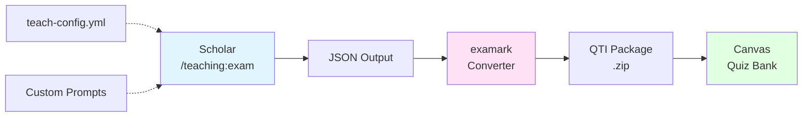

# Canvas LMS Integration

A comprehensive guide to integrating Scholar-generated assessments with Canvas and other Learning Management Systems.

## Prerequisites

Before starting this tutorial, you should have:

- Scholar v2.5.0 or later installed
- Node.js >= 20.19.0
- Basic familiarity with Scholar's teaching commands
- Canvas LMS instructor access (or equivalent for other LMS)
- Experience generating exams with `/teaching:exam`

**Estimated Time**: 45-60 minutes

**Learning Objectives**: By the end of this tutorial, you will be able to:
- Install and configure examark for QTI conversion
- Generate Canvas-compatible assessments from Scholar
- Export question banks to Canvas with proper formatting
- Organize and manage question banks efficiently
- Troubleshoot common import issues
- Batch process multiple assessments
- Adapt the workflow for Moodle and Blackboard

## Overview

Canvas uses the QTI (Question & Test Interoperability) standard for importing assessments. Scholar generates assessments in multiple formats (Markdown, Quarto, LaTeX, JSON), but Canvas requires QTI XML. The examark tool bridges this gap by converting Scholar's JSON output to Canvas-compatible QTI packages.

### Workflow Architecture



### Why QTI?

QTI (IMS Question & Test Interoperability) is the industry standard for sharing assessment content between systems. Benefits include:

- **Portability**: Move content between LMS platforms
- **Preservation**: Archive assessments in vendor-neutral format
- **Automation**: Batch import/export workflows
- **Standardization**: Consistent question types across systems

## Part 1: Installing examark

### Step 1: Install via npm (Recommended)

```bash
npm install -g examark
```

Verify installation:

```bash
examark --version
# Should output: examark v1.x.x
```

### Step 2: Alternative Installation (Homebrew)

If you're using the Data-Wise tap:

```bash
brew tap data-wise/tap
brew install examark
```

### Step 3: Verify examark Configuration

Test examark with a sample file:

```bash
# Create a simple test file
echo '{
  "title": "Test Quiz",
  "questions": [
    {
      "type": "multiple-choice",
      "question": "What is 2+2?",
      "options": ["3", "4", "5", "6"],
      "correct": "4"
    }
  ]
}' > test-quiz.json

# Convert to QTI
examark test-quiz.json --output test-quiz.zip

# Verify ZIP was created
ls -lh test-quiz.zip
```

If successful, you'll see a ZIP file containing QTI XML and manifest files.

### Troubleshooting Installation

**Issue**: `examark: command not found`

**Solution**: Ensure npm global bin is in your PATH:

```bash
npm config get prefix
# Add to ~/.zshrc or ~/.bashrc:
export PATH="$(npm config get prefix)/bin:$PATH"
```

**Issue**: Permission errors on macOS

**Solution**: Use npx instead:

```bash
npx examark <file.json>
```

**Issue**: Node version incompatibility

**Solution**: Update Node.js:

```bash
node --version  # Should be >= 20.19.0
nvm install 20  # If using nvm
```

## Part 2: Generating Canvas-Compatible Exams

### Step 1: Configure Scholar for Canvas

Create or edit `.flow/teach-config.yml`:

```yaml
scholar:
  course_info:
    level: "undergraduate"
    field: "statistics"
    difficulty: "intermediate"
    lms: "canvas"  # Optimize for Canvas

  defaults:
    exam_format: "json"  # Required for QTI conversion
    question_types:
      - "multiple-choice"
      - "short-answer"
      - "essay"
      - "matching"
      - "true-false"

  canvas:
    # Canvas-specific settings
    question_bank: true  # Group by topic
    shuffle_answers: true
    time_limit: 90  # minutes
    attempts_allowed: 1
    show_correct_answers: "after_due_date"

  style:
    tone: "formal"
    notation: "latex"  # Canvas supports LaTeX math
    examples: true
```

### Step 2: Generate Exam with Canvas Optimization

```bash
scholar teaching:exam "Multiple Regression Analysis" \
  --topics "simple linear regression,multiple regression,model diagnostics,interaction effects" \
  --num-questions 20 \
  --format json \
  --config .flow/teach-config.yml
```

**Output**: `exam-multiple-regression-analysis.json`

### Step 3: Review Generated JSON

Open the JSON file and verify structure:

```json
{
  "title": "Multiple Regression Analysis Exam",
  "course": "Statistics",
  "duration": 90,
  "instructions": "Answer all questions. Show your work for partial credit.",
  "questions": [
    {
      "id": "q1",
      "type": "multiple-choice",
      "topic": "simple-linear-regression",
      "question": "Which assumption is **not** required for simple linear regression?",
      "question_html": "Which assumption is <strong>not</strong> required for simple linear regression?",
      "options": [
        "Linearity of relationship",
        "Independence of errors",
        "Normality of predictors",
        "Constant variance of errors"
      ],
      "correct": 2,
      "explanation": "Normality is required for the **errors**, not the predictors.",
      "points": 2,
      "tags": ["assumptions", "theory"]
    },
    {
      "id": "q2",
      "type": "short-answer",
      "topic": "multiple-regression",
      "question": "Interpret the coefficient β₁ = 2.5 in a regression model predicting salary (in thousands) from years of experience.",
      "correct": "For each additional year of experience, salary increases by $2,500 on average, holding other variables constant.",
      "points": 5,
      "tags": ["interpretation", "coefficients"]
    }
  ]
}
```

### Canvas-Specific JSON Enhancements

Scholar automatically adds Canvas-compatible fields when `lms: "canvas"` is configured:

- `question_html`: HTML-rendered version of questions (for rich formatting)
- `tags`: For Canvas question bank organization
- `shuffle`: Per-question shuffle settings
- `partial_credit`: For complex questions

### Step 4: Validate JSON Schema

Before conversion, validate the JSON structure:

```bash
# If you have jq installed
jq '.questions[] | select(.type == "multiple-choice") | .correct' exam-*.json

# Check for required fields
jq '.questions[] | {id, type, question, correct}' exam-*.json
```

## Part 3: Converting to Canvas QTI Format

### Step 1: Basic Conversion

```bash
examark exam-multiple-regression-analysis.json \
  --output canvas-exam.zip \
  --format canvas
```

**What happens**:
1. examark reads the JSON schema
2. Maps question types to QTI equivalents
3. Generates QTI 2.1 XML for each question
4. Creates imsmanifest.xml with metadata
5. Packages everything into a ZIP file

### Step 2: Advanced Conversion Options

```bash
examark exam-multiple-regression-analysis.json \
  --output canvas-exam.zip \
  --format canvas \
  --shuffle-answers \
  --points-per-question 2 \
  --partial-credit \
  --feedback-mode "immediate"
```

**Options explained**:
- `--shuffle-answers`: Randomize answer order for each student
- `--points-per-question`: Override default point values
- `--partial-credit`: Enable partial credit for multi-select questions
- `--feedback-mode`: When to show feedback (`immediate`, `after_due_date`, `never`)

### Step 3: Inspect the QTI Package

```bash
# Extract and examine contents
unzip -l canvas-exam.zip

# Should show:
#   imsmanifest.xml          (package metadata)
#   assessment.xml           (exam structure)
#   questions/q1.xml         (individual questions)
#   questions/q2.xml
#   ...
```

### Question Type Mapping

| Scholar Type | Canvas Type | QTI Element | Notes |
|--------------|-------------|-------------|-------|
| `multiple-choice` | Multiple Choice | `choiceInteraction` | Single correct answer |
| `multi-select` | Multiple Answers | `choiceInteraction` (multiple) | Multiple correct answers |
| `short-answer` | Fill in the Blank | `textEntryInteraction` | Exact or partial match |
| `essay` | Essay | `extendedTextInteraction` | Manual grading required |
| `true-false` | True/False | `choiceInteraction` (2 options) | Special case of multiple choice |
| `matching` | Matching | `associateInteraction` | Pair items from two lists |
| `numerical` | Numerical Answer | `textEntryInteraction` (numeric) | With tolerance |

### Step 4: Handle Special Content

#### LaTeX Math

Canvas supports LaTeX math via MathJax. Scholar automatically wraps math expressions:

```json
{
  "question": "Solve for x: $x^2 + 5x + 6 = 0$",
  "question_html": "Solve for x: \\(x^2 + 5x + 6 = 0\\)"
}
```

examark preserves these during conversion:

```xml
<itemBody>
  <p>Solve for x: \(x^2 + 5x + 6 = 0\)</p>
</itemBody>
```

#### Images and Media

For questions with images:

```json
{
  "question": "Interpret the residual plot:",
  "image": "residual-plot.png",
  "image_alt": "Residual plot showing random scatter"
}
```

Include images in the conversion:

```bash
examark exam.json \
  --output canvas-exam.zip \
  --images-dir ./images/
```

examark will:
1. Embed images in the QTI package
2. Update XML references
3. Include alt text for accessibility

#### Code Blocks

For programming courses:

```json
{
  "question": "What does this R code output?",
  "code": "x <- c(1, 2, 3)\nmean(x)",
  "language": "r"
}
```

examark wraps code in `<pre><code>` tags with syntax highlighting hints.

## Part 4: Importing to Canvas

### Step 1: Navigate to Question Banks

1. Log into Canvas as instructor
2. Go to your course
3. Click **Settings** → **Import Course Content**
4. Select **QTI .zip file**

### Step 2: Upload the QTI Package

1. Click **Choose File** and select `canvas-exam.zip`
2. Under "Content" select **Question Bank**
3. Click **Import**

Canvas will:
- Parse the QTI XML
- Create a new question bank
- Import all questions with metadata
- Preserve tags, points, and feedback

### Step 3: Monitor Import Progress

1. Canvas shows import status in real-time
2. Click **View Issues** if warnings appear
3. Common issues:
   - Unsupported question types (rare with examark)
   - Invalid HTML in questions
   - Missing images

### Step 4: Review Imported Questions

1. Go to **Quizzes** → **Question Banks**
2. Find the new bank (named after your exam title)
3. Click to view all questions
4. Verify:
   - Question text renders correctly
   - Math equations display properly (MathJax)
   - Answer options are in correct order
   - Point values are accurate

### Step 5: Create a Canvas Quiz from the Bank

1. Go to **Quizzes** → **+ Quiz**
2. Name your quiz
3. Click **Questions** tab
4. Click **+ New Question Group**
5. Select **Link to Question Bank**
6. Choose your imported bank
7. Configure:
   - Number of questions to display
   - Points per question
   - Shuffle questions

### Step 6: Configure Quiz Settings

#### Basic Settings

- **Quiz Type**: Graded Survey, Ungraded Survey, or Practice Quiz
- **Time Limit**: Match your `teach-config.yml` duration
- **Multiple Attempts**: Set based on assessment type
- **Show Correct Answers**: After due date (recommended)

#### Advanced Settings

```yaml
# Example quiz configuration
Canvas Quiz Settings:
  - Shuffle Answers: Yes (prevents cheating)
  - Show One Question at a Time: Yes (reduces cognitive load)
  - Lock Questions After Answering: No (allow review)
  - Allow Backtracking: Yes
  - Show Results: After Each Attempt
  - Access Code: Optional (for in-class exams)
  - IP Filter: Optional (computer lab restrictions)
```

#### Accessibility Settings

- Enable screen reader support
- Provide extra time for students with accommodations
- Allow extended time multipliers (1.5x, 2x)

## Part 5: Batch Processing Multiple Assessments

### Scenario: Converting an Entire Course

You have 10 exams, 20 quizzes, and 5 midterms to convert.

#### Step 1: Organize Your Files

```bash
mkdir -p assessments/{exams,quizzes,midterms}
```

#### Step 2: Generate All Assessments

```bash
# Generate exams
for topic in "regression" "anova" "design" "bayesian"; do
  scholar teaching:exam "$topic" \
    --topics "..." \
    --num-questions 25 \
    --format json \
    --output "assessments/exams/exam-$topic.json"
done

# Generate quizzes
for i in {1..10}; do
  scholar teaching:quiz "Week $i Quiz" \
    --topics "..." \
    --num-questions 10 \
    --format json \
    --output "assessments/quizzes/quiz-week-$i.json"
done
```

#### Step 3: Batch Convert with a Script

Create `batch-convert.sh`:

```bash
#!/bin/bash

# Convert all JSON files to Canvas QTI
for json_file in assessments/**/*.json; do
  base_name=$(basename "$json_file" .json)
  output_dir=$(dirname "$json_file")

  echo "Converting $json_file..."
  examark "$json_file" \
    --output "$output_dir/$base_name-canvas.zip" \
    --format canvas \
    --shuffle-answers \
    --partial-credit
done

echo "Batch conversion complete!"
```

Run it:

```bash
chmod +x batch-convert.sh
./batch-convert.sh
```

#### Step 4: Bulk Import to Canvas

Canvas doesn't support bulk question bank imports via UI, but you can:

**Option A: Manual Sequential Import**
- Import each ZIP one at a time
- Takes 5-10 minutes for 30+ assessments

**Option B: Canvas API (Advanced)**

```bash
# Install Canvas CLI (if available)
npm install -g canvas-lms-cli

# Configure API token
canvas config --token YOUR_API_TOKEN --url https://canvas.school.edu

# Bulk import
for zip_file in assessments/**/*-canvas.zip; do
  canvas import-qti "$zip_file" --course-id 12345
done
```

**Option C: Use a Canvas Admin Tool**

Many institutions have bulk import utilities. Contact your Canvas administrator.

### Organizing Question Banks

#### Strategy 1: By Topic

```
Question Banks:
├── Regression Basics (50 questions)
├── Multiple Regression (75 questions)
├── Model Diagnostics (40 questions)
└── Advanced Topics (60 questions)
```

Benefits:
- Easy to find questions by content
- Mix topics in exams using question groups
- Align with course modules

#### Strategy 2: By Assessment Type

```
Question Banks:
├── Quizzes (200 questions)
├── Midterm Exams (100 questions)
├── Final Exam (150 questions)
└── Practice Problems (300 questions)
```

Benefits:
- Separate formative vs. summative
- Control difficulty levels
- Reuse practice questions

#### Strategy 3: By Learning Objective

```
Question Banks:
├── LO1: Apply regression models (80 questions)
├── LO2: Interpret coefficients (60 questions)
├── LO3: Check assumptions (50 questions)
└── LO4: Evaluate model fit (70 questions)
```

Benefits:
- Align with curriculum mapping
- Ensure comprehensive coverage
- Report on objective mastery

### Recommendation: Hybrid Approach

Combine strategies using Canvas tags:

```json
{
  "tags": [
    "topic:regression",
    "difficulty:medium",
    "objective:LO2",
    "type:conceptual",
    "bloom:apply"
  ]
}
```

This enables flexible question selection and detailed analytics.

## Part 6: Canvas-Specific Formatting Tips

### Tip 1: Use Canvas-Friendly HTML

Canvas supports a subset of HTML. Avoid:
- Custom CSS classes (stripped during import)
- JavaScript (security risk)
- Embedded `<iframe>` tags (blocked)

Prefer:
- Basic HTML tags (`<p>`, `<strong>`, `<em>`, `<ul>`, `<ol>`)
- MathJax for equations
- Canvas equation editor syntax

### Tip 2: Optimize Images

Canvas has image size limits (typically 5-10 MB per image). Optimize before embedding:

```bash
# Install ImageMagick
brew install imagemagick

# Resize images
for img in images/*.png; do
  convert "$img" -resize 800x600 -quality 85 "optimized/$(basename $img)"
done
```

### Tip 3: Preview Math Rendering

Test LaTeX math locally before importing:

```html
<!DOCTYPE html>
<html>
<head>
  <script src="https://cdn.jsdelivr.net/npm/mathjax@3/es5/tex-mml-chtml.js"></script>
</head>
<body>
  <p>When \(a \ne 0\), there are two solutions to \(ax^2 + bx + c = 0\):</p>
  <p>\[x = {-b \pm \sqrt{b^2-4ac} \over 2a}\]</p>
</body>
</html>
```

Open in browser to verify rendering.

### Tip 4: Use Proper Feedback Types

Canvas supports multiple feedback modes:

```json
{
  "feedback": {
    "general": "Review Chapter 3 for more on regression assumptions.",
    "correct": "Excellent! You correctly identified the independence assumption.",
    "incorrect": "Not quite. Remember that normality applies to errors, not predictors."
  }
}
```

examark maps these to Canvas feedback fields.

### Tip 5: Handle Special Characters

Canvas can be finicky with special characters. Use HTML entities:

| Character | Entity | Usage |
|-----------|--------|-------|
| `<` | `&lt;` | Less than in text |
| `>` | `&gt;` | Greater than in text |
| `&` | `&amp;` | Ampersand in text |
| `"` | `&quot;` | Quotes in attributes |
| `©` | `&copy;` | Copyright symbol |

### Tip 6: Test with a Small Bank First

Before converting 100+ questions:

1. Create a test bank with 5-10 questions
2. Import to Canvas
3. Create a sample quiz
4. Preview as a student
5. Verify all question types work
6. Check math, images, feedback

This catches issues early before bulk conversion.

## Part 7: Alternative LMS Support

### Moodle Integration

Moodle uses Moodle XML format (different from Canvas QTI).

#### Step 1: Convert to Moodle XML

```bash
examark exam.json \
  --output moodle-exam.xml \
  --format moodle
```

#### Step 2: Import to Moodle

1. Navigate to your Moodle course
2. Go to **Question Bank** → **Import**
3. Select **Moodle XML format**
4. Upload the XML file
5. Map question categories

#### Moodle-Specific Settings

```yaml
moodle:
  question_bank: "Category/Subcategory"
  feedback_mode: "immediate"
  penalty_factor: 0.33  # For adaptive mode
  hints: true  # Provide hints for multiple attempts
```

### Blackboard Integration

Blackboard supports QTI 1.2 (older standard).

#### Step 1: Convert to Blackboard QTI

```bash
examark exam.json \
  --output blackboard-exam.zip \
  --format blackboard
```

#### Step 2: Import to Blackboard

1. Log into Blackboard as instructor
2. Go to **Tests, Surveys, and Pools**
3. Click **Import Test**
4. Select the ZIP file
5. Map content areas

#### Blackboard Limitations

- Limited LaTeX support (use MathML instead)
- Fewer question types than Canvas
- Image handling can be problematic

**Workaround**: Use Blackboard's equation editor post-import.

### D2L Brightspace

D2L uses its own QTI variant.

```bash
examark exam.json \
  --output d2l-exam.zip \
  --format d2l
```

Import via **Question Library** → **Import** → **QTI**.

### Google Classroom

Google Classroom doesn't support QTI. Alternative workflow:

1. Generate exam in Google Forms format (not yet supported by examark)
2. Use Scholar's Markdown output
3. Manually transcribe to Google Forms

**Feature Request**: Add Google Forms output to examark.

## Part 8: Troubleshooting Common Issues

### Issue 1: Import Fails with "Invalid QTI Format"

**Symptoms**:
- Canvas shows "The uploaded file is not a valid QTI package"
- Import status shows red error

**Causes**:
- Corrupted ZIP file
- Missing `imsmanifest.xml`
- XML validation errors

**Solutions**:

```bash
# Validate ZIP integrity
unzip -t canvas-exam.zip

# Check for required files
unzip -l canvas-exam.zip | grep imsmanifest

# Validate XML syntax
xmllint --noout imsmanifest.xml
```

If XML is invalid, regenerate with examark latest version:

```bash
npm update -g examark
examark exam.json --output canvas-exam.zip --format canvas
```

### Issue 2: Math Equations Don't Render

**Symptoms**:
- LaTeX appears as plain text (`$x^2 + 1$` instead of formatted equation)
- Canvas shows raw LaTeX code

**Causes**:
- Wrong delimiter format
- MathJax not enabled in Canvas
- Invalid LaTeX syntax

**Solutions**:

1. **Verify Canvas MathJax is enabled**:
   - Ask Canvas admin to enable MathJax in theme settings
   - Test with a simple equation: `\(x^2\)`

2. **Use correct delimiters**:
   - Inline math: `\(x^2\)` not `$x^2$`
   - Display math: `\[x^2\]` not `$$x^2$$`

3. **Update Scholar output**:

```yaml
# In teach-config.yml
canvas:
  math_delimiters: "mathjax"  # Use \( \) instead of $ $
```

Regenerate exam and reconvert.

### Issue 3: Partial Credit Not Working

**Symptoms**:
- Multi-select questions marked all-or-nothing
- Students receive 0 points for partially correct answers

**Causes**:
- Partial credit not enabled in Canvas quiz settings
- QTI doesn't specify scoring rules

**Solutions**:

1. **Enable in examark**:

```bash
examark exam.json --partial-credit --output canvas-exam.zip
```

2. **Configure in Canvas**:
   - Edit question in question bank
   - Check "Award partial credit"
   - Set point values per answer

3. **Update Scholar JSON**:

```json
{
  "type": "multi-select",
  "scoring": {
    "type": "partial",
    "correct_weight": 1.0,
    "incorrect_penalty": -0.25
  }
}
```

### Issue 4: Questions Import Out of Order

**Symptoms**:
- Question order doesn't match original exam
- Topics are mixed randomly

**Causes**:
- Canvas randomizes questions by default
- QTI doesn't preserve order in all cases

**Solutions**:

1. **Disable shuffle in Canvas quiz settings**:
   - Edit quiz → Settings → Uncheck "Shuffle Answers"

2. **Use question numbering**:

```json
{
  "id": "q01",
  "question": "1. What is regression?"
}
```

3. **Create ordered question groups**:
   - In Canvas, manually arrange question groups
   - Set "Pick questions in order" instead of random

### Issue 5: Images Missing or Broken

**Symptoms**:
- Image placeholders show "Image not found"
- Alt text displays instead of image

**Causes**:
- Images not included in QTI package
- Wrong file paths in XML
- Unsupported image formats (TIFF, BMP)

**Solutions**:

1. **Include images in conversion**:

```bash
examark exam.json \
  --images-dir ./images/ \
  --output canvas-exam.zip
```

2. **Use supported formats**:
   - PNG (preferred)
   - JPG/JPEG
   - GIF (for animations)
   - SVG (for diagrams)

3. **Check file paths in JSON**:

```json
{
  "image": "./images/plot.png",  // ✅ Relative path
  "image": "plot.png"             // ✅ Filename only
}
```

4. **Verify images are embedded**:

```bash
unzip -l canvas-exam.zip | grep images/
```

### Issue 6: Feedback Shows for All Students

**Symptoms**:
- Students see correct answers immediately
- Defeats assessment purpose

**Causes**:
- Canvas quiz settings override QTI feedback rules
- Default is to show feedback immediately

**Solutions**:

1. **Configure Canvas quiz settings**:
   - Edit Quiz → Settings
   - "Let Students See Their Quiz Responses": Choose "After Due Date"
   - "Show Correct Answers": "After Last Attempt"

2. **Set in teach-config.yml**:

```yaml
canvas:
  show_correct_answers: "after_due_date"
  feedback_visibility: "after_submission"
```

3. **Override in examark**:

```bash
examark exam.json \
  --feedback-mode "after_due_date" \
  --output canvas-exam.zip
```

### Issue 7: Question Text Formatting Lost

**Symptoms**:
- Bullet points become plain text
- Bold/italic formatting removed
- Code blocks lose formatting

**Causes**:
- Canvas sanitizes HTML aggressively
- QTI doesn't support all Markdown features

**Solutions**:

1. **Use HTML in Scholar JSON**:

```json
{
  "question_html": "<p>Which of the following are <strong>assumptions</strong>?</p><ul><li>Linearity</li><li>Independence</li></ul>"
}
```

2. **Test HTML locally**:

```bash
echo "<p>Test <strong>bold</strong></p>" | examark --stdin --format canvas
```

3. **For code blocks, use `<pre><code>`**:

```json
{
  "question_html": "<p>What does this code do?</p><pre><code>x &lt;- c(1, 2, 3)\nmean(x)</code></pre>"
}
```

## Part 9: Performance Tips and Optimization

### Tip 1: Generate JSON Incrementally

For large exams (50+ questions), generate in batches:

```bash
# Generate 10 questions at a time
for batch in {1..5}; do
  scholar teaching:exam "Batch $batch" \
    --num-questions 10 \
    --format json \
    --output "batch-$batch.json"
done

# Merge into single file
jq -s '.[0] + {questions: ([.[].questions] | flatten)}' batch-*.json > full-exam.json
```

This prevents timeouts and allows review between batches.

### Tip 2: Use Caching for AI-Generated Content

Scholar uses Claude API which has rate limits. Enable caching:

```yaml
# In teach-config.yml
ai:
  cache_enabled: true
  cache_ttl: 86400  # 24 hours
```

Subsequent regenerations reuse cached responses.

### Tip 3: Optimize examark Conversion Speed

```bash
# Use --fast mode (skips validation)
examark exam.json --fast --output canvas-exam.zip

# Process multiple files in parallel
ls exams/*.json | xargs -P 4 -I {} examark {} --output {}-canvas.zip
```

**Caution**: `--fast` skips XML validation. Use only for known-good input.

### Tip 4: Minimize Question Bank Size

Large question banks (1000+ questions) slow down Canvas UI. Split into smaller banks:

```bash
# Split by topic
jq '.questions[] | select(.topic == "regression")' exam.json > regression-bank.json
jq '.questions[] | select(.topic == "anova")' exam.json > anova-bank.json
```

Convert and import separately.

### Tip 5: Preprocess Images

Resize and compress images before generation:

```bash
# Batch optimize all images
find images/ -name "*.png" -exec pngquant --quality=65-80 {} --output {}.optimized.png \;
```

Smaller images = faster imports and better student experience.

### Tip 6: Use examark Presets

Create examark configuration file `.examarkrc.json`:

```json
{
  "format": "canvas",
  "shuffle-answers": true,
  "partial-credit": true,
  "feedback-mode": "after_due_date",
  "images-dir": "./images/"
}
```

Then convert with:

```bash
examark exam.json  # Uses preset from .examarkrc.json
```

## Part 10: Advanced Techniques

### Custom Question Types via QTI Extensions

Canvas supports custom question types through QTI extensions. Example: coding questions with auto-grading.

#### Step 1: Define Custom Type in Scholar

```json
{
  "type": "code-execution",
  "language": "r",
  "question": "Write a function to calculate standard error.",
  "test_cases": [
    {"input": "c(1, 2, 3)", "expected": "0.5773503"},
    {"input": "c(5, 5, 5)", "expected": "0"}
  ]
}
```

#### Step 2: Convert to Canvas External Tool Question

This requires Canvas developer keys and LTI integration (beyond scope here). Alternative: use essay type and manual grading.

### Integrating with Scholar's Lecture Generation

Generate exam questions from lecture content:

```bash
# Generate lecture notes
scholar teaching:lecture "Multiple Regression" --output lecture-notes.md

# Extract key concepts
grep "^## " lecture-notes.md > key-concepts.txt

# Generate exam questions from concepts
while read concept; do
  scholar teaching:exam "$concept" --num-questions 3 --format json --output "q-$concept.json"
done < key-concepts.txt

# Merge all questions
jq -s '.[0] + {questions: ([.[].questions] | flatten)}' q-*.json > final-exam.json
```

This ensures alignment between lectures and assessments.

### Version Control for Question Banks

Track changes to question banks over time:

```bash
# Initialize git repo for assessments
cd assessments/
git init
git add *.json
git commit -m "Initial question banks"

# After updates
git diff exam-regression.json  # Review changes
git commit -am "Updated regression exam with new questions"

# Tag releases
git tag v1.0-fall-2024
git tag v2.0-spring-2025
```

This enables:
- Rollback to previous versions
- Compare across semesters
- Collaborate with other instructors

## Summary

You've learned how to:

- Install and configure examark for QTI conversion
- Generate Canvas-compatible assessments with Scholar
- Convert JSON to QTI and import to Canvas
- Organize question banks efficiently
- Batch process multiple assessments
- Troubleshoot common import issues
- Optimize performance for large assessments
- Adapt workflows for Moodle and Blackboard

## Next Steps

1. **Explore Custom Prompts**: Learn to customize AI generation in [Custom Prompts Tutorial](custom-prompts.md)
2. **Advanced Rubrics**: Create detailed grading rubrics with `/teaching:rubric`
3. **Automated Feedback**: Generate personalized feedback with `/teaching:feedback`
4. **LTI Integration**: Connect Scholar directly to Canvas via LTI (future feature)

## Related Advanced Topics

- [Teaching Commands Reference](../../TEACHING-COMMANDS-REFERENCE.md)
- [Teaching Workflows](../../TEACHING-WORKFLOWS.md)
- [Teaching Style Guide](../../TEACHING-STYLE-GUIDE.md)

## Additional Resources

- [Canvas QTI Documentation](https://canvas.instructure.com/doc/api/file.quiz_format.html)
- [IMS QTI Specification](https://www.imsglobal.org/question/index.html)
- [examark GitHub Repository](https://github.com/Data-Wise/examark)
- [Scholar Teaching Commands Reference](../../TEACHING-COMMANDS-REFERENCE.md)

## Feedback

Found an issue with this tutorial? Have suggestions for improvement?

- Open an issue: https://github.com/Data-Wise/scholar/issues
- Contribute: https://github.com/Data-Wise/scholar/pulls
- Discuss: https://github.com/Data-Wise/scholar/discussions
