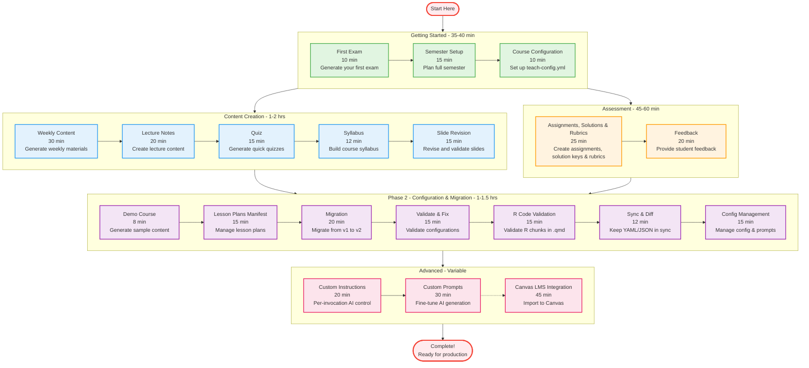

# Teaching Tutorials Learning Path

This guide shows the recommended order for working through Scholar's teaching tutorials. Follow the paths based on your experience level and goals.

---

## How to Use This Guide

The diagram below organizes tutorials into learning phases. Each phase builds on the previous one:

- **Getting Started**: Essential tutorials for all users (start here)
- **Content Creation**: Create various teaching materials
- **Assessment**: Design assessments and provide feedback
- **Phase 2**: Advanced configuration and migration tools
- **Advanced**: LMS integration and automation

You don't need to complete every tutorial. Choose the path that matches your needs:

- **Quick Start Path**: Getting Started → Content Creation (essential tutorials only)
- **Full Course Path**: All tutorials in order (comprehensive understanding)
- **Assessment Focus Path**: Getting Started → Assessment → Advanced
- **Migration Path**: Getting Started → Phase 2 (if migrating from another system)

**Time estimates:**
- Getting Started: 35-40 minutes total
- Content Creation: 1-2 hours total
- Assessment: 45-60 minutes total
- Phase 2: 1-1.5 hours total
- Advanced: Variable (depends on integrations)

---

## Learning Path Diagram

---

## Tutorial Descriptions

### Getting Started

These tutorials establish the foundation for using Scholar's teaching features.

| Tutorial | Time | What You'll Learn |
|----------|------|-------------------|
| **[First Exam](first-exam.md)** | 10 min | Generate your first exam with AI, customize difficulty, export to multiple formats, create rubrics |
| **[Semester Setup](semester-setup.md)** | 15 min | Plan an entire semester, organize content by week, set learning objectives, create course timeline |
| **[Course Configuration](configuration.md)** | 10 min | Set up `.flow/teach-config.yml`, configure course metadata, customize defaults |

**Start here if:** You're new to Scholar or want to generate teaching materials quickly.

---

### Content Creation

Generate various types of teaching materials for your course.

| Tutorial | Time | What You'll Learn |
|----------|------|-------------------|
| **[Weekly Content](weekly-content.md)** | 30 min | Generate a week's worth of content, coordinate materials, maintain consistency, use templates |
| **[Lecture Notes](lecture-notes.md)** | 20 min | Create lecture notes and slides, organize content structure, include examples and exercises |
| **[Quiz](quiz.md)** | 15 min | Generate quick quizzes, batch quiz creation, different question types, Canvas LMS export |
| **[Syllabus](syllabus.md)** | 12 min | Build a comprehensive syllabus, include policies and schedules, format for distribution |
| **[Slide Revision & Validation](slide-revision-validation.md)** | 15 min | Revise existing slides, validate content, check for consistency |

**Start here if:** You've completed Getting Started and need to create course materials.

---

### Assessment

Design assessments and provide feedback to students.

| Tutorial | Time | What You'll Learn |
|----------|------|-------------------|
| **[Assignments & Rubrics](assignments-solutions-rubrics.md)** | 25 min | Create assignments with detailed rubrics, generate standalone solution keys, define grading criteria |
| **[Feedback](feedback.md)** | 20 min | Provide constructive feedback, batch feedback generation, personalize comments |

**Start here if:** You need to create assessments or provide student feedback.

---

### Phase 2 - Configuration & Migration

Advanced configuration management and migration tools.

| Tutorial | Time | What You'll Learn |
|----------|------|-------------------|
| **[Demo Course](demo-course.md)** | 8 min | Generate sample course content, explore templates, test configurations |
| **[Lesson Plans Manifest](lesson-plans-manifest.md)** | 15 min | Manage lesson plans with manifests, coordinate with flow-cli, track content versions |
| **[Migration](migration.md)** | 20 min | Migrate from v1 to v2 schemas, update configuration files, batch migration |
| **[Validate & Fix](validate-and-fix.md)** | 15 min | Validate YAML configurations, auto-fix common errors, understand validation levels |
| **[R Code Validation](r-code-validation.md)** | 15 min | Validate R code chunks in .qmd files, eslint-style output, CI integration |
| **[Sync & Diff](sync-and-diff.md)** | 12 min | Sync YAML to JSON, compare files, integrate into workflow, bidirectional manifest sync |
| **[Config Management](config-management.md)** | 15 min | Scaffold prompts, inspect config hierarchy, validate, detect drift, track provenance |

**Start here if:** You need to validate configurations, migrate from older versions, or integrate with flow-cli.

---

### Advanced

Integration with external tools and custom workflows.

| Tutorial | Time | What You'll Learn |
|----------|------|-------------------|
| **[Custom Instructions](custom-instructions.md)** | 20 min | Add per-invocation AI instructions with `-i` flag, approval workflow, file-based instructions |
| **[Custom Prompts](../advanced/custom-prompts.md)** | 30 min | Fine-tune AI generation prompts, create custom templates, override defaults |
| **[Canvas LMS Integration](../advanced/lms-integration.md)** | 45 min | Export to Canvas QTI format, import quizzes/exams, manage gradebook integration |

**Start here if:** You need to customize AI generation or integrate with your institution's LMS.

---

## Recommended Learning Paths

### Path 1: Quick Start (Beginners)

**Goal:** Get up and running quickly with basic teaching materials.

**Time:** 1-2 hours

**Steps:**
1. First Exam (10 min)
2. Course Configuration (10 min)
3. Weekly Content (30 min)
4. Quiz (15 min)

**Outcome:** You can generate exams, quizzes, and weekly content for your course.

---

### Path 2: Full Course Development (Comprehensive)

**Goal:** Master all teaching features for complete course development.

**Time:** 4-6 hours

**Steps:**
1. All Getting Started tutorials (35-40 min)
2. All Content Creation tutorials (1-2 hrs)
3. All Assessment tutorials (45-60 min)
4. Validate & Fix (15 min)
5. Sync & Diff (12 min)

**Outcome:** You can create and manage an entire course with Scholar.

---

### Path 3: Assessment Focus

**Goal:** Specialize in creating assessments and providing feedback.

**Time:** 1.5-2 hours

**Steps:**
1. First Exam (10 min)
2. Course Configuration (10 min)
3. Assignments & Rubrics (25 min)
4. Feedback (20 min)
5. Quiz (15 min)
6. Canvas LMS Integration (45 min)

**Outcome:** You can create comprehensive assessments and integrate with your LMS.

---

### Path 4: Migration & Configuration

**Goal:** Migrate from v1 or another system and manage configurations.

**Time:** 1-1.5 hours

**Steps:**
1. Course Configuration (10 min)
2. Demo Course (8 min)
3. Migration (20 min)
4. Validate & Fix (15 min)
5. Sync & Diff (12 min)
6. Lesson Plans Manifest (15 min)

**Outcome:** Your configurations are validated and migrated to v2 schemas.

---

### Path 5: Advanced Integration

**Goal:** Customize Scholar and integrate with external tools.

**Time:** 2-3 hours

**Steps:**
1. Course Configuration (10 min)
2. Validate & Fix (15 min)
3. Sync & Diff (12 min)
4. Custom Prompts (30 min)
5. Canvas LMS Integration (45 min)

**Outcome:** You can customize AI generation and integrate with your institution's systems.

---

## Tips for Learning

**Take breaks between tutorials:**
- Each tutorial is designed to be completed in one sitting
- Take a 5-10 minute break between tutorials
- Practice what you learned before moving to the next tutorial

**Try variations:**
- Don't just follow the examples exactly
- Experiment with different options and flags
- Test with your own course content

**Use the checkpoints:**
- Each tutorial has checkpoint sections
- Verify you've completed each step correctly
- If something doesn't work, review that section

**Reference the documentation:**
- Tutorials link to comprehensive documentation
- Use the API reference for detailed command information
- Check the FAQ if you encounter issues

**Ask for help:**
- Join the Scholar community
- Report issues on GitHub
- Share your use cases and workflows

---

## Quick Reference

### All Tutorials by Time

| Tutorial | Time | Phase |
|----------|------|-------|
| Demo Course | 8 min | Phase 2 |
| First Exam | 10 min | Getting Started |
| Course Configuration | 10 min | Getting Started |
| Syllabus | 12 min | Content Creation |
| Sync & Diff | 12 min | Phase 2 |
| Quiz | 15 min | Content Creation |
| Semester Setup | 15 min | Getting Started |
| Validate & Fix | 15 min | Phase 2 |
| R Code Validation | 15 min | Phase 2 |
| Lesson Plans Manifest | 15 min | Phase 2 |
| Custom Instructions | 20 min | Advanced |
| Lecture Notes | 20 min | Content Creation |
| Feedback | 20 min | Assessment |
| Migration | 20 min | Phase 2 |
| Assignments & Rubrics | 25 min | Assessment |
| Weekly Content | 30 min | Content Creation |
| Custom Prompts | 30 min | Advanced |
| Canvas LMS Integration | 45 min | Advanced |

**Total time for all tutorials:** 5.5-6.5 hours

---

## Additional Resources

### Documentation

- **[Teaching Commands Reference](../../TEACHING-COMMANDS-REFERENCE.md)** - Complete command documentation
- **[API Reference](../../API-REFERENCE.md)** - Programmatic access
- **[Architecture Diagrams](../../ARCHITECTURE-DIAGRAMS.md)** - System design

### Examples

- **[Teaching Examples](../../examples/teaching.md)** - Real-world examples
- **[Command Examples](../../COMMAND-EXAMPLES.md)** - Quick command reference

### Help

- **[FAQ](../../help/FAQ-teaching.md)** - Frequently asked questions
- **[Common Issues](../../help/COMMON-ISSUES.md)** - Troubleshooting guide

---

**Choose your learning path and start with the first tutorial!**
