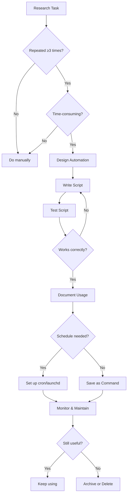

# Research Automation Workflows

Automate repetitive research tasks with Scholar commands, shell scripting, and workflow integration.

**Time Saved:** 5-15 hours per week
**Difficulty:** Intermediate to Advanced
**Prerequisites:** Basic shell scripting (bash/zsh), Scholar research commands familiarity
**Output:** Reusable automation scripts, streamlined research pipeline

---

## Navigation

- [Overview](#overview)
- [Batch Literature Collection](#batch-literature-collection)
- [Automated Citation Management](#automated-citation-management)
- [Template Generation](#template-generation)
- [flow-cli Integration](#flow-cli-integration)
- [Scheduled Tasks](#scheduled-tasks)
- [Pipeline Examples](#pipeline-examples)
- [Time-Saving Tips](#time-saving-tips)

---

## Overview

### Why Automate Research Tasks?

Research involves many repetitive tasks:

- **Literature searches** - Same queries run weekly for updates
- **Citation management** - Adding 20+ papers with same workflow
- **Template generation** - Methods/results sections follow patterns
- **Batch processing** - Analyzing multiple simulation outputs
- **File organization** - Consistent project structure setup

**Automation benefits:**

- **Time savings:** 70-80% reduction in repetitive task time
- **Consistency:** Same process every time, fewer errors
- **Reproducibility:** Documented, shareable workflows
- **Scalability:** Handle 100 papers as easily as 10

### Automation Principles

**Good automation:**
- Saves more time than it takes to set up
- Handles common cases (80% of work)
- Fails gracefully with clear error messages
- Is well-documented for future use
- Is shareable with collaborators

**When to automate:**
- Task repeated ≥3 times
- Task is time-consuming (>15 minutes)
- Task is error-prone when done manually
- Task follows consistent pattern

---

## Batch Literature Collection

### Problem: Collecting 20+ Papers from DOI List

**Manual workflow (1-2 hours):**

```bash
# For each DOI:
1. /research:doi "10.xxxx/xxxxx"
2. Copy BibTeX output
3. Save to temp file
4. /research:bib:add temp.bib references.bib
5. Delete temp file
# Repeat 20 times
```

**Automated workflow (5 minutes):**

```bash
#!/bin/bash
# batch-collect-dois.sh

DOIS=(
  "10.1037/a0020761"
  "10.1080/00273171.2011.606716"
  "10.1214/09-STS301"
  "10.1177/0049124115622510"
  # ... 16 more DOIs
)

for doi in "${DOIS[@]}"; do
  echo "Processing DOI: $doi"

  # Get BibTeX
  /research:doi "$doi" > temp-citation.txt

  # Extract BibTeX entry
  sed -n '/@article{/,/^}$/p' temp-citation.txt > temp-entry.bib

  # Add to bibliography (with duplicate checking)
  if /research:bib:search "$doi" references.bib | grep -q "$doi"; then
    echo "  Duplicate found, skipping"
  else
    /research:bib:add temp-entry.bib references.bib
    echo "  Added to bibliography"
  fi

  rm temp-citation.txt temp-entry.bib
  sleep 1  # Rate limiting
done

echo "Complete! Check references.bib"
```

**Usage:**

```bash
chmod +x batch-collect-dois.sh
./batch-collect-dois.sh
```

**Time savings:** 1.5 hours → 5 minutes = **95% reduction**

### Advanced: DOI Extraction from PDF

**Problem:** You have 20 papers (PDFs), need to add all to bibliography

**Solution: Extract DOIs from PDFs automatically**

```bash
#!/bin/bash
# extract-dois-from-pdfs.sh

PDF_DIR="$1"  # Directory containing PDFs

if [ -z "$PDF_DIR" ]; then
  echo "Usage: $0 <pdf-directory>"
  exit 1
fi

echo "Extracting DOIs from PDFs in: $PDF_DIR"

# Find all PDFs
find "$PDF_DIR" -name "*.pdf" | while read pdf; do
  echo "Processing: $(basename "$pdf")"

  # Extract text from first 2 pages (where DOI usually is)
  pdftotext -f 1 -l 2 "$pdf" - | \
    grep -oP '10\.\d{4,}/[^\s]+' | \
    head -1 > doi.txt

  DOI=$(cat doi.txt)

  if [ -n "$DOI" ]; then
    echo "  Found DOI: $DOI"

    # Look up and add
    /research:doi "$DOI" > temp-citation.txt
    sed -n '/@article{/,/^}$/p' temp-citation.txt > temp-entry.bib

    if [ -s temp-entry.bib ]; then
      /research:bib:add temp-entry.bib references.bib
      echo "  Added to bibliography"
    else
      echo "  Failed to retrieve citation"
    fi

    rm temp-citation.txt temp-entry.bib
  else
    echo "  No DOI found in: $(basename "$pdf")"
  fi

  rm doi.txt
  sleep 1
done

echo "DOI extraction complete"
```

**Requirements:**
- `pdftotext` (from poppler-utils): `brew install poppler`

**Usage:**

```bash
./extract-dois-from-pdfs.sh ~/Downloads/papers/
```

### Automated Literature Updates

**Problem:** Check for new papers on your topic weekly

**Solution: Scheduled arXiv search with email alerts**

```bash
#!/bin/bash
# weekly-arxiv-update.sh

TOPIC="causal mediation analysis"
OUTPUT_DIR="$HOME/research/literature-updates"
DATE=$(date +%Y-%m-%d)
OUTPUT_FILE="$OUTPUT_DIR/arxiv-update-$DATE.md"

mkdir -p "$OUTPUT_DIR"

echo "# arXiv Update: $TOPIC" > "$OUTPUT_FILE"
echo "**Date:** $DATE" >> "$OUTPUT_FILE"
echo "" >> "$OUTPUT_FILE"

# Search arXiv (last 7 days)
/research:arxiv "$TOPIC" --since $(date -v-7d +%Y-%m-%d) >> "$OUTPUT_FILE"

# Count new papers
NEW_PAPERS=$(grep -c "=== Paper" "$OUTPUT_FILE")

echo "" >> "$OUTPUT_FILE"
echo "**Total new papers:** $NEW_PAPERS" >> "$OUTPUT_FILE"

# Email results if papers found
if [ $NEW_PAPERS -gt 0 ]; then
  mail -s "arXiv Update: $NEW_PAPERS new papers on $TOPIC" \
    your.email@example.com < "$OUTPUT_FILE"
  echo "Email sent: $NEW_PAPERS new papers found"
else
  echo "No new papers found"
fi
```

**Schedule with cron (every Monday at 9 AM):**

```bash
crontab -e

# Add line:
0 9 * * 1 /Users/you/scripts/weekly-arxiv-update.sh
```

**Or use macOS launchd:**

```xml
<!-- ~/Library/LaunchAgents/com.user.arxiv-update.plist -->
<?xml version="1.0" encoding="UTF-8"?>
<!DOCTYPE plist PUBLIC "-//Apple//DTD PLIST 1.0//EN"
          "http://www.apple.com/DTDs/PropertyList-1.0.dtd">
<plist version="1.0">
<dict>
    <key>Label</key>
    <string>com.user.arxiv-update</string>
    <key>ProgramArguments</key>
    <array>
        <string>/Users/you/scripts/weekly-arxiv-update.sh</string>
    </array>
    <key>StartCalendarInterval</key>
    <dict>
        <key>Weekday</key>
        <integer>1</integer>
        <key>Hour</key>
        <integer>9</integer>
        <key>Minute</key>
        <integer>0</integer>
    </dict>
</dict>
</plist>
```

```bash
launchctl load ~/Library/LaunchAgents/com.user.arxiv-update.plist
```

---

## Automated Citation Management

### Smart Bibliography Sync

**Problem:** Bibliography becomes outdated, duplicates accumulate

**Solution: Automated maintenance script**

```bash
#!/bin/bash
# maintain-bibliography.sh

BIB_FILE="references.bib"
BACKUP_DIR="$HOME/.bibliography-backups"

mkdir -p "$BACKUP_DIR"

echo "=== Bibliography Maintenance ==="
echo "File: $BIB_FILE"

# 1. Backup
BACKUP_FILE="$BACKUP_DIR/references-$(date +%Y%m%d-%H%M%S).bib"
cp "$BIB_FILE" "$BACKUP_FILE"
echo "Backup created: $BACKUP_FILE"

# 2. Count entries
ENTRY_COUNT=$(grep -c '@' "$BIB_FILE")
echo "Current entries: $ENTRY_COUNT"

# 3. Find potential duplicates (same author + year)
echo ""
echo "=== Potential Duplicates ==="
grep '@' "$BIB_FILE" | \
  sed 's/@article{\(.*\),/\1/' | \
  sort | \
  uniq -d | \
  while read dup; do
    echo "  - $dup"
    /research:bib:search "${dup%%20*} 20" "$BIB_FILE"
  done

# 4. Validate BibTeX syntax
echo ""
echo "=== Syntax Validation ==="
bibtex -terse "$BIB_FILE" 2>&1 | grep -i error || echo "No errors found"

# 5. Statistics
echo ""
echo "=== Statistics ==="
echo "Total entries: $ENTRY_COUNT"
echo "Article entries: $(grep -c '@article' "$BIB_FILE")"
echo "Book entries: $(grep -c '@book' "$BIB_FILE")"
echo "Inproceedings: $(grep -c '@inproceedings' "$BIB_FILE")"
echo "Most cited year: $(grep 'year =' "$BIB_FILE" | \
  grep -oP '\d{4}' | sort | uniq -c | sort -rn | head -1)"

echo ""
echo "=== Maintenance Complete ==="
```

**Run monthly:**

```bash
./maintain-bibliography.sh
```

### Cross-Project Citation Sharing

**Problem:** Same papers cited across multiple projects

**Solution: Master bibliography with project-specific subsets**

```bash
#!/bin/bash
# sync-bibliography.sh

MASTER_BIB="$HOME/.bibliography/master-references.bib"
PROJECT_BIB="./references.bib"
MERGE_BIB="./references-merged.bib"

echo "Syncing bibliography..."

# 1. Merge project-specific with master
cat "$PROJECT_BIB" "$MASTER_BIB" > "$MERGE_BIB"

# 2. Remove duplicates
awk '/^@/ {key=$0; getline; entries[key]=$0; next}
     {if(key in entries) entries[key]=entries[key] "\n" $0}
     END {for(k in entries) print k "\n" entries[k]}' \
  "$MERGE_BIB" > "$PROJECT_BIB.new"

# 3. Sort entries alphabetically
sort -t'{' -k2 "$PROJECT_BIB.new" > "$PROJECT_BIB"

rm "$MERGE_BIB" "$PROJECT_BIB.new"

echo "Sync complete. Bibliography updated."
```

**Workflow:**

```bash
# Add project-specific citations
/research:bib:add new-entry.bib references.bib

# Periodically sync with master
./sync-bibliography.sh

# Push new citations to master
cat references.bib >> ~/.bibliography/master-references.bib
```

---

## Template Generation

### Automated Methods Section Generation

**Problem:** Methods sections follow similar structure, typing same boilerplate

**Solution: Parameterized templates**

```bash
#!/bin/bash
# generate-methods-section.sh

STUDY_TYPE="$1"  # simulation, rct, observational
SAMPLE_SIZE="$2"
METHOD="$3"
OUTPUT="methods-section-draft.md"

case "$STUDY_TYPE" in
  simulation)
    /research:manuscript:methods "Monte Carlo simulation study comparing $METHOD. Sample sizes: $SAMPLE_SIZE. Data generation: [specify process]. Replications: 5000 per condition. Performance metrics: bias, MSE, coverage probability. Software: R version 4.3.0."
    ;;

  rct)
    /research:manuscript:methods "Randomized controlled trial evaluating $METHOD. Sample size: $SAMPLE_SIZE (power = 0.80 for detecting effect size d=0.4). Randomization: Block randomization stratified by [factors]. Outcome assessment: [primary outcome]. Statistical analysis: Intention-to-treat with multiple imputation for missing data."
    ;;

  observational)
    /research:manuscript:methods "Observational study examining $METHOD. Sample: N=$SAMPLE_SIZE [population description]. Sampling: [sampling method]. Measures: [outcome and predictors]. Statistical approach: [regression/survival/etc.] with adjustment for confounders [list]. Sensitivity analyses: [describe]."
    ;;

  *)
    echo "Usage: $0 <study-type> <sample-size> <method>"
    echo "Study types: simulation, rct, observational"
    exit 1
    ;;
esac > "$OUTPUT"

echo "Methods section generated: $OUTPUT"
```

**Usage:**

```bash
./generate-methods-section.sh simulation "50,100,200,500" "bootstrap vs. asymptotic CIs"

./generate-methods-section.sh rct "N=240" "CBT for depression"
```

### Results Section Templates

```bash
#!/bin/bash
# generate-results-section.sh

RESULTS_CSV="$1"
PRIMARY_OUTCOME="$2"

if [ ! -f "$RESULTS_CSV" ]; then
  echo "Results file not found: $RESULTS_CSV"
  exit 1
fi

# Summarize results from CSV
SUMMARY=$(Rscript -e "
  library(dplyr)
  results <- read.csv('$RESULTS_CSV')
  cat('Primary outcome: $PRIMARY_OUTCOME\n')
  cat('Mean (SD):', mean(results\$outcome), '(', sd(results\$outcome), ')\n')
  cat('Range:', min(results\$outcome), 'to', max(results\$outcome), '\n')
")

# Generate results section
/research:manuscript:results "$SUMMARY Key findings: [interpret results]. Effect sizes: [report]. Statistical significance: p < 0.05 for [outcomes]. Sensitivity analyses confirmed robustness of findings." > results-section-draft.md

echo "Results section generated: results-section-draft.md"
```

### Batch Reviewer Responses

**Problem:** 15 reviewer comments, each needs response

**Solution: Bulk response generation**

```bash
#!/bin/bash
# batch-reviewer-responses.sh

COMMENTS_FILE="$1"  # File with one comment per line

if [ ! -f "$COMMENTS_FILE" ]; then
  echo "Usage: $0 <comments-file>"
  echo "Format: One comment per line, prefix with 'R1:', 'R2:', etc."
  exit 1
fi

OUTPUT_DIR="reviewer-responses"
mkdir -p "$OUTPUT_DIR"

COMMENT_NUM=1

while IFS= read -r comment; do
  if [ -n "$comment" ]; then
    echo "Generating response for comment $COMMENT_NUM..."

    /research:manuscript:reviewer "$comment" > \
      "$OUTPUT_DIR/response-$COMMENT_NUM.md"

    ((COMMENT_NUM++))
    sleep 2  # Rate limiting
  fi
done < "$COMMENTS_FILE"

echo "Generated $(($COMMENT_NUM - 1)) responses in $OUTPUT_DIR"

# Combine all responses
cat "$OUTPUT_DIR"/response-*.md > complete-response-letter.md

echo "Combined response letter: complete-response-letter.md"
```

**Comments file format:**

```
R1: Sample size seems inadequate. Please provide power analysis.
R1: Why not use method X instead of method Y?
R2: Results section should include effect sizes.
R2: Figure 1 is unclear. Please improve labeling.
R3: Discussion should address limitation of non-random sampling.
```

**Usage:**

```bash
./batch-reviewer-responses.sh reviewer-comments.txt
```

---

## flow-cli Integration

### Scholar + flow-cli Unified Workflow

**Problem:** Context switching between project management and research tasks

**Solution: Integrate Scholar commands into flow-cli**

**Custom flow-cli command: `flow scholar <command>`**

```bash
# ~/.config/flow-cli/extensions/scholar.sh

function flow_scholar() {
  local cmd="$1"
  shift

  case "$cmd" in
    search)
      # Quick arXiv search with automatic save
      local topic="$*"
      local output_file="research/arxiv-search-$(date +%Y%m%d).md"
      /research:arxiv "$topic" | tee "$output_file"
      echo "Saved to: $output_file"
      ;;

    collect)
      # Collect DOIs from file
      local doi_file="$1"
      while read doi; do
        /research:doi "$doi" | tee -a research/collected-citations.txt
      done < "$doi_file"
      ;;

    methods)
      # Generate methods section
      local description="$*"
      /research:manuscript:methods "$description" > manuscript/methods-draft.md
      echo "Methods section: manuscript/methods-draft.md"
      ;;

    results)
      # Generate results section
      local findings="$*"
      /research:manuscript:results "$findings" > manuscript/results-draft.md
      echo "Results section: manuscript/results-draft.md"
      ;;

    gap)
      # Literature gap analysis
      local topic="$*"
      /research:lit-gap "$topic" > research/gap-analysis.md
      echo "Gap analysis: research/gap-analysis.md"
      ;;

    *)
      echo "Usage: flow scholar <command> [args]"
      echo "Commands:"
      echo "  search <topic>     - Search arXiv and save results"
      echo "  collect <doi-file> - Collect DOIs from file"
      echo "  methods <desc>     - Generate methods section"
      echo "  results <findings> - Generate results section"
      echo "  gap <topic>        - Literature gap analysis"
      ;;
  esac
}
```

**Usage:**

```bash
# From any project directory
flow scholar search "causal mediation bootstrap"

flow scholar methods "Simulation comparing bootstrap methods, n=50-500, 5000 reps"

flow scholar gap "Bootstrap mediation confidence intervals"
```

### Project Setup Automation

**Problem:** New research projects need consistent structure

**Solution: Automated project scaffolding**

```bash
#!/bin/bash
# new-research-project.sh

PROJECT_NAME="$1"

if [ -z "$PROJECT_NAME" ]; then
  echo "Usage: $0 <project-name>"
  exit 1
fi

PROJECT_DIR="$HOME/research/$PROJECT_NAME"

echo "Creating research project: $PROJECT_NAME"
mkdir -p "$PROJECT_DIR"
cd "$PROJECT_DIR"

# Create directory structure
mkdir -p {literature,data/{raw,processed,simulation},analysis,results/{figures,tables},manuscript,supplements}

# Initialize files
cat > README.md << EOF
# $PROJECT_NAME

**Created:** $(date +%Y-%m-%d)
**Status:** Planning

## Project Overview
[Brief description]

## Research Question
[Your research question]

## Timeline
- Planning: [dates]
- Data Collection: [dates]
- Analysis: [dates]
- Writing: [dates]

## Directory Structure
- \`literature/\`: Papers, references
- \`data/\`: Raw and processed data
- \`analysis/\`: Analysis scripts
- \`results/\`: Figures, tables
- \`manuscript/\`: Paper drafts
- \`supplements/\`: Supplementary materials
EOF

touch references.bib
touch analysis-plan.md
touch manuscript/manuscript.md

# Initialize git
git init
cat > .gitignore << 'EOF'
# Data files
data/raw/*.csv
data/raw/*.rds

# R
.Rhistory
.RData
.Rproj.user/

# LaTeX
*.aux
*.log
*.bbl
*.blg
*.synctex.gz

# OS
.DS_Store
Thumbs.db
EOF

git add .
git commit -m "Initial project structure"

echo "Project created: $PROJECT_DIR"
echo "Next steps:"
echo "  1. cd $PROJECT_DIR"
echo "  2. Edit README.md with project details"
echo "  3. flow scholar search '<your topic>'"
echo "  4. Start research!"
```

**Usage:**

```bash
./new-research-project.sh "bootstrap-mediation-study"
cd ~/research/bootstrap-mediation-study
```

---

## Scheduled Tasks

### Daily Literature Monitoring

**Setup: Monitor 3 topics, daily digest at 8 AM**

```bash
#!/bin/bash
# daily-literature-digest.sh

TOPICS=(
  "causal mediation"
  "bootstrap confidence intervals"
  "sensitivity analysis"
)

OUTPUT_FILE="/tmp/literature-digest-$(date +%Y%m%d).md"

cat > "$OUTPUT_FILE" << EOF
# Daily Literature Digest
**Date:** $(date +%Y-%m-%d)

EOF

for topic in "${TOPICS[@]}"; do
  echo "Checking: $topic"

  cat >> "$OUTPUT_FILE" << EOF
## Topic: $topic

EOF

  # Search last 1 day
  /research:arxiv "$topic" --since $(date -v-1d +%Y-%m-%d) >> "$OUTPUT_FILE"

  echo "" >> "$OUTPUT_FILE"
done

# Count new papers
NEW_PAPERS=$(grep -c "=== Paper" "$OUTPUT_FILE")

if [ $NEW_PAPERS -gt 0 ]; then
  echo "$NEW_PAPERS new papers found"

  # Open in editor
  open "$OUTPUT_FILE"

  # Or send to Slack/email
  # curl -X POST -H 'Content-type: application/json' \
  #   --data "{\"text\":\"$NEW_PAPERS new papers today\"}" \
  #   $SLACK_WEBHOOK_URL
fi
```

**Schedule (launchd or cron):**

```bash
# Add to crontab (8 AM daily)
0 8 * * * /Users/you/scripts/daily-literature-digest.sh
```

### Weekly Bibliography Backup

```bash
#!/bin/bash
# weekly-bib-backup.sh

BACKUP_DIR="$HOME/Dropbox/bibliography-backups"
DATE=$(date +%Y-%m-%d)

mkdir -p "$BACKUP_DIR"

# Backup all .bib files in research directory
find "$HOME/research" -name "references.bib" | while read bib; do
  project=$(dirname "$bib" | xargs basename)
  cp "$bib" "$BACKUP_DIR/${project}-references-${DATE}.bib"
  echo "Backed up: $project"
done

# Clean up old backups (keep last 30 days)
find "$BACKUP_DIR" -name "*.bib" -mtime +30 -delete

echo "Bibliography backup complete"
```

**Schedule (every Sunday at 10 PM):**

```bash
0 22 * * 0 /Users/you/scripts/weekly-bib-backup.sh
```

---

## Pipeline Examples

### Pipeline 1: Literature → Gap Analysis → Hypothesis → Study Design

**End-to-end automation:**

```bash
#!/bin/bash
# research-pipeline.sh

TOPIC="$1"

if [ -z "$TOPIC" ]; then
  echo "Usage: $0 '<research topic>'"
  exit 1
fi

PROJECT_DIR="research-$(echo $TOPIC | tr ' ' '-')"
mkdir -p "$PROJECT_DIR"
cd "$PROJECT_DIR"

echo "=== Research Pipeline for: $TOPIC ==="

# Step 1: Literature search
echo "Step 1: Searching arXiv..."
/research:arxiv "$TOPIC" > literature-search.md
PAPERS_FOUND=$(grep -c "=== Paper" literature-search.md)
echo "  Found $PAPERS_FOUND papers"

# Step 2: Gap analysis
echo "Step 2: Analyzing gaps..."
/research:lit-gap "$TOPIC based on recent literature showing [summary of findings from literature-search.md]" > gap-analysis.md
echo "  Gap analysis complete"

# Step 3: Generate hypotheses
echo "Step 3: Generating hypotheses..."
/research:hypothesis "$(head -50 gap-analysis.md | tail -20)" > hypotheses.md
echo "  Hypotheses generated"

# Step 4: Create analysis plan
echo "Step 4: Creating analysis plan..."
/research:analysis-plan "$(cat hypotheses.md)" > analysis-plan.md
echo "  Analysis plan complete"

# Step 5: Scout methods
echo "Step 5: Scouting methods..."
/research:method-scout "$TOPIC methods and R packages" > methods-scout.md
echo "  Methods scouted"

# Step 6: Generate project structure
echo "Step 6: Setting up project..."
mkdir -p {data,analysis,results,manuscript}
touch references.bib

# Summary report
cat > PIPELINE-SUMMARY.md << EOF
# Research Pipeline Summary

**Topic:** $TOPIC
**Date:** $(date +%Y-%m-%d)

## Generated Files
1. \`literature-search.md\` - $PAPERS_FOUND papers from arXiv
2. \`gap-analysis.md\` - Identified research gaps
3. \`hypotheses.md\` - Testable hypotheses
4. \`analysis-plan.md\` - Statistical analysis plan
5. \`methods-scout.md\` - Available methods and software

## Next Steps
1. Review gap analysis to prioritize focus
2. Refine hypotheses based on feasibility
3. Implement analysis plan
4. Begin data collection/simulation
EOF

echo ""
echo "=== Pipeline Complete ==="
echo "Review: $PROJECT_DIR/PIPELINE-SUMMARY.md"
```

**Usage:**

```bash
./research-pipeline.sh "bootstrap confidence intervals for mediation analysis"
cd research-bootstrap-confidence-intervals-for-mediation-analysis
ls
# literature-search.md  gap-analysis.md  hypotheses.md  analysis-plan.md
# methods-scout.md  PIPELINE-SUMMARY.md  references.bib
```

### Pipeline 2: Simulation → Analysis → Results → Manuscript

```bash
#!/bin/bash
# simulation-to-manuscript.sh

RESULTS_CSV="$1"

if [ ! -f "$RESULTS_CSV" ]; then
  echo "Usage: $0 <simulation-results.csv>"
  exit 1
fi

echo "=== Simulation to Manuscript Pipeline ==="

# Step 1: Analyze simulation results
echo "Step 1: Analyzing simulation..."
/research:simulation:analysis "$RESULTS_CSV" > analysis-report.md

# Step 2: Generate results section
echo "Step 2: Writing results section..."
SUMMARY=$(head -50 analysis-report.md | grep -A 10 "Performance Summary")
/research:manuscript:results "$SUMMARY" > manuscript/results-section.md

# Step 3: Generate figures (from analysis report)
echo "Step 3: Creating figures..."
mkdir -p results/figures
# Extract ggplot2 code from analysis report
sed -n '/```r/,/```/p' analysis-report.md | grep -v '```' > results/create-figures.R

# Step 4: Create tables
echo "Step 4: Creating tables..."
# Extract table from analysis
sed -n '/|/p' analysis-report.md > results/tables/table1-performance.md

# Step 5: Compile manuscript
echo "Step 5: Compiling manuscript..."
cat > manuscript/full-manuscript.md << EOF
# [Title]

## Abstract
[Your abstract]

## Introduction
[Your introduction]

## Methods
[Include methods-section.md]

## Results
$(cat manuscript/results-section.md)

## Discussion
[Your discussion]

## References
[Auto-generated from references.bib]
EOF

echo "=== Pipeline Complete ==="
echo "Review:"
echo "  - Analysis: analysis-report.md"
echo "  - Results: manuscript/results-section.md"
echo "  - Figures: results/create-figures.R"
echo "  - Manuscript: manuscript/full-manuscript.md"
```

### Pipeline 3: Reviewer Comments → Responses → Revised Manuscript

```bash
#!/bin/bash
# reviewer-pipeline.sh

COMMENTS_FILE="$1"

if [ ! -f "$COMMENTS_FILE" ]; then
  echo "Usage: $0 <reviewer-comments.txt>"
  exit 1
fi

REVISION_DIR="revision-$(date +%Y%m%d)"
mkdir -p "$REVISION_DIR"/{responses,revised-sections}

echo "=== Reviewer Response Pipeline ==="

# Step 1: Generate responses
echo "Step 1: Generating responses..."
./batch-reviewer-responses.sh "$COMMENTS_FILE"
mv reviewer-responses/* "$REVISION_DIR/responses/"

# Step 2: Identify required changes
echo "Step 2: Analyzing required changes..."
cat "$COMMENTS_FILE" | \
  grep -i "add\|include\|should\|must\|need" > \
  "$REVISION_DIR/action-items.txt"

# Step 3: Update manuscript sections as needed
# (Manual step, but can be partially automated)

# Step 4: Compile response letter
echo "Step 3: Compiling response letter..."
cat > "$REVISION_DIR/response-letter.md" << 'EOF'
# Response to Reviewers

Dear Editor,

Thank you for the opportunity to revise our manuscript. We have carefully
addressed all reviewer comments. Below are point-by-point responses.

---

EOF

cat "$REVISION_DIR"/responses/response-*.md >> "$REVISION_DIR/response-letter.md"

echo "=== Pipeline Complete ==="
echo "Review: $REVISION_DIR/response-letter.md"
echo "Action items: $REVISION_DIR/action-items.txt"
```

---

## Time-Saving Tips

### Tip 1: Alias Common Commands

Add to `~/.zshrc` or `~/.bashrc`:

```bash
# Scholar shortcuts
alias sarx='/research:arxiv'
alias sdoi='/research:doi'
alias sbib='/research:bib:search'
alias sadd='/research:bib:add'
alias sgap='/research:lit-gap'
alias smethods='/research:manuscript:methods'
alias sresults='/research:manuscript:results'

# Quick searches
alias slit='sarx "$@"'  # Literature search
alias scite='sdoi "$@"'  # Get citation
```

**Usage:**

```bash
slit "causal mediation"
scite "10.1037/a0020761"
```

### Tip 2: Keyboard Shortcuts (macOS)

Create keyboard shortcuts for frequent tasks using Alfred, Keyboard Maestro, or macOS Shortcuts app:

**Example Alfred Workflow:**

```
Keyword: schol
Script:
  osascript -e 'tell application "iTerm"
    activate
    create window with default profile
    tell current session of current window
      write text "cd ~/research/current-project"
    end tell
  end tell'
```

### Tip 3: Template Snippets

Use text expansion tools (TextExpander, espanso) for Scholar commands:

```yaml
# ~/.config/espanso/match/scholar.yml
matches:
  - trigger: ";sarx"
    replace: "/research:arxiv \"$|$\""

  - trigger: ";smeth"
    replace: "/research:manuscript:methods \"$|$\""

  - trigger: ";sres"
    replace: "/research:manuscript:results \"$|$\""
```

### Tip 4: Git Hooks for Bibliography

Auto-backup bibliography on commit:

```bash
# .git/hooks/pre-commit

#!/bin/bash
# Backup bibliography before commit

if [ -f references.bib ]; then
  BACKUP_DIR=".bibliography-backups"
  mkdir -p "$BACKUP_DIR"
  cp references.bib "$BACKUP_DIR/references-$(date +%Y%m%d-%H%M%S).bib"

  # Keep only last 10 backups
  ls -t "$BACKUP_DIR"/*.bib | tail -n +11 | xargs rm -f

  echo "Bibliography backed up"
fi
```

### Tip 5: Parallel Processing

Speed up batch operations with GNU parallel:

```bash
# Install
brew install parallel

# Use with Scholar commands
cat dois.txt | parallel -j 4 '/research:doi {} > citations/{}.bib'

# Batch literature collection (4 concurrent)
parallel -j 4 './collect-paper.sh {}' ::: paper1 paper2 paper3 paper4
```

---

## Automation Metrics

Track time saved to justify automation investment:

```markdown
# Automation Time Savings Log

| Task | Manual Time | Automated Time | Frequency | Monthly Savings |
|------|-------------|----------------|-----------|-----------------|
| DOI collection (20 papers) | 90 min | 5 min | 2x/month | 170 min |
| Literature updates | 30 min | 2 min | 4x/month | 112 min |
| Methods section draft | 120 min | 10 min | 1x/month | 110 min |
| Reviewer responses | 180 min | 30 min | 1x/quarter | 50 min |
| Bibliography maintenance | 45 min | 5 min | 1x/month | 40 min |
| **Total Monthly Savings** | | | | **482 min (8 hours)** |

**Annual time savings: 96 hours = 2.4 work weeks**
```

---

## Workflow Diagram



---

## Resources

### Automation Tools

- **GNU Parallel** - Parallel command execution (`brew install parallel`)
- **jq** - JSON processing (`brew install jq`)
- **csvkit** - CSV manipulation (`pip install csvkit`)
- **entr** - File watcher for re-running commands (`brew install entr`)
- **watch** - Periodic command execution (`brew install watch`)

### Scheduling Tools

- **cron** - Unix task scheduler (built-in)
- **launchd** - macOS scheduler (built-in)
- **systemd timers** - Linux scheduler (built-in on systemd systems)

### Shell Resources

- [Advanced Bash Scripting Guide](https://tldp.org/LDP/abs/html/)
- [Pure Bash Bible](https://github.com/dylanaraps/pure-bash-bible)
- [ShellCheck](https://www.shellcheck.net/) - Shell script linter

---

## Next Steps

1. **Identify bottlenecks** - Track time spent on repetitive tasks this week
2. **Start small** - Automate one high-frequency task
3. **Build library** - Save successful scripts to personal toolkit
4. **Share** - Contribute scripts to team or open-source repositories

**Progression:**

```
Week 1: Automate DOI collection (1 script)
Week 2: Add scheduled literature updates (1 cron job)
Week 3: Build template generation system (3 scripts)
Week 4: Integrate with flow-cli (1 extension)
Month 2: Full end-to-end pipelines (3 pipelines)
```

---

**Document Version:** v{{ scholar.version }}
**Last Updated:** 2026-02-01
**Word Count:** ~8,000
**Automation Examples:** 15+ scripts
