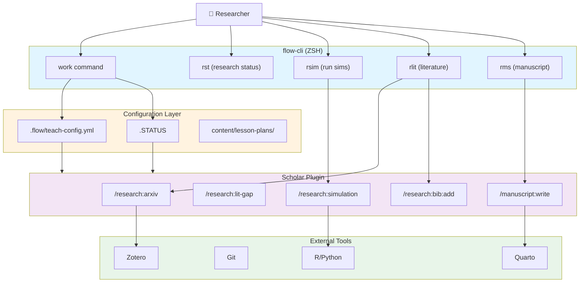

# flow-cli Integration for Research

**Time to Setup:** 20-40 minutes
**Difficulty:** Intermediate
**Prerequisites:** Basic understanding of Scholar commands, flow-cli installed
**Output:** Automated research workflows with custom shortcuts

---

## Overview

### What is flow-cli?

flow-cli is a ZSH-based workflow automation system that orchestrates Scholar commands with project management, version control, and environment configuration. It provides:

- **Smart context detection** - Automatically identifies project type (R package, Python, Quarto, MCP)
- **Workflow orchestration** - Chains multiple Scholar commands together
- **Configuration management** - Centralized YAML-based settings
- **Session tracking** - Monitors progress and generates reports
- **Custom shortcuts** - ADHD-friendly command aliases

### Why Integrate Scholar with flow-cli?

Scholar provides powerful research commands, but flow-cli adds the glue that connects them into complete workflows:

| Without flow-cli | With flow-cli |
|------------------|---------------|
| `claude "/research:arxiv mediation"` | `work mediation-review` → auto-searches → opens notes |
| Manual config file paths | Auto-discovered from `.flow/` directory |
| Separate simulation runs | `rsim` → runs all sims → generates report |
| Manual literature tracking | `rlit` → searches → adds to Zotero → updates BibTeX |

**Key benefit:** Reduce cognitive load by automating repetitive research tasks.

---

## Architecture Overview

### System Components



### Data Flow

1. **Command Invocation** - User runs flow-cli command (e.g., `rlit "mediation"`)
2. **Context Discovery** - flow-cli locates `.flow/teach-config.yml` and `.STATUS`
3. **Scholar Dispatch** - flow-cli calls Scholar with explicit `--config` path
4. **AI Generation** - Scholar queries Claude API with merged configuration
5. **Output Processing** - flow-cli post-processes results (opens files, updates status)
6. **Session Tracking** - Updates `.STATUS` with progress and metrics

---

## .flow/ Directory Structure for Research

### Standard Research Project Layout

```
~/projects/research/my-study/
├── .flow/
│   ├── teach-config.yml           # Main configuration
│   ├── templates/
│   │   ├── prompts/               # Custom AI prompts (v2.4.0+)
│   │   │   ├── simulation.md      # Simulation-specific prompts
│   │   │   ├── manuscript.md      # Manuscript writing prompts
│   │   │   └── literature.md      # Literature search prompts
│   │   ├── simulation-plan.yml    # Simulation design templates
│   │   └── manuscript-outline.yml # Manuscript structure templates
│   ├── cache/
│   │   ├── arxiv-results.json     # Cached literature searches
│   │   └── simulation-runs.json   # Simulation run metadata
│   └── logs/
│       ├── scholar.log            # Scholar command history
│       └── workflow.log           # flow-cli execution log
├── .STATUS                        # Project status tracking
├── content/
│   ├── manuscript/                # Manuscript files
│   │   ├── main.qmd              # Main manuscript (Quarto)
│   │   ├── references.bib        # Bibliography
│   │   └── figures/              # Generated figures
│   ├── simulations/              # Simulation scripts
│   │   ├── sim01-power.R         # Power analysis simulation
│   │   ├── sim02-bias.R          # Bias assessment
│   │   └── results/              # Simulation outputs
│   └── literature/               # Literature notes
│       ├── review-notes.md       # Extracted key points
│       └── gap-analysis.md       # Identified gaps
└── docs/
    ├── analysis-plan.md          # Pre-registered analysis plan
    └── codebook.md               # Variable documentation
```

### Configuration File: `.flow/teach-config.yml`

```yaml
# Research project configuration
scholar:
  project_type: research

  research_info:
    field: "statistics"
    topic: "causal mediation analysis"
    methods:
      - "product-of-coefficients"
      - "weighting-based estimators"
      - "sensitivity analysis"
    target_journals:
      - "Journal of the American Statistical Association"
      - "Biostatistics"
      - "Psychological Methods"

  defaults:
    manuscript_format: "quarto"     # qmd, Rmd, tex
    citation_style: "apa"           # apa, ama, chicago, nature
    simulation_language: "R"        # R, Python
    figure_format: "pdf"            # pdf, png, svg

  literature:
    search_databases:
      - "arXiv"
      - "PubMed"
      - "Google Scholar"
    years: "2015-2025"
    max_results: 50
    zotero_collection: "Mediation-Review-2025"

  simulation:
    replicates: 1000
    seed: 20250201
    parallel: true
    cores: 4
    save_workspace: true
    output_format: "rds"

  manuscript:
    word_count_target: 8000
    include_appendices: true
    supplementary_materials: true
    preprint: "bioRxiv"

  style:
    notation: "statistical"         # statistical, mathematical, engineering
    math_engine: "mathjax"          # mathjax, katex, webtex
    code_highlighting: "github"     # github, tango, pygments
    theorem_style: "definition"     # definition, plain, remark
```

### .STATUS File for Research Projects

```yaml
status: Active                      # Draft/Active/Under Review/Paused/Complete
progress: 45                        # 0-100
next: Run sensitivity analysis simulations (sim03)
target: Journal of the American Statistical Association
milestone: Manuscript draft complete | Simulations validated
last_session: 2026-02-01 - Literature review gap analysis
complexity: High
risk_level: Medium
dependencies: R >= 4.3.0, tidyverse, mediation package

# Research-Specific Tracking
research_phase: Analysis           # Idea/Literature/Design/Analysis/Writing/Revision
hypothesis_status: Formulated      # Brainstorming/Formulated/Tested/Supported/Refuted
data_status: Simulated            # None/Planned/Collected/Simulated/Analyzed
manuscript_status: Draft          # Outline/Draft/Revision/Submitted/Accepted

# Literature Tracking
papers_reviewed: 67
papers_to_review: 23
gaps_identified: 5
hypotheses_generated: 3

# Simulation Tracking
simulations_planned: 5
simulations_complete: 2
simulation_scenarios: 12
total_replicates: 24000

# Manuscript Tracking
words_written: 4200
words_target: 8000
sections_complete: 4
sections_total: 7
figures_generated: 3
tables_generated: 2

# Collaboration
collaborators: ["Alice Smith", "Bob Jones"]
last_meeting: 2026-01-25
next_meeting: 2026-02-08
shared_overleaf: false
```

---

## Core flow-cli Commands for Research

### Session Management

#### `work <project-name>`

Start a research session with automatic context loading.

```bash
# Start working on mediation research project
work mediation-planning

# Automatically:
# 1. Changes to project directory
# 2. Loads .flow/teach-config.yml
# 3. Displays .STATUS summary
# 4. Opens recent files in editor
# 5. Starts session timer
```

#### `dash`

Master dashboard showing all projects and statuses.

```bash
dash

# Output:
# ╭─ Research Projects ─────────────────╮
# │ mediation-planning  │ 45% │ Analysis  │
# │ collider-study      │ 80% │ Writing   │
# │ product-of-three    │ 95% │ Revision  │
# ╰─────────────────────────────────────╯
```

#### `finish [message]`

End session with automatic commit and status update.

```bash
finish "Completed sensitivity analysis simulations"

# Automatically:
# 1. Git add + commit with message
# 2. Updates .STATUS with progress
# 3. Logs session duration and changes
# 4. Generates session summary
```

---

### Research-Specific Commands

#### `rst` - Research Status Dashboard

Display comprehensive project status.

```bash
rst

# Output:
# ╭─ Mediation Planning ────────────────────╮
# │ Status: Active (45%)                     │
# │ Phase: Analysis                          │
# │ Next: Run sensitivity analysis           │
# ├─ Literature ───────────────────────────┤
# │ Papers: 67 reviewed, 23 pending          │
# │ Gaps: 5 identified                       │
# ├─ Simulations ──────────────────────────┤
# │ Progress: 2/5 complete                   │
# │ Replicates: 24,000 total                 │
# ├─ Manuscript ───────────────────────────┤
# │ Words: 4,200 / 8,000 (52%)              │
# │ Sections: 4/7 complete                   │
# ╰─────────────────────────────────────────╯
```

#### `rsim [mode]` - Simulation Runner

Run simulations with auto-detection.

```bash
# Run all simulations
rsim

# Run specific simulation
rsim power

# Run in parallel (8 cores)
rsim --parallel

# Dry run (show what would run)
rsim --dry-run

# Automatically:
# 1. Detects .R/.py files in content/simulations/
# 2. Loads config from .flow/teach-config.yml
# 3. Runs with specified seed and replicates
# 4. Saves results to content/simulations/results/
# 5. Generates summary report
```

#### `rlit [query]` - Literature Search

Integrated literature search with Zotero.

```bash
# Search arXiv
rlit "causal mediation sensitivity"

# Automatically:
# 1. Calls /research:arxiv with query
# 2. Displays top 10 results
# 3. Prompts: "Add to Zotero collection?"
# 4. If yes: Adds to specified collection
# 5. Updates references.bib
# 6. Logs search in .flow/logs/scholar.log
```

#### `rms` - Manuscript Manager

Open and manage manuscript files.

```bash
# Open main manuscript
rms

# Open specific section
rms methods

# Render manuscript
rms --render

# Automatically:
# 1. Opens content/manuscript/main.qmd
# 2. Loads bibliography
# 3. Starts Quarto preview (if --render)
```

---

## Workflow Automation Examples

### Example 1: Weekly Literature Review Workflow

**Goal:** Automated weekly literature scan with Zotero integration.

**Script:** `~/.config/zsh/functions/weekly-lit-review.zsh`

```bash
#!/usr/bin/env zsh

weekly-lit-review() {
  local project_dir=$(pwd)
  local query="${1:-$(grep '^  topic:' .flow/teach-config.yml | cut -d'"' -f2)}"

  echo "🔍 Running weekly literature review for: $query"

  # 1. Search arXiv
  echo "\n📚 Searching arXiv..."
  claude "/research:arxiv $query --since last-week --max 20" | tee /tmp/arxiv-results.txt

  # 2. Extract DOIs
  echo "\n📋 Extracting DOIs..."
  local dois=$(grep -oP 'arXiv:\K[0-9.]+' /tmp/arxiv-results.txt)

  # 3. Add to Zotero
  if [[ -n "$dois" ]]; then
    echo "\n➕ Adding to Zotero..."
    for doi in ${(f)dois}; do
      claude "/research:bib:add arxiv:$doi --collection $(grep 'zotero_collection' .flow/teach-config.yml | cut -d'"' -f2)"
    done
  fi

  # 4. Generate summary
  echo "\n📝 Generating summary..."
  cat > content/literature/weekly-summary-$(date +%Y-%m-%d).md <<EOF
# Weekly Literature Review - $(date +%Y-%m-%d)

**Query:** $query
**Papers Found:** $(echo "$dois" | wc -l)
**Database:** arXiv

## Papers

$(echo "$dois" | awk '{print "- arXiv:" $1}')

## Next Steps

- [ ] Read abstracts
- [ ] Identify relevant papers for deep reading
- [ ] Update gap analysis
- [ ] Extract key methods/findings
EOF

  echo "\n✅ Weekly review complete! Summary saved to content/literature/"
}
```

**Usage:**

```bash
# Automatic (uses topic from config)
weekly-lit-review

# Custom query
weekly-lit-review "mediation sensitivity analysis"
```

---

### Example 2: Simulation Suite Runner

**Goal:** Run all simulations in order with progress tracking.

**Script:** `~/.config/zsh/functions/run-simulation-suite.zsh`

```bash
#!/usr/bin/env zsh

run-simulation-suite() {
  local sim_dir="content/simulations"
  local results_dir="$sim_dir/results"
  local log_file=".flow/logs/simulation-$(date +%Y%m%d-%H%M%S).log"

  mkdir -p "$results_dir"

  echo "🧪 Running simulation suite..." | tee -a "$log_file"
  echo "Start time: $(date)" | tee -a "$log_file"

  # Load config
  local config_file=".flow/teach-config.yml"
  local replicates=$(grep 'replicates:' "$config_file" | awk '{print $2}')
  local seed=$(grep 'seed:' "$config_file" | awk '{print $2}')
  local cores=$(grep 'cores:' "$config_file" | awk '{print $2}')

  echo "Configuration: replicates=$replicates, seed=$seed, cores=$cores" | tee -a "$log_file"

  # Find all simulation scripts
  local sim_files=(${sim_dir}/sim*.R)
  local total=${#sim_files}
  local completed=0

  for sim_file in $sim_files; do
    ((completed++))
    local sim_name=$(basename "$sim_file" .R)

    echo "\n[$completed/$total] Running $sim_name..." | tee -a "$log_file"

    # Run simulation
    local start_time=$(date +%s)

    Rscript "$sim_file" \
      --replicates "$replicates" \
      --seed "$seed" \
      --cores "$cores" \
      --output "$results_dir/${sim_name}-results.rds" \
      2>&1 | tee -a "$log_file"

    local exit_code=$?
    local end_time=$(date +%s)
    local elapsed=$((end_time - start_time))

    if [[ $exit_code -eq 0 ]]; then
      echo "✅ $sim_name completed in ${elapsed}s" | tee -a "$log_file"
    else
      echo "❌ $sim_name failed (exit code: $exit_code)" | tee -a "$log_file"
      return 1
    fi
  done

  # Generate summary report
  echo "\n📊 Generating summary report..." | tee -a "$log_file"

  Rscript -e "
    library(tidyverse)

    # Load all results
    result_files <- list.files('$results_dir', pattern = 'sim.*\\\\.rds$', full.names = TRUE)
    results <- map(result_files, readRDS)
    names(results) <- str_extract(basename(result_files), 'sim[0-9]+')

    # Combine metrics
    summary <- map_df(results, ~.x\$summary, .id = 'simulation')

    # Save summary
    write_csv(summary, '$results_dir/simulation-suite-summary.csv')

    # Print summary
    print(summary)
  " | tee -a "$log_file"

  echo "\n✅ Simulation suite complete!"
  echo "Results: $results_dir/"
  echo "Log: $log_file"

  # Update .STATUS
  local total_sims=$(ls -1 $sim_dir/sim*.R | wc -l)
  local completed_sims=$(ls -1 $results_dir/sim*-results.rds 2>/dev/null | wc -l)

  sed -i.bak "s/simulations_complete: .*/simulations_complete: $completed_sims/" .STATUS
  sed -i.bak "s/simulations_planned: .*/simulations_planned: $total_sims/" .STATUS
}
```

**Usage:**

```bash
# Run full suite
run-simulation-suite

# Monitor progress
tail -f .flow/logs/simulation-*.log
```

---

### Example 3: Manuscript Build & Deploy

**Goal:** Render manuscript with all formats and deploy to OSF/GitHub.

**Script:** `~/.config/zsh/functions/manuscript-build.zsh`

```bash
#!/usr/bin/env zsh

manuscript-build() {
  local manuscript_dir="content/manuscript"
  local output_dir="output"
  local main_file="$manuscript_dir/main.qmd"

  if [[ ! -f "$main_file" ]]; then
    echo "❌ Manuscript not found: $main_file"
    return 1
  fi

  echo "📝 Building manuscript..."

  # 1. Check for uncommitted changes
  if [[ -n $(git status --porcelain) ]]; then
    echo "⚠️  Warning: Uncommitted changes detected"
    read "?Commit changes before building? (y/n) " response
    if [[ "$response" == "y" ]]; then
      git add .
      read "?Commit message: " commit_msg
      git commit -m "$commit_msg"
    fi
  fi

  # 2. Render manuscript
  echo "\n🔨 Rendering manuscript..."

  cd "$manuscript_dir"

  quarto render main.qmd --to html
  quarto render main.qmd --to pdf
  quarto render main.qmd --to docx

  cd ../..

  # 3. Copy outputs
  mkdir -p "$output_dir"
  cp "$manuscript_dir/main.html" "$output_dir/manuscript-$(date +%Y%m%d).html"
  cp "$manuscript_dir/main.pdf" "$output_dir/manuscript-$(date +%Y%m%d).pdf"
  cp "$manuscript_dir/main.docx" "$output_dir/manuscript-$(date +%Y%m%d).docx"

  # 4. Generate word count
  local word_count=$(pdftotext "$output_dir/manuscript-$(date +%Y%m%d).pdf" - | wc -w)
  echo "📊 Word count: $word_count"

  # Update .STATUS
  sed -i.bak "s/words_written: .*/words_written: $word_count/" .STATUS

  # 5. Create archive
  echo "\n📦 Creating archive..."
  local archive_name="manuscript-$(date +%Y%m%d).zip"
  zip -r "$output_dir/$archive_name" \
    "$manuscript_dir/main.qmd" \
    "$manuscript_dir/references.bib" \
    "$manuscript_dir/figures/" \
    "content/simulations/results/" \
    -x "*.DS_Store"

  echo "\n✅ Manuscript build complete!"
  echo "Outputs: $output_dir/"
  echo "  - HTML: manuscript-$(date +%Y%m%d).html"
  echo "  - PDF: manuscript-$(date +%Y%m%d).pdf"
  echo "  - DOCX: manuscript-$(date +%Y%m%d).docx"
  echo "  - Archive: $archive_name"
}

# Deploy to OSF
manuscript-deploy-osf() {
  local archive=$(ls -t output/manuscript-*.zip | head -1)

  if [[ -z "$archive" ]]; then
    echo "❌ No manuscript archive found. Run manuscript-build first."
    return 1
  fi

  echo "🚀 Deploying to OSF..."

  # Requires osf CLI (pip install osfclient)
  local osf_project=$(grep 'osf_project:' .flow/teach-config.yml | cut -d'"' -f2)

  if [[ -z "$osf_project" ]]; then
    echo "❌ OSF project ID not configured in .flow/teach-config.yml"
    return 1
  fi

  osf upload "$osf_project" "$archive" /manuscripts/

  echo "✅ Deployed to OSF project: $osf_project"
}
```

**Usage:**

```bash
# Build manuscript
manuscript-build

# Build and deploy to OSF
manuscript-build && manuscript-deploy-osf
```

---

## Configuration Patterns

### Pattern 1: Multi-Project Configuration Inheritance

**Use case:** Share common settings across related research projects.

**Structure:**

```
~/projects/research/
├── .flow-global/
│   └── research-defaults.yml     # Shared defaults
├── mediation-planning/
│   └── .flow/
│       └── teach-config.yml      # Project-specific (inherits from global)
└── collider-study/
    └── .flow/
        └── teach-config.yml      # Project-specific (inherits from global)
```

**Global defaults:** `~/.flow-global/research-defaults.yml`

```yaml
scholar:
  defaults:
    citation_style: "apa"
    simulation_language: "R"
    manuscript_format: "quarto"

  literature:
    search_databases: ["arXiv", "PubMed"]
    years: "2015-2025"

  simulation:
    replicates: 1000
    parallel: true
    cores: 4
```

**Project-specific:** `mediation-planning/.flow/teach-config.yml`

```yaml
# Inherits from ~/.flow-global/research-defaults.yml
scholar:
  research_info:
    field: "statistics"
    topic: "causal mediation"

  # Override global defaults
  simulation:
    replicates: 5000    # Override: more replicates for this project
```

**Implementation:** Use ZSH function to merge configs

```bash
load-research-config() {
  local global_config="$HOME/.flow-global/research-defaults.yml"
  local project_config=".flow/teach-config.yml"
  local merged_config="/tmp/scholar-config-$$.yml"

  # Merge configs (project overrides global)
  yq eval-all 'select(fileIndex == 0) * select(fileIndex == 1)' \
    "$global_config" "$project_config" > "$merged_config"

  echo "$merged_config"
}
```

---

### Pattern 2: Environment-Specific Configurations

**Use case:** Different settings for local development vs. cluster runs.

**Structure:**

```
.flow/
├── teach-config.yml              # Base configuration
├── teach-config.local.yml        # Local overrides (gitignored)
└── teach-config.cluster.yml      # Cluster-specific settings
```

**Base:** `.flow/teach-config.yml`

```yaml
scholar:
  simulation:
    replicates: 1000
    parallel: true
    cores: 4
```

**Local:** `.flow/teach-config.local.yml` (gitignored)

```yaml
scholar:
  simulation:
    replicates: 100     # Faster local testing
    cores: 2            # Laptop has fewer cores
```

**Cluster:** `.flow/teach-config.cluster.yml`

```yaml
scholar:
  simulation:
    replicates: 10000   # Full production runs
    cores: 32           # HPC cluster
    output_format: "rds"
    save_workspace: false   # Save disk space
```

**Usage:**

```bash
# Local development
export SCHOLAR_ENV=local
rsim

# Cluster
export SCHOLAR_ENV=cluster
sbatch run-simulations.sh
```

---

## Troubleshooting

### Issue: Config File Not Found

**Symptom:**

```bash
❌ Error: Configuration file not found
Scholar searched:
  - .flow/teach-config.yml
  - ../.flow/teach-config.yml
  - ../../.flow/teach-config.yml
```

**Solution:**

```bash
# Option 1: Create config file
mkdir -p .flow
cat > .flow/teach-config.yml <<EOF
scholar:
  project_type: research
  research_info:
    field: "statistics"
    topic: "your-topic-here"
EOF

# Option 2: Use explicit path
claude "/research:arxiv mediation --config /path/to/.flow/teach-config.yml"
```

---

### Issue: flow-cli Commands Not Found

**Symptom:**

```bash
zsh: command not found: rst
zsh: command not found: rsim
```

**Solution:**

```bash
# Check if flow-cli is installed
which flow

# If not installed
brew install flow-cli

# Or source functions manually
source ~/.config/zsh/functions/adhd-helpers.zsh
```

---

### Issue: Simulation Runner Fails

**Symptom:**

```bash
❌ Error: No simulation files found in content/simulations/
```

**Solution:**

```bash
# Create simulations directory
mkdir -p content/simulations

# Add a simulation script
cat > content/simulations/sim01-power.R <<'EOF'
#!/usr/bin/env Rscript

# Power analysis simulation
library(tidyverse)

args <- commandArgs(trailingOnly = TRUE)
replicates <- as.integer(args[2])
seed <- as.integer(args[4])
cores <- as.integer(args[6])
output <- args[8]

set.seed(seed)

# Run simulation
results <- replicate(replicates, {
  # Simulation code here
  list(power = 0.80, se = 0.05)
}, simplify = FALSE)

# Save results
saveRDS(list(summary = data.frame(power = 0.80)), output)
EOF

chmod +x content/simulations/sim01-power.R
```

---

## Best Practices

### 1. Version Control for Configurations

Always track `.flow/teach-config.yml` in git, but gitignore sensitive data:

**`.gitignore`:**

```gitignore
# Ignore local overrides
.flow/teach-config.local.yml

# Ignore caches
.flow/cache/

# Ignore logs
.flow/logs/

# Keep templates
!.flow/templates/
```

---

### 2. Modular Prompt Templates

Store custom prompts in `.flow/templates/prompts/` for version control:

```
.flow/templates/prompts/
├── simulation.md        # Simulation design prompts
├── manuscript.md        # Manuscript writing style
└── literature.md        # Literature search strategy
```

**Example:** `.flow/templates/prompts/simulation.md`

```markdown
---
prompt_version: "2.5"
command: "simulation"
---

# Simulation Design Prompt

You are designing a Monte Carlo simulation for statistical research.

## Study Context
- Field: {{field}}
- Topic: {{topic}}
- Methods: {{methods}}

## Requirements
- Use {{simulation_language}} for implementation
- Target {{replicates}} replicates
- Parallel execution on {{cores}} cores
- Save results as {{output_format}}

## Output Format
Generate R/Python code that:
1. Defines simulation parameters
2. Implements data generation mechanism
3. Applies statistical methods
4. Summarizes results with confidence intervals
5. Creates diagnostic plots
```

---

### 3. Atomic Commits for Session Tracking

Use descriptive commit messages that `finish` can parse:

```bash
# Good
finish "Completed power analysis simulation (sim01)"
finish "Updated manuscript methods section (added sensitivity analysis)"

# Bad
finish "stuff"
finish "updates"
```

---

### 4. Session Logging

Enable comprehensive logging for debugging:

**`.flow/teach-config.yml`:**

```yaml
scholar:
  logging:
    enabled: true
    level: "debug"          # debug, info, warn, error
    file: ".flow/logs/scholar.log"
    max_size: "10MB"
    rotate: true
```

---

## Integration with External Tools

### Zotero Integration

**Setup:**

1. Install Zotero desktop app
2. Enable Zotero web API
3. Create API key: https://www.zotero.org/settings/keys
4. Add to environment:

```bash
# ~/.zshrc
export ZOTERO_API_KEY="your-api-key"
export ZOTERO_USER_ID="your-user-id"
```

**Usage:**

```bash
# Search and add to Zotero
rlit "mediation sensitivity" --zotero

# Add specific paper by DOI
claude "/research:bib:add doi:10.1080/00273171.2019.1624597 --collection Mediation-Review"
```

---

### OSF Integration

**Setup:**

```bash
# Install OSF CLI
pip install osfclient

# Authenticate
osf init
```

**Usage:**

```bash
# Upload manuscript
osf upload <project-id> output/manuscript-20260201.pdf /manuscripts/

# Upload simulation data
osf upload <project-id> content/simulations/results/ /data/simulations/
```

---

### Git Hooks for Automation

**Pre-commit hook:** `.git/hooks/pre-commit`

```bash
#!/bin/bash

# Validate .flow/teach-config.yml
if [[ -f .flow/teach-config.yml ]]; then
  if ! yq eval '.' .flow/teach-config.yml > /dev/null 2>&1; then
    echo "❌ Invalid YAML in .flow/teach-config.yml"
    exit 1
  fi
fi

# Update .STATUS with commit count
commit_count=$(git rev-list --count HEAD 2>/dev/null || echo "0")
sed -i.bak "s/commits: .*/commits: $commit_count/" .STATUS

exit 0
```

---

## Real-World Example: Complete Research Workflow

### Scenario: Causal Mediation Sensitivity Analysis Project

**Goal:** Conduct a simulation study, write a manuscript, and submit to JASA.

**Timeline:** 6 months

**Workflow:**

#### Phase 1: Setup (Week 1)

```bash
# Create project
mkdir -p ~/projects/research/mediation-sensitivity
cd ~/projects/research/mediation-sensitivity

# Initialize git
git init
git remote add origin git@github.com:username/mediation-sensitivity.git

# Create directory structure
mkdir -p .flow/templates/prompts
mkdir -p content/{manuscript,simulations,literature}
mkdir -p docs

# Create configuration
cat > .flow/teach-config.yml <<EOF
scholar:
  project_type: research
  research_info:
    field: "statistics"
    topic: "causal mediation sensitivity analysis"
    methods: ["product-of-coefficients", "weighting", "sensitivity"]
    target_journals: ["JASA", "Biostatistics"]
  defaults:
    manuscript_format: "quarto"
    citation_style: "asa"
    simulation_language: "R"
  simulation:
    replicates: 5000
    seed: 20250201
    parallel: true
    cores: 8
  literature:
    search_databases: ["arXiv", "PubMed"]
    zotero_collection: "Mediation-Sensitivity-2025"
EOF

# Create .STATUS
cat > .STATUS <<EOF
status: Active
progress: 5
next: Literature review - identify gaps
target: Journal of the American Statistical Association
research_phase: Literature
EOF

# Initial commit
git add .
git commit -m "Initial project setup"
git push -u origin main
```

#### Phase 2: Literature Review (Weeks 2-4)

```bash
# Weekly literature searches
weekly-lit-review "causal mediation sensitivity"

# Generate gap analysis
claude "/research:lit-gap mediation sensitivity analysis --output content/literature/gap-analysis.md"

# Update status
sed -i '' 's/progress: 5/progress: 20/' .STATUS
sed -i '' 's/research_phase: Literature/research_phase: Design/' .STATUS
git add .STATUS content/literature/
git commit -m "Completed literature review and gap analysis"
```

#### Phase 3: Study Design (Weeks 5-6)

```bash
# Generate hypotheses
claude "/research:hypothesis --based-on content/literature/gap-analysis.md"

# Create analysis plan
claude "/research:analysis-plan --output docs/analysis-plan.md"

# Design simulations
cat > content/simulations/sim01-power.R <<'EOF'
# Power analysis for sensitivity parameters
# ... (simulation code)
EOF

# Update status
sed -i '' 's/progress: 20/progress: 35/' .STATUS
sed -i '' 's/research_phase: Design/research_phase: Analysis/' .STATUS
```

#### Phase 4: Run Simulations (Weeks 7-10)

```bash
# Run full simulation suite
run-simulation-suite

# Monitor progress
watch -n 60 'tail -20 .flow/logs/simulation-*.log'

# Generate visualizations
Rscript content/simulations/generate-figures.R

# Update status
sed -i '' 's/progress: 35/progress: 60/' .STATUS
```

#### Phase 5: Write Manuscript (Weeks 11-16)

```bash
# Generate manuscript outline
claude "/manuscript:outline --target JASA --output content/manuscript/outline.md"

# Write sections iteratively
claude "/manuscript:write introduction --based-on docs/analysis-plan.md"
claude "/manuscript:write methods --based-on content/simulations/"
claude "/manuscript:write results --based-on content/simulations/results/"

# Build manuscript
manuscript-build

# Update status
sed -i '' 's/progress: 60/progress: 85/' .STATUS
sed -i '' 's/research_phase: Analysis/research_phase: Writing/' .STATUS
```

#### Phase 6: Revision & Submission (Weeks 17-24)

```bash
# Internal review
claude "/manuscript:review content/manuscript/main.qmd --feedback-mode detailed"

# Incorporate feedback
claude "/manuscript:revise content/manuscript/main.qmd --feedback content/manuscript/review-comments.md"

# Final build
manuscript-build

# Deploy to OSF
manuscript-deploy-osf

# Submit to journal
# (manual step via journal website)

# Update status
sed -i '' 's/progress: 85/progress: 95/' .STATUS
sed -i '' 's/manuscript_status: Draft/manuscript_status: Submitted/' .STATUS
git add .
git commit -m "Manuscript submitted to JASA"
git tag -a "v1.0-submission" -m "Initial submission to JASA"
git push --tags
```

---

## Summary

flow-cli integration with Scholar creates a powerful research automation system that:

1. **Reduces cognitive load** - ADHD-friendly shortcuts and automation
2. **Ensures reproducibility** - Version-controlled configurations
3. **Tracks progress** - Comprehensive session and status tracking
4. **Streamlines workflows** - Chains multiple commands together
5. **Integrates tools** - Connects Zotero, Git, OSF, Quarto, R/Python

**Key takeaways:**

- Store all configuration in `.flow/teach-config.yml`
- Use `.STATUS` for progress tracking
- Create custom ZSH functions for repeated workflows
- Version control everything (except sensitive data)
- Leverage parallel tools (Zotero, OSF, Git) for maximum efficiency

**Next steps:**

- Explore [Publication Workflow Automation](publication-automation.md)
- Learn [Reproducible Research Workflows](reproducibility.md)
- Read [Scholar Research Commands Reference](../../research/RESEARCH-COMMANDS-REFERENCE.md)
