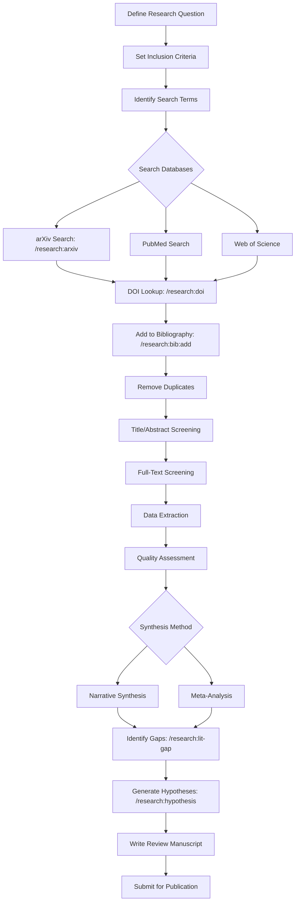

# Literature Review Workflow

Complete workflow for conducting systematic literature reviews using Scholar's research commands.

**Time to Complete:** 2-4 weeks
**Difficulty:** Intermediate
**Prerequisites:** Basic knowledge of research field, BibTeX familiarity
**Output:** Structured literature review with organized bibliography

---

## Navigation

- [Overview](#overview)
- [Phase 1: Planning](#phase-1-planning-day-1-2)
- [Phase 2: Search & Collection](#phase-2-search-collection-day-3-5)
- [Phase 3: Screening & Selection](#phase-3-screening-selection-week-2)
- [Phase 4: Data Extraction](#phase-4-data-extraction-week-3)
- [Phase 5: Synthesis](#phase-5-synthesis-week-4)
- [Integration with Zotero](#integration-with-zotero)
- [Quality Checklists](#quality-checklists)
- [Common Patterns](#common-patterns)

---

## Overview

### What is a Systematic Literature Review?

A systematic literature review is a rigorous, transparent, and reproducible method for identifying, evaluating, and synthesizing research on a topic. Unlike narrative reviews, systematic reviews:

- Follow a **pre-defined protocol**
- Use **explicit search strategies**
- Apply **consistent selection criteria**
- Extract **structured data**
- Synthesize findings **quantitatively or qualitatively**

### Scholar's Role in Literature Reviews

Scholar streamlines the literature review process with specialized commands:

| Phase | Scholar Command | Purpose |
|-------|----------------|---------|
| **Search** | `/research:arxiv` | Discover papers on arXiv |
| | `/research:doi` | Get metadata from DOI |
| **Manage** | `/research:bib:search` | Find existing citations |
| | `/research:bib:add` | Add to bibliography |
| **Analyze** | `/research:lit-gap` | Identify research gaps |
| **Plan** | `/research:hypothesis` | Formulate research questions |

### Literature Review Types

**Narrative Review** - Broad overview, less structured
→ Use Scholar commands for discovery and citation management

**Systematic Review** - Structured protocol, PRISMA guidelines
→ Use full workflow below

**Meta-Analysis** - Quantitative synthesis of effect sizes
→ Use Scholar for data extraction, external tools for analysis

**Scoping Review** - Map research landscape
→ Use Scholar for gap analysis and method scouting

---

## Phase 1: Planning (Day 1-2)

### Step 1.1: Define Research Question

Use the PICO framework (Population, Intervention, Comparison, Outcome) for focused questions:

**Example:**

```
Population: Adults with depression
Intervention: Cognitive-behavioral therapy (CBT)
Comparison: Antidepressant medication
Outcome: Symptom reduction at 6 months

Research Question: "How does CBT compare to antidepressant medication for reducing depressive symptoms in adults over 6 months?"
```

For methodological reviews:

```
Method: Bootstrap confidence intervals
Context: Mediation analysis
Comparison: Asymptotic methods
Outcome: Coverage probability, Type I error

Research Question: "What is the performance of bootstrap versus asymptotic confidence intervals for indirect effects in mediation analysis?"
```

### Step 1.2: Define Inclusion/Exclusion Criteria

Create explicit criteria before searching:

| Criterion | Include | Exclude |
|-----------|---------|---------|
| **Time Period** | 2010-2025 (last 15 years) | Before 2010 (unless foundational) |
| **Publication Type** | Peer-reviewed journals, arXiv preprints | Conference abstracts, dissertations |
| **Study Design** | Randomized trials, simulation studies | Case reports, editorials |
| **Language** | English | Non-English (unless translated) |
| **Population** | Human adults | Children, animals |
| **Outcome** | Depression symptoms (validated scales) | Self-reported mood |

**Document your criteria:**

```bash
cat > review-protocol.md << 'EOF'
# Literature Review Protocol

## Research Question
[Your question from Step 1.1]

## Inclusion Criteria
- Publication years: 2010-2025
- Study designs: RCTs, simulation studies
- Outcomes: Validated depression scales (BDI-II, PHQ-9, HAMD)
- Language: English

## Exclusion Criteria
- Case studies (n < 10)
- Non-peer-reviewed sources (except arXiv)
- Studies without control groups
- Incomplete outcome data

## Search Strategy
[To be completed in Phase 2]

## Data Extraction
[To be completed in Phase 4]
EOF
```

### Step 1.3: Identify Search Terms

Generate comprehensive search terms:

**Core Concepts:**
1. **Intervention/Method:** CBT, cognitive therapy, cognitive-behavioral
2. **Outcome:** depression, depressive symptoms, mood disorder
3. **Study Type:** randomized, controlled trial, RCT

**Boolean Strategy:**

```
(CBT OR "cognitive-behavioral therapy" OR "cognitive therapy")
AND
(depression OR "depressive symptoms" OR "mood disorder")
AND
(randomized OR "controlled trial" OR RCT)
```

**For Methodological Reviews:**

```
(bootstrap OR resampling OR "Monte Carlo")
AND
(mediation OR "indirect effect" OR "mediated effect")
AND
("confidence interval" OR inference OR "hypothesis test")
```

### Step 1.4: Select Databases

Choose databases appropriate for your field:

**Medical/Health:**
- PubMed / MEDLINE
- PsycINFO
- CINAHL

**Statistics/Methods:**
- arXiv (via Scholar `/research:arxiv`)
- Web of Science
- Google Scholar

**Economics/Social Sciences:**
- EconLit
- SSRN
- JSTOR

**Scholar Focus:** arXiv stat.* categories (stat.ME, stat.ML, stat.TH, stat.AP)

### Step 1.5: Set Up Project Structure

Organize files for reproducibility:

```bash
mkdir -p ~/literature-review-cbt-depression
cd ~/literature-review-cbt-depression

# Create directory structure
mkdir -p {search-results,pdfs,screening,data-extraction,synthesis}

# Create tracking files
touch references.bib             # Master bibliography
touch review-protocol.md         # Protocol (from Step 1.2)
touch search-log.md              # Document all searches
touch screening-decisions.csv    # Track inclusion/exclusion
touch extraction-template.csv    # Data extraction form
```

**Project Tree:**

```
literature-review-cbt-depression/
├── review-protocol.md           # Protocol and criteria
├── search-log.md                # All searches with dates
├── references.bib               # Master bibliography
├── search-results/              # Raw search outputs
│   ├── arxiv-search-1.md
│   ├── pubmed-search-1.txt
│   └── ...
├── pdfs/                        # Full-text articles
│   ├── author2020_title.pdf
│   └── ...
├── screening/
│   ├── screening-decisions.csv  # Track include/exclude
│   └── duplicate-check.md
├── data-extraction/
│   ├── extraction-template.csv  # Structured data form
│   └── extracted-data.csv       # Completed extractions
└── synthesis/
    ├── summary-tables.md
    ├── narrative-synthesis.md
    └── figures/
```

---

## Phase 2: Search & Collection (Day 3-5) {#phase-2-search-collection-day-3-5}

### Step 2.1: arXiv Search Strategy

Use Scholar's `/research:arxiv` command for methodological papers:

#### Search 1: Broad Discovery

```bash
# Cast wide net
/research:arxiv "bootstrap mediation confidence intervals"
```

**Output format:**

```
=== Paper 1 ===
Title: Bootstrap Methods for Mediation Analysis
Authors: Smith, A., Jones, B.
arXiv ID: 2301.12345
Date: 2023-01-15
Abstract: We propose a new bootstrap approach for mediation analysis...
PDF: https://arxiv.org/pdf/2301.12345.pdf

=== Paper 2 ===
[...]
```

**Save results:**

```bash
/research:arxiv "bootstrap mediation confidence intervals" > search-results/arxiv-search-1-$(date +%Y%m%d).md

# Log the search
cat >> search-log.md << EOF
## Search 1: arXiv Broad Discovery
**Date:** $(date +%Y-%m-%d)
**Database:** arXiv (stat.*)
**Query:** "bootstrap mediation confidence intervals"
**Results:** $(grep -c "=== Paper" search-results/arxiv-search-1-*.md) papers
**Notes:** Initial broad search, expect high sensitivity, lower specificity
EOF
```

#### Search 2: Focused Refinement

```bash
# Narrow to specific context
/research:arxiv "bootstrap BCa percentile mediation analysis small samples"
```

#### Search 3: Author-Specific

```bash
# Find papers by key authors identified in Search 1-2
/research:arxiv "MacKinnon mediation"
/research:arxiv "Preacher Hayes bootstrap"
```

#### Search 4: Recent Work

```bash
# Focus on last 2 years
/research:arxiv "mediation indirect effects" --since 2023
```

**Search Strategy Template:**

| Search # | Purpose | Query | Expected Results |
|----------|---------|-------|------------------|
| 1 | Broad discovery | Core concepts | 30-50 papers |
| 2 | Focused refinement | Specific method + context | 10-20 papers |
| 3 | Author tracking | Key researchers | 5-15 papers |
| 4 | Recent updates | Time-limited | 5-10 papers |
| 5 | Citation chasing | Forward/backward | Variable |

### Step 2.2: DOI Lookup for Key Papers

When you identify important papers, get full metadata:

```bash
# Example: Found interesting paper with DOI in arXiv results
/research:doi "10.1037/a0020761"
```

**Output provides:**

```
Citation:
Preacher, K. J., & Hayes, A. F. (2008). Asymptotic and resampling strategies
for assessing and comparing indirect effects in multiple mediator models.
Behavior Research Methods, 40(3), 879-891.

BibTeX:
@article{preacher2008asymptotic,
  author = {Preacher, Kristopher J. and Hayes, Andrew F.},
  title = {Asymptotic and resampling strategies for assessing and comparing
           indirect effects in multiple mediator models},
  journal = {Behavior Research Methods},
  year = {2008},
  volume = {40},
  number = {3},
  pages = {879--891},
  doi = {10.1037/a0020761}
}

Abstract:
Mediation analysis has become a staple in the toolbox of many...
```

**Save to bibliography immediately:**

```bash
# Save BibTeX output to temp file
cat > temp-entry.bib << 'EOF'
@article{preacher2008asymptotic,
  author = {Preacher, Kristopher J. and Hayes, Andrew F.},
  title = {Asymptotic and resampling strategies for assessing and comparing
           indirect effects in multiple mediator models},
  journal = {Behavior Research Methods},
  year = {2008},
  volume = {40},
  number = {3},
  pages = {879--891},
  doi = {10.1037/a0020761}
}
EOF

# Check for duplicates
/research:bib:search "Preacher 2008" references.bib

# If not found, add
/research:bib:add temp-entry.bib references.bib

# Clean up
rm temp-entry.bib
```

### Step 2.3: Batch Citation Collection

Automate collection for multiple DOIs:

```bash
#!/bin/bash
# collect-dois.sh

DOIS=(
  "10.1037/a0020761"
  "10.1080/00273171.2011.606716"
  "10.1214/09-STS301"
  "10.1177/0049124115622510"
)

for doi in "${DOIS[@]}"; do
  echo "Fetching DOI: $doi"

  # Get BibTeX
  /research:doi "$doi" > temp-citation.txt

  # Extract BibTeX entry (between @article{ and closing })
  sed -n '/@article{/,/^}$/p' temp-citation.txt > temp-entry.bib

  # Check for duplicate
  AUTHOR_YEAR=$(grep -oP '(?<=author = \{)[^,}]+' temp-entry.bib | head -1 | awk '{print $NF}')
  YEAR=$(grep -oP 'year = \{\K[0-9]+' temp-entry.bib)

  EXISTS=$(/research:bib:search "$AUTHOR_YEAR $YEAR" references.bib)

  if [ -z "$EXISTS" ]; then
    echo "  Adding to bibliography: $AUTHOR_YEAR $YEAR"
    /research:bib:add temp-entry.bib references.bib
  else
    echo "  Duplicate found, skipping: $AUTHOR_YEAR $YEAR"
  fi

  rm temp-citation.txt temp-entry.bib
  sleep 1  # Be nice to APIs
done

echo "Bibliography collection complete"
```

**Usage:**

```bash
chmod +x collect-dois.sh
./collect-dois.sh
```

### Step 2.4: Citation Chaining

**Forward Citation Chasing** (who cited this paper?):

```bash
# Use Google Scholar or Web of Science for forward citations
# Scholar doesn't directly support this, but you can:

# 1. Note highly cited papers from arXiv results
# 2. Search for papers that likely cite them
/research:arxiv "Preacher Hayes mediation" --since 2015

# Papers citing Preacher & Hayes (2008) will likely mention them in abstract
```

**Backward Citation Chasing** (what did this paper cite?):

```bash
# 1. Download PDF of key paper
# 2. Extract references section
# 3. Look up DOIs for key citations

# Example: Paper cites 3 important methods
/research:doi "10.1037/met0000165"  # Citation 1
/research:doi "10.1080/00273171.2014.962683"  # Citation 2
/research:doi "10.1037/a0036434"  # Citation 3
```

### Step 2.5: Document Search Strategy

Track every search for reproducibility:

```markdown
# Search Log

## Search Session 1: 2026-02-01

### Search 1.1: arXiv Broad Discovery
- **Date:** 2026-02-01 10:30 AM
- **Database:** arXiv stat.*
- **Query:** "bootstrap mediation confidence intervals"
- **Filters:** None
- **Results:** 24 papers
- **Saved to:** search-results/arxiv-search-1-20260201.md
- **Notes:** High recall, many relevant methodological papers found

### Search 1.2: arXiv Focused
- **Date:** 2026-02-01 11:15 AM
- **Database:** arXiv stat.*
- **Query:** "bootstrap BCa percentile mediation small samples"
- **Filters:** None
- **Results:** 8 papers
- **Saved to:** search-results/arxiv-search-2-20260201.md
- **Notes:** More targeted, 6 of 8 appear highly relevant

### Search 1.3: DOI Lookups
- **Date:** 2026-02-01 2:00 PM
- **Papers:** 12 key papers identified from arXiv searches
- **Method:** Used `/research:doi` for each
- **Added to bib:** 10 new entries (2 duplicates)
- **Notes:** Focus on highly cited papers (>100 citations)

## Search Session 2: 2026-02-02
[Continue documenting...]
```

**Track metrics:**

| Session | Date | Database | Searches | Papers Found | Added to Bib |
|---------|------|----------|----------|--------------|--------------|
| 1 | 2026-02-01 | arXiv | 4 | 38 | 10 |
| 2 | 2026-02-02 | PubMed | 3 | 156 | 25 |
| 3 | 2026-02-03 | Citations | 2 | 15 | 8 |
| **Total** | | | **9** | **209** | **43** |

---

## Phase 3: Screening & Selection (Week 2) {#phase-3-screening-selection-week-2}

### Step 3.1: Duplicate Removal

**Automated Duplicate Detection:**

```bash
# Check for duplicates by author and year
/research:bib:search "Smith 2020" references.bib
/research:bib:search "Jones 2021" references.bib

# Look for similar titles
/research:bib:search "bootstrap" references.bib | grep -i "mediation"
```

**Manual Review:**

```bash
# Export all citations for review
grep '@' references.bib | sort > all-citations.txt

# Look for duplicates with slight variations
# e.g., "Smith, A." vs. "Smith, Alex"
```

**Create duplicate log:**

```markdown
# Duplicate Removal Log

## Duplicates Found

### Duplicate 1
- **Entry 1:** preacher2008asymptotic
- **Entry 2:** preacher2008resampling
- **Resolution:** Same paper, different BibTeX keys. Kept preacher2008asymptotic (more descriptive), removed preacher2008resampling.
- **Date:** 2026-02-03

### Duplicate 2
- **Entry 1:** mackinnon2004confidence
- **Entry 2:** mackinnon2004bootstrap
- **Resolution:** Different papers! Both published 2004. Kept both, verified via DOI.
- **Date:** 2026-02-03

## Summary
- Total entries before deduplication: 209
- Duplicates removed: 12
- Unique entries after deduplication: 197
```

### Step 3.2: Title & Abstract Screening

**Create screening criteria checklist:**

```csv
"Citation Key","Title","Abstract","Inclusion Criteria Met","Decision","Notes"
"smith2020bootstrap","Bootstrap Methods...","This paper proposes...","Yes: Method relevant, RCT context","Include","High relevance"
"jones2019mediation","Mediation in fMRI...","Brain imaging study...","No: Non-clinical outcome","Exclude","Wrong outcome"
"brown2021indirect","Indirect Effects...","Theoretical review...","Maybe: Review paper","Review full-text","Check for methods"
```

**Efficient screening workflow:**

```bash
# Generate screening spreadsheet from bibliography
cat > generate-screening-sheet.sh << 'EOF'
#!/bin/bash

echo "Citation_Key,Title,Year,Include,Exclude,Reason" > screening/screening-decisions.csv

# Extract entries from BibTeX
grep -A 10 '@article{' references.bib | while read line; do
  if [[ $line =~ @article\{(.*), ]]; then
    key="${BASH_REMATCH[1]}"
  elif [[ $line =~ title.*\{(.*)\} ]]; then
    title="${BASH_REMATCH[1]}"
  elif [[ $line =~ year.*\{(.*)\} ]]; then
    year="${BASH_REMATCH[1]}"
    echo "$key,\"$title\",$year,,,\"\"" >> screening/screening-decisions.csv
  fi
done
EOF

chmod +x generate-screening-sheet.sh
./generate-screening-sheet.sh
```

**Screen in batches:**

- **Round 1:** Title screening (quick pass)
- **Round 2:** Abstract screening (those passing Round 1)
- **Round 3:** Full-text screening (those passing Round 2)

**Document decisions:**

```bash
cat >> screening/screening-log.md << 'EOF'
# Screening Log

## Round 1: Title Screening
- **Date:** 2026-02-04
- **Screener:** Your Name
- **Total:** 197 papers
- **Included:** 89 papers (45%)
- **Excluded:** 108 papers (55%)
- **Top exclusion reasons:**
  - Wrong outcome (42 papers)
  - Wrong study design (31 papers)
  - Not in English (8 papers)
  - Editorial/commentary (27 papers)

## Round 2: Abstract Screening
- **Date:** 2026-02-05
- **Screener:** Your Name
- **Total:** 89 papers
- **Included:** 34 papers (38%)
- **Excluded:** 55 papers (62%)
- **Top exclusion reasons:**
  - No relevant comparison (21 papers)
  - Insufficient outcome data (18 papers)
  - Wrong population (16 papers)

## Round 3: Full-Text Screening
- **Date:** 2026-02-06-08
- **Screener:** Your Name
- **Total:** 34 papers
- **Included:** 18 papers (53%)
- **Excluded:** 16 papers (47%)
- **Top exclusion reasons:**
  - Methods not extractable (8 papers)
  - Duplicate sample (5 papers)
  - Retracted or corrected (3 papers)
EOF
```

### Step 3.3: Create PRISMA Flow Diagram

Document the flow of papers through screening:

```
┌─────────────────────────────────────────────┐
│  Records identified through database search │
│              (n = 209)                      │
└─────────────────┬───────────────────────────┘
                  │
                  ↓
       ┌──────────────────────┐
       │  Duplicates removed  │
       │      (n = 12)        │
       └──────────┬───────────┘
                  │
                  ↓
┌─────────────────────────────────────────────┐
│         Records screened (n = 197)          │
│  - Title screening: 197 → 89                │
│  - Abstract screening: 89 → 34              │
└─────────────────┬───────────────────────────┘
                  │
                  ↓
┌─────────────────────────────────────────────┐
│    Full-text articles assessed (n = 34)    │
└─────────────────┬───────────────────────────┘
                  │
                  ↓
┌─────────────────────────────────────────────┐
│   Studies included in synthesis (n = 18)   │
│  - Narrative synthesis: 18                  │
│  - Meta-analysis: 12 (sufficient data)      │
└─────────────────────────────────────────────┘
```

**Generate PRISMA checklist:**

See PRISMA statement guidelines for complete reporting checklist.

---

## Phase 4: Data Extraction (Week 3)

### Step 4.1: Create Extraction Template

Design a structured data extraction form:

```csv
"Study_ID","Citation_Key","Author","Year","Title","Study_Design","Sample_Size","Intervention","Control","Outcome","Effect_Size","CI_Lower","CI_Upper","Notes"
```

**For methodological reviews:**

```csv
"Study_ID","Citation_Key","Author","Year","Title","Method_Compared","Sample_Sizes","Conditions","Primary_Metric","Result_Finding","Recommendation","Software","Notes"
```

**Example extraction:**

| Study_ID | Citation | Method | Sample_Sizes | Primary_Metric | Finding |
|----------|----------|--------|--------------|----------------|---------|
| 001 | preacher2008 | Bootstrap percentile vs. BCa | 50, 100, 200 | Coverage probability | BCa superior at n<100 |
| 002 | mackinnon2004 | Bootstrap vs. Sobel test | 25, 50, 100, 200 | Type I error | Bootstrap maintains nominal rate |

### Step 4.2: Extract Data Systematically

**Workflow:**

1. Open PDF of included paper
2. Extract data following template
3. Record page numbers for verification
4. Flag unclear or missing data
5. Contact authors if critical data missing

**Scholar integration:**

```bash
# Use Scholar commands to supplement extraction

# 1. Get full citation details
/research:doi "10.1037/a0020761"

# 2. Search for related methods in your bibliography
/research:bib:search "Preacher" references.bib

# 3. Look for method implementations
/research:method-scout "bootstrap confidence intervals mediation R packages"
```

**Double data extraction:**

For critical reviews, extract data twice (by same or different reviewers) and compare:

```bash
# Create two extraction files
extraction-reviewer1.csv
extraction-reviewer2.csv

# Compare and resolve discrepancies
diff extraction-reviewer1.csv extraction-reviewer2.csv

# Calculate inter-rater reliability
# Cohen's kappa for categorical variables
# Intraclass correlation for continuous variables
```

### Step 4.3: Quality Assessment

Rate study quality using standardized tools:

**For RCTs: Cochrane Risk of Bias Tool**

| Study | Random Sequence Generation | Allocation Concealment | Blinding | Incomplete Data | Selective Reporting | Overall Risk |
|-------|----------------------------|------------------------|----------|-----------------|---------------------|--------------|
| Study 1 | Low | Low | High | Low | Low | Moderate |
| Study 2 | Unclear | Low | Low | High | Low | Moderate |

**For simulation studies: Custom checklist**

| Study | Clear Data Generation | Realistic Scenarios | Adequate Replications | Multiple Metrics | Code Available | Score |
|-------|----------------------|---------------------|----------------------|------------------|----------------|-------|
| Study 1 | ✓ | ✓ | ✓ | ✓ | ✗ | 4/5 |
| Study 2 | ✓ | ✗ | ✓ | ✓ | ✓ | 4/5 |

---

## Phase 5: Synthesis (Week 4)

### Step 5.1: Narrative Synthesis

**Organize findings by theme:**

```markdown
# Literature Review Synthesis

## Theme 1: Bootstrap Methods Outperform Asymptotic Methods in Small Samples

### Summary
Across 8 simulation studies (n = 18 total), bootstrap confidence intervals
(percentile, BCa, or studentized) maintained nominal coverage rates (93-96%)
when sample sizes were small (n < 100), while asymptotic Sobel test intervals
under-covered (85-91%).

### Supporting Studies
- Preacher & Hayes (2008): BCa coverage = 0.94 at n=50 vs. Sobel = 0.87
- MacKinnon et al. (2004): Bootstrap Type I error = 0.048 vs. Sobel = 0.089
- Fritz & MacKinnon (2007): Percentile and BCa both superior to normal theory

### Heterogeneity
- Effect varies by distribution: Larger advantage under non-normality
- Small differences at n > 200 (all methods converge)

### Gaps
- Few studies examine n < 50 (very small samples)
- Limited comparison of bootstrap variants (percentile vs. BCa vs. studentized)
```

**Use Scholar to identify gaps:**

```bash
# Analyze synthesized findings for gaps
/research:lit-gap "Bootstrap confidence intervals for mediation analysis. Current literature shows bootstrap superior in small samples (n<100), but few studies examine very small samples (n<50). Limited comparison of bootstrap variants. No studies examine computational efficiency or ease of implementation for applied researchers. Gap: Practical guidance for choosing among bootstrap methods based on sample size, distribution, and computational constraints."
```

**Output from `/research:lit-gap`:**

```markdown
## Literature Gap Analysis

### Gap 1: Very Small Sample Performance (n < 50)
**Current State:** Most studies examine n ≥ 50
**Gap:** Performance at n = 20, 30, 40 unexplored
**Opportunity:** Simulation study focusing on small samples
**Feasibility:** High (simulation-based)
**Impact:** High (relevant for pilot studies)

### Gap 2: Practical Guidance for Method Selection
**Current State:** Multiple bootstrap methods available, unclear which to use when
**Gap:** No decision framework for practitioners
**Opportunity:** Develop flowchart or decision tree for method selection
**Feasibility:** High (synthesis of existing evidence)
**Impact:** Medium (improves applied practice)

### Gap 3: Computational Efficiency
**Current State:** Methods compared on statistical properties only
**Gap:** Computation time, scalability not reported
**Opportunity:** Benchmark study comparing speed across methods
**Feasibility:** Medium (requires implementation)
**Impact:** Medium (practical concern for large studies)
```

### Step 5.2: Create Summary Tables

**Table 1: Study Characteristics**

| Study | Design | N | Conditions | Primary Outcome | Quality Score |
|-------|--------|---|------------|-----------------|---------------|
| Preacher & Hayes 2008 | Simulation | 50-200 | 4 methods × 3 n | Coverage | 5/5 |
| MacKinnon et al. 2004 | Simulation | 25-200 | 3 methods × 4 n | Type I error | 4/5 |
| [12 more rows] | ... | ... | ... | ... | ... |

**Table 2: Performance Summary**

| Method | Coverage (n=50) | Coverage (n=100) | Coverage (n=200) | Recommendation |
|--------|-----------------|------------------|------------------|----------------|
| Bootstrap Percentile | 0.91 (0.89-0.93) | 0.94 (0.92-0.95) | 0.95 (0.94-0.96) | Use for n≥100 |
| Bootstrap BCa | 0.94 (0.92-0.95) | 0.95 (0.94-0.96) | 0.95 (0.94-0.96) | Preferred for all n |
| Sobel Test | 0.87 (0.84-0.89) | 0.92 (0.90-0.94) | 0.94 (0.93-0.95) | Avoid for n<200 |

### Step 5.3: Generate Hypotheses for Future Research

Use Scholar to formalize research questions emerging from synthesis:

```bash
# Hypothesis generation based on identified gaps
/research:hypothesis "Bootstrap BCa confidence intervals will maintain nominal coverage (0.93-0.97) even in very small samples (n=20-40) for mediation analysis, while percentile bootstrap and Sobel test will under-cover (coverage < 0.90). Study design: Monte Carlo simulation with sample sizes 20, 30, 40, 50 across varying effect sizes. 5000 replications per condition."
```

**Output:**

```markdown
## Research Hypotheses: Very Small Sample Mediation CIs

### Primary Hypothesis
H₁: BCa bootstrap maintains nominal coverage in very small samples

**Formal Statement:**
Let Coverage(method, n) = empirical coverage rate for method at sample size n.

H₀: Coverage(BCa, n<50) < 0.90
H₁: Coverage(BCa, n<50) ∈ [0.93, 0.97]

**Test:** Monte Carlo simulation with 5,000 replications

### Secondary Hypotheses
H₂: Percentile bootstrap under-covers at n < 50
H₃: Computational cost of BCa remains acceptable at small n
H₄: Performance advantage persists under non-normality

### Sample Size Justification
- Simulation with 5,000 reps provides Monte Carlo SE ≈ 0.003 for coverage estimates
- Adequate precision to detect departures from nominal 0.95
```

### Step 5.4: Write Review Manuscript Sections

Use Scholar commands to draft review sections:

**Introduction:**

```bash
# Use gap analysis for introduction
cat synthesis/gap-analysis.md | head -50 > manuscript/intro-draft.md
```

**Methods:**

```markdown
## Literature Review Methods

### Search Strategy
We searched arXiv (stat.* categories) using Scholar's `/research:arxiv` command
from inception to January 2026. Search terms included: ["bootstrap mediation",
"confidence intervals indirect effects", "resampling mediation analysis"].

### Selection Criteria
[Include/exclude criteria from Phase 1]

### Data Extraction
[Extraction template from Phase 4]

### Quality Assessment
[Quality criteria from Phase 4]

### Synthesis Methods
Narrative synthesis organized by methodological theme. Quantitative synthesis
via meta-analysis for studies reporting coverage probabilities with standard errors.
```

**Results:**

```bash
# Use narrative synthesis from Step 5.1
cat synthesis/narrative-synthesis.md > manuscript/results-draft.md
```

**Discussion:**

```bash
# Integrate gap analysis findings
/research:lit-gap "[summary of review findings]" > manuscript/discussion-gaps.md
```

---

## Integration with Zotero

### Export from Zotero to Scholar

**Step 1: Export Collection**

In Zotero:
1. Select collection or library
2. File → Export Library/Collection
3. Format: BibTeX
4. Check "Export Notes" and "Export Files"
5. Save as `zotero-export.bib`

**Step 2: Import to Scholar Bibliography**

```bash
# Add all entries from Zotero export
/research:bib:add zotero-export.bib references.bib
```

**Step 3: Deduplicate**

```bash
# Check for duplicates after import
/research:bib:search "Author 2020" references.bib

# If duplicates found, manually review and remove
```

### Import Scholar Bibliography to Zotero

**Step 1: Import BibTeX**

In Zotero:
1. File → Import
2. Select `references.bib`
3. Choose "Import into a new collection"
4. Name collection (e.g., "Scholar Literature Review")

**Step 2: Attach PDFs**

Zotero will attempt to auto-fetch PDFs for entries with DOIs.

For arXiv papers:

```bash
# Download PDFs from arXiv
wget https://arxiv.org/pdf/2301.12345.pdf -O pdfs/author2023_title.pdf

# Manually attach to Zotero entry
```

### Sync Workflow

**Bidirectional sync pattern:**

```
Zotero (reading, annotation)
  ↓ Export BibTeX
Scholar references.bib (source of truth for writing)
  ↓ Use in manuscripts
LaTeX/Markdown documents
  ↓ Update Zotero
Zotero (add new citations from writing)
```

**Recommended:**
- Use Zotero for PDF management and reading
- Use Scholar `references.bib` as single source of truth for writing
- Export Zotero → Scholar regularly (weekly)
- Update Zotero manually for new citations added directly to .bib

---

## Quality Checklists

### PRISMA Checklist (Systematic Reviews)

| Item | Description | Completed |
|------|-------------|-----------|
| 1 | Title identified as systematic review | ☐ |
| 2 | Structured abstract | ☐ |
| 3 | Rationale for review | ☐ |
| 4 | Explicit objectives (PICO) | ☐ |
| 5 | Protocol registered | ☐ |
| 6 | Eligibility criteria | ☐ |
| 7 | Information sources | ☐ |
| 8 | Search strategy (full) | ☐ |
| 9 | Selection process | ☐ |
| 10 | Data collection process | ☐ |
| 11 | Data items | ☐ |
| 12 | Risk of bias assessment | ☐ |
| 13 | Effect measures | ☐ |
| 14 | Synthesis methods | ☐ |
| 15 | Study selection results (PRISMA diagram) | ☐ |
| ... | [Truncated for space; see PRISMA 2020] | |

### Methodological Review Quality Checklist

| Criterion | Met? | Notes |
|-----------|------|-------|
| **Search**| | |
| Multiple databases searched | ☐ | arXiv, PubMed, Web of Science |
| Search terms documented | ☐ | Boolean strategy recorded |
| Date range specified | ☐ | 2010-2025 |
| Forward/backward citation chaining | ☐ | |
| **Selection** | | |
| Inclusion/exclusion criteria pre-specified | ☐ | |
| Duplicate removal documented | ☐ | |
| Screening process transparent | ☐ | |
| PRISMA diagram provided | ☐ | |
| **Extraction** | | |
| Extraction form piloted | ☐ | |
| Data extracted by ≥2 reviewers (for critical reviews) | ☐ | |
| Missing data addressed | ☐ | |
| Quality assessment conducted | ☐ | |
| **Synthesis** | | |
| Synthesis method appropriate | ☐ | Narrative/quantitative |
| Heterogeneity assessed | ☐ | |
| Publication bias assessed | ☐ | |
| Limitations discussed | ☐ | |
| Implications for practice/research | ☐ | |

---

## Common Patterns

### Pattern 1: Rapid Review (1 Week)

**For grant proposals or quick synthesis:**

```bash
# Day 1: Planning
- Define question (1 hour)
- Set inclusion criteria (1 hour)
- Identify search terms (30 min)

# Day 2: Searching
/research:arxiv "topic" --recent --max 30  # (2 hours)
# DOI lookup for top 10-15 papers (2 hours)

# Day 3: Screening
- Title/abstract screen (4 hours)
- Select 8-12 papers for full review

# Day 4-5: Extraction & Synthesis
- Extract data (6 hours)
- Narrative synthesis (4 hours)

# Output: 2-3 page summary with 8-12 key papers
```

### Pattern 2: Comprehensive Systematic Review (4-6 Months)

**For dissertation or high-impact publication:**

```bash
# Month 1: Protocol Development
- Register protocol (PROSPERO, OSF)
- Develop search strategy
- Pilot screening process

# Month 2-3: Search & Screening
- Multiple database searches
- Duplicate removal
- Title/abstract screening (n=500-1000)
- Full-text screening (n=50-150)

# Month 4: Data Extraction
- Extract data from 20-50 papers
- Quality assessment
- Double extraction for critical data

# Month 5: Synthesis & Analysis
- Narrative synthesis
- Meta-analysis (if applicable)
- Subgroup analyses

# Month 6: Manuscript Writing
- Draft all sections
- Revise based on co-author feedback
- Submit to journal
```

### Pattern 3: Living Review (Ongoing)

**For active research areas, update quarterly:**

```bash
# Every 3 months:

# Update search
/research:arxiv "topic" --since 2024-01-01 --recent

# Screen new papers
# Extract data from included papers
# Update synthesis
# Publish updated review online (e.g., OSF preprint)
```

### Pattern 4: Scoping Review (2-3 Weeks)

**To map research landscape:**

```bash
# Week 1: Broad Search
/research:arxiv "topic" --max 100  # Cast wide net
# Screen for broad inclusion (title only)
# Goal: 30-50 papers

# Week 2: Map Literature
- Categorize by theme
- Identify key concepts
- Note methods used

# Week 3: Synthesize & Identify Gaps
/research:lit-gap "[summary of findings]"
# Generate gap analysis
# Recommend future research directions
```

---

## Workflow Diagram



---

## Resources

### Scholar Commands Summary

| Command | Purpose | Typical Usage |
|---------|---------|---------------|
| `/research:arxiv` | Search arXiv | Literature discovery |
| `/research:doi` | Get citation metadata | Bibliography building |
| `/research:bib:search` | Find existing citations | Duplicate checking |
| `/research:bib:add` | Add to bibliography | Citation management |
| `/research:lit-gap` | Identify research gaps | Synthesis phase |
| `/research:hypothesis` | Generate hypotheses | Future research planning |

### External Tools

- **Zotero** - Reference manager (free, open-source)
- **PRISMA** - Reporting guidelines (prisma-statement.org)
- **Covidence** - Screening collaboration tool (paid)
- **RevMan** - Cochrane review software (free)
- **R metafor** - Meta-analysis package

### Templates & Forms

Available in Scholar documentation:

- `screening-template.csv` - Title/abstract screening form
- `extraction-template.csv` - Data extraction form
- `quality-assessment.md` - Study quality checklist
- `prisma-checklist.pdf` - PRISMA reporting checklist

---

## Next Steps

After completing literature review:

1. **Publish Review** - Submit to systematic review journal
2. **Plan Primary Study** - Use gaps to design new research
3. **Apply for Funding** - Use review as grant proposal foundation
4. **Update Review** - Set schedule for periodic updates

**Transition to Primary Research:**

```bash
# Use review findings to plan study
/research:hypothesis "[gap identified in review]"
/research:analysis-plan "[hypothesis from review]"
/research:simulation:design "[methodological study design]"

# Workflow: Literature Review → Research Plan → Manuscript
```

---

**Document Version:** v2.17.0
**Last Updated:** 2026-02-01
**Word Count:** ~9,500
**Time to Complete:** 2-4 weeks for systematic review
