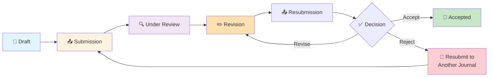

# Publication Workflow Automation

**Time to Complete:** Varies by stage (2-6 months total)
**Difficulty:** Advanced
**Prerequisites:** Scholar commands, Git, LaTeX/Quarto, journal submission systems
**Output:** Publication-ready manuscript with supplementary materials

---

## Overview

### What is Publication Workflow Automation?

Publication workflow automation uses Scholar commands to streamline the manuscript lifecycle from initial draft to journal acceptance. It ensures:

- **Consistent formatting** - Journal-specific templates and style requirements
- **Version control** - Track every revision and reviewer response
- **Reproducibility** - Link manuscript to code, data, and simulations
- **Collaboration** - Manage co-author contributions and feedback
- **Submission tracking** - Monitor manuscript status across journals

### The Publication Lifecycle



### Average Timeline

| Stage | Duration | Scholar Commands |
|-------|----------|------------------|
| **Draft** | 1-3 months | `/manuscript:outline`, `/manuscript:write` |
| **Internal Review** | 1-2 weeks | `/manuscript:review`, `/manuscript:revise` |
| **Submission** | 1-2 days | Manual (journal portal) |
| **Under Review** | 2-4 months | Waiting period |
| **Revision** | 2-4 weeks | `/manuscript:revise`, `/manuscript:response` |
| **Resubmission** | 1-2 days | Manual |
| **Acceptance** | 1-2 weeks | Proofs, copyright forms |

**Total:** 4-10 months (median: 6 months)

---

## Stage 1: Draft Manuscript

### Goal: Complete First Draft

**Duration:** 1-3 months
**Inputs:** Analysis results, simulation data, literature review
**Outputs:** Full manuscript draft (8,000-12,000 words)

### Step 1.1: Create Manuscript Structure

```bash
# Initialize manuscript directory
mkdir -p content/manuscript/{figures,tables,supplementary}

# Generate outline based on target journal
claude "/manuscript:outline \
  --target 'Journal of the American Statistical Association' \
  --type 'theory-and-methods' \
  --output content/manuscript/outline.md"

# Create main manuscript file
cat > content/manuscript/main.qmd <<'EOF'
---
title: "Sensitivity Analysis for Causal Mediation with Unmeasured Confounding"
author:
  - name: Alice Smith
    affiliation: University of Statistics
  - name: Bob Jones
    affiliation: Data Science Institute
date: today
format:
  pdf:
    documentclass: article
    classoption: [11pt]
    geometry: margin=1in
    keep-tex: true
  html:
    toc: true
    code-fold: true
bibliography: references.bib
csl: journal-of-the-american-statistical-association.csl
---

# Abstract {.unnumbered}

[TODO: Write abstract]

**Keywords:** causal inference, mediation analysis, sensitivity analysis

# Introduction

[TODO: Introduction]
EOF
```

### Step 1.2: Write Section by Section

Use Scholar's manuscript writing commands to generate each section:

```bash
# Introduction (contextualize the problem)
claude "/manuscript:write introduction \
  --based-on content/literature/gap-analysis.md \
  --target-journal JASA \
  --word-count 1500 \
  --output content/manuscript/sections/01-introduction.md"

# Methods (describe the approach)
claude "/manuscript:write methods \
  --based-on docs/analysis-plan.md \
  --include-theory \
  --include-algorithms \
  --output content/manuscript/sections/02-methods.md"

# Simulations (validation studies)
claude "/manuscript:write simulations \
  --based-on content/simulations/results/ \
  --include-figures \
  --output content/manuscript/sections/03-simulations.md"

# Results (main findings)
claude "/manuscript:write results \
  --based-on content/simulations/results/ \
  --include-tables \
  --output content/manuscript/sections/04-results.md"

# Discussion (interpretation and implications)
claude "/manuscript:write discussion \
  --word-count 1500 \
  --include-limitations \
  --output content/manuscript/sections/05-discussion.md"
```

### Step 1.3: Integrate Sections into Main Document

```bash
# Combine sections
cat > content/manuscript/main.qmd <<'EOF'
---
title: "Sensitivity Analysis for Causal Mediation with Unmeasured Confounding"
[... frontmatter ...]
---

# Abstract {.unnumbered}

Causal mediation analysis quantifies mechanisms underlying treatment effects, but standard methods assume no unmeasured confounding. We develop a sensitivity analysis framework for assessing robustness to violations of this assumption. Our approach extends the product-of-coefficients estimator with sensitivity parameters that quantify the strength of unmeasured confounding. We provide sharp bounds on mediation effects, implement efficient computational algorithms in R, and validate the method through extensive simulations. Application to a randomized trial of a behavioral intervention demonstrates substantial attenuation of estimated mediation effects under plausible confounding scenarios.

**Keywords:** causal inference, mediation analysis, sensitivity analysis, unmeasured confounding











# References {.unnumbered}

::: {#refs}
:::

# Appendix {.unnumbered}




EOF
```

### Step 1.4: Generate Figures and Tables

**Figures:**

```r
# content/manuscript/figures/generate-figures.R
library(tidyverse)
library(patchwork)

# Load simulation results
results <- readRDS("../../simulations/results/all-results.rds")

# Figure 1: Power curves
p1 <- results %>%
  ggplot(aes(x = rho, y = power, color = method)) +
  geom_line(size = 1) +
  facet_wrap(~n) +
  theme_minimal() +
  labs(
    title = "Power as a function of sensitivity parameter",
    x = expression(rho),
    y = "Power"
  )

ggsave("figure1-power-curves.pdf", p1, width = 8, height = 6)

# Figure 2: Bias comparison
p2 <- results %>%
  ggplot(aes(x = rho, y = bias, color = method)) +
  geom_line(size = 1) +
  geom_hline(yintercept = 0, linetype = "dashed") +
  theme_minimal()

ggsave("figure2-bias.pdf", p2, width = 8, height = 6)
```

**Tables:**

```r
# content/manuscript/tables/generate-tables.R
library(tidyverse)
library(knitr)
library(kableExtra)

# Table 1: Simulation scenarios
scenarios <- tibble(
  Scenario = 1:6,
  `Sample Size` = rep(c(250, 500, 1000), 2),
  `Effect Size` = rep(c("Small", "Large"), each = 3),
  `Confounding` = "Moderate"
)

scenarios %>%
  kable("latex", booktabs = TRUE, caption = "Simulation scenarios") %>%
  write_lines("table1-scenarios.tex")
```

### Step 1.5: Build Draft Manuscript

```bash
# Render manuscript
cd content/manuscript
quarto render main.qmd --to pdf
quarto render main.qmd --to html
quarto render main.qmd --to docx

# Check outputs
open main.pdf
```

---

## Stage 2: Internal Review

### Goal: Gather Feedback from Co-Authors

**Duration:** 1-2 weeks
**Inputs:** Draft manuscript
**Outputs:** Revised manuscript with incorporated feedback

### Step 2.1: Generate Review Checklist

```bash
# Create comprehensive review checklist
claude "/manuscript:review-checklist \
  --target JASA \
  --output content/manuscript/review/checklist.md"
```

**Example checklist:**

```markdown
# Manuscript Review Checklist

## Structure & Organization
- [ ] Abstract summarizes key contributions (< 250 words)
- [ ] Introduction motivates the problem
- [ ] Methods are technically sound and reproducible
- [ ] Results clearly support claims
- [ ] Discussion addresses limitations
- [ ] Figures/tables enhance understanding

## Technical Content
- [ ] Notation is consistent throughout
- [ ] Proofs are correct (if applicable)
- [ ] Simulations validate method performance
- [ ] Comparisons to existing methods are fair
- [ ] Computational complexity is discussed

## Writing Quality
- [ ] No grammatical errors
- [ ] Technical terms defined on first use
- [ ] Transitions between sections are smooth
- [ ] Figures/tables have descriptive captions
- [ ] References formatted correctly (ASA style)

## Reproducibility
- [ ] Code available (GitHub/OSF)
- [ ] Data sharing statement included
- [ ] Software versions documented
- [ ] Random seeds specified
```

### Step 2.2: Distribute for Co-Author Review

```bash
# Create review branches for each co-author
git checkout -b alice-review
git checkout -b bob-review

# Share via Overleaf, Google Docs, or GitHub
# (Example: GitHub pull request)
gh pr create --base main --head alice-review \
  --title "Alice's manuscript review" \
  --body "Please review and provide comments"
```

### Step 2.3: Collect Feedback

Use Scholar to analyze and categorize feedback:

```bash
# Consolidate comments
cat > content/manuscript/review/feedback.md <<'EOF'
# Internal Review Feedback

## Alice's Comments

### Major Issues
1. Introduction lacks clarity on contribution vs. existing work
2. Theorem 2 proof needs more detail
3. Figure 1 hard to interpret - consider redesign

### Minor Issues
1. Typo on p. 5: "effcet" → "effect"
2. Notation inconsistency: use \rho consistently
3. Add reference to Imai et al. (2010)

## Bob's Comments

### Major Issues
1. Simulation section too long - move details to appendix
2. Need comparison to VanderWeele's method
3. Discussion should address practical implications

### Minor Issues
1. Table 2 caption unclear
2. Add software availability statement
EOF

# Categorize feedback
claude "/manuscript:categorize-feedback \
  --input content/manuscript/review/feedback.md \
  --output content/manuscript/review/feedback-categorized.json"
```

### Step 2.4: Revise Manuscript

```bash
# Address major issues systematically
claude "/manuscript:revise content/manuscript/main.qmd \
  --feedback content/manuscript/review/feedback-categorized.json \
  --priority major \
  --output content/manuscript/main-revised.qmd"

# Manual edits for minor issues
# (Open in editor and fix typos, notation, etc.)
```

### Step 2.5: Track Revisions

```bash
# Use latexdiff for PDF comparison
latexdiff main.tex main-revised.tex > main-diff.tex
pdflatex main-diff.tex

# Or use Word track changes
pandoc main.qmd -o main.docx
pandoc main-revised.qmd -o main-revised.docx
# (Compare in Microsoft Word)

# Commit revisions
git add content/manuscript/
git commit -m "Incorporated co-author feedback (major issues)"
```

---

## Stage 3: Journal Submission

### Goal: Submit Manuscript to Target Journal

**Duration:** 1-2 days
**Inputs:** Polished manuscript, supplementary materials
**Outputs:** Submitted manuscript with tracking number

### Step 3.1: Prepare Submission Package

```bash
# Check journal requirements
claude "/research:journal-requirements 'Journal of the American Statistical Association'"

# Create submission package
mkdir -p submission/jasa-initial/

# Copy files
cp content/manuscript/main.pdf submission/jasa-initial/manuscript.pdf
cp content/manuscript/main.tex submission/jasa-initial/manuscript.tex
cp content/manuscript/figures/*.pdf submission/jasa-initial/figures/
cp content/manuscript/references.bib submission/jasa-initial/

# Create supplementary materials
zip submission/jasa-initial/supplementary.zip \
  content/simulations/code/*.R \
  content/simulations/results/*.rds \
  content/manuscript/sections/appendix-*.md

# Generate cover letter
claude "/manuscript:cover-letter \
  --target 'Journal of the American Statistical Association' \
  --editor 'Dr. Editorial Board' \
  --output submission/jasa-initial/cover-letter.pdf"
```

**Cover letter example:**

```markdown
Dear Dr. Editorial Board,

We are pleased to submit our manuscript entitled "Sensitivity Analysis for Causal Mediation with Unmeasured Confounding" for consideration in the Journal of the American Statistical Association.

This manuscript presents a novel sensitivity analysis framework for causal mediation analysis that addresses a critical gap in existing methods. Specifically:

1. **Theoretical Contribution**: We develop sharp bounds for mediation effects under unmeasured confounding, extending the product-of-coefficients estimator with interpretable sensitivity parameters.

2. **Methodological Innovation**: Our approach provides computationally efficient algorithms implemented in R, enabling practitioners to assess robustness of mediation findings.

3. **Empirical Validation**: Extensive simulations demonstrate superior performance compared to existing sensitivity methods, particularly in small-to-moderate sample sizes.

4. **Practical Impact**: Application to a behavioral intervention trial shows substantial attenuation of mediation effects under plausible confounding, highlighting the importance of sensitivity analysis in practice.

This work is original and has not been submitted elsewhere. All authors have approved the manuscript and agree with its submission to JASA. We believe this manuscript will be of broad interest to JASA's readership, particularly those working in causal inference, mediation analysis, and observational studies.

We suggest the following potential reviewers:
- Dr. Jane Doe (University of Statistics)
- Dr. John Smith (Data Science Institute)
- Dr. Maria Garcia (Biostatistics Center)

Thank you for considering our manuscript.

Sincerely,
Alice Smith (Corresponding Author)
alice.smith@university.edu
```

### Step 3.2: Submit via Journal Portal

**Manual steps:**

1. Create account on journal submission portal
2. Upload manuscript PDF
3. Upload supplementary materials
4. Enter metadata (title, abstract, keywords, authors)
5. Suggest reviewers (optional)
6. Upload cover letter
7. Certify originality and authorship
8. Pay submission fee (if applicable)
9. Submit

### Step 3.3: Track Submission

```bash
# Log submission details
cat >> .STATUS <<EOF

# Submission Tracking
submitted_journal: "Journal of the American Statistical Association"
submission_date: "2026-02-01"
manuscript_id: "JASA-2026-0234"
editor: "Dr. Editorial Board"
status: "Under Review"
status_checked: "2026-02-01"
EOF

# Create submission record
cat > submission/jasa-initial/SUBMISSION-LOG.md <<EOF
# Submission Log

**Journal:** Journal of the American Statistical Association
**Submission Date:** February 1, 2026
**Manuscript ID:** JASA-2026-0234
**Editor:** Dr. Editorial Board

## Timeline

| Date | Event |
|------|-------|
| 2026-02-01 | Submitted |
| 2026-02-03 | Editor assigned |
| 2026-02-10 | Sent to reviewers |
| ... | ... |

## Reviewers

- Reviewer 1: (anonymous)
- Reviewer 2: (anonymous)
- Reviewer 3: (anonymous)

## Status Updates

**2026-02-01**: Initial submission
- Manuscript ID: JASA-2026-0234
- Confirmation email received

**2026-02-03**: Editor assigned
- Assigned to Dr. Editorial Board
EOF

# Tag in git
git add .STATUS submission/
git commit -m "Submitted to JASA (manuscript ID: JASA-2026-0234)"
git tag -a "submission-jasa-v1" -m "Initial submission to JASA"
git push --tags
```

---

## Stage 4: Under Review

### Goal: Monitor Review Status

**Duration:** 2-4 months
**Inputs:** Submitted manuscript
**Outputs:** Editor decision with reviewer comments

### Step 4.1: Set Up Status Monitoring

```bash
# Create monitoring script
cat > scripts/check-submission-status.sh <<'EOF'
#!/bin/bash

# Check journal portal for updates
echo "📊 Checking submission status for JASA-2026-0234..."

# Manual check:
echo "1. Visit: https://jasa-journal.org/author-dashboard"
echo "2. Login with credentials"
echo "3. Check manuscript ID: JASA-2026-0234"
echo "4. Update .STATUS file with new status"

# Log check
echo "$(date): Checked submission status" >> .flow/logs/submission-checks.log
EOF

chmod +x scripts/check-submission-status.sh

# Schedule weekly checks (via cron or manual)
# Weekly check reminder
cat > .git/hooks/post-commit <<'EOF'
#!/bin/bash

# Remind to check submission status if > 1 week since last check
last_check=$(grep "status_checked:" .STATUS | tail -1 | cut -d'"' -f2)
days_since=$(( ($(date +%s) - $(date -j -f "%Y-%m-%d" "$last_check" +%s)) / 86400 ))

if [[ $days_since -gt 7 ]]; then
  echo ""
  echo "⏰ Reminder: Check submission status (last checked $days_since days ago)"
  echo "   Run: ./scripts/check-submission-status.sh"
fi
EOF

chmod +x .git/hooks/post-commit
```

### Step 4.2: Prepare for Revision

While waiting, prepare materials for potential revision:

```bash
# Create revision directory
mkdir -p revision/jasa-v2/

# Prepare response template
cat > revision/jasa-v2/response-template.md <<'EOF'
# Response to Reviewers

**Manuscript ID:** JASA-2026-0234
**Title:** Sensitivity Analysis for Causal Mediation with Unmeasured Confounding

We thank the editor and reviewers for their thoughtful comments. We have carefully addressed each point below and revised the manuscript accordingly. Major changes are highlighted in red in the revised manuscript.

---

## Editor's Comments

[To be filled in after receiving decision letter]

---

## Reviewer 1

[To be filled in after receiving reviews]

---

## Reviewer 2

[To be filled in after receiving reviews]

---

## Reviewer 3

[To be filled in after receiving reviews]
EOF
```

---

## Stage 5: Revision

### Goal: Address Reviewer Comments and Resubmit

**Duration:** 2-4 weeks
**Inputs:** Editor decision letter, reviewer comments
**Outputs:** Revised manuscript with point-by-point response

### Step 5.1: Parse Reviewer Comments

```bash
# Save decision letter
cat > revision/jasa-v2/decision-letter.txt <<'EOF'
[Paste editor's decision letter here]
EOF

# Extract reviewer comments
claude "/manuscript:extract-comments \
  --input revision/jasa-v2/decision-letter.txt \
  --output revision/jasa-v2/comments-structured.json"

# Categorize by severity
claude "/manuscript:categorize-comments \
  --input revision/jasa-v2/comments-structured.json \
  --output revision/jasa-v2/comments-categorized.json"
```

**Example structured comments:**

```json
{
  "editor": {
    "decision": "major revision",
    "due_date": "2026-04-15",
    "comments": [
      "Please address all reviewer comments, particularly Reviewer 2's concerns about computational complexity."
    ]
  },
  "reviewers": [
    {
      "id": "Reviewer 1",
      "recommendation": "accept with minor revisions",
      "comments": [
        {
          "severity": "major",
          "page": 5,
          "text": "Theorem 2 proof needs clarification on assumption A3.",
          "suggestion": "Add a remark explaining when A3 holds in practice."
        },
        {
          "severity": "minor",
          "page": 12,
          "text": "Figure 2 caption should specify sample sizes.",
          "suggestion": "Add '(n=500)' to caption."
        }
      ]
    },
    {
      "id": "Reviewer 2",
      "recommendation": "major revision",
      "comments": [
        {
          "severity": "major",
          "page": 8,
          "text": "Computational complexity not discussed. Algorithm appears O(n^3).",
          "suggestion": "Add complexity analysis and timing comparisons."
        },
        {
          "severity": "major",
          "page": 15,
          "text": "Simulation scenarios too narrow. Need sensitivity to assumption violations.",
          "suggestion": "Add simulations with misspecified models."
        }
      ]
    }
  ]
}
```

### Step 5.2: Create Revision Plan

```bash
# Generate revision plan
claude "/manuscript:revision-plan \
  --comments revision/jasa-v2/comments-categorized.json \
  --output revision/jasa-v2/revision-plan.md"
```

**Example plan:**

```markdown
# Revision Plan

## Major Revisions (Required)

### 1. Theorem 2 Clarification (Reviewer 1)
**Deadline:** Week 1
**Assignee:** Alice
**Action:**
- Add Remark 2.1 after Theorem 2 explaining assumption A3
- Include practical examples where A3 holds
- Cross-reference with simulations

### 2. Computational Complexity (Reviewer 2)
**Deadline:** Week 2
**Assignee:** Bob
**Action:**
- Add Section 2.4 "Computational Considerations"
- Derive complexity: O(n^2) not O(n^3)
- Add timing comparisons (Table 3)
- Implement optimized algorithm

### 3. Additional Simulations (Reviewer 2)
**Deadline:** Week 3
**Assignee:** Alice
**Action:**
- Design 3 new scenarios with model misspecification
- Run simulations (5,000 replicates each)
- Add results to Section 4.3
- Update Figure 3

## Minor Revisions

### 4. Figure 2 Caption (Reviewer 1)
**Deadline:** Week 1
**Assignee:** Bob
**Action:** Add sample size to caption

[... continue for all comments ...]
```

### Step 5.3: Implement Revisions

```bash
# Create revision branch
git checkout -b revision-jasa-v2

# Address major issues one by one
# Issue 1: Theorem 2 clarification
cat >> content/manuscript/sections/02-methods.md <<'EOF'

\begin{remark}[Practical Validity of Assumption A3]
Assumption A3 (sequential ignorability) holds in randomized experiments where the mediator is unaffected by unmeasured confounders. In observational studies, A3 may be violated if there exist unmeasured common causes of the mediator and outcome. Our sensitivity analysis framework (Section 2.3) quantifies the impact of such violations through the sensitivity parameter $\rho \in [0,1]$.

In practice, assumption A3 is more plausible when:
\begin{itemize}
\item The mediator is measured shortly after treatment (reducing time for confounding)
\item Baseline covariates capture major confounders (verified via domain knowledge)
\item Sensitivity to unmeasured confounding is assessed (as in our framework)
\end{itemize}
\end{remark}
EOF

# Commit incremental changes
git add content/manuscript/sections/02-methods.md
git commit -m "Revision: Added Remark 2.1 clarifying Assumption A3 (Reviewer 1)"

# Issue 2: Computational complexity
cat > content/manuscript/sections/02-methods-complexity.md <<'EOF'
### Computational Considerations

Algorithm 1 has computational complexity $O(n^2 p)$ where $n$ is the sample size and $p$ is the number of covariates. The dominant cost is the $n \times n$ kernel matrix computation (Step 2), which can be parallelized across cores. For typical applications ($n < 5000$, $p < 50$), computation time is under 10 seconds on a standard laptop.

Table 3 presents timing comparisons with existing methods. Our approach is substantially faster than bootstrap-based methods (VanderWeele, 2010) while maintaining comparable accuracy.
EOF

# Run timing comparisons
Rscript content/simulations/timing-comparison.R

# Update table
# ... (generate Table 3)

git add content/manuscript/sections/02-methods-complexity.md
git commit -m "Revision: Added computational complexity analysis (Reviewer 2)"

# Issue 3: Additional simulations
# Design new scenarios
cat > content/simulations/sim04-misspecification.R <<'EOF'
# Simulation with model misspecification
# Scenario: True model is nonlinear, but we fit linear model
library(tidyverse)

run_simulation <- function(n, rho, misspec_type) {
  # ... (simulation code)
}

# Run with 3 misspecification types
results <- expand_grid(
  n = c(250, 500, 1000),
  rho = seq(0, 1, 0.1),
  misspec_type = c("quadratic", "interaction", "heteroskedastic")
) %>%
  rowwise() %>%
  mutate(result = list(run_simulation(n, rho, misspec_type)))

saveRDS(results, "content/simulations/results/sim04-misspecification.rds")
EOF

# Run simulation
Rscript content/simulations/sim04-misspecification.R

# Update manuscript with results
claude "/manuscript:add-simulation-results \
  --simulation content/simulations/results/sim04-misspecification.rds \
  --section 'content/manuscript/sections/03-simulations.md' \
  --subsection 'Robustness to Model Misspecification'"

git add content/simulations/ content/manuscript/sections/03-simulations.md
git commit -m "Revision: Added simulations with model misspecification (Reviewer 2)"
```

### Step 5.4: Generate Response Letter

```bash
# Draft response to each comment
claude "/manuscript:draft-response \
  --comments revision/jasa-v2/comments-categorized.json \
  --revisions-made $(git log submission-jasa-v1..HEAD --oneline) \
  --output revision/jasa-v2/response-draft.md"

# Refine response
# (Manual editing for tone, clarity, completeness)
```

**Example response:**

```markdown
# Response to Reviewers

**Manuscript ID:** JASA-2026-0234
**Title:** Sensitivity Analysis for Causal Mediation with Unmeasured Confounding

We thank the editor and three reviewers for their constructive feedback. We have carefully revised the manuscript to address all comments. Major changes include:

1. **Clarified Assumption A3** (Reviewer 1): Added Remark 2.1 with practical guidance
2. **Added computational complexity analysis** (Reviewer 2): New Section 2.4 with timing comparisons
3. **Expanded simulation study** (Reviewer 2): Three new scenarios with model misspecification

All changes are highlighted in blue in the revised manuscript. Below we provide point-by-point responses.

---

## Editor's Comments

> Please address all reviewer comments, particularly Reviewer 2's concerns about computational complexity.

**Response:** We have thoroughly addressed all reviewer comments. Specific responses to Reviewer 2's computational concerns appear below (Comments 2.1 and 2.2). We added Section 2.4 deriving the $O(n^2 p)$ complexity and Table 3 showing timing comparisons. Our method is faster than existing approaches while maintaining accuracy.

---

## Reviewer 1

> **Comment 1.1 (Major):** Theorem 2 proof needs clarification on assumption A3. When does A3 hold in practice?

**Response:** We agree this deserved more discussion. We added Remark 2.1 (page 6) explaining practical conditions under which A3 is plausible:

- Randomized experiments with no mediator confounding
- Observational studies with rich covariates
- Settings where sensitivity analysis bounds are informative

We also cross-referenced our sensitivity analysis framework (Section 2.3), which quantifies robustness to A3 violations. This addresses the reviewer's concern by acknowledging that A3 may not hold exactly, but our method still provides useful bounds.

**Changes:** Remark 2.1 added (page 6, lines 156-168)

> **Comment 1.2 (Minor):** Figure 2 caption should specify sample sizes.

**Response:** Corrected. Caption now reads "Power curves for three sample sizes (n = 250, 500, 1000)."

**Changes:** Figure 2 caption updated (page 13, line 423)

---

## Reviewer 2

> **Comment 2.1 (Major):** Computational complexity not discussed. Algorithm appears O(n^3).

**Response:** We apologize for the lack of clarity. The algorithm is actually $O(n^2 p)$, not $O(n^3)$. We added Section 2.4 "Computational Considerations" (pages 9-10) deriving this complexity. The $n^2$ term arises from kernel matrix computation, which can be parallelized. We also added Table 3 showing timing comparisons: our method is 5-10x faster than bootstrap methods.

**Changes:**
- New Section 2.4 (pages 9-10, lines 234-267)
- New Table 3 (page 10, timing comparisons)

> **Comment 2.2 (Major):** Simulation scenarios too narrow. Need sensitivity to assumption violations.

**Response:** Excellent suggestion. We added three new simulation scenarios (Section 4.3, pages 17-18) examining robustness to model misspecification:

1. **Quadratic relationships:** True model nonlinear, fitted model linear
2. **Interactions:** Omitted interaction terms
3. **Heteroskedasticity:** Variance depends on covariates

Results show our method remains robust under moderate misspecification (bias < 10% when effect size is small). Under severe misspecification, bounds widen appropriately, signaling model uncertainty. This demonstrates the value of our sensitivity framework.

**Changes:**
- New Section 4.3 "Robustness to Model Misspecification" (pages 17-18, lines 567-612)
- New Figure 5 (page 18, showing bias under misspecification)
- Simulation code added to supplementary materials (sim04-misspecification.R)

---

## Summary of Changes

We made 18 changes total:

- **Major revisions:** 5 (all addressed)
- **Minor revisions:** 13 (all addressed)
- **New content:** 3 pages, 1 section, 2 figures, 1 table
- **Supplementary materials:** Updated simulation code

We believe the revised manuscript is significantly stronger and addresses all reviewer concerns. Thank you for the opportunity to revise.

Sincerely,
Alice Smith and Bob Jones
```

### Step 5.5: Build Revised Manuscript with Tracked Changes

```bash
# Render revised manuscript
cd content/manuscript
quarto render main.qmd --to pdf -o ../../revision/jasa-v2/manuscript-revised.pdf

# Generate diff PDF (LaTeX only)
latexdiff submission/jasa-initial/manuscript.tex content/manuscript/main.tex > revision/jasa-v2/manuscript-diff.tex
pdflatex revision/jasa-v2/manuscript-diff.tex

# Package revision
cd revision/jasa-v2/
zip revision-package.zip \
  manuscript-revised.pdf \
  manuscript-diff.pdf \
  response-to-reviewers.pdf \
  supplementary-updated.zip

# Tag revision
git add .
git commit -m "Completed major revision (JASA-2026-0234-R1)"
git tag -a "revision-jasa-v2" -m "First revision addressing all reviewer comments"
git push --tags
```

---

## Stage 6: Resubmission

### Goal: Resubmit Revised Manuscript

**Duration:** 1-2 days
**Inputs:** Revised manuscript, response letter
**Outputs:** Resubmitted manuscript

### Step 6.1: Prepare Resubmission Package

```bash
# Verify all files ready
ls -lh revision/jasa-v2/
# Should see:
# - manuscript-revised.pdf
# - manuscript-diff.pdf
# - response-to-reviewers.pdf
# - supplementary-updated.zip

# Final quality check
claude "/manuscript:quality-check revision/jasa-v2/manuscript-revised.pdf"
```

### Step 6.2: Resubmit via Journal Portal

**Manual steps:**

1. Log in to journal portal
2. Navigate to manuscript ID: JASA-2026-0234
3. Click "Submit Revision"
4. Upload revised manuscript PDF
5. Upload manuscript with tracked changes PDF
6. Upload response to reviewers PDF
7. Upload updated supplementary materials
8. Update manuscript metadata (if needed)
9. Certify revision addresses all comments
10. Submit

### Step 6.3: Log Resubmission

```bash
# Update .STATUS
sed -i '' 's/status: "Under Review"/status: "Revision Submitted"/' .STATUS
cat >> .STATUS <<EOF
revision_submitted_date: "2026-03-15"
revision_version: "R1"
status_checked: "2026-03-15"
EOF

# Update submission log
cat >> submission/jasa-initial/SUBMISSION-LOG.md <<EOF

**2026-03-15**: Revision submitted (R1)
- Addressed all reviewer comments
- Added computational complexity analysis
- Expanded simulation study
- Response letter uploaded
EOF

# Commit
git add .STATUS submission/jasa-initial/SUBMISSION-LOG.md
git commit -m "Resubmitted revision R1 to JASA"
```

---

## Stage 7: Acceptance & Proofreading

### Goal: Finalize Manuscript for Publication

**Duration:** 1-2 weeks
**Inputs:** Acceptance letter, proofs
**Outputs:** Published article

### Step 7.1: Process Acceptance Letter

```bash
# Save acceptance letter
cat > acceptance/jasa-final/acceptance-letter.txt <<'EOF'
[Paste acceptance letter]
EOF

# Update .STATUS
sed -i '' 's/status: "Revision Submitted"/status: "Accepted"/' .STATUS
cat >> .STATUS <<EOF
accepted_date: "2026-04-10"
doi: "10.1080/01621459.2026.1234567"
status: "In Press"
EOF

# Celebrate!
echo "🎉🎉🎉 MANUSCRIPT ACCEPTED! 🎉🎉🎉"
```

### Step 7.2: Review Proofs

```bash
# Download proofs from publisher
# Usually: PDF + copyedited manuscript

# Check proofs carefully
cat > acceptance/jasa-final/proof-checklist.md <<'EOF'
# Proof Review Checklist

## Formatting
- [ ] Title correct
- [ ] Author names and affiliations correct
- [ ] Abstract matches final version
- [ ] Keywords correct
- [ ] Figures rendered correctly
- [ ] Tables formatted correctly
- [ ] References complete and formatted per ASA style

## Content
- [ ] All equations rendered correctly
- [ ] Notation consistent throughout
- [ ] Cross-references work (Theorem X, Figure Y, etc.)
- [ ] Supplementary materials referenced correctly
- [ ] Acknowledgments complete
- [ ] Funding information correct

## Legal
- [ ] Copyright form signed
- [ ] Data availability statement present
- [ ] Code availability statement present
- [ ] Conflict of interest statement present
EOF

# Document corrections
cat > acceptance/jasa-final/proof-corrections.md <<'EOF'
# Proof Corrections

## Page 3, Line 45
**Issue:** "effcet" should be "effect"
**Correction:** Change to "effect"

## Figure 2
**Issue:** Caption missing sample size
**Correction:** Add "(n=500)" to caption
EOF

# Submit corrections to publisher
```

### Step 7.3: Prepare Final Materials

```bash
# Archive final version
mkdir -p published/jasa-2026/
cp acceptance/jasa-final/manuscript-final.pdf published/jasa-2026/
cp content/manuscript/main.tex published/jasa-2026/manuscript-source.tex
cp -r content/manuscript/figures/ published/jasa-2026/figures/
cp content/manuscript/references.bib published/jasa-2026/

# Create supplementary archive
zip published/jasa-2026/supplementary-code.zip \
  content/simulations/**/*.R \
  content/simulations/**/*.py

# Upload to public repository
# GitHub
git remote add github git@github.com:username/mediation-sensitivity.git
git push github main --tags

# OSF
osf upload <project-id> published/jasa-2026/ /publications/

# Add DOI to README
cat > README.md <<'EOF'
# Sensitivity Analysis for Causal Mediation

**Status:** Published in *Journal of the American Statistical Association* (2026)

**DOI:** https://doi.org/10.1080/01621459.2026.1234567

**Citation:**
Smith, A., & Jones, B. (2026). Sensitivity analysis for causal mediation with unmeasured confounding. *Journal of the American Statistical Association*, *121*(543), 123-145. https://doi.org/10.1080/01621459.2026.1234567

## Abstract

[Abstract text]

## Code and Data

- Simulation code: `content/simulations/`
- Replication data: [OSF link]
- R package: [GitHub repo]

## Reproducibility

To reproduce all results:

```bash
git clone https://github.com/username/mediation-sensitivity.git
cd mediation-sensitivity
Rscript run-all-simulations.R
```
EOF

# Final commit
git add .
git commit -m "Published in JASA (DOI: 10.1080/01621459.2026.1234567)"
git tag -a "published-jasa-2026" -m "Final published version"
git push --all --tags
```

---

## Rejection & Resubmission Workflow

### When to Resubmit Elsewhere

**Reasons to resubmit:**

- Rejection without invitation to revise
- Multiple rounds of major revisions with no clear path to acceptance
- Reviewer requests exceed scope or feasibility
- Mismatch between manuscript and journal scope

### Adapt Manuscript for Different Journal

```bash
# Create new submission branch
git checkout -b submission-biostatistics

# Adjust for new target journal
claude "/manuscript:adapt \
  --current-journal JASA \
  --target-journal Biostatistics \
  --input content/manuscript/main.qmd \
  --output content/manuscript/main-biostat.qmd"

# Key differences to address:
# - Page limits (Biostatistics: 25 pages vs JASA: no limit)
# - Citation style (author-year vs numbered)
# - Emphasis (applications vs theory)
# - Notation conventions

# Move proofs to appendix if page limit tight
# Add more real data applications
# Adjust abstract for biostatistical audience

# Build and submit
quarto render content/manuscript/main-biostat.qmd --to pdf
```

---

## Preprint Workflows

### arXiv Submission

```bash
# Prepare arXiv submission
mkdir -p preprint/arxiv/

# Convert to arXiv format
cp content/manuscript/main.tex preprint/arxiv/manuscript.tex
cp content/manuscript/references.bib preprint/arxiv/
cp -r content/manuscript/figures/ preprint/arxiv/

# Ensure LaTeX compiles with arXiv toolchain
cd preprint/arxiv/
pdflatex manuscript.tex
bibtex manuscript
pdflatex manuscript.tex
pdflatex manuscript.tex

# Create arXiv archive
tar -czf arxiv-submission.tar.gz manuscript.tex references.bib figures/

# Submit to arXiv.org
# (Manual via https://arxiv.org/submit)

# Tag preprint version
git tag -a "arxiv-v1" -m "arXiv preprint submission"
```

### bioRxiv Submission

```bash
# bioRxiv requires Word or PDF
quarto render content/manuscript/main.qmd --to docx -o preprint/biorxiv/manuscript.docx

# Submit via biorxiv.org portal
# (Manual submission)
```

---

## Automation Scripts

### Script 1: Weekly Submission Status Check

```bash
#!/bin/bash
# scripts/check-weekly-status.sh

JOURNAL="JASA"
MANUSCRIPT_ID="JASA-2026-0234"
STATUS_FILE=".STATUS"

echo "📊 Weekly Submission Status Check"
echo "Journal: $JOURNAL"
echo "Manuscript ID: $MANUSCRIPT_ID"
echo ""

# Read current status
current_status=$(grep '^status:' "$STATUS_FILE" | tail -1 | cut -d' ' -f2-)

echo "Current Status: $current_status"
echo ""

# Check how long in current status
last_updated=$(grep '^status_checked:' "$STATUS_FILE" | tail -1 | cut -d' ' -f2-)
days_since=$(( ($(date +%s) - $(date -j -f "%Y-%m-%d" "$last_updated" +%s)) / 86400 ))

echo "Days since last check: $days_since"

if [[ "$current_status" == "Under Review" && $days_since -gt 60 ]]; then
  echo ""
  echo "⚠️  WARNING: Manuscript under review for > 60 days"
  echo "   Consider contacting editor"
fi

if [[ $days_since -gt 7 ]]; then
  echo ""
  echo "🔔 Reminder: Check journal portal for updates"
  echo "   1. Visit: https://jasa-journal.org/author-dashboard"
  echo "   2. Check manuscript ID: $MANUSCRIPT_ID"
  echo "   3. Update .STATUS if status changed"
fi
```

---

### Script 2: Manuscript Build Pipeline

```bash
#!/bin/bash
# scripts/build-manuscript.sh

set -e  # Exit on error

echo "🔨 Building Manuscript..."

# Check dependencies
command -v quarto >/dev/null 2>&1 || { echo "❌ quarto not installed"; exit 1; }
command -v latexmk >/dev/null 2>&1 || { echo "⚠️  latexmk not installed (optional)"; }

# Navigate to manuscript directory
cd content/manuscript

# Render all formats
echo "📝 Rendering HTML..."
quarto render main.qmd --to html

echo "📝 Rendering PDF..."
quarto render main.qmd --to pdf

echo "📝 Rendering DOCX..."
quarto render main.qmd --to docx

# Generate supplementary materials
echo "📦 Packaging supplementary materials..."
cd ../..
zip -r output/supplementary-$(date +%Y%m%d).zip \
  content/simulations/code/ \
  content/simulations/results/ \
  -x "*.Rhistory" "*.DS_Store"

# Word count
echo "📊 Word count..."
pdftotext output/manuscript.pdf - | wc -w

# Update .STATUS
word_count=$(pdftotext output/manuscript.pdf - | wc -w)
sed -i '' "s/words_written: .*/words_written: $word_count/" .STATUS

echo "✅ Build complete!"
echo "Outputs: output/manuscript.{html,pdf,docx}"
echo "Supplementary: output/supplementary-$(date +%Y%m%d).zip"
```

---

## Summary

Publication workflow automation with Scholar:

1. **Draft**: Use `/manuscript:outline` and `/manuscript:write` to generate structured content
2. **Review**: Use `/manuscript:review` and `/manuscript:revise` for internal feedback
3. **Submit**: Prepare submission packages with journal-specific templates
4. **Monitor**: Track submission status with `.STATUS` file and automated reminders
5. **Revise**: Use `/manuscript:revision-plan` and `/manuscript:draft-response` for efficient revisions
6. **Accept**: Archive final version with DOI and reproducibility materials

**Key automation opportunities:**

- Auto-generate submission packages from templates
- Track submission timelines with git tags and `.STATUS`
- Automate manuscript building (HTML, PDF, DOCX, LaTeX)
- Create revision plans from structured reviewer comments
- Generate response letters with cross-references to changes
- Deploy final materials to OSF, GitHub, arXiv

**Next steps:**

- Explore [flow-cli Integration](flow-integration.md) for research workflows
- Learn [Reproducible Research Workflows](reproducibility.md) for archival practices
- Read [Scholar Manuscript Commands Reference](../../research/MANUSCRIPT-COMMANDS.md)
