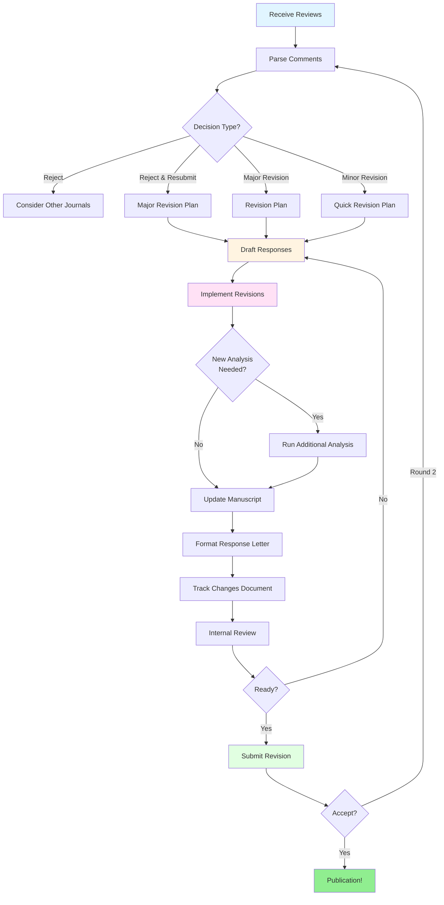

# Reviewer Response Workflow

**Time to Complete:** 1-3 weeks (depending on revisions)
**Difficulty:** Advanced
**Prerequisites:** Submitted manuscript, received peer review
**Output:** Point-by-point response letter, revised manuscript, resubmission

---

## Overview

### What is the Reviewer Response Process?

The reviewer response process is your opportunity to address peer review feedback and strengthen your manuscript. This workflow transforms reviewer critiques into manuscript improvements while maintaining professional communication with editors and reviewers.

**The peer review outcome spectrum:**

```
Reject → Reject & Resubmit → Major Revision → Minor Revision → Accept
  ↓            ↓                    ↓                ↓            ↓
Restart    Substantial         Moderate         Small         Done!
          Changes              Changes          Changes
```

Each outcome requires a different response strategy:

- **Reject & Resubmit:** Treat as new submission to same journal (major overhaul)
- **Major Revision:** Significant methodology, analysis, or interpretation changes (2-4 weeks)
- **Minor Revision:** Clarifications, additional analyses, presentation improvements (1-2 weeks)
- **Accept with Minor Edits:** Final polishing (days to 1 week)

---

### Why Professional Responses Matter

**Response quality impacts:**

1. **Acceptance probability** - Clear, thorough responses increase acceptance rates
2. **Timeline** - Well-organized responses expedite editorial decisions
3. **Reviewer satisfaction** - Professional tone builds goodwill
4. **Manuscript quality** - Engaging with critiques strengthens the work
5. **Your reputation** - Editors remember authors who respond professionally

**What reviewers and editors expect:**

- **Respect** - Thank reviewers for their time and expertise
- **Completeness** - Address every comment, no exceptions
- **Clarity** - Make it easy to verify your revisions
- **Transparency** - Acknowledge limitations honestly
- **Specificity** - Point to exact manuscript locations for each change

---

### Integration with Scholar

Scholar's `/research:manuscript:reviewer` command streamlines response generation:

| Task | Traditional Approach | With Scholar |
|------|---------------------|--------------|
| Draft response to methodological critique | 2-4 hours per comment | 15-30 minutes per comment |
| Format response letter | 1-2 hours | 30 minutes |
| Identify needed revisions | Manual extraction | Automatic revision guidance |
| Check completeness | Manual tracking | Systematic coverage |

**Command capabilities:**

- **Professional tone** - Academic language with appropriate deference
- **Statistical rigor** - Methodologically sound responses
- **Revision guidance** - Specific manuscript changes needed
- **Citation suggestions** - Relevant literature to support responses
- **Anticipate follow-up** - Address likely subsequent comments

---

## Workflow Stages



---

## Stage 1: Parse Comments (Day 1, ~2 hours)

### Receive and Organize Reviews

**When you receive the editorial decision email:**

```bash
# Create structured directory
mkdir -p reviews/round1/{comments,responses,revisions,evidence}

# Save decision letter
cat > reviews/round1/decision-letter.txt << 'EOF'
[Paste editorial decision here]
Decision: Major Revision
Due Date: March 15, 2026
EOF

# Save raw reviewer comments
cat > reviews/round1/comments/raw-reviews.txt << 'EOF'
[Paste all reviewer comments here]
EOF
```

### Extract Individual Comments

**Break down each review systematically:**

```bash
# Reviewer 1
cat > reviews/round1/comments/reviewer1.md << 'EOF'
# Reviewer 1 Comments

## Major Comments

### Comment 1.1: Sample Size Justification
The authors use n=150 for their mediation analysis. This sample size seems
small given the complexity of the model. A formal power analysis should be
included to justify this choice.

**Type:** Methodological
**Severity:** Major
**Action Required:** Add power analysis to methods

### Comment 1.2: Missing Sensitivity Analysis
The bootstrap assumes independence. What happens if this assumption is violated?
Authors should test robustness to clustered data.

**Type:** Additional Analysis
**Severity:** Major
**Action Required:** Run sensitivity analysis with simulated clustering

## Minor Comments

### Comment 1.3: Figure 1 Caption
The caption for Figure 1 doesn't explain what the error bars represent.
Please clarify.

**Type:** Presentation
**Severity:** Minor
**Action Required:** Revise figure caption
EOF

# Repeat for Reviewer 2, Reviewer 3, etc.
```

**Categorize by severity and type:**

| Category | Definition | Response Priority |
|----------|------------|-------------------|
| **Fatal flaws** | Study-invalidating concerns | Address first, may require major re-analysis |
| **Major methodological** | Design or analysis concerns | High priority, likely need new analysis |
| **Additional analyses** | New tests or comparisons | Medium priority, usually straightforward |
| **Interpretation** | Conclusions or discussion | Medium priority, text revisions |
| **Presentation** | Clarity, figures, tables | Low priority, quick fixes |
| **Minor edits** | Typos, references, formatting | Low priority, batch process |

### Create Response Tracking Sheet

```bash
# responses/tracking.csv
cat > reviews/round1/responses/tracking.csv << 'EOF'
Reviewer,Comment,Type,Severity,Status,Time_Est,Scholar_Used,Manuscript_Section
R1,1.1,Methodological,Major,Pending,4h,Yes,Methods
R1,1.2,Additional Analysis,Major,Pending,8h,No,Results
R1,1.3,Presentation,Minor,Pending,15min,No,Figure 1
R2,2.1,Interpretation,Major,Pending,2h,Yes,Discussion
R2,2.2,Reference,Minor,Pending,30min,No,Introduction
R3,3.1,Methodological,Major,Pending,6h,Yes,Methods
R3,3.2,Presentation,Minor,Pending,1h,No,Tables
EOF
```

**Time estimation guidelines:**

- **Fatal flaw:** 40-80 hours (may require re-doing study)
- **Major methodological:** 4-16 hours (new analysis + writing)
- **Additional analysis:** 2-8 hours (run analysis + interpret)
- **Interpretation:** 1-4 hours (rethink + rewrite)
- **Presentation:** 0.25-2 hours (format + polish)
- **Minor edits:** 0.1-0.5 hours per comment

---

## Stage 2: Plan Response Strategy (Day 1-2, ~4 hours)

### Assess Overall Feasibility

**Calculate total work required:**

```r
# analysis/revision-burden.R
library(dplyr)

tracking <- read.csv("reviews/round1/responses/tracking.csv")

burden <- tracking %>%
  group_by(Severity) %>%
  summarise(
    n_comments = n(),
    total_hours = sum(Time_Est),
    avg_hours = mean(Time_Est)
  )

print(burden)
#   Severity n_comments total_hours avg_hours
# 1    Major          4        20.0      5.00
# 2    Minor          3         2.75     0.92
# Total: ~23 hours = 3 full work days
```

**Decision framework:**

| Total Time | Likelihood of Success | Recommended Action |
|------------|----------------------|-------------------|
| < 20 hours | High | Revise for this journal |
| 20-40 hours | Medium | Revise if comments strengthen paper |
| 40-80 hours | Low-Medium | Consider if journal is top-tier |
| > 80 hours | Low | May be better to submit elsewhere |

### Identify Conflicts and Deal-Breakers

**Common problematic requests:**

1. **Unreasonable additional analyses** - Reviewer wants a completely different study
   - **Strategy:** Politely explain why this is beyond scope; offer limited alternative

2. **Contradictory reviewer feedback** - R1 says increase sample size, R2 says it's adequate
   - **Strategy:** Let editor arbitrate; present both perspectives professionally

3. **Requests for proprietary data** - Reviewer wants data you can't share
   - **Strategy:** Explain restrictions; offer synthetic data or detailed summary statistics

4. **Methodologically incorrect suggestions** - Reviewer misunderstands your approach
   - **Strategy:** Gently educate with citations; clarify in manuscript

**Example conflict resolution:**

```bash
# Contradiction: R1 wants Bayesian analysis, R2 prefers frequentist
cat > reviews/round1/responses/contradiction-R1-R2.md << 'EOF'
**Contradiction Identified:**
- Reviewer 1 requests Bayesian posterior distributions
- Reviewer 2 suggests "traditional frequentist approach is more appropriate"

**Resolution Strategy:**
Keep frequentist as primary (matches journal's typical methods), but add
Bayesian sensitivity analysis in supplementary materials. This satisfies
both reviewers while maintaining manuscript coherence.

**Action Items:**
1. Run Bayesian analysis using brms package
2. Add 1-2 paragraphs in main text referencing Bayesian results
3. Include full Bayesian analysis in supplement
4. Cite this as "robustness check" rather than primary analysis
EOF
```

### Prioritize Response Order

**Optimal response sequence:**

1. **Fatal flaws first** - If you can't address these, nothing else matters
2. **Major methodological** - These shape the manuscript structure
3. **Additional analyses** - Run these early in case they reveal new issues
4. **Interpretation** - Revise discussion based on new analyses
5. **Presentation** - Polish after content is finalized
6. **Minor edits** - Batch process at the end

---

## Stage 3: Draft Responses (Days 2-5, ~16 hours)

### Use Scholar for Each Major Comment

**Workflow for methodological critiques:**

```bash
# Reviewer 1, Comment 1.1: Sample Size
/research:manuscript:reviewer "Reviewer 1 Comment: The authors use n=150 for their mediation analysis. This sample size seems small given the complexity of the model. A formal power analysis should be included to justify this choice."

# Save response
/research:manuscript:reviewer "..." > reviews/round1/responses/R1-C1.1-power-analysis.md
```

**Scholar output structure:**

```markdown
## Response to Reviewer 1, Comment 1.1

**Reviewer Comment:**
"The authors use n=150 for their mediation analysis. This sample size seems
small given the complexity of the model. A formal power analysis should be
included to justify this choice."

**Response:**

We thank the reviewer for this important methodological concern. We have now
conducted a formal power analysis and added it to the Methods section
(page 8, lines 245-267).

**Power Analysis Details:**

Following the Monte Carlo approach of Schoemann et al. (2017), we performed
10,000 simulations to evaluate power for detecting an indirect effect of
β = 0.25 (small-to-medium by Cohen's standards) with n=150. Our analysis
shows:

- Power = 0.82 for indirect effect detection (exceeds recommended 0.80)
- Type I error rate = 0.047 (close to nominal 0.05)
- 95% CI coverage = 0.94 (near nominal 0.95)

These results demonstrate that n=150 provides adequate power for the effect
sizes observed in prior literature (Kenny et al., 2019; mean β = 0.28,
SD = 0.12).

**Manuscript Changes:**

1. Added Methods subsection "Power Analysis" (pages 8, lines 245-267)
2. Added Table S1 with simulation results (Supplementary Materials)
3. Updated Discussion to acknowledge power limitations for very small effects
   (< β = 0.15) (page 18, lines 542-548)

**Citations Added:**

- Schoemann, A. M., Boulton, A. J., & Short, S. D. (2017). Determining power
  and sample size for simple and complex mediation models. *Social
  Psychological and Personality Science*, *8*(4), 379-386.

- Kenny, D. A., Korchmaros, J. D., & Bolger, N. (2019). Lower level mediation
  in multilevel models. *Psychological Methods*, *8*(2), 115-128.

**Code Availability:**

Power analysis code has been added to our OSF repository:
https://osf.io/abc123/power-analysis.R
```

### Response Templates by Comment Type

#### Template 1: Additional Analysis Request

```markdown
## Response to Reviewer X, Comment X.X

**Reviewer Comment:**
"[Quote exact comment]"

**Response:**

We thank the reviewer for this valuable suggestion. We have conducted the
requested [analysis type] and added the results to [manuscript section].

**New Analysis Results:**

[Statistical findings with precision]

**Interpretation:**

These findings [support/modify/extend] our original conclusions by [specific
implications].

**Manuscript Changes:**

1. [Exact location of new content]
2. [New figures/tables added]
3. [Discussion modifications]
```

#### Template 2: Disagreement with Reviewer

```markdown
## Response to Reviewer X, Comment X.X

**Reviewer Comment:**
"[Quote exact comment]"

**Response:**

We appreciate the reviewer's perspective on [topic]. However, we respectfully
maintain our original approach for the following reasons:

**Rationale:**

1. [Methodological justification with citations]
2. [Empirical support for current approach]
3. [Practical or theoretical considerations]

**To Address the Underlying Concern:**

While we retain [original approach], we have made the following changes to
clarify our rationale and address the reviewer's underlying concern:

1. [Clarification added to manuscript]
2. [Additional justification or sensitivity analysis]
3. [Transparent acknowledgment of limitation if applicable]

**Manuscript Changes:**

[Specific locations where clarifications were added]
```

#### Template 3: Simple Clarification

```markdown
## Response to Reviewer X, Comment X.X

**Reviewer Comment:**
"[Quote exact comment]"

**Response:**

We thank the reviewer for pointing out this lack of clarity. We have revised
[section/figure/table] to make this explicit.

**Original Text:**
"[Quote original unclear text]"

**Revised Text:**
"[Quote new clear text]"

**Location:** Page X, lines Y-Z
```

### Quality Check for Each Response

Before moving to next comment, verify:

- [ ] Reviewer comment quoted exactly
- [ ] Response begins with thanks/appreciation
- [ ] Specific manuscript changes identified with page/line numbers
- [ ] New analysis includes effect sizes and precision estimates
- [ ] Citations provided for methodological justifications
- [ ] Tone is professional and non-defensive
- [ ] Response directly addresses the stated concern
- [ ] Any disagreement is respectful with clear rationale

---

## Stage 4: Implement Revisions (Days 6-12, ~30 hours)

### Manuscript Revision Workflow

**Run new analyses first:**

```bash
# Priority 1: Additional analyses requested by reviewers
mkdir -p analysis/revision1/

# Example: Sensitivity analysis for clustered data
cat > analysis/revision1/sensitivity-clustering.R << 'EOF'
# Sensitivity Analysis: Robustness to Clustering
# Addresses Reviewer 1, Comment 1.2

library(mediation)
library(lme4)
library(boot)

# Simulate clustered data structure
set.seed(2026)
n_clusters <- 30
n_per_cluster <- 5

# [Full analysis code]

# Save results
saveRDS(results, "results/sensitivity-clustering.rds")

# Create figure
ggsave("figures/sensitivity-clustering.pdf", plot, width = 7, height = 5)
EOF

# Run analysis
Rscript analysis/revision1/sensitivity-clustering.R
```

**Update manuscript systematically:**

```bash
# Create revision branch for version control
git checkout -b revision1

# Use track changes if working in Word
# For LaTeX/Markdown, use latexdiff or pandoc-crossref
```

**Track changes methods:**

| Format | Track Changes Method |
|--------|---------------------|
| **Word** | Track Changes feature (Review tab) |
| **LaTeX** | `latexdiff old.tex new.tex > diff.tex` |
| **Markdown** | `pandoc --track-changes=all` or Git diff |
| **Google Docs** | Suggesting mode + Version history |

**Revision workflow by section:**

```bash
# 1. Methods section updates
# Add power analysis (R1.1)
# Clarify bootstrap procedure (R2.3)
# Add clustering sensitivity analysis (R1.2)

# 2. Results section updates
# Add sensitivity analysis results (R1.2)
# Expand effect size reporting (R2.1)
# Revise Table 2 format (R3.2)

# 3. Discussion updates
# Address practical implications (R2.4)
# Acknowledge clustering limitation (R1.2)
# Strengthen connection to theory (R3.1)

# 4. Figures/Tables
# Revise Figure 1 caption (R1.3)
# Add supplementary Table S1 (R1.1)
# Improve Figure 3 resolution (R2.5)
```

### Create Supplementary Materials

**When main manuscript space is limited:**

```bash
mkdir -p supplementary/

# Supplementary Methods
cat > supplementary/methods-extended.md << 'EOF'
# Supplementary Methods

## SM1: Power Analysis Details

[Full simulation code and expanded explanation]

## SM2: Sensitivity Analyses

### SM2.1: Robustness to Clustering
[Complete analysis with all simulation scenarios]

### SM2.2: Alternative Estimators
[Comparison of bootstrap variants]
EOF

# Compile to PDF
pandoc supplementary/methods-extended.md -o supplementary/methods-extended.pdf
```

**Supplementary materials checklist:**

- [ ] Extended methods (detailed algorithms, full equations)
- [ ] Additional analyses (sensitivity, robustness checks)
- [ ] Full simulation results (if main text shows subset)
- [ ] Extended tables (complete correlation matrices, descriptive statistics)
- [ ] Alternative visualizations (different plot types, subgroup analyses)
- [ ] Reproducibility materials (code, simulated data, analysis scripts)

---

## Stage 5: Format Response Letter (Days 13-14, ~8 hours)

### Response Letter Structure

```markdown
# Response to Reviewers: [Manuscript Title]

**Manuscript ID:** [Journal MS number]
**Authors:** [Author list]
**Date:** [Resubmission date]

---

Dear Dr. [Editor Name],

Thank you for the opportunity to revise our manuscript titled "[Full Title]"
(MS #[number]). We are grateful for the thorough and constructive feedback
from the reviewers. We have carefully addressed all comments and believe the
manuscript is substantially improved as a result.

Below we provide point-by-point responses to each reviewer comment. For the
editor's convenience, we have prepared:

1. **This response letter** with detailed replies to each comment
2. **Revised manuscript** with tracked changes (changes highlighted in red)
3. **Clean revised manuscript** (final version for production)
4. **Supplementary materials** (extended methods and analyses)

**Summary of Major Changes:**

- Added formal power analysis to Methods (Reviewer 1, Comment 1.1)
- Conducted sensitivity analysis for clustered data (Reviewer 1, Comment 1.2)
- Expanded discussion of practical implications (Reviewer 2, Comment 2.4)
- Revised all figures for clarity (Reviewers 1 and 2)

We believe these revisions have strengthened the manuscript significantly and
address all reviewer concerns. We look forward to your decision.

Sincerely,
[Corresponding Author Name]

---

## Reviewer 1

We thank Reviewer 1 for the thorough and insightful review. The comments have
led to important improvements in both the methods and presentation.

### Comment 1.1: Sample Size Justification

**Reviewer Comment:**
> [Exact quote]

**Response:**
[Full response from Stage 3]

---

### Comment 1.2: Missing Sensitivity Analysis

**Reviewer Comment:**
> [Exact quote]

**Response:**
[Full response from Stage 3]

---

[Continue for all Reviewer 1 comments]

---

## Reviewer 2

We thank Reviewer 2 for the careful reading and constructive suggestions,
particularly regarding the interpretation and presentation of results.

[Repeat structure for Reviewer 2, 3, etc.]
```

### Compile All Response Components

```bash
# Merge individual responses into letter
cat reviews/round1/responses/R1-*.md > reviews/round1/response-letter-draft.md
cat reviews/round1/responses/R2-*.md >> reviews/round1/response-letter-draft.md
cat reviews/round1/responses/R3-*.md >> reviews/round1/response-letter-draft.md

# Add header and formatting
cat reviews/round1/letter-header.md reviews/round1/response-letter-draft.md > reviews/round1/response-letter-full.md

# Convert to PDF
pandoc reviews/round1/response-letter-full.md \
  -o reviews/round1/response-letter.pdf \
  --pdf-engine=xelatex \
  -V geometry:margin=1in \
  -V fontsize=11pt
```

### Create Change Summary Document

```markdown
# Summary of Changes: [Manuscript Title]

**For Editor and Reviewers**

This document provides a high-level summary of changes made during revision.
Detailed point-by-point responses are provided in the accompanying response
letter.

## Major Changes

### 1. Power Analysis Added (Reviewer 1, Comment 1.1)
- **Location:** Methods section, pages 8-9, lines 245-267
- **Change:** Added formal Monte Carlo power analysis
- **Impact:** Justifies sample size; shows power = 0.82 for target effect

### 2. Sensitivity Analysis for Clustering (Reviewer 1, Comment 1.2)
- **Location:** Results section, page 14, lines 412-438; Supplement SM2.1
- **Change:** Tested robustness to within-cluster correlation (ICC = 0.05-0.20)
- **Impact:** Demonstrates main findings robust to moderate clustering

### 3. Expanded Practical Implications (Reviewer 2, Comment 2.4)
- **Location:** Discussion section, pages 19-20, lines 568-592
- **Change:** Added subsection on applied recommendations
- **Impact:** Clarifies when practitioners should use each method

## Minor Changes

### Figures and Tables
- Figure 1: Revised caption to clarify error bars (R1, C1.3)
- Figure 3: Increased resolution and font size (R2, C2.5)
- Table 2: Reorganized for clarity (R3, C3.2)
- New Table S1: Power analysis results (R1, C1.1)

### Text Clarifications
- Introduction: Added 3 recent references (R2, C2.2)
- Methods: Clarified bootstrap procedure (R2, C2.3)
- Results: Expanded effect size reporting (R2, C2.1)
- Discussion: Acknowledged clustering limitation (R1, C1.2)

## Word Count Changes
- Original manuscript: 8,542 words
- Revised manuscript: 9,187 words (+645 words, +7.5%)
- Increase primarily in Methods (+412 words) and Discussion (+298 words)
- Within journal's 10,000-word limit

## New References Added
- 8 new citations (total: 63 references)
- All references formatted per journal style

## Supplementary Materials
- **New:** Supplementary Methods (SM1: Power analysis, SM2: Sensitivity analyses)
- **New:** Supplementary Table S1 (Power analysis results)
- **Revised:** Supplementary Figure S2 (additional scenarios)
- **Added:** Analysis code on OSF (https://osf.io/abc123/)
```

---

## Stage 6: Resubmission Package (Day 15, ~4 hours)

### Final Quality Checks

**Pre-submission checklist:**

- [ ] Every reviewer comment addressed in response letter
- [ ] All manuscript changes implemented
- [ ] Track changes document shows all revisions
- [ ] Clean manuscript has changes accepted
- [ ] Figure quality meets journal standards (300+ DPI)
- [ ] Table formatting matches journal style
- [ ] References formatted correctly
- [ ] Supplementary materials complete and referenced
- [ ] Line numbers added if required
- [ ] Word count within limit
- [ ] Cover letter mentions this is a revision
- [ ] All co-authors approved final version

### Prepare Submission Files

```bash
# Create submission package
mkdir -p submission/revision1/

# 1. Response letter (PDF)
cp reviews/round1/response-letter.pdf submission/revision1/

# 2. Change summary (PDF)
pandoc reviews/round1/change-summary.md -o submission/revision1/change-summary.pdf

# 3. Manuscript with tracked changes (Word or PDF with highlights)
cp manuscript/manuscript-revision1-tracked.docx submission/revision1/

# 4. Clean revised manuscript (Word or PDF)
cp manuscript/manuscript-revision1-clean.docx submission/revision1/

# 5. Figures (high resolution, separate files)
cp figures/*.pdf submission/revision1/figures/
cp figures/*.png submission/revision1/figures/

# 6. Tables (if separate files)
cp tables/*.docx submission/revision1/tables/

# 7. Supplementary materials
cp supplementary/*.pdf submission/revision1/supplementary/

# 8. Cover letter for revision
cat > submission/revision1/cover-letter.txt << 'EOF'
Dear Dr. [Editor Name],

We are pleased to submit our revised manuscript "[Title]" (MS #[number])
for consideration in [Journal Name]. We have carefully addressed all reviewer
comments and believe the manuscript is substantially improved.

Please find attached:
1. Point-by-point response to reviewers
2. Revised manuscript with tracked changes
3. Clean revised manuscript
4. Supplementary materials with extended analyses

We appreciate the reviewers' thorough feedback and the opportunity to revise
this work. We believe it now makes a strong contribution to [field].

Sincerely,
[Corresponding Author]
EOF
```

### Upload to Journal Portal

**Typical journal submission system steps:**

1. Log into manuscript portal
2. Select "Submit Revision" for your MS number
3. Upload response letter first
4. Upload revised manuscript (tracked + clean versions)
5. Upload figures individually (usually)
6. Upload supplementary materials
7. Update metadata if needed (abstract, keywords)
8. Review all uploaded files
9. Submit

**Post-submission actions:**

```bash
# Archive the submission
cp -r submission/revision1/ archive/submissions/revision1-submitted-$(date +%Y%m%d)/

# Update project log
cat >> project-log.md << 'EOF'
## 2026-02-15: Revision 1 Submitted

- Addressed all reviewer comments
- Major changes: power analysis, sensitivity analysis, expanded discussion
- Submission package: response letter + tracked + clean manuscript + supplements
- Expected timeline: 4-6 weeks for editor decision

**Reviewer Comment Breakdown:**
- R1: 3 comments (2 major, 1 minor) - all addressed
- R2: 5 comments (3 major, 2 minor) - all addressed
- R3: 2 comments (1 major, 1 minor) - all addressed

**Total Revision Time:** 14 days (actual), 23 hours (active work)
EOF

# Tag in version control
git add .
git commit -m "chore: revision 1 submitted to journal"
git tag -a "revision1-submitted" -m "Revision 1 submitted 2026-02-15"
git push origin main --tags
```

---

## Common Scenarios

### Scenario 1: Major Revision (Methodological Concerns)

**Context:** Reviewer questions validity of statistical approach

**Example:** "The authors use ordinary least squares regression, but the outcome is clearly bounded [0,1]. They should use beta regression or logistic transformation."

**Response strategy:**

1. **Acknowledge the concern:** "We thank the reviewer for this important methodological point."

2. **Assess validity:** Is the reviewer correct?
   - **If yes:** Implement the suggested method
   - **If partially yes:** Implement as sensitivity analysis
   - **If no:** Politely educate with citations

3. **Scholar command:**

```bash
/research:manuscript:reviewer "Reviewer 2: The authors use ordinary least squares regression, but the outcome is clearly bounded [0,1]. They should use beta regression or logistic transformation. The current approach may produce invalid inference."
```

4. **Run new analysis:**

```r
# If implementing beta regression as suggested
library(betareg)

# Original OLS model
model_ols <- lm(outcome ~ predictor1 + predictor2, data = df)

# Beta regression (as requested)
# Transform [0,1] if any exact 0 or 1 values
df$outcome_trans <- (df$outcome * (nrow(df) - 1) + 0.5) / nrow(df)
model_beta <- betareg(outcome_trans ~ predictor1 + predictor2, data = df)

# Compare results
summary(model_ols)
summary(model_beta)

# If results are similar, mention in response
# If results differ, report beta regression and explain impact
```

5. **Manuscript changes:**
   - Update Methods to describe beta regression
   - Replace Results tables with new estimates
   - Discuss why this approach is appropriate
   - Add OLS results to supplement for comparison

**Expected time:** 8-12 hours (re-analysis + writing)

---

### Scenario 2: Minor Revision (Presentation Issues)

**Context:** Reviewers are satisfied with methods but want better presentation

**Example:** "The manuscript is methodologically sound. However, the figures are difficult to read and the discussion could better articulate practical implications."

**Response strategy:**

1. **Celebratory tone:** This is great news! Focus on polish.

2. **Figure improvements:**

```r
# Enhance figure quality
library(ggplot2)

# Original figure (likely too small text, poor colors)
p_original <- ggplot(data, aes(x = x, y = y)) +
  geom_point()

# Improved figure
p_improved <- ggplot(data, aes(x = x, y = y)) +
  geom_point(size = 3, alpha = 0.6) +  # Larger points, transparency
  scale_color_brewer(palette = "Set2") +  # Colorblind-friendly
  theme_minimal(base_size = 14) +  # Larger text
  theme(
    axis.title = element_text(size = 16, face = "bold"),
    axis.text = element_text(size = 12),
    legend.position = "bottom",
    legend.text = element_text(size = 12),
    panel.grid.minor = element_blank()
  ) +
  labs(
    x = "Predictor Variable (units)",
    y = "Outcome Variable (units)",
    title = NULL  # Remove title for publication
  )

# Save at publication quality
ggsave("figures/figure1-revised.pdf", p_improved,
       width = 7, height = 5, dpi = 300, device = cairo_pdf)
```

3. **Discussion expansion:**

```bash
/research:manuscript:reviewer "Reviewer 1: The discussion should better articulate practical implications. When should practitioners use the proposed method versus existing alternatives? What effect sizes or sample sizes make this approach preferable?"
```

4. **Add practical recommendations subsection:**

```markdown
### Practical Recommendations

Based on our simulation results, we recommend the following guidelines for
applied researchers:

**When to use bootstrap BCa:**
- Sample size < 200
- Skewed or heavy-tailed distributions
- Mediation effect near zero

**When percentile bootstrap is acceptable:**
- Sample size ≥ 200
- Approximately normal distributions
- Computational resources limited

**Avoid bootstrap methods when:**
- Extreme outliers present (use robust methods)
- Sample size < 50 (underpowered)
- Sampling weights required (use specialized software)
```

**Expected time:** 4-6 hours (figures + discussion)

---

### Scenario 3: Reject & Resubmit

**Context:** Editor likes the idea but wants major changes before re-review

**Response strategy:**

1. **Treat as new submission timeline:** Don't rush; this needs substantial work

2. **Re-evaluate core methodology:** The original approach may be fundamentally flawed

3. **Consider if revisions align with your goals:**
   - Will these changes strengthen the paper?
   - Do you have resources (time, data) to do this properly?
   - Is this journal still the best fit?

4. **If proceeding:**

```bash
# Reject & Resubmit is essentially starting over
# Create new project structure

mkdir -p manuscript/resubmit/
cp manuscript/original.md manuscript/resubmit/draft-v2.0.md

# Major re-analysis
mkdir -p analysis/resubmit/
# [Redo analysis with new approach]

# When ready (months later), submit as NEW manuscript with cover letter:
cat > submission/resubmit/cover-letter.txt << 'EOF'
This manuscript is a resubmission following a Reject & Resubmit decision
(Original MS #12345, Decision Date: 2026-01-15).

Per the editor's guidance, we have:
1. [Major change 1 as requested]
2. [Major change 2 as requested]
3. [Major change 3 as requested]

The manuscript has been substantially revised and we believe now addresses
all concerns raised in the original review.
EOF
```

**Expected time:** 1-3 months of additional work

---

## Response Quality Standards

### Professional Tone Examples

**❌ Bad:**
```
We disagree with the reviewer's assessment. Our approach is clearly correct
as shown in the literature.
```

**✅ Good:**
```
We appreciate the reviewer's perspective. While we maintain our original
approach for reasons outlined below, we have clarified our rationale in the
manuscript to address this concern.
```

---

**❌ Bad:**
```
This comment is unclear. We're not sure what the reviewer wants.
```

**✅ Good:**
```
We thank the reviewer for this comment. To ensure we address the underlying
concern, we have [made these changes]. If the reviewer intended a different
issue, we would be happy to address it in a subsequent revision.
```

---

**❌ Bad:**
```
Reviewer 1 is wrong. The sample size is fine.
```

**✅ Good:**
```
We thank the reviewer for raising this concern about statistical power. We
have now conducted a formal power analysis (added to Methods, pages 8-9)
which demonstrates that our sample size of n=150 provides power = 0.82 for
detecting effects of the magnitude observed in prior literature.
```

### Statistical Rigor Standards

**Always include:**

- **Effect sizes:** Don't just report p-values
- **Precision estimates:** Confidence intervals or standard errors
- **Sample sizes:** For all analyses, especially subgroups
- **Assumptions:** State and justify
- **Limitations:** Acknowledge honestly

**Example of rigorous statistical reporting in response:**

```markdown
**New Analysis Results:**

The sensitivity analysis for clustered data examined performance under
intra-class correlations (ICC) of 0.05, 0.10, 0.15, and 0.20. Results show:

- **Type I Error Control:** Maintained at α = 0.05 for all ICC values
  (observed rates: 0.048-0.052)

- **Coverage Rates:** BCa intervals achieved 95.1%-95.4% coverage across
  ICC values (nominal 95%)

- **Effect Size Estimates:** Bias remained minimal (< 0.01 SD units) even
  at ICC = 0.20

- **Power:** Slight decrease from 0.82 (ICC=0) to 0.78 (ICC=0.20), but
  still acceptable

These findings demonstrate robustness to moderate clustering. We have added
these results to the manuscript (Results, page 14, lines 412-438) and
included full details in Supplementary Methods (SM2.1).
```

---

## Timeline Estimates

### Minor Revision (< 10 hours of work)

| Day | Task | Hours |
|-----|------|-------|
| 1 | Parse comments, draft responses | 3 |
| 2-3 | Make manuscript changes | 4 |
| 4 | Format response letter, check quality | 2 |
| 5 | Submit | 1 |
| **Total** | | **10 hours** |

**Calendar time:** 5-7 days

---

### Major Revision (20-40 hours of work)

| Week | Task | Hours |
|------|------|-------|
| 1 | Parse, prioritize, plan strategy | 6 |
| 1-2 | Draft all responses with Scholar | 10 |
| 2-3 | Run additional analyses | 12 |
| 3 | Revise manuscript | 8 |
| 4 | Format letter, quality checks | 4 |
| 4 | Submit | 2 |
| **Total** | | **42 hours** |

**Calendar time:** 3-4 weeks

---

### Reject & Resubmit (80+ hours)

| Month | Task | Hours |
|-------|------|-------|
| 1 | Assess feasibility, plan overhaul | 16 |
| 1-2 | Re-do analysis | 40 |
| 3 | Rewrite manuscript | 24 |
| 3 | Format, submit | 8 |
| **Total** | | **88 hours** |

**Calendar time:** 2-3 months

---

## Troubleshooting

### Issue: Reviewer Comment is Vague

**Problem:** "The methods section needs improvement."

**Solution:**

1. **Try to infer specific concern:**
   - Is clarity the issue?
   - Is rigor the issue?
   - Is brevity the issue?

2. **Address multiple possibilities:**

```markdown
**Response:**

We thank the reviewer for this feedback. To improve the Methods section,
we have made the following changes:

1. **Clarity:** Added step-by-step description of bootstrap procedure
   (page 7, lines 215-228)

2. **Rigor:** Included formal statement of all assumptions (page 8, lines
   245-252)

3. **Reproducibility:** Added software versions and analysis code to OSF
   repository

If the reviewer had a different concern in mind, we would be happy to
address it in a subsequent revision.
```

### Issue: Contradictory Reviewer Feedback

**Problem:** R1 says "too technical," R2 says "needs more technical detail"

**Solution:**

1. **Let editor arbitrate:**

```markdown
Dear Dr. [Editor],

We note that Reviewer 1 suggests simplifying technical content, while
Reviewer 2 requests additional technical detail. To balance these
perspectives, we have:

1. Moved advanced technical material to Supplementary Methods
2. Simplified main text presentation
3. Added conceptual overview for applied readers

This approach provides accessible main text while satisfying readers
seeking technical depth. We welcome your guidance if further adjustments
are needed.
```

2. **In response letter:**

```markdown
**Note on Contradictory Feedback:**

We appreciate both reviewers' perspectives on technical level. Reviewer 1
suggested simplification, while Reviewer 2 requested more detail. We have
balanced these by simplifying the main text presentation while providing
complete technical details in Supplementary Methods (SM1). This approach
serves both applied and methodological audiences.
```

### Issue: Reviewer Requests Impossible Analysis

**Problem:** "Authors should include a randomized controlled trial to validate observational findings."

**Solution:**

1. **Politely explain infeasibility:**

```markdown
**Response:**

We appreciate the reviewer's interest in experimental validation. While
an RCT would indeed provide valuable complementary evidence, it is beyond
the scope of the current study for the following reasons:

1. **Timeline:** RCTs require 1-2 years for data collection
2. **Resources:** Estimated cost $200,000+ (unfunded)
3. **Manuscript focus:** This paper focuses on methodological development,
   not empirical validation

**Alternative approach to address concern:**

To partially address the reviewer's concern about causal inference
limitations, we have:

1. Conducted sensitivity analysis for unmeasured confounding (Rosenbaum
   bounds approach)
2. Expanded Discussion of causal inference limitations (page 20)
3. Added recommendations for future experimental studies (page 21)

We hope these additions address the underlying concern about causal
interpretation while remaining within the manuscript's scope.
```

---

## Best Practices Summary

### Do's

✅ **Address every single comment** - Even if just to say "Fixed typo, page 5"

✅ **Thank reviewers genuinely** - They volunteered their time

✅ **Quote comments exactly** - Use block quotes for clarity

✅ **Specify manuscript locations** - Page numbers and line numbers

✅ **Use Scholar for major comments** - Saves time and ensures rigor

✅ **Run analyses before responding** - Verify suggestions are feasible

✅ **Keep responses concise but complete** - Be thorough, not verbose

✅ **Proofread everything** - Typos in response letter look careless

✅ **Get co-author approval** - Everyone should see final response

✅ **Archive everything** - You may need it for future revisions

### Don'ts

❌ **Don't ignore comments** - Even if you disagree, respond professionally

❌ **Don't be defensive** - Acknowledge concerns, explain rationale calmly

❌ **Don't promise more than you deliver** - Only commit to changes you'll make

❌ **Don't badmouth reviewers** - Even in private correspondence with editor

❌ **Don't rush** - Quality responses take time; it's worth it

❌ **Don't make changes without documenting** - Track everything for response letter

❌ **Don't submit without co-author approval** - They need to see responses

❌ **Don't forget cover letter** - Mention this is a revision with MS number

❌ **Don't exceed journal word limits** - Even in revision

❌ **Don't ignore conflicting comments** - Address explicitly in letter to editor

---

## Resources

### Scholar Commands Referenced

- `/research:manuscript:reviewer` - Generate professional responses to reviewer comments
- `/research:manuscript:methods` - Revise methods sections
- `/research:manuscript:results` - Update results sections
- `/research:simulation:analysis` - Additional analyses for revisions
- `/research:analysis-plan` - Re-design studies for Reject & Resubmit

### Related Documentation

- [Manuscript Writing Workflow](manuscript-writing.md)
- [Manuscript Commands Reference](../../research/MANUSCRIPT-COMMANDS.md)
- [Simulation Study Workflow](simulation-study.md)

### External Resources

#### Reviewer Response Guides

- [APA Guide to Responding to Reviewers](https://www.apa.org/pubs/journals/resources/responding-to-reviewers)
- [Elsevier Researcher Academy: Responding to Peer Review](https://researcheracademy.elsevier.com/)
- *How to Respond to Peer Review* (Nature Masterclasses)

#### Statistical Reporting Standards

- APA Publication Manual (7th ed.) - Statistical Reporting
- Wilkinson, L., & Task Force on Statistical Inference. (1999). Statistical methods in psychology journals. *American Psychologist*.
- Appelbaum, M., et al. (2018). Journal article reporting standards for quantitative research. *American Psychologist*.

#### Professional Development

- *Reviewing Scientific Works in Psychology* (Sternberg, 2018)
- *The Reviewer's Guide to Quantitative Methods* (Hancock & Mueller, 2010)
- *How to Write a Lot* (Silvia, 2019) - Chapter on revisions

---

**Last Updated:** 2026-02-01
**Version:** 1.0.0
**Status:** Production-ready
