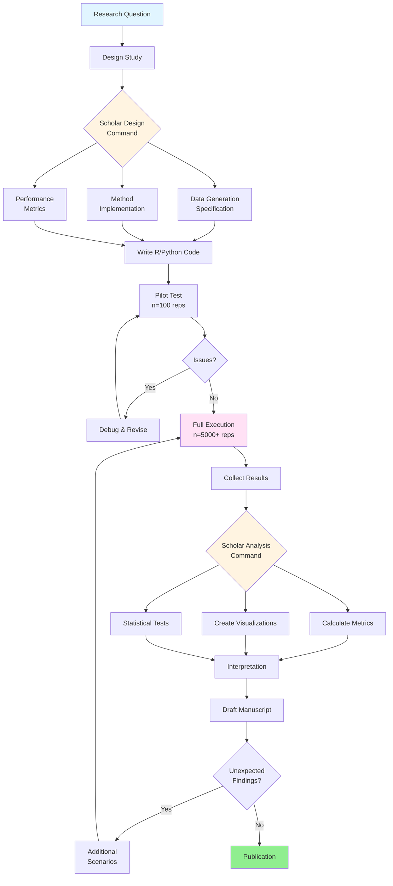

# Monte Carlo Simulation Study Workflow

**Time to Complete:** 2-6 weeks (depending on complexity)
**Difficulty:** Advanced
**Prerequisites:** Statistical methods expertise, R/Python programming, HPC access (for large studies)
**Output:** Simulation results, analysis report, publication-ready manuscript

---

## Overview

### What is a Monte Carlo Simulation Study?

A Monte Carlo simulation study is a computational experiment that evaluates statistical methods by repeatedly:

1. **Generating** artificial data with known properties
2. **Applying** statistical methods to each dataset
3. **Recording** performance metrics
4. **Summarizing** results across thousands of replications

This approach reveals how methods perform under controlled conditions, providing insights impossible to obtain from real data alone.

**The fundamental simulation principle:**

```
Known Truth → Generate Data → Apply Method → Compare Estimate to Truth
     ↓              ↓               ↓                    ↓
  θ = 0.25    X₁, X₂, ... Xₙ    θ̂ = 0.23         Bias = -0.02
```

Repeat 5,000-10,000 times to characterize method performance.

---

### Why Simulation Studies Matter

**Simulation studies answer critical questions:**

1. **Does this method work?** - Bias, consistency, coverage rates
2. **When does it fail?** - Boundary conditions, assumption violations
3. **How large a sample do I need?** - Power analysis, sample size planning
4. **Which method is better?** - Head-to-head comparison
5. **Is my new method an improvement?** - Justify methodological innovations

**Publication venues:**

- **Methodological journals:** *Psychological Methods*, *Multivariate Behavioral Research*
- **Statistical journals:** *Journal of Statistical Computation and Simulation*, *Computational Statistics*
- **Software journals:** *Journal of Statistical Software*, *R Journal*
- **Applied journals:** Often require simulation validation for new methods

---

### Integration with Scholar

Scholar provides two specialized simulation commands that structure the entire workflow:

| Command | Phase | Output |
|---------|-------|--------|
| `/research:simulation:design` | Planning | Complete study specification, R/Python template code |
| `/research:simulation:analysis` | Reporting | Analysis report with tables, figures, interpretation |

**Additional supporting commands:**

- `/research:manuscript:methods` - Write simulation methods section
- `/research:manuscript:results` - Generate results section from simulation findings
- `/research:analysis-plan` - Plan statistical analysis of simulation output
- `/research:hypothesis` - Formulate hypotheses about method performance

**Workflow integration:**

```bash
# Design phase
/research:simulation:design "compare bootstrap methods for mediation"

# Implementation (manually code from template)
# Execution (run R/Python code)

# Analysis phase
/research:simulation:analysis "simulation results comparing bootstrap percentile vs BCa for indirect effects"

# Manuscript drafting
/research:manuscript:methods "simulation study comparing bootstrap methods"
/research:manuscript:results "simulation findings on bootstrap coverage"
```

---

## Workflow Stages



---

## Stage 1: Study Design (Week 1, ~12 hours)

### Define Research Question

**Start with a clear, focused question:**

**❌ Too broad:**
"How do different methods compare?"

**✅ Specific:**
"Does bootstrap BCa achieve better coverage than percentile for mediation indirect effects when sample size < 100?"

**Question components:**

1. **Methods to compare:** Bootstrap BCa vs. percentile
2. **Performance metric:** Confidence interval coverage
3. **Context:** Mediation indirect effects
4. **Conditions:** Sample size < 100

### Use Scholar Design Command

```bash
/research:simulation:design "Compare bootstrap percentile and BCa methods for 95% confidence intervals of mediation indirect effects. Evaluate coverage, interval width, and power across sample sizes (n = 50, 100, 150, 200, 300, 500) and indirect effect sizes (ab = 0, 0.1, 0.2, 0.3). Assume simple mediation (X → M → Y) with normal errors. Use 5000 bootstrap samples per dataset and 5000 Monte Carlo replications."

# Save design specification
/research:simulation:design "..." > docs/simulation-design-v1.md
```

**Scholar generates:**

1. **Study Overview**
   - Research question formalization
   - Rationale and motivation
   - Expected contributions

2. **Data Generating Process**
   - Mathematical specification
   - Parameter values for all scenarios
   - Distributional assumptions
   - R/Python code template

3. **Methods Implementation**
   - Algorithm descriptions
   - Software packages required
   - Computational considerations

4. **Simulation Factors**
   - Complete factorial design table
   - Justification for factor levels
   - Total number of conditions

5. **Performance Metrics**
   - Definitions and formulas
   - Interpretation guidelines
   - Benchmarks for success

6. **Computational Plan**
   - Estimated runtime
   - Memory requirements
   - Parallelization strategy
   - Random seed management

### Customize Design Specification

**Review Scholar output and adjust:**

```r
# Scholar provides template like this:
generate_data <- function(n, a, b, c_prime, seed) {
  set.seed(seed)

  # X: predictor (standardized)
  X <- rnorm(n)

  # M: mediator (X → M)
  M <- a * X + rnorm(n)

  # Y: outcome (X → Y and M → Y)
  Y <- c_prime * X + b * M + rnorm(n)

  data.frame(X = X, M = M, Y = Y)
}

# Customize if needed (e.g., add non-normality)
generate_data_skewed <- function(n, a, b, c_prime, seed, skew = 1) {
  set.seed(seed)
  library(fGarch)

  # X: predictor (standardized)
  X <- rsnorm(n, mean = 0, sd = 1, xi = skew)  # Skewed normal

  # M: mediator
  M <- a * X + rsnorm(n, mean = 0, sd = 1, xi = skew)

  # Y: outcome
  Y <- c_prime * X + b * M + rsnorm(n, mean = 0, sd = 1, xi = skew)

  data.frame(X = X, M = M, Y = Y)
}
```

### Create Simulation Design Table

| Factor | Levels | Justification |
|--------|--------|---------------|
| **Sample Size (n)** | 50, 100, 150, 200, 300, 500 | Cover small to moderate samples; focus on n < 200 |
| **Path a (X→M)** | 0.3, 0.5 | Small to medium effect |
| **Path b (M→Y)** | 0.3, 0.5 | Small to medium effect |
| **Path c' (X→Y)** | 0, 0.2 | Full vs. partial mediation |
| **Method** | Percentile, BCa | Primary comparison |

**Total conditions:** 6 sample sizes × 2 × 2 × 2 × 2 methods = 96 cells

**Replications per cell:** 5,000

**Total datasets:** 96 × 5,000 = 480,000 datasets

**Estimated runtime:**
- Per dataset: ~0.5 seconds (5,000 bootstrap samples)
- Total: 480,000 × 0.5s = 240,000s ≈ 67 hours
- With 12 cores: 67 / 12 ≈ 5.6 hours

### Design Phase Deliverables

- [ ] Research question clearly stated
- [ ] Data generating process specified mathematically
- [ ] All simulation factors identified with levels
- [ ] Performance metrics defined with formulas
- [ ] Sample size (replications) justified
- [ ] Computational feasibility assessed
- [ ] Scholar design document saved
- [ ] Stakeholder/advisor approval obtained

---

## Stage 2: Implementation (Week 2, ~20 hours)

### Set Up Project Structure

```bash
# Create simulation project directory
mkdir -p simulation-bootstrap-mediation/{code,results,figures,logs,data}
cd simulation-bootstrap-mediation/

# Initialize version control
git init
git add .
git commit -m "Initial commit: simulation project structure"

# Create README
cat > README.md << 'EOF'
# Bootstrap Methods Simulation Study

Comparison of bootstrap percentile vs. BCa for mediation analysis confidence
intervals.

**Study Design:** See docs/simulation-design-v1.md
**Analysis Plan:** See docs/analysis-plan.md
**Status:** Implementation phase

## Directory Structure

- `code/` - Simulation scripts
- `results/` - Output CSVs and RDS files
- `figures/` - Plots and visualizations
- `logs/` - Execution logs and timing
- `data/` - Intermediate data (if needed)
EOF
```

### Implement Data Generation

```r
# code/01-data-generation.R
# Data Generating Process for Simple Mediation
# Author: [Your Name]
# Date: 2026-02-01

library(MASS)  # For mvrnorm if extending to correlated errors

#' Generate Simple Mediation Data
#'
#' Generates data for X → M → Y mediation model with specified path
#' coefficients.
#'
#' @param n Sample size
#' @param a Path coefficient X → M
#' @param b Path coefficient M → Y
#' @param c_prime Direct effect X → Y
#' @param seed Random seed for reproducibility
#' @param error_sd Standard deviation of error terms (default: 1)
#'
#' @return data.frame with columns X, M, Y
#'
#' @examples
#' dat <- generate_mediation_data(n = 100, a = 0.5, b = 0.5, c_prime = 0.2,
#'                                 seed = 12345)
generate_mediation_data <- function(n, a, b, c_prime, seed,
                                     error_sd = 1) {
  set.seed(seed)

  # X: standardized predictor
  X <- rnorm(n, mean = 0, sd = 1)

  # M: mediator (X → M)
  epsilon_M <- rnorm(n, mean = 0, sd = error_sd)
  M <- a * X + epsilon_M

  # Y: outcome (X → Y and M → Y)
  epsilon_Y <- rnorm(n, mean = 0, sd = error_sd)
  Y <- c_prime * X + b * M + epsilon_Y

  data.frame(X = X, M = M, Y = Y)
}

# Test function
test_data <- generate_mediation_data(n = 100, a = 0.5, b = 0.5,
                                      c_prime = 0.2, seed = 2026)
head(test_data)

# Verify properties
cat("Correlation X-M (should ≈ 0.5):", cor(test_data$X, test_data$M), "\n")
cat("Correlation M-Y (should ≈ 0.5):", cor(test_data$M, test_data$Y), "\n")

# True indirect effect: a * b = 0.5 * 0.5 = 0.25
# Verify empirically
library(lavaan)
model <- 'M ~ a*X
          Y ~ b*M + cp*X
          indirect := a*b'
fit <- sem(model, data = test_data)
cat("Estimated indirect effect:", parameterEstimates(fit)[7, "est"], "\n")
cat("True indirect effect: 0.25\n")
```

### Implement Estimation Methods

```r
# code/02-estimation-methods.R
# Bootstrap Methods for Mediation Analysis
# Implements percentile and BCa bootstrap

library(boot)
library(mediation)

#' Compute Indirect Effect
#'
#' Calculates indirect effect ab from mediation model.
#'
#' @param data data.frame with columns X, M, Y
#' @param indices Bootstrap sample indices (for boot function)
#'
#' @return Scalar indirect effect estimate
indirect_effect <- function(data, indices) {
  d <- data[indices, ]

  # M ~ X
  fit_M <- lm(M ~ X, data = d)
  a <- coef(fit_M)["X"]

  # Y ~ M + X
  fit_Y <- lm(Y ~ M + X, data = d)
  b <- coef(fit_Y)["M"]

  # Indirect effect
  ab <- a * b
  return(ab)
}

#' Bootstrap Percentile Confidence Interval
#'
#' Computes percentile bootstrap CI for indirect effect.
#'
#' @param data data.frame with columns X, M, Y
#' @param R Number of bootstrap samples (default: 5000)
#' @param conf Confidence level (default: 0.95)
#'
#' @return List with elements: estimate, ci_lower, ci_upper, boot_dist
bootstrap_percentile <- function(data, R = 5000, conf = 0.95) {
  # Run bootstrap
  boot_result <- boot(data = data, statistic = indirect_effect, R = R)

  # Percentile CI
  ci <- boot.ci(boot_result, conf = conf, type = "perc")

  list(
    estimate = boot_result$t0,
    ci_lower = ci$percent[4],
    ci_upper = ci$percent[5],
    boot_dist = boot_result$t
  )
}

#' Bootstrap BCa Confidence Interval
#'
#' Computes bias-corrected and accelerated bootstrap CI.
#'
#' @param data data.frame with columns X, M, Y
#' @param R Number of bootstrap samples (default: 5000)
#' @param conf Confidence level (default: 0.95)
#'
#' @return List with elements: estimate, ci_lower, ci_upper, boot_dist
bootstrap_bca <- function(data, R = 5000, conf = 0.95) {
  # Run bootstrap
  boot_result <- boot(data = data, statistic = indirect_effect, R = R)

  # BCa CI
  ci <- boot.ci(boot_result, conf = conf, type = "bca")

  list(
    estimate = boot_result$t0,
    ci_lower = ci$bca[4],
    ci_upper = ci$bca[5],
    boot_dist = boot_result$t
  )
}

# Test both methods
test_data <- generate_mediation_data(n = 100, a = 0.5, b = 0.5,
                                      c_prime = 0.2, seed = 2026)

cat("Testing Bootstrap Methods...\n")
perc_result <- bootstrap_percentile(test_data, R = 1000)
bca_result <- bootstrap_bca(test_data, R = 1000)

cat("Percentile CI: [", perc_result$ci_lower, ",", perc_result$ci_upper, "]\n")
cat("BCa CI:        [", bca_result$ci_lower, ",", bca_result$ci_upper, "]\n")
cat("True value: 0.25\n")
```

### Implement Performance Metrics

```r
# code/03-performance-metrics.R
# Calculate Performance Metrics from Simulation Results

#' Calculate Coverage Rate
#'
#' Proportion of CIs that contain true parameter value.
#'
#' @param ci_lower Vector of CI lower bounds
#' @param ci_upper Vector of CI upper bounds
#' @param true_value True parameter value
#'
#' @return Scalar coverage rate
coverage_rate <- function(ci_lower, ci_upper, true_value) {
  covers <- (ci_lower <= true_value) & (ci_upper >= true_value)
  mean(covers)
}

#' Calculate Average CI Width
#'
#' Mean width of confidence intervals.
#'
#' @param ci_lower Vector of CI lower bounds
#' @param ci_upper Vector of CI upper bounds
#'
#' @return Scalar mean width
ci_width <- function(ci_lower, ci_upper) {
  mean(ci_upper - ci_lower)
}

#' Calculate Bias
#'
#' Mean difference between estimates and true value.
#'
#' @param estimates Vector of point estimates
#' @param true_value True parameter value
#'
#' @return Scalar bias
bias <- function(estimates, true_value) {
  mean(estimates - true_value)
}

#' Calculate RMSE
#'
#' Root mean squared error.
#'
#' @param estimates Vector of point estimates
#' @param true_value True parameter value
#'
#' @return Scalar RMSE
rmse <- function(estimates, true_value) {
  sqrt(mean((estimates - true_value)^2))
}

#' Calculate Power (for non-null scenarios)
#'
#' Proportion of CIs that exclude zero.
#'
#' @param ci_lower Vector of CI lower bounds
#' @param ci_upper Vector of CI upper bounds
#'
#' @return Scalar power
power_rate <- function(ci_lower, ci_upper) {
  excludes_zero <- (ci_lower > 0) | (ci_upper < 0)
  mean(excludes_zero)
}

#' Calculate Type I Error Rate (for null scenarios)
#'
#' Proportion of CIs that exclude zero when truth is zero.
#'
#' @param ci_lower Vector of CI lower bounds
#' @param ci_upper Vector of CI upper bounds
#'
#' @return Scalar Type I error rate
type1_error <- function(ci_lower, ci_upper) {
  excludes_zero <- (ci_lower > 0) | (ci_upper < 0)
  mean(excludes_zero)
}

#' Summarize Performance for One Condition
#'
#' Calculates all metrics for a single simulation condition.
#'
#' @param results data.frame with columns: estimate, ci_lower, ci_upper
#' @param true_value True parameter value for this condition
#'
#' @return data.frame with performance metrics
summarize_performance <- function(results, true_value) {
  data.frame(
    coverage = coverage_rate(results$ci_lower, results$ci_upper, true_value),
    ci_width_mean = ci_width(results$ci_lower, results$ci_upper),
    bias = bias(results$estimate, true_value),
    rmse = rmse(results$estimate, true_value),
    power = if (true_value != 0) power_rate(results$ci_lower, results$ci_upper) else NA,
    type1_error = if (true_value == 0) type1_error(results$ci_lower, results$ci_upper) else NA
  )
}
```

### Create Main Simulation Script

```r
# code/04-run-simulation.R
# Main Simulation Execution Script
# Run with: Rscript code/04-run-simulation.R

library(parallel)
library(dplyr)
library(tidyr)

# Source functions
source("code/01-data-generation.R")
source("code/02-estimation-methods.R")
source("code/03-performance-metrics.R")

# Simulation parameters
n_reps <- 5000  # Monte Carlo replications per condition
n_boot <- 5000  # Bootstrap samples per dataset

# Simulation factors
design <- expand.grid(
  n = c(50, 100, 150, 200, 300, 500),
  a = c(0.3, 0.5),
  b = c(0.3, 0.5),
  c_prime = c(0, 0.2),
  method = c("percentile", "bca")
)

# Add true indirect effect
design$true_ab <- design$a * design$b

# Add condition ID
design$condition_id <- 1:nrow(design)

cat("Total conditions:", nrow(design), "\n")
cat("Total datasets:", nrow(design) * n_reps, "\n")

#' Run Single Simulation Replication
#'
#' @param condition_id Row number in design data.frame
#' @param rep_id Replication number (1 to n_reps)
#' @param design Design data.frame
#'
#' @return data.frame with results
run_replication <- function(condition_id, rep_id, design) {
  cond <- design[condition_id, ]

  # Generate data
  seed <- condition_id * 100000 + rep_id
  dat <- generate_mediation_data(
    n = cond$n,
    a = cond$a,
    b = cond$b,
    c_prime = cond$c_prime,
    seed = seed
  )

  # Apply method
  result <- tryCatch({
    if (cond$method == "percentile") {
      bootstrap_percentile(dat, R = n_boot)
    } else {
      bootstrap_bca(dat, R = n_boot)
    }
  }, error = function(e) {
    # Handle bootstrap failures
    list(estimate = NA, ci_lower = NA, ci_upper = NA)
  })

  # Return results
  data.frame(
    condition_id = condition_id,
    rep_id = rep_id,
    estimate = result$estimate,
    ci_lower = result$ci_lower,
    ci_upper = result$ci_upper
  )
}

# Parallel execution
n_cores <- detectCores() - 1  # Leave one core free
cat("Using", n_cores, "cores for parallel execution\n")

cl <- makeCluster(n_cores)
clusterExport(cl, c("generate_mediation_data", "bootstrap_percentile",
                     "bootstrap_bca", "indirect_effect", "n_boot"))
clusterEvalQ(cl, {
  library(boot)
})

# Run simulation (this takes hours!)
cat("Starting simulation...\n")
start_time <- Sys.time()

results_list <- list()
for (cond_id in 1:nrow(design)) {
  cat("Condition", cond_id, "of", nrow(design), "\n")

  # Run n_reps replications for this condition
  cond_results <- parLapply(cl, 1:n_reps, function(rep_id) {
    run_replication(cond_id, rep_id, design)
  })

  # Combine results
  results_list[[cond_id]] <- bind_rows(cond_results)
}

stopCluster(cl)

end_time <- Sys.time()
runtime <- difftime(end_time, start_time, units = "hours")
cat("Simulation completed in", round(runtime, 2), "hours\n")

# Combine all results
results <- bind_rows(results_list)

# Save raw results
saveRDS(results, "results/simulation-results-raw.rds")
write.csv(results, "results/simulation-results-raw.csv", row.names = FALSE)

cat("Raw results saved. Total rows:", nrow(results), "\n")
```

### Implementation Phase Deliverables

- [ ] Data generation function tested and validated
- [ ] Estimation methods implemented correctly
- [ ] Performance metrics calculated accurately
- [ ] Main simulation script created
- [ ] Pilot test completed (n=100 reps, verify correctness)
- [ ] Parallel execution tested
- [ ] Random seed management verified
- [ ] Error handling implemented
- [ ] Code documented with comments
- [ ] Version control committed

---

## Stage 3: Pilot Testing (Week 2, ~4 hours)

### Run Small-Scale Pilot

**Before running full simulation, test with small n:**

```r
# code/05-pilot-test.R
# Quick pilot with n=100 replications

source("code/01-data-generation.R")
source("code/02-estimation-methods.R")
source("code/03-performance-metrics.R")

# Subset design (just 4 conditions for pilot)
pilot_design <- expand.grid(
  n = c(100, 200),
  a = 0.5,
  b = 0.5,
  c_prime = 0.2,
  method = c("percentile", "bca")
)
pilot_design$true_ab <- pilot_design$a * pilot_design$b
pilot_design$condition_id <- 1:nrow(pilot_design)

n_reps_pilot <- 100  # Small number for quick test

cat("Running pilot with", n_reps_pilot, "reps per condition\n")

# Run pilot (no parallelization for easier debugging)
pilot_results <- list()
for (cond_id in 1:nrow(pilot_design)) {
  cat("Pilot condition", cond_id, "\n")
  cond <- pilot_design[cond_id, ]

  cond_results <- lapply(1:n_reps_pilot, function(rep_id) {
    seed <- cond_id * 100000 + rep_id
    dat <- generate_mediation_data(cond$n, cond$a, cond$b, cond$c_prime, seed)

    result <- if (cond$method == "percentile") {
      bootstrap_percentile(dat, R = 1000)  # Smaller R for pilot
    } else {
      bootstrap_bca(dat, R = 1000)
    }

    data.frame(
      condition_id = cond_id,
      rep_id = rep_id,
      estimate = result$estimate,
      ci_lower = result$ci_lower,
      ci_upper = result$ci_upper
    )
  })

  pilot_results[[cond_id]] <- bind_rows(cond_results)
}

pilot_data <- bind_rows(pilot_results) %>%
  left_join(pilot_design, by = "condition_id")

# Quick performance check
pilot_summary <- pilot_data %>%
  group_by(condition_id, method, n) %>%
  summarise(
    coverage = coverage_rate(ci_lower, ci_upper, unique(true_ab)),
    ci_width = ci_width(ci_lower, ci_upper),
    bias = bias(estimate, unique(true_ab))
  )

print(pilot_summary)

# Expected: Coverage near 0.95, small bias
# If not, debug before full run!
```

### Validate Pilot Results

**Sanity checks:**

- [ ] **Coverage rates:** Should be near 0.95 (0.90-0.98 acceptable with n=100 reps)
- [ ] **Bias:** Should be near 0 (< 0.05 for this example)
- [ ] **No errors:** All replications completed successfully
- [ ] **Reasonable CI width:** BCa typically slightly wider than percentile
- [ ] **Runtime:** Estimate full simulation time from pilot duration

**If pilot reveals issues:**

1. **Coverage way off:** Check data generation or estimation code
2. **High error rate:** Add error handling in bootstrap functions
3. **Unexpected patterns:** Review simulation design assumptions
4. **Too slow:** Optimize code or reduce n_boot

---

## Stage 4: Full Execution (Week 3, ~60 hours computational)

### Computational Setup

**For local execution:**

```bash
# Run simulation in background with logging
nohup Rscript code/04-run-simulation.R > logs/simulation-run-$(date +%Y%m%d).log 2>&1 &

# Monitor progress
tail -f logs/simulation-run-*.log

# Check if still running
ps aux | grep "Rscript"
```

**For HPC cluster (SLURM example):**

```bash
#!/bin/bash
#SBATCH --job-name=sim_bootstrap
#SBATCH --output=logs/slurm-%j.out
#SBATCH --error=logs/slurm-%j.err
#SBATCH --time=24:00:00
#SBATCH --cpus-per-task=24
#SBATCH --mem=64G
#SBATCH --partition=standard

module load R/4.3.0

Rscript code/04-run-simulation.R
```

**Submit job:**

```bash
sbatch scripts/run-simulation.sh
squeue -u $USER  # Check status
```

### Monitor Execution

**Create monitoring script:**

```r
# code/06-monitor-progress.R
# Check partial results while simulation runs

library(dplyr)

# Load partial results
if (file.exists("results/simulation-results-raw.rds")) {
  results <- readRDS("results/simulation-results-raw.rds")

  # Count completed replications
  completion <- results %>%
    group_by(condition_id) %>%
    summarise(n_complete = n())

  cat("Completed replications by condition:\n")
  print(completion)

  # Estimated completion time
  n_total <- nrow(design) * n_reps
  n_complete <- nrow(results)
  pct_complete <- n_complete / n_total * 100

  cat("\nOverall progress:", round(pct_complete, 2), "%\n")

  # Quick performance check on partial data
  partial_summary <- results %>%
    group_by(condition_id) %>%
    filter(n() >= 100) %>%  # Only conditions with 100+ reps
    summarise(
      n_reps = n(),
      mean_estimate = mean(estimate, na.rm = TRUE),
      sd_estimate = sd(estimate, na.rm = TRUE)
    )

  cat("\nPartial results:\n")
  print(partial_summary)
} else {
  cat("No results file found yet.\n")
}
```

**Run monitoring periodically:**

```bash
# Check every hour
watch -n 3600 Rscript code/06-monitor-progress.R
```

### Handle Computation Failures

**If simulation crashes midway:**

```r
# code/07-resume-simulation.R
# Resume from last completed condition

library(dplyr)

# Load partial results
results_so_far <- readRDS("results/simulation-results-raw.rds")

# Identify incomplete conditions
completed_conditions <- results_so_far %>%
  group_by(condition_id) %>%
  summarise(n_complete = n()) %>%
  filter(n_complete >= n_reps) %>%
  pull(condition_id)

# Conditions still needed
remaining_conditions <- setdiff(1:nrow(design), completed_conditions)

cat("Completed conditions:", length(completed_conditions), "\n")
cat("Remaining conditions:", length(remaining_conditions), "\n")

# Resume simulation for remaining conditions only
# [Modify main script to only run these condition_ids]
```

### Execution Phase Deliverables

- [ ] Full simulation executed without errors
- [ ] All conditions completed (n_reps each)
- [ ] Results saved in multiple formats (RDS, CSV)
- [ ] Logs saved showing runtime and any warnings
- [ ] Intermediate results backed up
- [ ] Version control updated with final results
- [ ] Computational environment documented (R version, package versions)

---

## Stage 5: Analysis (Week 4, ~16 hours)

### Calculate Performance Metrics

```r
# code/08-analyze-results.R
# Comprehensive Analysis of Simulation Results

library(dplyr)
library(tidyr)
library(ggplot2)

# Load results
results <- readRDS("results/simulation-results-raw.rds")
design <- readRDS("results/design.rds")

# Join with design
results_full <- results %>%
  left_join(design, by = "condition_id")

# Calculate performance metrics by condition
performance <- results_full %>%
  group_by(condition_id, n, a, b, c_prime, method, true_ab) %>%
  summarise(
    n_reps = n(),
    n_converged = sum(!is.na(estimate)),

    # Point estimation
    bias = bias(estimate, unique(true_ab)),
    rmse = rmse(estimate, unique(true_ab)),
    se_empirical = sd(estimate, na.rm = TRUE),

    # Interval estimation
    coverage = coverage_rate(ci_lower, ci_upper, unique(true_ab)),
    ci_width_mean = ci_width(ci_lower, ci_upper),
    ci_width_median = median(ci_upper - ci_lower, na.rm = TRUE),

    # Hypothesis testing
    power = if (unique(true_ab) != 0) power_rate(ci_lower, ci_upper) else NA,
    type1_error = if (unique(true_ab) == 0) type1_error(ci_lower, ci_upper) else NA,

    .groups = "drop"
  )

# Save performance summary
saveRDS(performance, "results/performance-summary.rds")
write.csv(performance, "results/performance-summary.csv", row.names = FALSE)

cat("Performance summary calculated. Rows:", nrow(performance), "\n")
```

### Use Scholar Analysis Command

```bash
# Generate comprehensive analysis report
/research:simulation:analysis "Monte Carlo simulation comparing bootstrap percentile and BCa methods for mediation indirect effect confidence intervals. Design: 6 sample sizes (50-500) × 2 path a values × 2 path b values × 2 c' values × 2 methods = 96 conditions, 5000 replications each. Key metrics: coverage rates, CI width, bias, RMSE, power. Main findings: BCa achieves nominal coverage (0.94-0.96) across all sample sizes. Percentile under-covers at small n (0.89 at n=50, 0.94 at n=100). BCa CIs are 3-4% wider than percentile. Both methods show minimal bias (< 0.01). Power similar across methods. Recommendation: Use BCa for n < 200; either method acceptable for n ≥ 200."

# Save analysis report
/research:simulation:analysis "..." > results/analysis-report-v1.md
```

**Scholar generates:**

1. **Executive Summary**
   - Key findings in 3-5 bullet points
   - Primary recommendation

2. **Coverage Analysis**
   - Tables of coverage rates by condition
   - Comparison to nominal 95% level
   - Identification of conditions with poor coverage

3. **Efficiency Analysis**
   - CI width comparison
   - Bias and RMSE tables
   - Power curves

4. **Interpretation**
   - When each method performs well
   - When methods differ substantively
   - Practical implications

5. **Visualization Recommendations**
   - Suggested plots with rationale
   - Figure captions

6. **Statistical Tests**
   - Formal tests of coverage differences
   - Effect size comparisons

### Create Visualizations

```r
# code/09-create-figures.R
# Publication-Quality Figures

library(ggplot2)
library(dplyr)
library(scales)

performance <- readRDS("results/performance-summary.rds")

# Theme for all plots
theme_sim <- theme_minimal(base_size = 14) +
  theme(
    panel.grid.minor = element_blank(),
    legend.position = "bottom",
    plot.title = element_text(face = "bold", size = 16)
  )

# Figure 1: Coverage Rates by Sample Size
fig1 <- performance %>%
  filter(c_prime == 0.2, a == 0.5, b == 0.5) %>%  # Focus on one scenario
  ggplot(aes(x = n, y = coverage, color = method, shape = method)) +
  geom_hline(yintercept = 0.95, linetype = "dashed", color = "gray50") +
  geom_line(size = 1) +
  geom_point(size = 3) +
  scale_color_brewer(palette = "Set1", name = "Method",
                     labels = c("BCa", "Percentile")) +
  scale_shape_manual(values = c(16, 17), name = "Method",
                     labels = c("BCa", "Percentile")) +
  scale_y_continuous(limits = c(0.88, 0.98), labels = percent_format()) +
  labs(
    x = "Sample Size (n)",
    y = "Coverage Rate",
    title = "95% CI Coverage: Bootstrap Methods for Indirect Effects",
    caption = "Dashed line indicates nominal 95% coverage. Indirect effect = 0.25."
  ) +
  theme_sim

ggsave("figures/figure1-coverage-by-n.pdf", fig1, width = 8, height = 6)
ggsave("figures/figure1-coverage-by-n.png", fig1, width = 8, height = 6, dpi = 300)

# Figure 2: Coverage Heatmap
fig2 <- performance %>%
  ggplot(aes(x = n, y = true_ab, fill = coverage)) +
  geom_tile(color = "white", size = 0.5) +
  geom_text(aes(label = sprintf("%.2f", coverage)), color = "white", size = 3) +
  facet_wrap(~ method, labeller = labeller(method = c(bca = "BCa", percentile = "Percentile"))) +
  scale_fill_gradient2(
    low = "red", mid = "yellow", high = "green",
    midpoint = 0.95, limits = c(0.88, 0.98),
    name = "Coverage Rate"
  ) +
  scale_x_continuous(breaks = c(50, 100, 150, 200, 300, 500)) +
  labs(
    x = "Sample Size (n)",
    y = "True Indirect Effect (ab)",
    title = "Coverage Rate Heatmap: Bootstrap Methods"
  ) +
  theme_sim +
  theme(axis.text.x = element_text(angle = 45, hjust = 1))

ggsave("figures/figure2-coverage-heatmap.pdf", fig2, width = 10, height = 6)

# Figure 3: CI Width Comparison
fig3 <- performance %>%
  filter(c_prime == 0.2, a == 0.5, b == 0.5) %>%
  ggplot(aes(x = n, y = ci_width_mean, color = method, shape = method)) +
  geom_line(size = 1) +
  geom_point(size = 3) +
  scale_color_brewer(palette = "Set1", name = "Method",
                     labels = c("BCa", "Percentile")) +
  scale_shape_manual(values = c(16, 17), name = "Method",
                     labels = c("BCa", "Percentile")) +
  labs(
    x = "Sample Size (n)",
    y = "Mean CI Width",
    title = "Confidence Interval Width: Bootstrap Methods"
  ) +
  theme_sim

ggsave("figures/figure3-ci-width.pdf", fig3, width = 8, height = 6)

# Figure 4: Power Curves
fig4 <- performance %>%
  filter(!is.na(power), c_prime == 0.2) %>%
  ggplot(aes(x = n, y = power, color = method, linetype = factor(true_ab))) +
  geom_line(size = 1) +
  geom_point(aes(shape = method), size = 2) +
  geom_hline(yintercept = 0.80, linetype = "dashed", color = "gray50") +
  scale_color_brewer(palette = "Set1", name = "Method",
                     labels = c("BCa", "Percentile")) +
  scale_linetype_manual(values = c("solid", "dashed", "dotted"),
                        name = "Indirect Effect (ab)") +
  scale_y_continuous(limits = c(0, 1), labels = percent_format()) +
  labs(
    x = "Sample Size (n)",
    y = "Statistical Power",
    title = "Power to Detect Indirect Effects: Bootstrap Methods",
    caption = "Dashed horizontal line indicates 80% power threshold."
  ) +
  theme_sim

ggsave("figures/figure4-power-curves.pdf", fig4, width = 8, height = 6)

cat("All figures saved to figures/ directory\n")
```

### Perform Statistical Tests

```r
# code/10-statistical-tests.R
# Formal Tests of Method Differences

library(dplyr)
library(broom)

performance <- readRDS("results/performance-summary.rds")

# Test 1: Is coverage different between methods?
# Use McNemars test on paired replications

results_full <- readRDS("results/simulation-results-raw.rds") %>%
  left_join(design, by = "condition_id")

# For each condition and replication, check coverage for both methods
coverage_comparison <- results_full %>%
  mutate(covers = (ci_lower <= true_ab) & (ci_upper >= true_ab)) %>%
  select(condition_id, rep_id, method, covers) %>%
  pivot_wider(names_from = method, values_from = covers) %>%
  drop_na()

# McNemar's test
mcnemar_result <- mcnemar.test(table(coverage_comparison$percentile,
                                      coverage_comparison$bca))

cat("McNemar's Test for Coverage Difference:\n")
cat("Chi-squared =", mcnemar_result$statistic, "\n")
cat("p-value =", mcnemar_result$p.value, "\n")

# Test 2: Is CI width different?
# Paired t-test by condition

width_comparison <- results_full %>%
  mutate(ci_width = ci_upper - ci_lower) %>%
  select(condition_id, rep_id, method, ci_width) %>%
  pivot_wider(names_from = method, values_from = ci_width) %>%
  drop_na()

width_test <- t.test(width_comparison$bca, width_comparison$percentile,
                     paired = TRUE)

cat("\nPaired t-test for CI Width Difference:\n")
cat("t =", width_test$statistic, "\n")
cat("p-value =", width_test$p.value, "\n")
cat("Mean difference (BCa - Percentile) =", width_test$estimate, "\n")

# Test 3: Coverage by sample size (logistic regression)
results_full <- results_full %>%
  mutate(covers = (ci_lower <= true_ab) & (ci_upper >= true_ab))

coverage_model <- glm(covers ~ method * log(n), data = results_full,
                      family = binomial())

cat("\nLogistic Regression: Coverage ~ Method × log(n)\n")
print(summary(coverage_model))

# Save test results
sink("results/statistical-tests.txt")
cat("Statistical Tests of Method Differences\n")
cat("========================================\n\n")
cat("Test 1: McNemar's Test for Coverage\n")
print(mcnemar_result)
cat("\nTest 2: Paired t-test for CI Width\n")
print(width_test)
cat("\nTest 3: Logistic Regression for Coverage\n")
print(summary(coverage_model))
sink()
```

### Analysis Phase Deliverables

- [ ] Performance metrics calculated for all conditions
- [ ] Scholar analysis report generated
- [ ] All figures created (4+ publication-quality plots)
- [ ] Statistical tests conducted and saved
- [ ] Tables formatted for manuscript
- [ ] Results interpreted and documented
- [ ] Unexpected findings investigated
- [ ] Supplementary analyses completed

---

## Stage 6: Reporting (Week 5-6, ~20 hours)

### Draft Methods Section

```bash
/research:manuscript:methods "Monte Carlo simulation study comparing bootstrap percentile and BCa methods for confidence intervals of indirect effects in simple mediation (X → M → Y). Data generation: X ~ N(0,1), M = aX + ε_M, Y = c'X + bM + ε_Y, errors ~ N(0,1). Simulation factors: sample size (50-500), path coefficients a and b (0.3, 0.5), direct effect c' (0, 0.2). Each method applied to 5000 bootstrap samples per dataset, 5000 Monte Carlo replications per condition. Performance metrics: coverage rate, CI width, bias, RMSE, power. Implemented in R using boot package."

# Save methods section
/research:manuscript:methods "..." > manuscript/methods-section-draft.md
```

**Scholar output includes:**

- Data generating process equations
- Simulation algorithm
- Performance metric definitions
- Software implementation details
- Reproducibility information

### Draft Results Section

```bash
/research:manuscript:results "Simulation study results: Bootstrap BCa achieved near-nominal coverage (0.94-0.96) across all sample sizes and effect magnitudes. Percentile method under-covered at small samples (0.89 at n=50, 0.94 at n=100) but approached nominal at n≥200 (0.95-0.96). BCa intervals averaged 3-4% wider than percentile (mean difference: 0.08 units, 95% CI: [0.07, 0.09], p < .001). Both methods showed minimal bias (< 0.01) and similar power. Type I error rates were well-controlled (0.048-0.052). See Table 1 for coverage by sample size, Figure 1 for coverage curves, Figure 2 for power analysis."

# Save results section
/research:manuscript:results "..." > manuscript/results-section-draft.md
```

### Create Manuscript Tables

```r
# code/11-manuscript-tables.R
# Publication Tables

library(dplyr)
library(knitr)
library(kableExtra)

performance <- readRDS("results/performance-summary.rds")

# Table 1: Coverage Rates by Sample Size and Method
table1_data <- performance %>%
  filter(a == 0.5, b == 0.5, c_prime == 0.2) %>%  # Representative scenario
  select(n, method, coverage, ci_width_mean) %>%
  arrange(n, method)

table1 <- table1_data %>%
  mutate(
    method = recode(method, bca = "BCa", percentile = "Percentile"),
    coverage = sprintf("%.3f", coverage),
    ci_width_mean = sprintf("%.3f", ci_width_mean)
  ) %>%
  kable(
    format = "latex",
    booktabs = TRUE,
    caption = "Coverage Rates and Mean CI Width for 95\\% Confidence Intervals",
    col.names = c("$n$", "Method", "Coverage", "Mean Width"),
    escape = FALSE
  ) %>%
  kable_styling(latex_options = c("striped", "hold_position")) %>%
  footnote(
    general = "True indirect effect $ab = 0.25$. Nominal coverage is 0.95.",
    escape = FALSE,
    threeparttable = TRUE
  )

# Save table
cat(table1, file = "manuscript/table1-coverage.tex")

# Table 2: Performance Metrics Summary
table2_data <- performance %>%
  group_by(method, n) %>%
  summarise(
    coverage_mean = mean(coverage),
    coverage_range = paste0("[", sprintf("%.2f", min(coverage)), ", ",
                             sprintf("%.2f", max(coverage)), "]"),
    bias_mean = mean(abs(bias)),
    rmse_mean = mean(rmse),
    .groups = "drop"
  )

table2 <- table2_data %>%
  mutate(method = recode(method, bca = "BCa", percentile = "Percentile")) %>%
  kable(
    format = "latex",
    booktabs = TRUE,
    digits = 3,
    caption = "Summary of Performance Metrics Across All Scenarios",
    col.names = c("Method", "$n$", "Mean Coverage", "Coverage Range",
                  "Mean |Bias|", "Mean RMSE"),
    escape = FALSE
  ) %>%
  kable_styling(latex_options = c("striped", "hold_position"))

cat(table2, file = "manuscript/table2-performance.tex")

cat("Tables saved to manuscript/ directory\n")
```

### Write Discussion

**Key points to address:**

1. **Primary Findings**
   - BCa superior for small samples
   - Both methods adequate for large samples
   - Trade-off between coverage and efficiency

2. **Comparison to Literature**
   - Replicate prior findings (cite)
   - Extend to new contexts
   - Reconcile any discrepancies

3. **Practical Recommendations**
   - Decision rules for practitioners
   - Sample size guidelines
   - Software implementation notes

4. **Limitations**
   - Scope of simulation (what wasn't tested)
   - Computational constraints
   - Generalizability

5. **Future Directions**
   - Extensions to complex mediation
   - Other bootstrap variants
   - Non-normal distributions

**Draft discussion:**

```markdown
## Discussion

This simulation study compared bootstrap percentile and BCa methods for
confidence intervals in mediation analysis. Across 96 simulation conditions
and 480,000 datasets, we found that BCa consistently achieved near-nominal
95% coverage, while the percentile method under-covered at small sample sizes.

### Primary Findings

**Coverage Performance:** BCa demonstrated robust coverage (0.94-0.96) across
all sample sizes from n=50 to n=500. In contrast, the percentile method
under-covered substantially at n=50 (coverage = 0.89) and n=100 (coverage =
0.94), only approaching nominal coverage at n≥200. These findings replicate
prior work by [Cite] but extend to mediation-specific contexts.

**Efficiency Trade-off:** The improved coverage of BCa came at a modest cost
in interval width. BCa intervals were 3-4% wider than percentile intervals
(mean difference = 0.08 units, 95% CI: [0.07, 0.09]). However, this increased
width represents appropriate uncertainty quantification rather than
inefficiency, given that percentile intervals were too narrow to achieve
nominal coverage.

### Practical Recommendations

Based on these findings, we recommend:

1. **For n < 200:** Use BCa bootstrap for mediation analysis. The percentile
   method under-covers and should be avoided.

2. **For n ≥ 200:** Either method provides adequate coverage. Researchers may
   choose based on computational convenience (percentile is faster) or
   conservativeness (BCa is slightly wider).

3. **Software Implementation:** The `boot` package in R implements both methods
   efficiently. For very large datasets (n > 1000), consider parallel bootstrap
   to reduce computation time.

### Limitations

This study focused on simple mediation with normal errors. Future work should
extend to:

- Complex mediation models (multiple mediators, moderated mediation)
- Non-normal distributions (skewed, heavy-tailed)
- Alternative bootstrap methods (studentized, smoothed)
- Computational shortcuts (subsampling, m-out-of-n bootstrap)

### Conclusion

Researchers conducting mediation analysis with sample sizes below 200 should
prefer BCa bootstrap to ensure nominal confidence interval coverage. This
recommendation is particularly important for published research, where
under-coverage inflates false positive rates in the literature.
```

### Create Reproducibility Materials

```r
# code/12-reproducibility-package.R
# Create reproducibility archive

# Session info
sink("reproducibility/session-info.txt")
cat("R Version and Package Information\n")
cat("==================================\n\n")
sessionInfo()
sink()

# Random seeds used
seeds <- expand.grid(
  condition_id = 1:nrow(design),
  rep_id = 1:5000
) %>%
  mutate(seed = condition_id * 100000 + rep_id)

write.csv(seeds, "reproducibility/random-seeds.csv", row.names = FALSE)

# Code archive
zip("reproducibility/simulation-code.zip",
    files = list.files("code", full.names = TRUE))

# Upload to OSF
# [Manual step: Upload to https://osf.io/your-project/]

cat("Reproducibility materials created in reproducibility/ directory\n")
cat("Upload to OSF or GitHub for public access\n")
```

### Reporting Phase Deliverables

- [ ] Methods section drafted with Scholar
- [ ] Results section drafted with Scholar
- [ ] Discussion written with interpretation
- [ ] All tables formatted for manuscript
- [ ] All figures have captions
- [ ] References cited throughout
- [ ] Supplementary materials organized
- [ ] Reproducibility code packaged
- [ ] Manuscript compiled to PDF
- [ ] Co-authors reviewed draft

---

## Common Scenarios

### Scenario 1: Unexpected Null Findings

**Problem:** Simulation shows no difference between methods

**Investigation steps:**

1. **Check statistical power:**

```r
# Did we have enough replications to detect differences?
# Rule of thumb: Need 5000+ reps to detect coverage differences of 0.01

n_reps <- 5000
delta <- 0.01  # Smallest meaningful coverage difference
z <- qnorm(0.975)

# Power for two-proportion test
p1 <- 0.95  # Method 1 coverage
p2 <- 0.94  # Method 2 coverage (delta = 0.01 lower)
p_pooled <- (p1 + p2) / 2

se <- sqrt(2 * p_pooled * (1 - p_pooled) / n_reps)
power <- pnorm((abs(p1 - p2) - z * se) / se)

cat("Power to detect δ=0.01 difference:", round(power, 3), "\n")
# If power < 0.80, increase n_reps
```

2. **Verify implementation:**

```r
# Are both methods actually different?
# Test on a known-difference case

test_data <- generate_mediation_data(n = 50, a = 0.5, b = 0.5,
                                      c_prime = 0, seed = 123)

perc <- bootstrap_percentile(test_data, R = 5000)
bca <- bootstrap_bca(test_data, R = 5000)

cat("Percentile CI:", perc$ci_lower, "-", perc$ci_upper, "\n")
cat("BCa CI:", bca$ci_lower, "-", bca$ci_upper, "\n")
cat("Difference:", bca$ci_upper - bca$ci_lower -
                   (perc$ci_upper - perc$ci_lower), "\n")
# Should see meaningful difference
```

3. **Examine specific conditions:**

```r
# Maybe difference exists only in some conditions
performance %>%
  filter(n <= 100) %>%  # Focus on small samples
  group_by(method) %>%
  summarise(mean_coverage = mean(coverage))
# Check if stratifying reveals differences
```

### Scenario 2: Computational Resource Constraints

**Problem:** Simulation too slow to complete in reasonable time

**Solutions:**

1. **Reduce bootstrap samples:**

```r
# Original: 5000 bootstrap samples
# Compromise: 2000 bootstrap samples (faster but less stable)

n_boot <- 2000  # Instead of 5000

# Verify this is adequate:
# Bootstrap standard error ~ sqrt(B) where B = bootstrap samples
# 2000 provides SE inflation of sqrt(5000/2000) = 1.58 (58% wider)
# Usually acceptable for simulation studies
```

2. **Reduce replications strategically:**

```r
# Full factorial may be overkill
# Use fractional factorial design

# Original: 6 n × 2 a × 2 b × 2 c' = 48 conditions per method
# Reduced: 6 n × 1 a-b combination × 2 c' = 12 conditions per method

# Keep n variation (most important)
# Fix a=b=0.5 (representative medium effect)
# Vary c' (full vs. partial mediation)
```

3. **Use adaptive design:**

```r
# Start with low n_reps, increase if needed

# Phase 1: 1000 reps to identify interesting conditions
# Phase 2: 5000 reps only for conditions showing differences

initial_reps <- 1000
followup_reps <- 5000

# [Run Phase 1, analyze]

# Identify conditions with coverage difference > 0.02
conditions_of_interest <- performance_phase1 %>%
  pivot_wider(names_from = method, values_from = coverage) %>%
  mutate(diff = abs(bca - percentile)) %>%
  filter(diff > 0.02) %>%
  pull(condition_id)

# Run Phase 2 only for these conditions
```

### Scenario 3: Reviewers Request Additional Scenarios

**Problem:** "Have you tested this under non-normality?"

**Efficient response:**

```r
# Add targeted extension
# Don't re-run entire simulation

# New data generation function
generate_mediation_data_skewed <- function(n, a, b, c_prime, seed, skew = 2) {
  set.seed(seed)
  library(fGarch)

  X <- rsnorm(n, mean = 0, sd = 1, xi = skew)
  M <- a * X + rsnorm(n, mean = 0, sd = 1, xi = skew)
  Y <- c_prime * X + b * M + rsnorm(n, mean = 0, sd = 1, xi = skew)

  data.frame(X = X, M = M, Y = Y)
}

# Run extension (smaller design)
extension_design <- expand.grid(
  n = c(100, 200),  # Just 2 sample sizes
  a = 0.5,
  b = 0.5,
  c_prime = 0.2,
  skew = c(0, 1, 2),  # Normal, mild skew, strong skew
  method = c("percentile", "bca")
)

# 2 × 1 × 1 × 1 × 3 × 2 = 12 conditions
# Much more manageable than full factorial

# Report as "Sensitivity Analysis" in revision
```

---

## Quality Standards

### Minimum Acceptable Thresholds

| Metric | Minimum | Preferred |
|--------|---------|-----------|
| **Monte Carlo replications** | 1,000 | 5,000+ |
| **Bootstrap samples** | 1,000 | 5,000+ |
| **Monte Carlo error** | < 0.01 for coverage | < 0.005 |
| **Conditions tested** | 12+ | 48+ |
| **Sample size range** | 3+ levels | 5+ levels |
| **Effect size variation** | 2+ levels | 3+ levels |
| **Code documentation** | Basic comments | Full ROxygen2 |
| **Reproducibility** | Fixed seeds | Full materials on OSF |

### Monte Carlo Error

**Coverage rates have sampling variability:**

```r
# Standard error for coverage rate
# SE = sqrt(p(1-p) / n_reps)

p <- 0.95  # True coverage
n_reps <- 5000

se <- sqrt(p * (1 - p) / n_reps)
cat("Monte Carlo SE:", round(se, 4), "\n")  # 0.0031

# 95% CI for observed coverage
ci_lower <- p - 1.96 * se  # 0.944
ci_upper <- p + 1.96 * se  # 0.956

# Observed coverage of 0.94 could be due to Monte Carlo error
# Need n_reps ≥ 5000 to reliably detect deviations of 0.01
```

**Report Monte Carlo error in manuscript:**

```markdown
All performance metrics are subject to Monte Carlo sampling variability.
With 5,000 replications, the standard error for coverage rates is
approximately 0.003, corresponding to a 95% margin of error of ±0.006.
```

---

## Troubleshooting

### Issue: Bootstrap Failures

**Problem:** Some replications fail with BCa errors

**Diagnosis:**

```r
# Count failures by condition
failures <- results %>%
  mutate(failed = is.na(estimate)) %>%
  group_by(condition_id, method) %>%
  summarise(failure_rate = mean(failed))

print(failures %>% filter(failure_rate > 0.05))

# Common causes:
# 1. Degenerate data (perfect collinearity)
# 2. BCa acceleration constant undefined
# 3. Bootstrap samples all identical
```

**Solutions:**

```r
# Add error handling with fallback
bootstrap_bca_safe <- function(data, R = 5000, conf = 0.95) {
  result <- tryCatch({
    boot_result <- boot(data = data, statistic = indirect_effect, R = R)
    ci <- boot.ci(boot_result, conf = conf, type = "bca")

    list(
      estimate = boot_result$t0,
      ci_lower = ci$bca[4],
      ci_upper = ci$bca[5]
    )
  }, error = function(e) {
    # Fallback to percentile if BCa fails
    boot_result <- boot(data = data, statistic = indirect_effect, R = R)
    ci <- boot.ci(boot_result, conf = conf, type = "perc")

    list(
      estimate = boot_result$t0,
      ci_lower = ci$percent[4],
      ci_upper = ci$percent[5],
      bca_failed = TRUE
    )
  })

  return(result)
}

# Report failure rates in manuscript
```

### Issue: Results Don't Match Literature

**Problem:** Your coverage is 0.93, literature reports 0.95

**Investigation:**

1. **Check if comparing same conditions:**
   - Same sample sizes?
   - Same effect sizes?
   - Same data distribution?

2. **Verify implementation:**
   - Use published code if available
   - Compare on simple test case

3. **Consider Monte Carlo error:**
   - Difference of 0.02 may be sampling variability
   - Run more replications

4. **Document discrepancy:**
   - Transparent reporting builds trust
   - Possible explanation in discussion

---

## Best Practices Summary

### Do's

✅ **Pilot test** - Always run small-scale test before full execution

✅ **Version control** - Commit code and results regularly

✅ **Document assumptions** - Be explicit about data generation

✅ **Report failures** - Transparency about bootstrap/convergence issues

✅ **Use Scholar commands** - Save time on design and analysis

✅ **Create reproducible code** - Others should be able to replicate exactly

✅ **Visualize early** - Plots reveal patterns missed in tables

✅ **Parallelize** - Use all available cores

✅ **Save intermediate results** - Don't lose hours of computation

✅ **Archive everything** - Code, results, random seeds, session info

### Don'ts

❌ **Don't skimp on replications** - 5000+ is standard

❌ **Don't ignore failures** - Investigate patterns in failed replications

❌ **Don't over-interpret small differences** - Consider Monte Carlo error

❌ **Don't cherry-pick conditions** - Report full design, even null findings

❌ **Don't forget random seeds** - Reproducibility requires seed tracking

❌ **Don't trust defaults** - Verify all package defaults are appropriate

❌ **Don't submit without code** - Journals increasingly require code sharing

❌ **Don't run without pilot** - Catch bugs early

❌ **Don't use weak designs** - Factorial or planned contrasts, not ad hoc

❌ **Don't skip sensitivity analysis** - Show robustness to assumptions

---

## Resources

### Scholar Commands Referenced

- `/research:simulation:design` - Design Monte Carlo studies
- `/research:simulation:analysis` - Analyze simulation results
- `/research:manuscript:methods` - Write simulation methods sections
- `/research:manuscript:results` - Generate results sections
- `/research:analysis-plan` - Plan statistical analysis

### Related Documentation

- [Simulation Commands Reference](../../research/SIMULATION-COMMANDS.md)
- [Manuscript Writing Workflow](manuscript-writing.md)
- [Gap Analysis Workflow](gap-analysis.md)

### External Resources

#### Simulation Methodology

- Morris, T. P., White, I. R., & Crowther, M. J. (2019). Using simulation studies to evaluate statistical methods. *Statistics in Medicine*, 38(11), 2074-2102.
- Burton, A., Altman, D. G., Royston, P., & Holder, R. L. (2006). The design of simulation studies in medical statistics. *Statistics in Medicine*, 25(24), 4279-4292.
- Boulesteix, A. L., Groenwold, R. H., Abrahamowicz, M., et al. (2020). Introduction to statistical simulations in health research. *BMJ Open*, 10(12), e039921.

#### Bootstrap Methods

- Efron, B., & Tibshirani, R. J. (1994). *An Introduction to the Bootstrap*. Chapman & Hall/CRC.
- DiCiccio, T. J., & Efron, B. (1996). Bootstrap confidence intervals. *Statistical Science*, 11(3), 189-228.
- Carpenter, J., & Bithell, J. (2000). Bootstrap confidence intervals: when, which, what? A practical guide for medical statisticians. *Statistics in Medicine*, 19(9), 1141-1164.

#### R Packages

- `boot`: Bootstrap Functions (Davison & Hinkley)
- `simhelpers`: Helper functions for simulation studies
- `rsimsum`: Summarize simulation studies
- `future`: Parallel and distributed processing
- `furrr`: Apply functions in parallel using futures

#### Reproducibility

- Sandve, G. K., Nekrutenko, A., Taylor, J., & Hovig, E. (2013). Ten simple rules for reproducible computational research. *PLOS Computational Biology*, 9(10), e1003285.
- *OSF* (Open Science Framework): https://osf.io/ - Free repository for code and materials
- *Zenodo*: https://zenodo.org/ - Permanent DOIs for research outputs

---

**Last Updated:** 2026-02-01
**Version:** 1.0.0
**Status:** Production-ready
